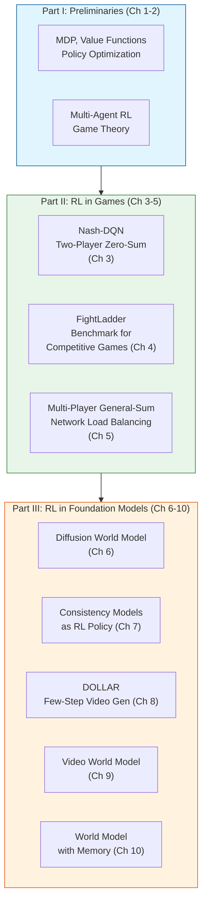
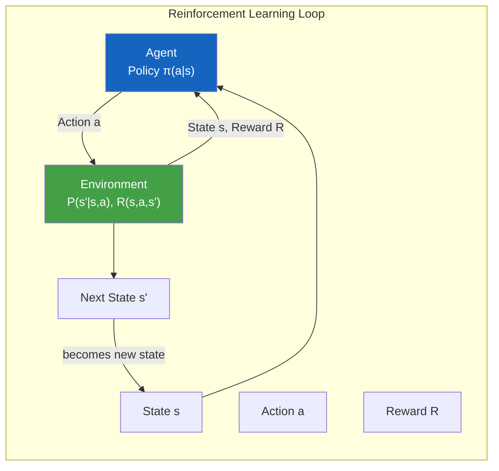
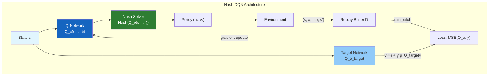
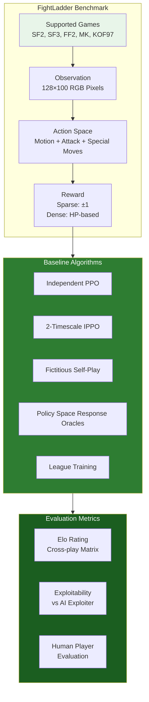
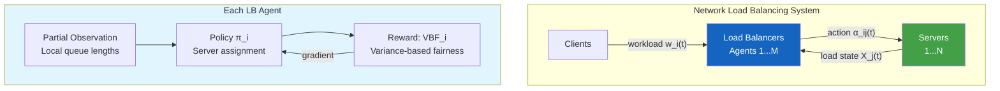
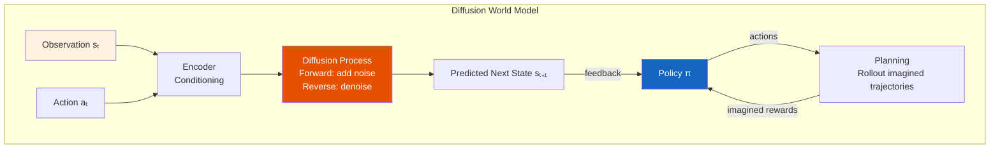
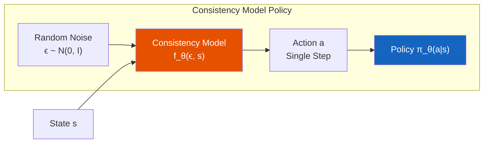
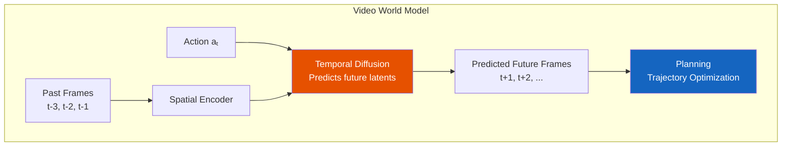
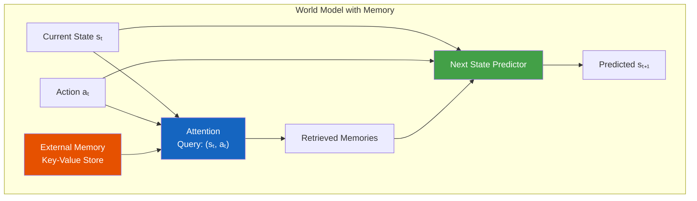

> **Document type:** This page combines (A) a structured, visual summary of the thesis compiled with AI assistance, and (B) the complete original English text of the dissertation as extracted from the PDF.
>
> **Author:** Zihan Ding &nbsp;|&nbsp; **Institution:** Princeton University &nbsp;|&nbsp; **Advisor:** Professor Chi Jin &nbsp;|&nbsp; **Year:** 2026 &nbsp;|&nbsp; **Pages:** 319
>
> **Original PDF:** arXiv:2607.17560v1 [cs.AI] 20 Jul 2026

---

---

# Part A — Structured Summary

*The following section is a structured, diagram-rich summary of the thesis compiled with AI assistance. It is organized by the thesis's three parts and ten chapters, with Mermaid flowcharts visualizing each major method.*

## 1. Thesis Architecture Overview

This thesis presents a unified intellectual arc spanning three major parts: foundational preliminaries, Nash equilibrium solving in competitive multi-agent games, and the integration of reinforcement learning with foundation models for world modeling and video generation. The central thesis is that reinforcement learning provides a general mathematical framework for incentive-driven decision-making, and that this framework scales from classical game-theoretic settings to modern foundation-model-based systems.

The thesis is organized into three parts. Part I (Chapters 1-2) establishes the mathematical foundations of Markov Decision Processes, value functions, policy optimization, and game-theoretic multi-agent RL. Part II (Chapters 3-5) applies these foundations to solve Nash equilibria at scale in competitive games, from two-player zero-sum Atari games to multi-player general-sum network load balancing. Part III (Chapters 6-10) extends RL into the foundation model era, developing world models based on diffusion processes, consistency models for efficient policy representation, and video generation systems that leverage these advances.

---

## 2. Part I: Preliminaries

### 2.1 MDP, Value Functions, and Policy Optimization (Chapter 2)

The thesis begins by formalizing the reinforcement learning problem through Markov Decision Processes (MDPs). An MDP is defined by the tuple ⟨S, A, P, R, γ⟩, where S is the state space, A is the action space, P is the transition probability, R is the reward function, and γ is the discount factor. The agent's goal is to find a policy π: S → Δ(A) that maximizes expected cumulative discounted reward. Two fundamental approaches are presented: value-based methods (Q-learning, DQN) that learn the optimal action-value function Q*, and policy-based methods (REINFORCE, actor-critic) that directly optimize the policy parameters. The Bellman operator is shown to be a contraction mapping in the sup-norm, guaranteeing convergence of value iteration and Q-learning under standard assumptions.

### 2.2 Multi-Agent RL and Game Theory (Chapter 2)

The thesis extends single-agent RL to multi-agent settings where each agent's return depends on the policies of others. This gives rise to game-theoretic solution concepts. In two-player zero-sum Markov games, the minimax theorem guarantees that max-min and min-max values coincide, defining the game's value. A Nash equilibrium (µ*, ν*) is a pair of policies where neither player can improve by unilateral deviation. The exploitability of a policy is measured by the duality gap: V^(:,ν)(s₁) - V^(µ,:)(s₁), which equals zero at equilibrium. For general-sum games, the solution concept extends to Nash equilibria where each player's policy is a best response to the others.

---

## 3. Part II: RL in Games — Nash Equilibrium at Scale

### 3.1 Nash-DQN: Deep RL for Two-Player Zero-Sum Games (Chapter 3)

**Problem:** Existing deep MARL algorithms (NFSP, PSRO) treat Markov games as normal-form games, ignoring the sequential structure and leading to significant inefficiency in finding non-exploitable policies.

**Method:** Nash-DQN combines deep Q-networks with Nash value iteration. The key innovation is maintaining a Q-network Q_ϕ(s, a, b) that approximates the Nash equilibrium value function, and using a Nash solver subroutine to compute equilibrium strategies from the Q-matrix at each state. The target value is computed as yⱼ = rⱼ + γ·µ̂ᵀQ_ϕ_target(sⱼ₊₁, ·, ·)ν̂, where (µ̂, ν̂) = Nash(Q_ϕ_target(sⱼ₊₁, ·, ·)). A variant, Nash-DQN-Exploiter, additionally trains an exploiter network that learns the best response to the main agent's policy, forcing the main agent to explore and improve.

**Key Insight:** By directly incorporating the Nash equilibrium solving into the Bellman update, Nash-DQN leverages the Markov structure of the game rather than treating it as a normal-form game, achieving polynomial convergence guarantees in tabular settings.

**Results:** On six two-player zero-sum video games (SlimeVolley, Boxing, Double Dunk, Pong, Tennis, Surround), Nash-DQN achieves non-positive exploiter rewards on five environments, significantly outperforming SP, FSP, NFSP, and PSRO. In Boxing, Nash-DQN learns aggressive policies that directly engage opponents, while baseline methods learn exploitable corner-hiding strategies.

**Publication:** NeurIPS 2022

### 3.2 FightLadder: A Benchmark for Zero-Sum Video Games (Chapter 4)

**Problem:** Existing competitive game benchmarks either have low-dimensional state spaces (board games) or require massive computational resources (StarCraft II, DOTA). A benchmark with rich strategy space, visual input, and computational efficiency is needed.

**Method:** FightLadder provides a platform for five fighting games (Street Fighter II/III, Fatal Fury 2, Mortal Kombat, The King of Fighters '97) with pixel-based observations, transformed action spaces, and both sparse and dense reward structures. The benchmark includes implementations of five baseline algorithms (IPPO, 2Timescale, FSP, PSRO, League Training) and three evaluation metrics: Elo ratings, exploitability tests against AI exploiters, and human player evaluation.

**Results:** League Training and PSRO achieve the highest Elo ratings (1682 and 1517 respectively), significantly outperforming independent learning methods. However, all methods show high exploitability (0.88-1.00), indicating that none approach Nash equilibrium. Single-player pretrained PPO policies are the most exploitable (0.99), while two-player training improves robustness.

**Publication:** ICML 2024

### 3.3 Multi-Player General-Sum MARL: Network Load Balancing (Chapter 5)

**Problem:** Network load balancers in data centers must distribute workloads across heterogeneous servers under partial observability, low-latency constraints, and multi-agent settings. Existing heuristics (ECMP, WCMP, LSQ, SED) degrade under misconfigured weights and partial observations.

**Method:** The load balancing problem is formulated as a Markov Potential Game (MPG), where the potential function is the variance-based fairness (VBF) of server load distribution. The key theoretical result is that maximizing VBF is sufficient for minimizing makespan (max server completion time). Each LB agent independently optimizes its own VBF, and the MPG structure guarantees that self-play converges to a pure Nash equilibrium. The approach requires no communication among agents, making it suitable for data plane deployment.

**Results:** The proposed MARL approach achieves 15-25% lower tail latency compared to ECMP, WCMP, LSQ, and SED under realistic data center traffic patterns. It adapts to heterogeneous server capacities without manual weight configuration and maintains performance under partial observability with multiple LBs.

**Publication:** NeurIPS 2022

---

## 4. Part III: RL in Foundation Models — World Models, Diffusion, and Video

### 4.1 Diffusion World Model (DWM) (Chapter 6)

**Problem:** Traditional world models in RL (e.g., Dreamer) use variational autoencoders or Gaussian mixtures for next-state prediction, which struggle with multimodal future distributions and long-horizon planning.

**Method:** DWM replaces the standard world model with a diffusion probabilistic model that learns the conditional distribution p(sₜ₊₁ | sₜ, aₜ). The diffusion process gradually denoises a random sample to produce the predicted next state. During planning, the diffusion world model is rolled out forward to generate imagined trajectories, and a policy is optimized using these imagined trajectories via backpropagation through the diffusion process.

**Key Results:** DWM achieves superior sample efficiency compared to Dreamer and other model-based RL methods on continuous control tasks. The diffusion-based prediction captures multimodal future distributions more effectively than Gaussian or categorical models, enabling better long-horizon planning.

**Publication:** NeurIPS 2023

### 4.2 Consistency Models as RL Policy (Chapter 7)

**Problem:** Diffusion-based policies require many denoising steps (typically 50-1000) for each action generation, making them computationally expensive for real-time RL deployment.

**Method:** This work proposes using consistency models—a class of generative models that map any point on the diffusion trajectory directly to the clean data distribution in a single step—as RL policies. The consistency model policy is trained via a combination of distillation from a pre-trained diffusion policy and direct RL fine-tuning. The single-step generation enables real-time action inference while maintaining the expressiveness of diffusion-based policies.

**Results:** The consistency model policy achieves comparable performance to diffusion-based policies while reducing inference time by orders of magnitude (from 50+ steps to 1 step). This makes diffusion-based RL practical for real-time applications.

**Publication:** ICML 2024

### 4.3 DOLLAR: Few-Step Video Generation (Chapter 8)

**Problem:** Video generation with diffusion models requires many denoising steps, making it slow for practical applications. Existing few-step methods sacrifice quality for speed.

**Method:** DOLLAR (Diffusion with Optimized Latent Learning and Adaptive Refinement) introduces a two-stage pipeline: first, a latent diffusion model generates a coarse video representation in few steps; second, a lightweight refinement network enhances temporal consistency and detail. The key innovation is a distillation objective that preserves the quality of multi-step diffusion while enabling few-step generation.

**Results:** DOLLAR achieves state-of-the-art quality among few-step video generation methods, with FVD scores comparable to 50-step diffusion models while using only 4-8 steps. The speed-quality tradeoff is significantly better than prior approaches.

**Publication:** ICCV 2025

### 4.4 Video World Model (Chapter 9)

**Problem:** World models for video prediction must capture complex temporal dynamics and long-range dependencies. Existing approaches either use simple recurrent architectures that struggle with long horizons or expensive 3D convolutions.

**Method:** This chapter proposes a video world model that combines a spatial autoencoder with a temporal diffusion process. The model learns to predict future video frames conditioned on past frames and actions, using a hierarchical architecture that first predicts coarse structure then refines details. The video world model is used for planning by simulating future trajectories and evaluating them under a learned reward model.

**Results:** The video world model achieves state-of-the-art video prediction quality on Atari and DMControl benchmarks, and enables effective planning for tasks requiring long-horizon reasoning.

### 4.5 World Model with Memory (Chapter 10)

**Problem:** Standard world models are Markovian—they condition only on the current state—which limits their ability to handle partially observable environments and tasks requiring episodic memory.

**Method:** This chapter augments the world model with an external memory module that stores and retrieves relevant past experiences. The memory is accessed via a differentiable attention mechanism that queries based on the current state and action. The memory-augmented world model can recall relevant past transitions to improve prediction accuracy and planning quality.

**Results:** The memory-augmented world model significantly improves prediction accuracy in partially observable environments and tasks requiring long-term memory, outperforming both standard world models and recurrent architectures.

---

## 5. Publications and Contributions Summary

| Chapter | Contribution | Method | Venue | Key Metric |
|---------|-------------|--------|-------|------------|
| 3 | Non-exploitable policies in zero-sum games | Nash-DQN, Nash-DQN-Exploiter | NeurIPS 2022 | Exploitability ≤ 0 on 5/6 Atari games |
| 4 | Competitive MARL benchmark | FightLadder platform + 5 baselines | ICML 2024 | Elo ratings, exploitability metrics |
| 5 | Distributed fair load balancing | Markov Potential Game formulation | NeurIPS 2022 | 15-25% lower tail latency |
| 6 | Diffusion-based world model | DWM: diffusion for next-state prediction | NeurIPS 2023 | Superior sample efficiency |
| 7 | Efficient diffusion policies | Consistency model as RL policy | ICML 2024 | 50-1000× inference speedup |
| 8 | Few-step video generation | DOLLAR: latent diffusion + refinement | ICCV 2025 | FVD comparable to 50-step models |
| 9 | Video prediction for planning | Video world model with temporal diffusion | — | SOTA video prediction quality |
| 10 | Memory-augmented world models | External memory + attention retrieval | — | Improved POMDP performance |

---

## 6. Key Original Passages

**On the vision of RL for AGI (Chapter 1, p. 17):**

> "Reinforcement learning (RL) provides a general mathematical framework for designing incentive-driven decision-making systems. This perspective is increasingly important for artificial general intelligence (AGI), where an intelligent system must act over time under explicit objectives, adapt to changing circumstances, and coordinate with a complex environment. At a conceptual level, RL is also deeply connected to studies in human physiology and neuroscience, where dopamine-related signals are often interpreted as carrying information about reward, motivation, and learning. These connections suggest that incentive-based adaptation is not only an engineering principle, but also a fundamental mechanism for intelligent behaviour."

**On the central idea of RL (Chapter 1, p. 17):**

> "The central idea of RL is to specify what the agent should want, rather than prescribing exactly how it should behave. A desired outcome for the agent is encoded quantitatively by a reward function, which evaluates the consequences of actions. The agent itself follows a decision-making rule, called a policy, and learning consists of improving this policy so as to perform optimally with respect to the objective induced by the reward."

**On the role of world models in the foundation model era (Chapter 1, p. 18):**

> "Recent progress in foundation models has opened a new direction for RL by enabling the injection of broad prior knowledge into the decision-making process. Instead of learning entirely from scratch, an agent can leverage pretrained representations and structured knowledge about the world to explore more sensibly and optimise its policy more sample efficiently and with better generalization. From this perspective, world modelling can be viewed as environment modelling enriched by the capabilities of foundation models."

**On the motivation for Nash-DQN (Chapter 3, p. 44):**

> "A distinguishing feature of games is that the opponents can further model the learner's behaviors, adapt their strategies, and exploit the learner's weakness. It is highly unclear whether the policies found by many of these multi-agent systems remain viable against the adversarial exploitation of the opponents. [...] By definition, the NE strategy is a stationary point where no player has the incentive to deviate from its current strategy. Due to the minimax theorem, the NE strategy for one player is also the best solution when facing against the best response of the opponent. That is, NE is a natural solution that is free from the exploitation by adversarial opponents."

**On the theoretical justification of Nash-DQN (Chapter 3, p. 56):**

> "With special choices of Q-network architecture Q_ϕ, minibatch size |M| and number of steps for GD m, both our algorithms Nash-DQN and Nash-DQN-Exploiter reduce to the ϵ-greedy version of standard algorithm Nash-VI and Nash-VI-Exploiter for learning tabular Markov games. [...] For tabular Markov games, the optimistic versions of both Nash-VI and Nash-VI-Exploiter can find ϵ-approximate Nash equilibria in poly(S, A, B, (1-γ)⁻¹, ϵ⁻¹, log(1/δ)) steps with probability at least 1-δ."

**On the challenge of competitive games (Chapter 4, p. 78):**

> "Fighting games feature rich policy space, and significant depth in strategy — including catching specific timing, counter-attack by exploiting the stiffness of the opponents, managing energy resources, etc. Moreover, these games also have a rather large number of characters with distinct move-sets which add another layer of complexity for AI agents to master the game."

**On the limitations of existing methods in competitive games (Chapter 4, p. 96):**

> "The PPO exploiter eventually learns to beat policies from all baselines (with a win rate greater than 0.5), which means that none of these algorithms can result in the exact Nash equilibrium policies, or even close to it. Therefore, closing this gap is a challenging direction for future research."

**On the Markov Potential Game formulation (Chapter 5, p. 109):**

> "A potential game (PG) has a special function called potential function, which specifies a property that any individual deviation of the action for one player will change the value of its own and the potential function equivalently. A desirable property of PG is that pure NE always exists and coincides with the maximum of potential function in norm-form setting. Self-play is provably converged for PG."

**On the reparameterization policy gradient theorem (Chapter 2, p. 30):**

> "This theorem is a direct application of reparameterization to the gradient of the policy objective. It is understood to be known but is not formally presented or derived for policy gradients in any existing work. We include it here for completeness as well as a useful theoretical tool."

---

## 7. Broader Impact

This thesis makes a compelling case for the convergence of two previously distinct research directions: game-theoretic multi-agent reinforcement learning and foundation-model-based world modeling. The intellectual arc—from Nash equilibria in Atari games to diffusion-based world models for video generation—reveals a deeper unity: both settings involve an agent learning to act in an environment, whether that environment is an adversarial opponent or a complex physical world.

The practical implications are significant. The Nash-DQN algorithm demonstrates that game-theoretic solution concepts can be scaled to complex visual domains, challenging the assumption that deep RL for games must rely on self-play or population-based methods that ignore the Markov structure. The FightLadder benchmark provides a much-needed testbed for competitive MARL, revealing that even state-of-the-art methods remain far from Nash equilibrium in visually rich fighting games. This gap represents both a challenge and an opportunity for future research.

The transition to foundation models in Part III represents the thesis's most forward-looking contribution. By replacing traditional world models with diffusion processes, the thesis shows that the same mathematical framework that generates images and videos can also serve as a predictive model for planning. The consistency model policy bridges the gap between the expressiveness of diffusion models and the computational efficiency required for real-time control. The DOLLAR system for few-step video generation demonstrates that these ideas have practical applications beyond RL, in content creation and media production.

Looking toward AGI, this thesis suggests that the path forward involves integrating three capabilities: (1) the ability to reason strategically about other agents, formalized through game theory; (2) the ability to model the world at multiple scales and modalities, enabled by foundation models; and (3) the ability to plan and act efficiently, provided by reinforcement learning. The convergence of these threads—game theory, world models, and RL—may be essential for building systems that can operate robustly in the open world, where both cooperative and competitive interactions with other agents are the norm, and where accurate prediction of complex dynamics is necessary for effective decision-making.

---

# Part B — Original Thesis Text (Full)

*The following is the complete English text of the dissertation as extracted from the source PDF (Zihan Ding, Princeton University, 2026). Light cleanup was applied to fix PDF extraction artifacts (e.g., broken hyphenation, encoding glitches); no content was added or paraphrased.*

Reinforcement Learning: From
Algorithms To Foundation Models
Zihan Ding
A Dissertation
Presented to the Faculty
of Princeton University
in Candidacy for the Degree
of Doctor of Philosophy
Recommended for Acceptance
by the Department of
Electrical Computer Engineering
Adviser: Professor Chi Jin
May 2026
arXiv:2607.17560v1  [cs.AI]  20 Jul 2026

© Copyright by Zihan Ding, 2026.
All rights reserved.

Abstract
Reinforcement learning (RL) provides a general framework for sequential decision making
under explicit objectives.
In its classical form, RL studies how an agent should act
to maximise long-term reward in a dynamic environment. In richer settings, however,
the problem extends beyond a single agent and fixed environment: intelligent behavior
may require strategic interaction with other agents, adaptation to uncertainty, and the
ability to reason over complex, high-dimensional worlds. This thesis studies reinforcement
learning from two complementary perspectives: RL algorithms in games, and RL in the
era of foundation models.
The first part focuses on multi-agent reinforcement learning in games. It examines
how incentives, policies, and equilibrium concepts interact in competitive and generalsum environments, spanning canonical two-player zero-sum games, large-scale video-game
domains, and multi-player settings with more general strategic structure. Together, these
works investigate both the algorithmic foundations of learning in multi-agent systems and
the practical behavior of RL methods in complex interactive environments.
The second part studies reinforcement learning with generative and foundation models, motivated by the idea that broad prior knowledge can substantially enrich sequential
decision making. In this setting, pretrained generative models and learned world models
serve not only as representation tools, but also as structured priors for planning, control,
and policy optimization. The thesis develops diffusion-based world models, investigates
reinforcement learning for efficient video generation, explores expressive generative models as policy classes, and studies interactive video world models in which actions shape
future observations. It further addresses long-horizon sequential modeling through architectures that incorporate memory into world modeling.
Taken together, these contributions present a unified view of reinforcement learning
as the study of objective-driven adaptation in complex sequential domains. From strategic games to generative world models, the thesis highlights how reinforcement learning
connects algorithmic decision making, environment modeling, and the emerging capabil-
3

ities of large-scale foundation models, offering a broader perspective on the principles
underlying intelligent behavior.
4

Acknowledgements
Princeton is a place both profound and elegant-quiet in its outward form, yet endlessly
rich in thought. It is a place made for study, for reflection, and for the slow shaping
of one's character. Over the past four years, it has witnessed not only my Ph.D. journey, but also a period of growth far beyond academics. What made this journey truly
meaningful were the people I encountered along the way. With them, I shared not only
the demands of research, but also conversations, friendship, and life itself. Their support
and companionship sustained me through this long and often challenging path. I am also
deeply grateful to the administrative staff of the Department of Electrical and Computer
Engineering and across the Princeton campus. With patience, kindness, and care, they
quietly supported us through the years, like devoted gardeners tending the ground on
which others may grow.
Among my most cherished memories of Princeton are the evenings spent around
a dinner table, where meals became occasions for thought as much as for rest.
We
brought riddles, brain teasers, half-formed ideas, and sudden curiosities to one another,
and what began as casual gatherings often unfolded into lively exchanges of mind and
imagination. Those moments reminded me that intellectual life does not belong only to
offices, classrooms, or papers-it also lives in friendship, laughter, and conversation, and
in the simple joy of thinking together.
I would like to express my deepest gratitude to my advisor, Professor Chi Jin, who has
been the most important mentor in my Ph.D. journey. He stood with us through every
stage of research: from the earliest brainstorming of ideas, to experiment design, project
organization, and the many rounds of paper polishing that carried us through submission
deadlines. From him, I learned what true rigor in research means-not only in broad
vision, but in the precision of every detail, down to the value of a single parameter
or the choice of a single word in a manuscript. He built for me a solid foundation in
reinforcement learning and optimization, while continually opening promising directions
for exploration. Even more importantly, he taught me how to recognize the taste of good
research and how to judge the importance of a problem. Under his guidance, my way
5

of thinking grew from theoretical understanding into a broader research capability that
includes both conceptual depth and empirical judgment. At the same time, he gave me
the freedom to explore independently and to grow into my own style as a researcher. His
optimism, generosity, and kindness have also shaped the spirit of our group in lasting
ways. I cannot fully express how much I appreciate his guidance and support.
I am also deeply thankful to the other members of my dissertation committee-Professor Benjamin Eysenbach, Professor Pramod Viswanath, and Professor
Mengdi Wang. Each of them is a leading scholar in their respective field, and I have
learned a great deal from their work, their insights, and their feedback.
I feel very
fortunate to have received their support and guidance throughout the dissertation
process.
I would also like to thank my wonderful friends: Qinghua Liu, Xiao Ma, Zhou Lu,
Yuanhao Wang, Ahmed Khaled, Wenzhe Li, Seth Karten, Yixiao Chen, Yuqi Nie, Andy
Su, Allen Ren, Yuheng Zheng, Kexin Jin, Qinqin Nan Li, Anjian Li, Zhengyuan Shang,
Yaqian Tang, Shouda Wang, Xinhao Liu, Yubin Lin, Yong Lin, Xiang Ji, Zixu Zhang,
Cindy Wu, Qiang Zhang, Jiachen Wang, Kaixuan Huang, Tianle Cai, Eshaan Nichani,
Hongjie Wang, Tong Wu, Cheng Gao, Jikai Hou, Chengzhuo Ni, Sulin Liu, Lihan Zha,
Kaiqu Liang, Yulai Zhao, Beining Han, Yaqian Tang, Yuchen Liu, Zhiyang Yuan, Haoyu
Wu, Haoyu Zhao, Jimmy Yang, Runzhe Wang, Yifan Li, Yue Wu, Xuezhou Zhang,
Xiaonan Zhu, Chengshuai Shi, Xinran Liang, Ziran Yang, and Qinxin Yan. Thank you
for the time we shared at Princeton, for your friendship, and for the many conversations,
exchanges, and moments of mutual encouragement that made these years far richer than
they otherwise would have been.
Finally, and most importantly, I want to thank my parents. Thank you for raising me,
shaping me, and supporting me with unwavering love. Your influence has been present
in everything I have done, and your support has been the foundation beneath every step
of this journey. Whatever I have achieved, I owe first to you.
6

The greatest mystery in human lies not in intelligence,
but in humanity and consciousness.
7

Contents
Abstract.......................................
3
Acknowledgements.................................
5
I
Preclude
16
1
Introduction to Reinforcement Learning
17
1.1
Reinforcement Learning at AGI Era.....................
17
1.2
Single-Agent RL
...............................
19
1.2.1
Markov Decision Process.......................
19
1.2.2
Policy and Value Functions
.....................
20
1.2.3
Value Iteration
............................
21
1.2.4
Policy Gradient............................
28
1.3
Game-Theoretical Multi-Agent RL
.....................
32
1.3.1
Zero-Sum Game............................
33
1.3.2
Markov Game.............................
34
1.3.3
Two-Player Zero-Sum Markov Game
................
34
1.3.4
Markov Potential Game
.......................
38
2
Organization
41
II
Reinforcement Learning in Games
43
3
Two-Player Zero-Sum Game
44
3.1
Introduction..................................
44
3.2
Related Works.................................
46
8

3.3
Preliminaries
.................................
49
3.4
Methodology
.................................
52
3.4.1
Nash-DQN
..............................
52
3.4.2
Nash-DQN-Exploiter.........................
54
3.4.3
Theoretical Justification.......................
56
3.5
Experiments..................................
57
3.5.1
Baselines................................
57
3.5.2
Tabular Markov Game........................
58
3.5.3
Two-Player Video Game.......................
60
3.6
Comparison of Nash Solvers for Normal-Form Game............
63
3.6.1
Multiplicative Weights Update....................
64
3.6.2
Comparison..............................
64
3.7
Algorithms on Tabular Markov Games...................
66
3.7.1
Nash Algorithm Subroutines.....................
66
3.7.2
Nash Q-Learning...........................
68
3.7.3
Self-play................................
68
3.7.4
Fictitious Self-play..........................
71
3.7.5
Double Oracle.............................
71
3.7.6
Nash-VI................................
72
3.7.7
Nash-VI-Exploiter
..........................
72
3.7.8
Comparisons of Nash Series Algorithms...............
73
3.7.9
Proof of Theorem 30.........................
75
4
Zero-Sum Video Game
76
4.1
Introduction..................................
76
4.2
Related Work.................................
79
4.3
Multi-Agent Reinforcement Learning....................
81
4.4
FightLadder..................................
82
4.4.1
Scenarios
...............................
83
4.4.2
State and Observations........................
83
9

4.4.3
Action Space
.............................
84
4.4.4
Rewards................................
86
4.4.5
Features................................
86
4.5
Evaluation Metrics..............................
88
4.6
FightLadder-Baselines
............................
90
4.7
Results.....................................
90
4.7.1
Single-Player Full Video Game....................
91
4.7.2
Performance of Two-Player Baseline Algorithms..........
92
4.7.3
Non-Exploitability of Trained Agents................
95
4.8
Details of FightLadder............................
97
4.8.1
Dense Reward.............................
97
4.8.2
Game Settings.............................
97
4.8.3
Comparison of MARL Game Platforms...............
97
4.9
Baseline Algorithms of FightLadder-Baselines
...............
98
4.9.1
Training Details............................
100
4.10 Individual Elo Results
............................
100
5
Multi-Player General-Sum Game
106
5.1
Introduction..................................
106
5.2
Related Work.................................
108
5.3
Methods....................................
111
5.3.1
Problem Description.........................
111
5.3.2
Distribution Fairness.........................
113
5.3.3
Game Theory Framework
......................
114
5.3.4
Distributed Method..........................
115
5.4
Evaluation...................................
119
5.5
Stochastic Markov Model...........................
123
5.6
Analysis of Distribution Fairness.......................
124
10

III
Reinforcement Learning in Foundation Models
129
6
Diffusion World Model
130
6.1
Introduction..................................
130
6.2
Related Work.................................
134
6.3
Preliminaries
.................................
137
6.4
Diffusion World Model............................
138
6.4.1
Conditional Diffusion Model.....................
140
6.4.2
Model-Based RL with Diffusion World Model
...........
140
6.5
Experiments..................................
142
6.5.1
DWM v.s. One-Step Dynamics Model
...............
144
6.5.2
DWM v.s. Decision Diffuser.....................
145
6.5.3
DWM v.s. Model-Free Counterparts
................
147
6.5.4
Ablation Studies
...........................
147
6.6
Implementation Details............................
148
6.6.1
Diffusion World Model........................
148
6.6.2
One-step Dynamics Model......................
151
6.7
Diffusion World Model Based Offline RL Methods.............
152
6.7.1
DWM-TD3BC: TD3+BC with Diffusion World Model
......
153
6.7.2
DWM-IQL: IQL with Diffusion World Model............
154
6.7.3
DWM-PQL: Pessimistic Q-learning with Diffusion World Model.
155
6.8
Training and Evaluation Details of Offline RL Algorithms.........
157
6.8.1
Common Settings...........................
157
6.8.2
Model-Free Algorithms........................
158
6.8.3
Model-Based Algorithms.......................
159
6.9
Additional Experiments
...........................
159
6.9.1
Detailed Results of Long Horizon Planning with DWM......
159
6.9.2
World Modeling: Prediction Error Analysis.............
161
6.9.3
Transformer-based World Model...................
162
6.9.4
Additional Baselines
.........................
163
11

6.9.5
Additional Environments: Sparse-reward Tasks
..........
165
6.9.6
Ablation: Number of Diffusion Steps for Training and Inference
.
166
6.9.7
Ablation: Sequence Length of Diffusion World Model.......
170
6.9.8
Ablation: OOD Evaluation RTG Values
..............
171
6.9.9
Ablation: λ-Return Value Estimation................
174
6.9.10 Ablation: RTG Relabeling and Model Fine-tuning.........
176
7
Consistency Models as Reinforcement Learning Policy
178
7.1
Introduction..................................
178
7.2
Related Works.................................
180
7.3
Preliminaries
.................................
182
7.3.1
Offline and Online RL
........................
182
7.3.2
Consistency Model..........................
182
7.4
Consistency Model as RL Policy.......................
183
7.5
Experimental Evaluation...........................
186
7.5.1
Offline RL: Behavior Cloning
....................
187
7.5.2
Offline RL: Consistency Actor-Critic
................
189
7.5.3
Offline-to-Online and Online RL...................
192
7.6
Consistency Model Training and Inference Details.............
195
7.7
Offline RL Experiment Details........................
196
7.7.1
Computational Time.........................
196
7.7.2
Ablation Studies
...........................
198
7.8
Offline-to-Online and Online RL Details
..................
200
7.8.1
Algorithms
..............................
200
7.8.2
Computational Time.........................
201
8
Reinforcement Learning in Few-Step Video Generation
203
8.1
Introduction..................................
203
8.2
Related Work.................................
206
8.3
Methodology
.................................
209
12

8.3.1
Diffusion Model............................
209
8.3.2
Consistency Distillation
.......................
210
8.3.3
Variational Score Distillation
....................
211
8.3.4
Latent Reward Fine-tuning
.....................
212
8.4
Multi-Objective Distillation
.........................
214
8.5
Experiments..................................
215
8.5.1
Implementation............................
215
8.5.2
Comparison with SOTA Methods and Models...........
216
8.5.3
Comparison with Pixel-Space Reward................
220
8.5.4
Ablation of Distillation Methods...................
221
8.5.5
Ablation Studies
...........................
222
8.6
DOLLAR Method Details............................
223
8.6.1
Pseudo-code..............................
223
8.6.2
Diffusion Model Training and Inference...............
224
8.6.3
Implementation Details........................
225
8.6.4
Student-Teacher Parameterization..................
226
8.6.5
Derivations
..............................
227
8.6.6
Inference Time Analysis
.......................
229
8.7
Reward Model Fine-Tuning
.........................
230
8.7.1
Evidence of Fine-tuning Effect....................
230
8.7.2
Direct Reward Gradient
.......................
230
8.7.3
Latent Reward Model For Different Reward Types.........
231
8.7.4
Latent Reward Model Training
...................
234
8.7.5
Latent Reward Model Fine-tuning..................
235
8.7.6
Denoising Diffusion Policy Optimization
..............
236
9
Video World Model
239
9.1
Introduction..................................
239
9.2
Related Works.................................
241
9.3
Methodology
.................................
243
13

9.3.1
Preliminary: Latent Video Diffusion Model.............
243
9.3.2
Interactive Long Video Generation
.................
244
9.3.3
Retrieval Augmented Video World Model with Global State
...
246
9.3.4
Long-context Extension Baselines..................
248
9.4
Experiments..................................
250
9.4.1
Datasets and Evaluation Protocol..................
250
9.4.2
Training Details............................
251
9.4.3
World Coherence Results
......................
252
9.4.4
Compounding Error Results.....................
253
9.4.5
VBench Evaluation..........................
254
9.4.6
Extension: Real World Setting....................
255
9.4.7
Ablation: Memory and Training of VRAG.............
256
9.5
Baseline Method Details...........................
257
9.6
Additional Experiments
...........................
260
9.6.1
Analysis of Compounding Error Evaluation Metrics........
260
9.6.2
Vanilla Long-context Extension vs. YaRN
.............
262
9.6.3
More Discussions on Main Results..................
264
9.6.4
Predicted Global State........................
264
9.6.5
Memory and Time Overhead.....................
265
10 World Model With Memory
267
10.1 Introduction..................................
267
10.2 Related work
.................................
269
10.3 Preliminaries
.................................
271
10.3.1 Recurrent Neural Networks
.....................
271
10.3.2 Video Diffusion model
........................
272
10.4 Methodology
.................................
273
10.4.1 Recurrent Autoregressive Diffusion
.................
274
10.4.2 Chunk-wise and Frame-wise Autoregression
............
276
10.4.3 Hidden State Pre-fetch for Parallel Attention............
277
14

10.5 Experiments..................................
279
10.5.1 Datasets and Evaluation Protocol..................
279
10.5.2 Maze Results
.............................
280
10.5.3 Minecraft Results...........................
282
10.5.4 VBench Results............................
284
10.5.5 Computational Resource Analysis..................
284
10.6 Ablation study
................................
285
10.6.1 Noise Level of Memory Frames
...................
285
10.6.2 Strided Chunk-wise Autoregression.................
286
10.6.3 Action Condition Design.......................
286
10.7 Implementationation Details.........................
287
10.7.1 Mamba and TTT...........................
287
10.7.2 Efficient Parallelization of Attention in Frame-wise RNNs.....
288
Bibliography
290
15

Chapter 1
Introduction to Reinforcement
Learning
1.1
Reinforcement Learning at AGI Era
Reinforcement learning (RL) provides a general mathematical framework for designing
incentive-driven decision-making systems. This perspective is increasingly important for
artificial general intelligence (AGI), where an intelligent system must act over time under explicit objectives, adapt to changing circumstances, and coordinate with a complex
environment. At a conceptual level, RL is also deeply connected to studies in human physiology and neuroscience, where dopamine-related signals are often interpreted as carrying
information about reward, motivation, and learning.
These connections suggest that
incentive-based adaptation is not only an engineering principle, but also a fundamental
mechanism for intelligent behaviour.
The central idea of RL is to specify what the agent should want, rather than prescribing exactly how it should behave. A desired outcome for the agent is encoded quantitatively by a reward function, which evaluates the consequences of actions. The agent
itself follows a decision-making rule, called a policy, and learning consists of improving
this policy so as to perform optimally with respect to the objective induced by the reward. In the simplest single-agent setting, optimality often means maximising expected
17

Agent
Policy πpat | stq
World Model
ˆP, ˆR
Environment
Ps'|st, atq, Reward Rpstq
Next State st`1, Reward Rpstq
Update
Planning
Action at
Experience
Figure 1.1: A general reinforcement learning system: the agent interacts with the environment to optimize its policy for reward maximization, while optionally using a learned
world model to predict dynamics and rewards, support planning, and improve policy
optimisation.
cumulative reward. In richer multi-agent environments, however, the relevant notion of
optimality may instead take the form of a Nash equilibrium or other equilibrium concepts,
depending on how different agents interact and how incentives are coupled.
Although the reward function may be simple, the strategy that emerges from it can be
highly nontrivial. This complexity is driven largely by the dynamic nature of the problem:
actions affect future states, the environment may evolve stochastically, and in multi-agent
settings the behaviours of other agents also shape the decision landscape. As a result,
modelling the environment becomes a central issue. In classical RL, this is captured by
the state transition model, which describes how the system evolves in response to actions
and uncertainty.
Recent progress in foundation models has opened a new direction for RL by enabling
the injection of broad prior knowledge into the decision-making process. Instead of learning entirely from scratch, an agent can leverage pretrained representations and structured
knowledge about the world to explore more sensibly and optimise its policy more sample
efficiently and with better generalization. From this perspective, world modelling can be
18

viewed as environment modelling enriched by the capabilities of foundation models. A
strong world model can support planning, improve sample efficiency, and better align optimisation with the agent's objective. At the same time, these benefits depend critically
on the accuracy and computational efficiency of the world model itself, which makes the
design of appropriate architectures and algorithms a central challenge.
1.2
Single-Agent RL
Through trial and error, an RL agent attempts to find the optimal policy to maximise
its long-term reward. This process is formulated by Markov Decision Processes.
1.2.1
Markov Decision Process
Definition 1 (Markov Decision Process). An MDP can be described by a tuple of key
elements xS, A, P, R, γy:
• S: the set of environmental states.
• A: the set of agent's possible actions.
• P: S ˆ A → Δ(Sq: for each time step t P N, given agent's action a P A, the
transition probability from a state s P S to the state in the next time step s1 P S.
• R: S ˆAˆS → R: the reward function that returns a scalar value to the agent for
a transition from s to s1 as a result of action a. The rewards have absolute values
uniformly bounded by Rmax.
• γ P r0, 1s is the discount factor that represents the value of time.
At each time step t, the environment has a state st. The learning agent observes
this state1 and executes an action at. The action makes the environment transition into
the next state st`1 „ Ps'|st, atq, and the new environment returns an immediate reward
1If the agent cannot fully observe the environment state, it be it becomes the partially-observable
setting, shorten as POMDP.
19

Rpst, at, st`1q to the agent. The reward function can be also written as R: S ˆ A → R,
which is interchangeable with R: S ˆ A ˆ S → R.
1.2.2
Policy and Value Functions
Given above MDP setup, the goal of the agent is to solve the MDP: to find the optimal
policy that maximises the reward over time. Mathematically, one common objective is
for the agent to find a Markovian (i.e., the input depends on only the current state) and
stationary (i.e., function form is time-independent) policy function π: S → Δ(Aq, with
∆s'q denoting the probability simplex.
Formally, a Markov policy depends only on the current state, and can be written as
π: S → Δ(Aqq
(1.1)
for discrete stochastic case or π: S → A in the deterministic case. In contrast, a general
or non-Markovian policy may depend on the whole history available at time h. If we
denote the history by
Hh " ps1, a1, r1,..., sh´1, ah´1, rh´1, shq,
(1.2)
then a general policy is a mapping
πh: Hh → Δ(Aq,
(1.3)
or equivalently πhpah | Hhq for a stochastic policy.
The optimal Markov policy exists as long as the transition function and the reward
function are both Markovian and stationary, so by default we use π to denote the Markov
policy without further clarification.
20

The policy takes sequential actions such that the discounted cumulative reward is
maximised in this infinite-horizon MDP in this infinite-horizon MDP:
J pπq " Est`1„Ps'|st,atq
« 8
ÿ
t"0
γtR pst, at, st`1q
ˇˇˇat „ π s' | stq, s0
ff
.
(1.4)
Another common mathematical objective of an MDP is to maximise the time-average
reward for finite-horizon MDP:
J pπq " Est`1„Ps'|st,atq
«
1
T
T´1
ÿ
t"0
Rpst, at, st`1q
ˇˇˇat „ π s' | stq, s0
ff
.
(1.5)
We will adopt the infinite-horizon MDP setting by default.
Based on the objective function of Eq. (1.4), under a given policy π, we can define
the state-action function (namely, the Q-function, which determines the expected return
from undertaking action a in state s) and the value function (which determines the return
associated with the policy in state s) as:
Qπps, aq " Eπ
«ÿ
tě0
γtR pst, at, st`1q
ˇˇˇa0 " a, s0 " s
ff
, @s P S, a P A
(1.6)
V πpsq " Eπ
«ÿ
tě0
γtR pst, at, st`1q
ˇˇˇs0 " s
ff
, @s P S
(1.7)
where Eπ is the expectation under the probability measure Pπ over the set of infinitely
long state-action trajectories τ " ps0, a0, s1, a1,...q and where Pπ is induced by state
transition probability P, the policy π, the initial state s and initial action a (in the
case of the Q-function). The connection between the Q-function and value function is
V πpsq " Ea„πs'|sqrQπps, aqs and Qπ " Es1„Ps'|s,aqrRps, a, s1q ` V πps1qs.
1.2.3
Value Iteration
Value-Based Method
For all MDPs with finite states and actions, there exists at least one deterministic stationary optimal policy. With the known transition function Pps1|s, aq, this becomes a
21

Algorithm 1 Value Iteration
1: Input: transition model P, reward function R, discount factor γ, tolerance ε
2: Initialize V0psq arbitrarily for all s P S
3: for k " 0, 1, 2,... do
4:
Vk`1psq Ð maxa
ř
s1 Pps1|s, aq pRps, a, s1q ` γVkps1qq,
@s P S
5:
if }Vk`1 ´ Vk}8 ă ε then
6:
break
7: Return: Vk`1 and π˚psq P arg maxa
ř
s1 Pps1|s, aq pRps, a, s1q ` γVk`1ps1qq
dynamic programming problem. One of the most fundamental dynamic programming
methods for computing the optimal value is value iteration as Alg. 1. Starting from an
arbitrary initial value function V0, value iteration repeatedly applies the Bellman optimality operator:
Vk`1psq " max
a
ÿ
s1
Pps1|s, aq pRps, a, s1q ` γVkps1qq.
(1.8)
After convergence, an optimal policy can be recovered by acting greedily with respect to
the converged value function:
π˚psq P arg max
a
ÿ
s1
Pps1|s, aq pRps, a, s1q ` γV ˚ps1qq.
(1.9)
Without knowing the transition function P, Q-learning is introduced to find the optimal Q-function Q˚ that maximises Eq. (1.6). Correspondingly, the optimal policy can be
derived from the Q-function by taking the greedy action π˚psq " arg maxa Q˚ps, aq. The
classic Q-learning algorithm approximates Q˚ by ˆQ, and updates its value via temporaldifference learning:
ˆQpst, atq Ð ˆQpst, atq ` α
´
Rt ` γ max
aPA
ˆQpst`1, aq ´ ˆQpst, atq
¯
.
(1.10)
Researchers applied neural networks as a function approximator for the Q-function in
updating Eq. (1.10). Specifically, DQN optimises the following equation:
min
θ
Epst,at,Rt,st`1q„D
„´
Rt ` γ max
aPA Qθ´ pst`1, aq ´ Qθ pst, atq
¯2ȷ
.
(1.11)
22

The neural network parameters θ is fitted by drawing i.i.d. samples from the replay buffer
D and then updating in a supervised learning fashion. Qθ´ is a slowly updated target
network that helps stabilise training.
Bellman Operator
Using the MDP notation introduced above, the Bellman operator maps a value function
to its one-step look-ahead update under the transition kernel P and reward function R.
For a fixed policy π, the Bellman expectation operator is defined by
pBπV qpsq " Ea„πs'|sq, s1„Ps'|s,aq rRps, a, s1q ` γV ps1qs
(1.12)
"
ÿ
a
πpa | sq
ÿ
s1
Pps1 | s, aq pRps, a, s1q ` γV ps1qq.
(1.13)
and its shorthand form is BQps, aq " ř
s1 P a
ss1pRa
ss1 ` γ maxa1 Qps1, a1qq. In particular,
the value function defined in the previous subsection satisfies the Bellman fixed-point
equation
V π " BπV π.
(1.14)
For optimal control, we replace the policy average by a maximisation over actions and
obtain the Bellman optimality operator
pBV qpsq " max
a
ÿ
s1
Pps1 | s, aq pRps, a, s1q ` γV ps1qq,
(1.15)
which is the same operator later written in the shorthand form BV psq " maxapRa
s `
γ ř
s1 P a
ss1V ps1qq. Likewise, for action-values, we have the Bellman optimality operator:
pBQqps, aq "
ÿ
s1
Pps1 | s, aq
´
Rps, a, s1q ` γ max
a1
Qps1, a1q
¯
.
(1.16)
and its shorthand form is BQps, aq " ř
s1 P a
ss1pRa
ss1 ` γ maxa1 Qps1, a1qq.
23

Convergence of Bellman Operator
Definition 2 (Metric Space). A metric space pX, dq is a set X with a metric d defined
to measure the distance between any two elements of the set X. The distance measure
in the metric space needs to satisfy the following properties:
• Identity: dpx, xq " 0, @x P X;
• Non-negativity: dpx, yq ě" 0, @x, y P X;
• Symmetry: dpx, yq " dpy, xq, @x, y P X;
• Triangular Inequality: dpx, zq ď dpx, yq ` dpy, zq.
Definition 3 (Cauchy Sequence). In metric space pX, dq, we take a subset (sequence)
Xc " tx1, x2, x3,..., xnu Ď X, if @ϵ ą 0, DN ą 0, @a, b ą N, dpxa, xbq, ϵ, then the sequence
Xc is a Cauchy sequence.
Definition 4 (Complete Metric Space). A metric space pX, dq is complete if every possible Cauchy sequence of the elements in the set X converges to an element that belongs
to the set X, i.e., the convergence limit of every Cauchy sequence of the elements of the
set lies in the set itself.
Theorem 5 (Contractor/Contraction Mapping). A function f is defined on a metric
space pX, dq, and satisfies for @x1, x2, Dγ P r0, 1q, dpfpx1q, fpx2qq ď γdpx1, x2q, the the
function (operator) f is contraction mapping or contractor.
Theorem 6 (Banach Fixed Point Theorem). Let pX, dq be a complete metric space and
a function f: X → X be a contractor, then f has a unique fixed point x˚ P X ( i.e.,
fpx˚q " x˚) such that the sequence fpfpfp...fpxqqqq converges to x˚.
Lemma 7 (Bellman Optimal Operator).
BV psq " max
a pRa
s ` γ
ÿ
s1
P a
ss1V ps1qq
(1.17)
24

Prove the convergence of value iteration is equivalent of proving the Bellman optimal
operator satisfies the Banach fixed point theorem. In this case, the metric space pX, dq
has X:" tV psq|V psq P Ru, and d:" ||X||8 " max |xi|, xi P X. It is easy to see this
metric space is complete.
Theorem 8 (Convergence of Bellman Optimal Operator-V ˚). Optimal V ˚ value is a fixed
point of the Bellman contraction operator B, which is applied on general V: S ˆ A → R.
The operator is a contractor in the sup-norm, i.e.,
||BV1 ´ BV2||8 ď γ||V1 ´ V2||8
(1.18)
Proof.
||BV1 ´ BV2||8 " max
s
| max
a pRa
s ` γ
ÿ
s1
1
P a
ss1V1ps1
1qq ´ max
a pRa
s ` γ
ÿ
s1
2
P a
ss1V2ps1
2qq| (1.19)
" max
s,a γ|
ÿ
s1
P a
ss1pV1ps1q ´ V2ps1qq|
(1.20)
ď max
s,a γ
ÿ
s1
P a
ss1|V1ps1q ´ V2ps1q| (by triangular inequality)
(1.21)
ď max
s,a γ max
s1
|V1ps1q ´ V2ps1q| (assign probability 1 to max
s1 q
(1.22)
ď max
s,a γ||V1 ´ V2||8
(1.23)
" γ||V1 ´ V2||8
(1.24)
Theorem 9 (Convergence of Bellman Optimal Operator-Q˚). Optimal Q˚ value is a fixed
point of the Bellman contraction operator B, which is applied on general Q: S ˆ A → R
as: (neglect the "*" in following for simplicity)
BQps, aq "
ÿ
s1
P a
ss1pRa
ss1 ` γ max
a1
Qps1, a1qq
(1.25)
25

The operator is a contractor in the sup-norm, i.e.,
||BQ1 ´ BQ2||8 ď γ||Q1 ´ Q2||8
(1.26)
Proof.
||BQ1 ´ BQ2||8 " max
s,a |
ÿ
s1
P a
ss1pRa
ss1 ` γ max
a1
1
Q1ps1, a1
1q ´ Ra
ss1 ´ γ max
a1
2
Q2ps1, a1
2qq|
(1.27)
" max
s,a γ|
ÿ
s1
P a
ss1pmax
a1
1
Q1ps1, a1
1q ´ max
a1
2
Q2ps1, a1
2qq|
(1.28)
ď max
s,a γ
ÿ
s1
P a
ss1| max
a1
1
Q1ps1, a1
1q ´ max
a1
2
Q2ps1, a1
2q| (by triangular inequality)
(1.29)
ď max
s,a γ
ÿ
s1
P a
ss1 max
a1
|Q1ps1, a1q ´ Q2ps1, a1q| (by convexity of max function)
(1.30)
ď max
s,a γ max
a1
|Q1pˆs1, a1q ´ Q2pˆs1, a1q| (assign probability 1 to max
s1 q
(1.31)
ď max
s,a γ||Q1 ´ Q2||8
(1.32)
" γ||Q1 ´ Q2||8
(1.33)
Not only the optimal Bellman operators have contraction property, but also the general Bellman operators. The proofs are similar and omitted here.
Remark 10. Specifically, in the contraction of normal Bellman operators, if one of the
value function is the unbiased value function, e.g., V π
2 " BV π
2 or Qπ
2 " BQπ
2, another
one is the estimation (V π
1 or Qπ
1), the convergence theorems say that the estimated value
function will converge to the true value function.
26

Convergence of Q-Learning
Theorem 11 (Convergence of Q-Learning). Consider a finite discounted MDP with
bounded rewards, and the Q-learning update
Qt`1pst, atq " p1 ´ αtpst, atqqQtpst, atq ` αtpst, atq
"
rt ` γ max
a1
Qtpst`1, a1q
ı
,
(1.34)
while for ps, aq ‰ pst, atq we keep
Qt`1ps, aq " Qtps, aq.
(1.35)
Assume:
• every state-action pair ps, aq is visited infinitely often;
• the reward is uniformly bounded;
• the learning rates satisfy the Robbins-Monro conditions
8
ÿ
t"0
αtps, aq " 8,
8
ÿ
t"0
α2
tps, aq ă 8,
@ps, aq P S ˆ A.
(1.36)
Then the iterates Qt converge to the optimal action-value function Q˚ almost surely:
Qtps, aq
a.s.
ÝÝÝ→
t→8 Q˚ps, aq,
@ps, aq P S ˆ A,
(1.37)
where Q˚ is the unique fixed point of the Bellman optimality operator
pBQqps, aq "
ÿ
s1
Pps1|s, aq
´
Rps, a, s1q ` γ max
a1
Qps1, a1q
¯
.
(1.38)
Remark 12. This theorem shows that Q-learning is a stochastic approximation procedure
for solving the Bellman optimality fixed-point equation. The contraction of B guarantees
27

uniqueness of Q˚, while the martingale-difference noise induced by sampling transitions
is controlled by the diminishing step sizes.
1.2.4
Policy Gradient
Policy-Based Method
Policy-based methods are designed to directly search over the policy space to find the optimal policy π˚. One can parameterise the policy expression π˚ « πθs'|sq and update the
parameter θ in the direction that maximises the cumulative reward θ Ð θ ` α∇θV πθpsq
to find the optimal policy. However, the gradient will depend on the unknown effects of
policy changes on the state distribution. The famous policy gradient (PG) theorem [Sutton et al., 2000] derives an analytical solution that does not involve the state distribution,
that is:
∇θV πθpsq " Es„µπθs'q,a„πθs'|sq
"
∇θ log πθpa|sq ' Qπθps, aq
ı
(1.39)
where µπθ is the state occupancy measure under policy πθ and ∇log πθpa|sq is the updating
score of the policy. When the policy is deterministic and the action set is continuous, one
obtains the deterministic policy gradient (DPG) theorem [Silver et al., 2014] as
∇θV πθpsq " Es„µπθs'q
"
∇θπθpa|sq ' ∇aQπθps, aq
ˇˇ
a"πθpsq
ı
.
(1.40)
A classic implementation of the PG theorem is REINFORCE [Williams, 1992], which
uses a sample return Rt " řT
i"t γi´tri to estimate Qπθ. Alternatively, one can use a
model of Qω (also called critic) to approximate the true Qπθ and update the parameter
ω via TD learning. This approach gives rise to the famous actor-critic methods [Konda
and Tsitsiklis, 2000; Peters and Schaal, 2008]. Important variants of actor-critic methods
include trust-region methods [Schulman et al., 2015a, 2017], soft actor-critic methods
[Haarnoja et al., 2018], and deep deterministic policy gradient (DDPG) methods [Lillicrap
et al., 2015].
28

Policy Gradient Theorem
In this subsection, we write the policy objective as
Jpθq:" Es0„p0 rV πθps0qs.
(1.41)
Here µπθ denotes the discounted state occupancy measure induced by policy πθ, and
πθpa | sq denotes a stochastic policy parameterized by θ. For the reparameterization
form, we assume that an action can be generated by first sampling ϵ „ ppϵq from a fixed
noise distribution and then applying a differentiable transformation
a " fθpϵ; sq.
(1.42)
The conditional density induced by this sampling procedure is just the policy πθpa | sq.
Assumption 1. S and A are closed and bounded.
Assumption 2. Pps1 | s, aq, fθpϵ; sq, πθpa | sq, ppϵq, Rps, a, s1q, p0psq and their derivatives
are continuous in all variables s, a, s1, θ, and ϵ.
Remark 13. The two assumptions above allow us to exchange derivatives and integrals,
and the order of multiple integrations, using Fubini's theorem and Leibniz integral rule.
Theorem 14 (Stochastic Policy Gradient (SPG) Theorem). Suppose that the MDP satisfies Assumption 1 and 2, then
∇θJpθq " Es„µπθ, a„πθs'|sq r∇θ log πθpa | sq Qπθps, aqs
" Es„µπθ, a„πθs'|sq, s1„Ps'|s,aq r∇θ log πθpa | sq pRps, a, s1q ` γV πθps1qqs.
Corollary 15 (Baseline Subtraction Stochastic Policy Gradient).
∇θJpθq " Es„µπθ, a„πθs'|sq, s1„Ps'|s,aq r∇θ log πθpa | sq pRps, a, s1q ` γV πθps1q ´ V πθpsqqs
" Es„µπθ, a„πθs'|sq r∇θ log πθpa | sq Aπθps, aqs.
29

where Aπθps, aq " Qπθps, aq ´ V πθpsq is the advantage function. Both of these are
unbiased, but baseline subtraction reduces the variance in gradient estimation.
Theorem 16 (Reparameterization Policy Gradient Theorem). Suppose that the MDP
satisfies Assumption 1 and 2, then
∇θJpθq " Es„µπθ, ϵ„p
"
∇θfθpϵ; sq∇aQπθps, aq
ˇˇ
a"fθpϵ;sq
ı
.
Proof. By the policy gradient theorem, we have
∇θJpθq "
ż
µπθpsqπθpa | sqQπθps, aq∇θ log πθpa | sq da ds.
Thus
∇θJpθq
"
ż
µπθpsqπθpa | sqQπθps, aq∇θ log πθpa | sq da ds
"
ż
µπθpsq
ˆż
Qπθps, aq∇θπθpa | sq da
˙
ds
"
ż
µπθpsq
„ż
∇θ pQπθps, aqπθpa | sqq da ´
ż
πθpa | sq∇θQπθps, aq da
ȷ
ds
"
ż
µπθpsq
„
∇θ
ˆż
Qπθps, aqπθpa | sq da
˙
´
ż
πθpa | sq∇θQπθps, aq da
ȷ
ds
"
ż
µπθpsq
„
∇θ
ˆż
ppϵqQπθps, fθpϵ; sqq dϵ
˙
´
ż
ppϵq∇θQπθps, aq
ˇˇ
a"fθpϵ;sq dϵ
ȷ
ds
(by reparameterization)
"
ż
µπθpsq
„ż
ppϵq
´
∇θfθpϵ; sq∇aQπθps, aq
ˇˇ
a"fθpϵ;sq ` ∇θQπθps, aq
ˇˇ
a"fθpϵ;sq
¯
dϵ
´
ż
ppϵq∇θQπθps, aq
ˇˇ
a"fθpϵ;sq dϵ
ȷ
ds
"
ż
µπθpsq ppϵq∇θfθpϵ; sq∇aQπθps, aq
ˇˇ
a"fθpϵ;sq dϵ ds.
Remark 17. This theorem is a direct application of reparameterization to the gradient of
the policy objective. It is understood to be known but is not formally presented or derived
30

for policy gradients in any existing work. We include it here for completeness as well as
a useful theoretical tool.
Corollary 18 (Deterministic Policy Gradient Theorem). Suppose that the MDP satisfies
Assumption 1 and 2, for a deterministic policy µθpsq, we have
∇θJpθq " Es„µµθ
"
∇θµθpsq∇aQµθps, aq
ˇˇ
a"µθpsq
ı
.
Proof. Let ppϵq be the delta function. Thus
ş
ppϵqfθpϵ; sq dϵ " fθp0; sq. Furthermore, let
fθp0; sq " µθpsq. By Theorem 16,
∇θJpθq "
ż
µµθpsq
ˆż
ppϵq∇θfθpϵ; sq∇aQµθps, aq
ˇˇ
a"fθpϵ;sq dϵ
˙
ds
"
ż
µµθpsq∇θfθp0; sq∇aQµθps, aq
ˇˇ
a"fθp0;sq ds
"
ż
µµθpsq∇θµθpsq∇aQµθps, aq
ˇˇ
a"µθpsq ds.
Remark 19. Both DPG and DDPG are proposed based on this theorem, which is first
proved by Silver et al. [2014]. It is limited to deterministic policies and thus can be deduced
as a corollary of Theorem 16, which is applicable to stochastic policies as well.
Corollary 20 (Entropy-regularized Reparameterization Policy Gradient Theorem). Consider the entropy-regularized values
V πθps0q " Eπ
« 8
ÿ
t"0
γt pRpst, at, st`1q ` αHpπθs' | stqqq
ff
,
Qπθps0, a0q " Eπ
« 8
ÿ
t"0
γtRpst, at, st`1q ` α
8
ÿ
t"1
γtHpπθs' | stqq
ff
,
where
Hppq " ´
ż
ppxq log ppxq dx
31

is the differential entropy for probability density function ppxq, and α is a positive constant. Suppose that the MDP satisfies Assumption 1 and 2, then
∇θJpθq " Es„µπθ, ϵ„p
"
∇θfθpϵ; sq∇aQπθps, aq
ˇˇ
a"fθpϵ;sq ´ α∇θ log πθpfθpϵ; sq | sq
ı
.
1.3
Game-Theoretical Multi-Agent RL
Single-agent RL studies decision making against an environment whose dynamics are
fixed and do not strategically respond to the learner's behavior. In multi-agent RL, by
contrast, part of the environment is replaced by other learning or decision-making agents.
As a result, the return of each agent depends not only on the state transition model and
its own policy, but also on the policies chosen by the other agents. This interdependence
naturally gives rise to a game-theoretical structure.
From this perspective, multi-agent RL can be viewed as extending MDPs to interactive decision processes with multiple players, joint actions, and possibly different reward
functions. Compared with the single-agent objective in Eq. (1.4), where one optimizes
a single policy against a passive environment, the multi-agent objective is defined over a
tuple of policies pπ1,..., πMq. For player i, a general discounted-return objective can be
written as
Jipπ1,..., πMq " Eπ1,...,πM
« 8
ÿ
t"0
γtripst, a1
t,..., aM
t q
ff
.
(1.43)
The optimization problem is therefore no longer simply maxπ Jpπq, but rather a strategic
problem in which each player optimizes its own objective while accounting for the policies of others. Depending on the reward structure, one studies solution concepts such as
equilibrium policies, minimax policies in zero-sum games, or cooperative optima in team
settings. In this section, we first introduce minimax optimization as the mathematical
core of competitive interaction, then review zero-sum games, followed by their sequential extension to Markov games, and finally briefly discuss general-sum and cooperative
settings.
32

Minimax Optimization
The mathematical core of zero-sum game solving is minimax optimization. In its most basic form, one optimizes an objective fpx, yq with two
competing variables x P Rm and y P Rn:
min
xPRm max
yPRn fpx, yq
(1.44)
where fpx, yq: Rm ˆ Rn → R is not necessarily convex-concave. When fs', yq is convex
for every fixed y and fpx, 'q is concave for every fixed x, the problem is called convexconcave. Many game-theoretic learning problems, especially in multi-agent reinforcement
learning, can be understood as finding stable solutions to such minimax structures.
1.3.1
Zero-Sum Game
Zero-sum games provide the canonical game-theoretic setting in which the minimax structure in Eq. (1.44) arises naturally. They model fully competitive interactions, where one
player's gain is exactly the other player's loss, so the total utility sums to zero.
For a two-player zero-sum game, let µ denote the policy of the maximizing player and
ν denote the policy of the minimizing player, and let Rpµ, νq denote the payoff to the
maximizing player under strategy pair pµ, νq. A central result is the minimax theorem
[Von Neumann and Morgenstern, 1945], which states that
max
µ
min
ν
E
"
R
`
µ, ν
˘ı
" min
ν
max
µ
E
"
R
`
µ, ν
˘ı
.
(1.45)
The minimax theorem implies that the game has a well-defined value, and a Nash equilibrium is a natural solution concept: when a player uses an equilibrium strategy, the
opponent cannot improve against it by unilateral deviation.
Definition 21 (Nash Equilibrium). For a two-player zero-sum game, a strategy pair
pµ‹, ν‹q is called a Nash equilibrium if neither player can improve its objective by unilat-
33

eral deviation, that is,
E
"
Rpµ, ν‹q
‰
ď E
"
Rpµ‹, ν‹q
‰
ď E
"
Rpµ‹, νq
‰
,
@µ, ν.
(1.46)
1.3.2
Markov Game
Definition 22 (Markov Game). A finite-horizon Markov game can be viewed as the
sequential extension of a stage game, where players repeatedly interact over H steps
and the environment state evolves according to a Markov transition rule. In the general
multi-player case, a Markov game is specified by
@
H, S, tAiuM
i"1, P, tRiuM
i"1
D
,
(1.47)
where H is the horizon, S is the state space, Ai is the action space of player i, P "
tPhuhPrHs is a collection of transition kernels
Ph: S ˆ A1 ˆ ' ' ' ˆ AM → Δ(Sq,
(1.48)
and Ri " tRi,huhPrHs is the reward function of player i with
Ri,h: S ˆ A1 ˆ ' ' ' ˆ AM → R.
(1.49)
1.3.3
Two-Player Zero-Sum Markov Game
As a special case of Markov game, we define two-player zero-sum Markov game as follows.
Definition 23 (Two-Player Zero-Sum Markov Game). It is specified by the tuple
xH, S, A, B, P, Ry,
(1.50)
34

where A and B are the action spaces of the max-player and min-player respectively,
P " tPhuhPrHs is a collection of transition kernels
Ph: S ˆ A ˆ B → Δ(Sq,
(1.51)
and R " tRhuhPrHs is the reward function of the max-player with
Rh: S ˆ A ˆ B → R.
(1.52)
The min-player receives reward ´Rh, so the total reward sums to zero at each step.
Policy and Value Functions
A (Markov) policy µ of the max-player is a collection of
functions tµh: S → Δ(AquhPrHs, and similarly a policy ν of the min-player is a collection
tνh: S → Δ(BquhPrHs. We write µhpa | sq and νhpb | sq for the corresponding action
probabilities at step h.
We use V µ,ν
h
: S → R to denote the value function at step h under policy µ and ν,
so that V µ,ν
h
psq gives the expected cumulative rewards received under policy µ and ν,
starting from s at step h:
V µ,ν
h
psq:" Eµ,ν
„
H
ÿ
h1"h
Rh1psh1, ah1, bh1q
ˇˇˇˇsh " s
ȷ
.
(1.53)
We also define Qµ,ν
h
: S ˆ A ˆ B → R to be the action-value function at step h so that
Qµ,ν
h ps, a, bq gives the cumulative rewards received under policy µ and ν, starting from
ps, a, bq at step h:
Qµ,ν
h ps, a, bq
:" Eµ,ν
„
H
ÿ
h1"h
Rh1psh1, ah1, bh1q
ˇˇsh " s, ah " a, bh " b
ȷ
.
(1.54)
For simplicity, we define the transition operator
rPhV sps, a, bq:" Es1„Phs'|s,a,bqV ps1q
(1.55)
35

for any value function V. We also use
rDµhˆνhQspsq:" Ea„µhs'|sq, b„νhs'|sqQps, a, bq
(1.56)
for any action-value function Q. By definition of value functions, we have the Bellman
equation
$
'
&
'
%
Qµ,ν
h ps, a, bq " pRh ` PhV µ,ν
h`1qps, a, bq,
V µ,ν
h
psq " pDµhˆνhQµ,ν
h qpsq,
(1.57)
for all ps, a, b, hq P S ˆ A ˆ B ˆ rHs, and at the pH ` 1qth step we have V µ,ν
H`1psq " 0 for
all s P S.
Best Response and Nash Equilibrium.
For any policy of the max-player µ, there
exists a best response of the min-player, which is a policy ν:pµq satisfying V µ,ν:pµq
h
psq "
infν V µ,ν
h
psq for any ps, hq P S ˆ rHs. We denote V µ,:
h
:" V µ,ν:pµq
h
. According to the
previous Bellman equation (3.3), we further have the best response defined in a dynamic
programming manner (which is applied in the experimental section):
Qµ,:
h ps, a, bq " pRh ` PhV µ,:
h`1qps, a, bq
(1.58)
V µ,:
h psq " inf
ν pDµhˆνhQµ,:
h qpsq
(1.59)
By symmetry, we can also define µ:pνq and V:,ν
h. It is further known that there exist
policies µ‹, ν‹ that are optimal against the best responses of the opponents, in the sense
that
$
'
'
&
'
'
%
V µ‹,:
h
psq " sup
µ V µ,:
h psq,
V:,ν‹
h
psq " inf
ν V:,ν
h psq,
36

for all ps, hq P S ˆ rHs. We call these optimal strategies pµ‹, ν‹q the Nash equilibrium of
the Markov game, which satisfies the following minimax equation 2:
supµ infν V µ,ν
h
psq " V µ‹,ν‹
h
psq " infν supµ V µ,ν
h
psq.
Intuitively, a Nash equilibrium gives a solution in which no player has anything to gain
by changing only her own policy.
Learning Objective.
We measure the suboptimality of any pair of general policies
pˆµ, ˆνq using the gap between their performance and the performance of the optimal strategy (i.e., Nash equilibrium) when playing against the best responses respectively:
V:,ˆν
1
ps1q ´ V ˆµ,:
1
ps1q
"
"
V:,ˆν
1
ps1q ´ V ˚
1 ps1q
ı
`
"
V ˚
1 ps1q ´ V ˆµ,:
1
ps1q
ı
.
Definition 24 (α-approximate Nash equilibrium). A pair of general policies pˆµ, ˆνq is an
α-approximate Nash equilibrium, if V:,ˆν
1
ps1q ´ V ˆµ,:
1
ps1q ď α.
In value iteration for Markov games with simulator, the estimated transition model
is:
ˆPhps1 | s, a, bq " 1
n
nÿ
i"1
1rs1
i " s1s
(1.60)
Nash equilibrium policies ˆµ can be derived with the following:
By Bellman optimality equation,
Q˚
hps, a, bq " Rhps, a, bq ` p ˆPhV ˚
h`1qps, a, bq
(1.61)
V ˚
h psq " min
νh max
µh
ÿ
a,b
µhpa|sqνhpb|sqQ˚
hps, a, bq
(1.62)
2The minimax theorem here is different from the one for matrix games, i.e. maxϕ minψ ϕJAψ "
minψ maxϕ ϕJAψ for any matrix A, since here V µ,ν
h
psq is in general not bilinear in µ, ν.
37

The Nash equilibrium pˆµ, ˆνq can be calculated by:
pˆµhs'|sq, ˆνhs'|sqq " arg min
νh arg max
µh
ÿ
a,b
µhpa|sqνhpb|sqQ˚
hps, a, bq
(1.63)
for each ps, hq.
Theorem 25. For value iteration (VI) with simulator in two-player zero-sum Markov
game, with n ě cH4ι
ϵ2, ι " log 2HSA
p
, with probability at least 1´p, the policy pˆµ, ˆνq resulting
from VI will be ϵ´optimal.
V:,ˆν
1
ps1q ´ V ˆµ,:
1
ps1q ď ϵ
(1.64)
1.3.4
Markov Potential Game
Markov potential games form an important structured subclass of general-sum Markov
games. While a general-sum game may involve conflicting objectives across players, a
potential game admits a single scalar potential function that tracks every player's incentive for unilateral deviation. This structure is useful because it converts a strategic
equilibrium problem into an optimization problem over the potential function.
Potential Game
We first recall the stage-game notion. Let N be the number of players, let Ai be the
action space of player i, and write the joint action as a " pai, a´iq P A1 ˆ ' ' ' ˆ AN.
For a fixed state s, a state-dependent stage game is called a potential game if unilateral
changes in a player's reward are exactly matched by the change in a common potential
function.
Definition 26 (Stage Potential Game). For a stage game with reward functions
tRips, aquN
i"1, it is a state potential game if there exists a function Φps, aq such that for
every player i, every state s, every ai, ˜ai P Ai, and every fixed a´i,
Rips, ˜ai, a´iq ´ Rips, ai, a´iq " Φps, ˜ai, a´iq ´ Φps, ai, a´iq.
(1.65)
38

Markov Potential Game
The dynamic counterpart is obtained by extending a stage potential game with Markov
state transitions, so that one-step payoff comparisons are replaced by comparisons of
long-term value functions induced by policies.
Definition 27 (Markov Potential Game). Consider a general-sum Markov game with
players i P rNs, policies π " pπ1,..., πNq, and player-wise value functions V π
i psq. The
game is called a Markov potential game if there exists a potential function Φπpsq such
that for every player i, every state s, every πi, ˜πi P Πi, and every fixed profile π´i P Π´i,
V πi,π´i
i
psq ´ V ˜πi,π´i
i
psq " Φπi,π´ipsq ´ Φ˜πi,π´ipsq.
(1.66)
This definition means that every player's incentive for unilateral deviation is perfectly
aligned with the change of the same scalar potential.
Consequently, maximizing the
potential is compatible with reaching a Nash equilibrium.
Proposition 28. If π‹ maximizes the potential function Φπpsq, then π‹ is a Nash equilibrium of the Markov potential game.
Theorem 29. For finite Markov potential games, there exists at least one deterministic
Nash equilibrium.
Sufficient Conditions.
Several structural conditions imply that a Markov game is a
Markov potential game. Typical examples include:
• each state-wise stage game is a potential game and the transition structure preserves
this alignment across states;
• separable rewards together with state-independent transitions;
• action-independent transitions combined with a state-wise potential-game reward
structure.
39

These conditions illustrate the main design principle behind Markov potential games:
strategic interactions may be decentralized across players, but the induced incentives can
still be summarized by a single global potential function.
40

Chapter 2
Organization
This thesis is organized into two technical parts that develop a common theme from
complementary directions. Part I studies reinforcement learning algorithms in games,
where the central challenge is strategic decision making in multi-agent environments.
Part II studies reinforcement learning in the era of foundation models, where pretrained
generative models and learned world models provide rich priors for sequential decision
making. Together, the two parts connect the algorithmic foundations of reinforcement
learning with the emerging role of world modeling in large-scale generative and interactive
systems.
Part I begins with Chapter 3 Two-Player Zero-Sum Game, which develops reinforcement learning algorithms in the canonical adversarial setting and establishes the basic
connection between incentives, policies, and equilibrium behaviour.
It is followed by
Chapter 4 Zero-Sum Video Game, which brings these ideas into richer video-game environments and studies how competitive reinforcement learning behaves in practice at scale.
The part then concludes with Chapter 5 Multi-Player General-Sum Game, which moves
beyond pure competition to more general strategic interaction, where the relevant notion
of optimality is no longer a single winner but an equilibrium shaped by the incentives of
multiple agents.
Part II turns to reinforcement learning with foundation models, motivated by the idea
that broad prior knowledge can make optimisation more efficient and better aligned with
41

complex objectives. Chapter 6 Diffusion World Model studies how diffusion-based generative models can serve as learned environment models for planning and control. Chapter 7 Consistency Models as Reinforcement Learning Policy explores expressive generative
model classes as policies, showing how advances in generative modeling can directly enrich the action space of reinforcement learning. Next, Chapter 8 RL in Few-Step Video
Generation then investigates how reinforcement learning can improve efficient video generation when the generator itself is a powerful pretrained model. Chapter 9 Video World
Model further develops the world-modeling perspective in interactive settings, where the
world model must reflect how actions shape future visual observations. Finally, Chaper 10
World Model with Memory addresses long-horizon sequence modeling, providing architectural tools that support more capable world models for sequential generation and
interaction.
Taken together, these chapters present a unified view of reinforcement learning as
the study of objective-driven sequential decision making, from algorithmic questions in
strategic games to foundation-model-based systems that rely on learned world models to
represent, predict, and optimise complex environments.
42

Part II
Reinforcement Learning in Games
43

Chapter 3
Two-Player Zero-Sum Game
This section is based on paper "A Deep Reinforcement Learning Approach for
Finding Non-Exploitable Strategies in Two-Player Atari Games" [Ding et al.,
2022] written in collaboration with Dijia Su, Qinghua Liu and Chi Jin.
3.1
Introduction
Reinforcement learning (RL) in multi-agent systems has succeeded in many challenging
tasks, including Go [Silver et al., 2017], hide-and-seek [Baker et al., 2019], Starcraft
[Vinyals et al., 2017], Dota [Berner et al., 2019], Poker [Heinrich and Silver, 2016; Brown
and Sandholm, 2019; Zha et al., 2021], and board games [Lanctot et al., 2019; Serrino
et al., 2019]. Excluding the systems for Poker, a large number of these works measure
their success in terms of performance against fixed agents, average human players or
experts in a few shots.
A distinguishing feature of games is that the opponents can
further model the learner's behaviors, adapt their strategies, and exploit the learner's
weakness. It is highly unclear whether the policies found by many of these multi-agent
systems remain viable against the adversarial exploitation of the opponents.
In this paper, we consider two-player zero-sum Markov games (MGs), and our objective is to find the Nash Equilibrium (NE) [Nash et al., 1950]. By definition, the NE
strategy is a stationary point where no player has the incentive to deviate from its current
strategy. Due to the minimax theorem, the NE strategy for one player is also the best
44

solution when facing against the best response of the opponent. That is, NE is a natural
solution that is free from the exploitation by adversarial opponents.
The concepts of Nash equilibrium and non-exploitability have been well studied in the
community of learning extensive-form games (EFGs) such as Poker [Heinrich and Silver,
2016; Brown and Sandholm, 2019; Zha et al., 2021; McAleer et al., 2021]. Distinct from
EFGs which feature tree-structured transition dynamics and do not efficiently represent
the games where multiple states in the past may lead to the same state in the future,
this paper focuses on MGs with general transition structure, and leverages the Markov
structures. Another line of prior works [Heinrich and Silver, 2016; Lanctot et al., 2017]
directly combine the best-response-based algorithm for finding NE in normal-form games,
such as fictitious play [Brown, 1951] and double oracle [McMahan et al., 2003], with singleagent deep RL algorithm such as DQN [Mnih et al., 2013] and PPO [Schulman et al.,
2017] for finding the best-response.
While these approaches can be applied to MGs,
they do not utilize the fine structure of MGs beyond treating it as normal-form games,
which leads to the significant inefficiency in learning (as shown in both tabular and Atari
experiments of this paper).
This paper proposes two novel, end-to-end deep reinforcement learning algorithms
for learning the Nash equilibrium of two-player zero-sum Markov games-Nash Deep
Q-Network (Nash-DQN ), and its variant Nash Deep Q-Network with Exploiter (Nash-
DQN-Exploiter). Nash-DQN combines the recent theoretical progress for learning Nash
equilibria of tabular Markov games [Hu and Wellman, 2003; Bai and Jin, 2020; Liu et al.,
2021; Jin et al., 2021b], with well-known single-agent DRL algorithm DQN [Mnih et al.,
2013] for addressing continuous state space and function approximation. Nash-DQN-
Exploiter is a variant of Nash-DQN which explicitly train an exploiting opponent during
its learning. The exploiting opponent stimulates the exploration for the main agent. Both
algorithms are the practical variants of theoretical algorithms which are guaranteed to
converge to Nash equilibria in the basic tabular setting.
Experimental evaluations are conducted on both tabular Markov games and twoplayer video games, to show the effectiveness and robustness of the proposed algorithms.
45

(1). SlimeVolley
(2). Boxing
(3). Double Dunk
(4). Pong
(5). Tennis
(6). Surround
Figure 3.1: Screen shots of the six two-player video games.
As shown in Fig. 3.1, the video games in our experiments include five two-player Atari
games in PettingZoo library [Terry et al., 2021b; Bellemare et al., 2013] and a benchmark environment Slime Volley-Ball [Ha, 2020]. Due to the constraints of computational
resource, we consider the RAM-based version of Atari games, and truncate the length
of each game to 300 steps. We test the performance by training adversarial opponents
using DQN that directly exploit the learner's policies. Our experiments in both settings
show that our algorithms significantly outperform standard algorithms for MARL including Neural Fictitious Self-Play (NFSP) [Heinrich and Silver, 2016] and Policy Space
Response Oracle (PSRO) [Lanctot et al., 2017], in terms of the robustness against adversarial exploitation.
3.2
Related Works
In this section, we review the related works.
MARL in cooperative games. A rich literature of MARL has been focused on the
cooperative setting, where all players share the same objective, and seek to maximize this
objective jointly. Many empirical or theoretical algorithms have been developed, such as
VDN [Sunehag et al., 2017], COMA [Foerster et al., 2018], QMIX [Rashid et al., 2018],
MADDPG [Lowe et al., 2017], MAPPO [Yu et al., 2021]. In contrast, our paper focus on
the competitive setting and the key challenge is to find a policy that is non-exploitable.
Most of the algorithms designed for the cooperative games do not have mechanisms to
handle the adversarial exploitation of the opponents.
MARL in IIEFGs. This line of work [Lanctot et al., 2009; Heinrich et al., 2015a;
Brown and Sandholm, 2019; Farina et al., 2020; McAleer et al., 2021; Kozuno et al.,
46

2021; Bai et al., 2022] focuses on learning Imperfect Information Extensive-Form Games
(IIEFGs).
This line of results focuses on finding Nash equilibrium, which is nonexploitable. However, a majority of these results focus on the settings and applications
(such as Poker) where state space is discrete. More importantly, comparing to MGs, the
model of IIEFGs made a strong assumption of transition which must be tree-formed. The
results of IIEFG typically scales super-linearly with respect to the number of information
sets, which in general grows exponentially with the horizon length of the game.
MARL in zero-sum MGs. There has not been much prior empirical efforts to
design algorithms specializing in solving zero-sum MGs. However, there is a rich class
of empirical algorithms that can be directly applied to this setting. These algorithms
involve combining single-agent RL algorithm, such as deep Q-network (DQN) [Mnih
et al., 2013] or proximal policy optimisation (PPO) [Schulman et al., 2017], with bestresponse-based Nash equilibrium finding algorithm for normal-form games, including
fictitious play (FP) [Brown, 1951], double oracle (DO) [McMahan et al., 2003], and many
others. A few other examples such as neural fictitious self-play (NFSP) [Heinrich and
Silver, 2016], policy space response oracles (PSRO) [Lanctot et al., 2017], online double
oracle [Dinh et al., 2021] and prioritized fictitious self-play [Vinyals et al., 2019] also in
general fall into this class of algorithms or their variants. These algorithms call singleagent RL algorithm to compute the best response of the current "meta-strategy", and
then use the best-response-based algorithm for normal-form games to compute a new
"meta-strategy". However, these algorithms inherently treat MGs as normal-form games,
do not efficiently utilize the finer structure within MGs. Specifically, for normal-form
game, FP has a convergence rate exponential in the number of actions, while DO is
linear. However, a direct converting of Markov game to normal-form game will generate
a new action space exponential in horizon, number of states and number of actions in
original Markov game. This, as shown in our experiments, leads to significant inefficiency
in scaling up with size of the MGs.
On the other hand, there has been rich studies on two-player zero-sum Markov games
from the theoretical perspectives. Many of these works [Hu and Wellman, 2003; Bai and
47

Jin, 2020; Bai et al., 2020; Liu et al., 2021; Jin et al., 2021a] focused on the tabular
setting, which requires the numbers of states and actions to be finite. These algorithms
are proved to converge to the Nash equilibria policies in a number of samples that is
polynomial in the number of states, actions, horizon (or the discount coefficient), and
the target accuracy. Among those, Nash Q-learning [Hu and Wellman, 2003] is one of
the earliest works along this line of research, which provably converges to NE for generalsum games under the assumption that the NE is unique for each stage game during
learning process. On the other hand, Golf-with-Exploiter [Jin et al., 2021b] is another
theoretical work with provable polynomial convergence for two-player zero-sum Markov
games. Our Nash DQN algorithm is designed based on the provable tabular algorithm
Nash Value Iteration [Liu et al., 2021], which is a natural extension of value iteration
algorithm from single-agent setting to the multi-agent setting. For better understanding,
we provide a detailed comparison of similarities and differences of Nash Q-learning, Nash
Value Iteration, Golf-with-Exploiter and Nash DQN in the Sec. 3.7.8. [Xie et al., 2020]
considers Markov games with linear function approximation. There are a few theoretical
works on studying zero-sum Markov games with general function approximation [Jin
et al., 2021b; Huang et al., 2021], which include neural network function approximation
as special cases. However, these algorithms are sample-efficient, but not computationally
efficient. They require solving optimistic policies with complicated confidence sets as
constraints, which can not be run in practice.
Single-agent deep reinforcement learning.
Deep RL algorithms have been
demonstrated effectively for optimizing polices in the single-agent setting.
Off-policy
algorithms like deep Q-network (DQN) [Mnih et al., 2013] and its variants have shown
great superhuman performances on real-time Atari video games [Badia et al., 2020].
On-policy algorithms like proximal policy optimisation (PPO) [Schulman et al., 2017]
has been widely applied for complex tasks with both discrete and continuous action
spaces. We refer readers to [Sutton and Barto, 2018; Arulkumaran et al., 2017; Lillicrap
et al., 2015; Dong et al., 2020] and the references therein for more algorithms and details
about single-agent deep RL.
48

3.3
Preliminaries
In this paper, we consider Markov Games [MGs, Shapley, 1953; Littman, 1994], which
generalizes standard Markov Decision Processes (MDPs) into multi-player settings. Each
player has its own utility and optimize its policy to maximize the utility. We consider a
special setting in MG called two-player zero-sum games, which has a competitive relationship between the two players.
More concretely, consider a infinite-horizon discounted version of two-player zero-sum
MG, which is denoted as MGpS, A, B, P, r, γq. S is the state space, A and B are the
action spaces for the max-player and min-player respectively. P is the state transition
distribution, and Ps'|s, a, bq is the distribution of the next state given the current state
s and action pair pa, bq. r: S ˆ A ˆ B → R is the reward function. In the zero-sum
setting, the reward is the gain for the max-player and the loss for the min-player due
to the zero-sum payoff structure. γ P r0, 1s is the discount factor. At each step, the
two players will observe the state s P S and choose their actions a P A and b P B
independently and simultaneously. The action from their opponent can be observed after
they take the actions, and the reward rps, a, bq will be received (r for max-player and ´r
for min-player). The environment then transit to the next state s1 „ Ps'|s, a, bq.
Policy, value function.
We define the policy and value functions for each player. For
the max-player, the (Markov) policy is a map µ: S → ∆A. Here we only consider discrete
action space, so ∆A is the probability simplex over action set A. Similarly, the policy for
the min-player is ν: S → ∆B.
V µ,ν: S → R represents the value function evaluated with policies µ and ν, which can
be expanded as the expected cumulative reward starting from the state s,
V µ,νpsq:" Eµ,ν
„ 8
ÿ
h"1
γh´1rpsh, ah, bhq
ˇˇˇˇs1 " s
ȷ
.
(3.1)
49

Correspondingly, Qµ,ν: S ˆ A ˆ B → R is the state-action value function evaluated with
policies µ and ν, which can also be expanded as expected cumulative rewards as:
Qµ,νps, a, bq:" Eµ,ν
„ 8
ÿ
h"1
γh´1rpsh, ah, bhq
ˇˇs1 " s, a1 " a, b1 " b
ȷ
.
(3.2)
In this paper we also use a simplified notation for convenience, rPV sps, a, bq
:"
Es1„Ps'|s,a,bqV ps1q, where P as the transition function can be viewed as an operator.
Similarly, we denote rDπQspsq:" Epa,bq„πs','|sqQps, a, bq for any state-action value function. In this way, the Bellman equation for two-player MG can be written as:
Qµ,νps, a, bq " pr ` γPV µ,νqps, a, bq,
V µ,νpsq " pDµˆνQµ,νqpsq,
(3.3)
for all ps, a, bq P S ˆ A ˆ B.
Best response and Nash equilibrium.
In two-player games, if the other player always play a fixed Markov policy, optimizing over learner's policy is the same as optimizing
over the policy of single agent in MDP (with other players' polices as a part of the environment). For two-player cases, given the max-player's policy µ, there exists a best
response of the min-player, which is a policy ν:pµq satisfying V µ,ν:pµqpsq " infν V µ,νpsq
for any s P S. We simplify the notation as: V µ,::" V µ,ν:pµq. Similar best response for
a given min-player's policy ν also exists as µ:pνq satisfying V:,ν " supµ V µ,ν. By leveraging the Bellman equation Eq. (3.3), the best response can be derived with dynamic
programming,
Qµ,:ps, a, bq " pr ` γPV µ,:qps, a, bq,
V µ,:psq " inf
ν pDµˆνQµ,:qpsq
(3.4)
The Nash equilibrium (NE) is defined as a pair of policies pµ‹, ν‹q serving as the
optimal against the best responses of the opponents, indicating:
V µ‹,:psq " sup
µ V µ,:psq,
V:,ν‹psq " inf
ν V:,νpsq,
(3.5)
50

for all s P S. The existence of NE is shown by previous work [Filar and Vrieze, 2012].
Furthermore, NE strategies satisfy the following minimax equation:
supµ infν V µ,νpsq " V µ‹,ν‹psq " infν supµ V µ,νpsq.
(3.6)
which is similar as the normal-form game but without the bilinear structure of the payoff
matrix.
NE strategies are the ones where no player has incentive to change its own
strategy.
The value functions of pµ‹, ν‹q is denoted as V ‹ and Q‹, which satisfy the
following Bellman optimality equation:
Q‹ps, a, bq " pr ` γPV µ,:qps, a, bq
V ‹psq " sup
µP∆A
inf
νP∆BpDµˆνQ‹qpsq " inf
νP∆B sup
µP∆A
pDµˆνQ‹qpsq.
(3.7)
Learning Objective.
The exploitability of policy pˆµ, ˆνq can be defined as the difference in values comparing to Nash strategies when playing against their best response.
Formally, the exploitability of the max-player can be defined as V ‹ps1q ´ V ˆµ,:ps1q while
the exploitability of the min-player is defined as V:,ˆνps1q ´ V ‹ps1q. We define the total
suboptimality of pˆµ, ˆνq simply as the summation of the exploitability of both players
V:,ˆνps1q ´ V ˆµ,:ps1q "
"
V:,ˆνps1q ´ V ‹ps1q
‰
`
"
V ‹ps1q ´ V ˆµ,:ps1q
‰
.
(3.8)
This quantity is also known as the duality gap in the literature of MGs, which can be
viewed as a distance measure to Nash equilibria. We note that the duality gap of Nash
equilibria is equal to zero. Furthermore, all video games we conduct experiments on are
symmetric to two players, which implies that V ‹ps1q " 0.
Nash-VI and Nash Q-Learning.
The model-based tabular algorithm for MGs-
Nash-VI, computes the near-optimal policy by performing Bellman optimality update
Eq. (3.7) with pP, rq replaced by their empirical estimates using samples. The empirical
estimates of the entry ˆPps1|s, a, bq in transition matrix is computed by how many times
ps, a, b, s1q is visited divided by how many times ps, a, bq is visited. Please see Algorithm
51

12 in Sec. for more details. Similar to the relation between Q-learning and VI in the
single-agent setting, Nash Q-Learning [Hu and Wellman, 2003] is the model-free version
of Nash-VI, which performs incremental update
Qps, a, bq Ð p1 ´ αqQps, a, bq ` αpr ` γ ' NashpQps1, ', 'qq
whenever a new sample ps, a, b, r, s1q is observed.
3.4
Methodology
To learn the Nash equilibria of two-player zero-sum Markov games, this paper proposes
two novel, end-to-end deep MARL algorithms-Nash-DQN and Nash-DQN-Exploiter.
Nash-DQN combines single-agent DQN [Mnih et al., 2013] with Nash-VI [Liu et al.,
2021]-a provable algorithm for tabular Markov games. Nash-DQN-Exploiter is a variant
of Nash-DQN by explicitly training an adversarial opponent during the learning phase
to encourage the exploration of the learning agent. The details of Nash-VI is discussed
in Sec. 3.7.6.
3.4.1
Nash-DQN
We describe Nash-DQN in Algorithm 2 which incorporates neural networks into the
tabular Nash-VI [Liu et al., 2021] algorithm for approximating the Q-value function.
Similar to the single-agent DQN, Nash-DQN maintains two networks in the training
process: the Q-network and its target network, which are parameterized by ϕ and ϕtarget,
respectively. In each episode, Nash-DQN executes the following two main steps:
‚ Data collection: Nash-DQN adopts the ϵ-greedy strategy for exploration. At each
state st, with probability ϵ, both players take random actions; otherwise, they will sample
actions pat, btq from the Nash equilibrium of its Q-value matrix (i.e., NashpQϕpst, ', 'qq,
see (3.9)). After that, we add the collected data into the experience replay buffer D.
52

Algorithm 2 Nash Deep Q-Network (Nash-DQN )
1: Initialize replay buffer D " H, counter i " 0, Q-network Qϕ
2: Initialize target network parameters: ϕtarget Ð ϕ.
3: for episode k " 1,..., K do
4:
reset the environment and observe s1.
5:
for t " 1,..., H do
6:
% collect data
7:
sample actions pat, btq from
#
UniformpA ˆ Bq
with probability ϵ
pµt, νtq " NashpQϕpst, ', 'qq
otherwise.
8:
execute actions pat, btq, observe reward rt, next state st`1.
9:
store data sample pst, at, bt, rt, st`1q into D
10:
% update Q-network
11:
randomly sample minibatch M Ă t1,..., |D|u.
12:
for all j P M do
13:
compute pˆµ, ˆνq " NashpQϕtargetpsj`1, ', 'qq
14:
set yj " rj ` γˆµJQϕtargetpsj`1, ', 'qˆν.
15:
Perform m steps of GD on loss ř
jPMpyj ´ Qϕpsj, aj, bjqq2 to update ϕ.
16:
% update target network
17:
i " i ` 1; if i%N " 0: ϕtarget Ð ϕ.
‚ Model update: We first randomly sample a batch of data M from replay buffer
D, and then perform m-steps gradient descent to update ϕ using the loss below
ř
jPM pQϕpsj, aj, bjq ´ yjq2,
where target yj is computed according to line 14. We adopt the convention of setting
Qϕtargetpsj`1, ', 'q " 0 for all terminal state sj`1.
Here, Nashs'q is the NE subroutine for normal-form games, which takes a payoff matrix
A P RAˆB as input and outputs one of its Nash equilibria pµ‹, ν‹q. In math, we have:
pµ‹, ν‹q " NashpAq
if and only if
@µ, ν,
µJAν‹ ď pµ‹qJAν‹ ď pµ‹qJAν.
(3.9)
There are several off-the-shelf libraries to implement this Nash subroutine. After comparing the performance of several different implementations (see Sec. 3.6 for details), we
found the ECOS library [Domahidi et al., 2013] works the best, which from now on is set
as the default choice in our algorithms.
53

Regarding the choice of target value update (line 14), one can view it as a Monte
Carlo estimate of
rpsj, aj, bjq ` γEs1„Ps'|sj,aj,bjqrmaxˆµP∆A minˆνP∆B ˆµ⊺Qϕtargetps1, ', 'qˆνs.
(3.10)
Intuitively, we aim to approximate the Q-value function of Nash equilibria Q‹ by our Q-
network Qϕ. Recall that Q‹ is the unique solution of the Bellman optimality equations:
@ps, a, bq,
Q‹ps, a, bq " rps, a, bq`γEs1„Ps'|s,a,bqrmaxˆµP∆A minˆνP∆B ˆµ⊺Q‹ps1, ', 'qˆνs. (3.11)
As a result, by performing gradient descent on ϕ to minimize the square loss as in line
15, Qϕ will decrease its Bellman error, and eventually converge to Q‹, as more samples
are collected. Finally, we remark that the target Nash Q-network (Qϕtarget) is updated in
a delayed manner as DQN to stabilize the training process.
3.4.2
Nash-DQN-Exploiter
Nash-DQN relies on the ϵ-greedy strategy for exploration. To improve the exploration
efficiency, we propose a variant of Nash-DQN - Nash-DQN-Exploiter, which additionally
introduces an exploiter in the training procedure. By constantly exploiting the weakness
of the main agent, the exploiter forces the main agent to play the part of the games she
is still not good at, and thus helps the main agent improve and discover more effective
strategies.
We describe Nash-DQN-Exploiter in Algorithm 3. We let the main agent maintain
a Q-network Qϕ and let the exploiter maintain a separate value network ˜Qψ, both are
functions of ps, a, bq. We make two key modifications from Nash-DQN. First, in the data
collection phase, at state st, we no longer choose both µt, νt to be the Nash equilibrium
computed from Qϕ. Instead, we only choose µt to be the Nash strategy of Qϕ but pick the
policy of the exploiter νt to be the best response of µt under the exploiter's Q-network
54

Algorithm 3 Nash Deep Q-Network with Exploiter (Nash-DQN-Exploiter)
1: Initialize replay buffer D " H, counter i " 0, Q-network Qϕ, exploiter network ˜Qψ.
2: Initialize target network parameters: ϕtarget Ð ϕ, ψtarget Ð ψ.
3: for episode k " 1,..., K do
4:
reset the environment and observe s1.
5:
for t " 1,..., H do
6:
% collect data
7:
sample actions pat, btq from
#
UniformpA ˆ Bq
w.p. ϵ
pµt, νtq computed according to (3.12)
otherwise.
8:
execute actions pat, btq, observe reward rt, next state st`1.
9:
store data sample pst, at, bt, rt, st`1q into D.
10:
% update Q-network and exploiter network
11:
randomly sample minibatch M Ă t1,..., |D|u.
12:
for all j P M do
13:
compute pˆµ, ˆνq " NashpQϕtargetpsj`1, ', 'qq
14:
set yj " rj ` γˆµJQϕtargetpsj`1, ', 'qˆν.
15:
set ˜yj " rj ` γ minbPB ˆµJ ˜Qψtargetpsj`1, ', bq
16:
Perform m1 steps of GD on loss ř
jPMpyj ´ Qϕpsj, aj, bjqq2 to update ϕ.
17:
Perform m2 steps of GD on loss ř
jPMp˜yj ´ ˜Qψpsj, aj, bjqq2 to update ψ.
18:
% update target network
19:
i " i ` 1; if i%N " 0: ϕtarget Ð ϕ, ψtarget Ð ψ.
˜Qψ. Formally,
pµt, 'q " NashpQϕpst, ', 'qq
(3.12)
νt " argmin
ν
µJ
t ˜Qψpst, ', 'qν.
In the model update phase, Nash-DQN-Exploiter follows exactly the same rule as Nash-
DQN to update Qϕ and Qϕtarget, the Q-networks of the main agent. However, for the
update of the exploiter networks, Nash-DQN-Exploiter utilizes a different regression target in the loss function as specified in line 15. One can view the target as a Monte Carlo
estimate of
rpsj, aj, bjq ` γEs1„Ps'|sj,aj,bjq
"
min
b
ˆµps1q⊺˜Qψtargetps1, ', bq
ı
(3.13)
We set the target in this way because we aim to approximate Qˆµ,:, which is the value of the
current policy of the main player ˆµ against its best response, using our exploiter network
55

˜Qψ. Recall that Qˆµ,: satisfies the following Bellman equations for the best response:
@ps, a, bq,
Qˆµ,:ps, a, bq " rps, a, bq ` γEs1„Ps'|s,a,bqrminb ˆµps1q⊺Qˆµ,:ps1, ', bqs.
(3.14)
Therefore, by performing gradient descent on ψ to minimize the square loss as in line 17,
˜Qψ will decrease its (best response version of) Bellman error, and approximate Qˆµ,:.
3.4.3
Theoretical Justification
With special choices of Q-network architecture Qϕ, minibatch size |M| and number of
steps for GD m, both our algorithms Nash-DQN and Nash-DQN-Exploiter reduce to the
ϵ-greedy version of standard algorithm Nash-VI [Liu et al., 2021] and Nash-VI-Exploiter
[Jin et al., 2021b] for learning tabular Markov games, where the numbers of states and
actions are finite and small. Please see Sec. 3.7 for a detailed discussion on the connections
of these algorithms.
When replacing the ϵ-greedy exploration with optimistic exploration (typically in the
form of constructing upper confidence bounds), both Nash-VI and Nash-VI-Exploiter are
guaranteed to efficiently find the Nash equilibria of MGs in the tabular settings.
Theorem 30 ([Liu et al., 2021; Jin et al., 2021b]). For tabular Markov games, the
optimistic versions of both Nash-VI and Nash-VI-Exploiter can find ϵ-approximate Nash
equilibria in polypS, A, B, p1´γq´1, ϵ´1, logp1{δqq steps with probability at least 1´δ. Here
S is the size of states, A, B are the size of two players' actions respectively, and γ is the
discount factor.
We defer the proof of Theorem 30 to Sec. 3.7. We highlight that, in contrast, existing
deep MARL algorithms such as NFSP [Heinrich and Silver, 2016] or PSRO [Lanctot et al.,
2017] are incapable of efficient learning of Nash equilibria with a polynomial convergence
rate for tabular Markov games. Our simulation results reveal that they are indeed highly
inefficient in finding Nash equilibria.
56

3.5
Experiments
The experimental evaluations are conducted on randomly generated tabular Markov
games and two-player video games on Slime Volley-Ball [Ha, 2020] and PettingZoo
Atari [Terry et al., 2021b]. We tested the performance of proposed methods as well as
the baseline algorithms in both (a) the basic tabular form without function approximation (only in tabular environments); and (b) full versions with deep neural networks (in
both tabular environments and video games).
For (a), we measure the exploitability
by computing the exact best response using the ground truth transition and reward
function.
This is only feasible in the tabular environment.
For (b), we measure the
exploitability by training single-agent DQN (exploiter) against the learned policy to
directly exploit it.
3.5.1
Baselines
For benchmarking purpose, we have the following baselines with deep neural network
function approximation for scalable tests:
• Self-Play (SP): each agent learns to play the best response strategy against the
fixed opponent strategy alternatively, i.e., iterative best response.
• Fictitious Self-Play (FSP) [Heinrich et al., 2015a]: each agent learns a bestresponse strategy against the episodic average of its opponent's historical strategy
set, and save it to its own strategy set.
• Neural Fictitious Self-Play (NSFP) [Heinrich and Silver, 2016]: an neural network approximation of FSP, a policy network is explicitly maintained to imitate the
historical behaviours by an agent, and the learner learns the best response against
it.
• Policy Space Response Oracles (PSRO) [Lanctot et al., 2017]: we adopt a
version based on double oracle (DO), each agent learns the best response against a
57

meta-Nash strategy of its opponent's strategy set, and add the learned strategy to
its own strategy set.
For tabular case without function approximation, SP, FSP and DO are implemented
with Q-learning as the base learning agents for finding best responses. For tabular case
with function approximation and video games, all four baseline methods use DQN as the
basic agent for learning the best-response strategies. The pseudo-codes for algorithms
SP, FSP, DO are provided in Sec. 3.7.
3.5.2
Tabular Markov Game
Tabular forms without function approximation. We first evaluate methods (1)
SP, (2) FSP, (3) PSRO, (4) Nash-DQN and (5) Nash-DQN-Exploiter without function
approximation (i.e., w/o neural network) on the tabular Markov games. They reduce
to methods (1) SP, (2) FSP, (3) DO, (4) Nash value iteration (Nash-VI ) and (5) Nash
value iteration with exploiter (Nash-VI-Exploiter), correspondingly. For SP, FSP and
DO, we adopt Q-learning as a subroutine for finding the best response policies.
As
tabular versions of our deep MARL algorithms, Nash-VI and Nash-VI-Exploiter also
use Nash subroutine for calculating NE in normal-form games, with ϵ " 0.5 for ϵ-greedy
exploration. The pseudo-codes for Nash-VI and Nash-VI-Exploiter are provided in Sec.
3.7.
We randomly generated the tabular Markov games, which has discrete state space
S, discrete action spaces A, B for two players and the horizon H1 The state transition
probability function tTh: S ˆ A ˆ S → r0, 1s, h P rHsu and reward function tRh:
S ˆ A ˆ S → r´1, 1s, h P rHsu are both i.i.d sampled uniformly over their ranges. As
shown in Fig. 3.2, we tested on two randomly generated Markov games of different sizes:
I. |S| " |A| " |B| " H " 3; II. |S| " |A| " |B| " H " 6.
The exploitability is
calculated according to Eq. (3.8), which can be solved with dynamic programming in the
tabular cases with known transition and reward functions. Our two proposed algorithms
1We encode the horizon into the state space in order to use the algorithm designed for the discounted
setting.
58

Figure 3.2: Tabular case experiments on two randomly generated Markov games.
without function approximation show significant speedup for decreasing the exploitability
compared against other baselines, especially for the larger environment (II). This aligns
with our theoretical justification as in Section 3.4.3.
With neural networks as function approximation. In this set of experimentation, we add neural networks as function approximators. We evaluate Nash-DQN and
Nash-DQN-Exploiter on the same tabular MG environments I and II. We setup the
neural-network versions of baseline methods-FSP, NFSP and PSRO, using the same set
of hyperparameters and the same training configurations. During training, the model
checkpoints are saved at different stages for each method and reloaded for exploitation
test. Each method is trained for a total of 5ˆ104 episodes to get the final model, against
which the exploiter is trained for 3ˆ104 episodes as the exploitation test. The exploiter is
a DQN agent trained from scratch with the same hyperparameters as the base agents (for
finding best responses) in FSP, NFSP, PSRO. We empirically measure the exploitability
of the learner's policy as follows: we first compute smoothed version of cumulative utility
achieved by the exploiter at each episode (the smoothing is conducted by averaging over
a small set of neighboring episodes); we then report the highest smoothed cumulative
utility of the exploiter as an approximation for the exploitability. We also test the effectiveness of using DQN exploiter to measure the exploitability, by training it against the
oracle Nash strategies (i.e., the ground-truth Nash equilibria). Results for two tabular
environments are displayed in Table 3.1. As shown in Table 3.1, both Nash-DQN and
Nash-DQN-Exploiter outperform all other methods by a significant margin. The negative
exploitability values of the Oracle Nash strategy indicates that the DQN-based exploiter
59

is not able to find the exact theoretical best response. Nevertheless, it approximates the
best response very well. The reported exploitability of Oracle Nash is very close to zero,
which justifies the effectiveness of using DQN for exploitation tests.
Table 3.1: Approximate exploitability (lower is better) in two tabular Markov games
Env
Method
SP
FSP
NFSP
PSRO
Nash
DQN
Nash DQN
Exploiter
Oracle
Nash
Tabular Env I
0.448 0.379 0.317
0.134
0.096
0.020
´0.027
Tabular Env II
1.239 0.694 0.379
0.569
0.017
0.071
´0.082
3.5.3
Two-Player Video Game
To evaluate the scalability and robustness of the proposed method, we examine all algorithms in five two-player Atari environments [Bellemare et al., 2013] in PettingZoo library [Terry et al., 2021b] (Boxing-v1, Double Dunk-v2, Pong-v2, Tennis-v2 2, Surroundv1) and in environment SlimeVolley-v0 in a public available benchmark named Slime
Volley-Ball [Ha, 2020], as shown in Fig. 3.1. The algorithms tested for this setting include:
(1) SP, (2) FSP, (3) NFSP, (4) PSRO, (5) Nash-DQN and (6) Nash-DQN-Exploiter. To
speed up the experiments, each environment is truncated to 300 steps per episode for
both training and exploitation. For Atari games, the observation is based on RAM and
normalized in range r0, 1s.
Similar to experiments in the tabular environment with function approximation, the
exploitation test (using single-agent DQN) is conducted to evaluate the learned models.
Ideally, if an agent learns the perfect Nash equilibrium strategy, then by definition, we
shall expect the agent to be perfectly non-exploitable (i.e., with even the strongest exploiter only capable of achieving her cumulative utility at most zero in symmetric games).
To carry out the experiment, we first trained all the methods for 5 ˆ 104 episodes. After the methods are fully trained, we take their final models or certain distributions of
historical strategies (uniform for FSP and meta-Nash for PSRO), and the train separate
exploiters playing against those learned strategies. We instantiate a DQN agent as exploiter using the same set of hyperparameters and network architectures to learn from
2The original Tennis-v2 environment in PettingZoo is not zero-sum, a reward wrapper is applied to
make it.
60

scratch against the fixed trained checkpoint. The resulting learning curve in the exploitation test illustrates the degree of exploitation. An exploiter reward greater than zero
indicates that the agent has been exploited since the games are symmetric. The model
with lower exploiter reward means is more difficult to be exploited (is thus better).
Figure 3.3: The exploiter learning curves for exploitation tests on six two-player zero-sum
video games.
Table 3.2: Approximate exploitability (lower is better) for six two-player video games.
Env
Method
SP
FSP
NFSP
PSRO
Nash DQN
Nash DQN Exploiter
SlimeVolley
´0.099 0.316
0.643
´0.762
´0.396
´0.821
Boxing
99.475
93.683
24.544
66.891
´90.254
28.271
Double
Dunk
3.801
5.920
0.445
6.960
´0.539
1.367
Pong
4.207
5.196
4.238
4.693
´3.336
´1.524
Tennis
4.176
2.355
2.643
2.943
´0.425
0.069
Surround
1.782
1.574
1.594
1.603
0.904
1.462
Fig. 3.3 and Table 3.2 show the exploitation results of all algorithms and baselines.
Each method is trained for five random seeds, and the model for each random seed is
further exploited with DQN exploiter for 104 episodes under three random initializations.
For each method and environment, Table 3.2 displays the best performing models with its
corresponding exploitability. Complete results are provided in Sec. Sec. ??. The values
in the Table 3.2 is the maximum of smoothed exploiter reward in the exploitation test of
Fig. 3.3. The baseline methods SP, FSP, NFSP, PSRO do not perform well in most games.
61

Initial Position
Exploiter
Exploiter
Subopt. Model
Subopt. Model
Subopt. Model
(a)
(b)
(c)
(d)
Exploiter
Exploiter
Better Model
Figure 3.4: The key frames in Boxing exploitation test: (a-c) shows a sub-optimal model
exploited by the exploiter. (d) shows our proposed algorithms learn hard-to-exploit policy
robust against the turning-around strategy of the exploiter.
This shows the challenge for finding approximate Nash equilibrium strategies for these
games. Nash-DQN demonstrates significant advantages over other methods across all
six games. Except for Surround environment, Nash-DQN achieves non-positive exploiter
rewards for five environments, which demonstrates the non-exploitability of the policies
learned by Nash-DQN. Nash-DQN-Exploiter also shows unexploitable performance on
SlimeVolley and Pong environments.
Different environments show different levels of
difficulties to find a non-exploitable model. SlimeVolley is relatively easy with almost all
methods achieving exploitability close to zero. Surround is generally hard to resolve due
to the inherent complexity of the game. We believe that solving Surround requires more
advanced exploration technique to boost its performance.
Interestingly, we observe that in the exploitation test for Boxing environment, baseline
methods such as SP sometimes produce a policy that keeps staying at the corner of the
ground. As shown in Fig. 3.4, the black agent uses the learned suboptimal model by SP
algorithm, which tries to avoid any touch with the white opponent (a-b). Such policy
(always hide in a corner) is not bad when playing against average player or AI whose
policies may not have considered this extreme cases and thus unable to even locate the
black agent. However, this policy is very vulnerable to exploitation. Once the exploiter
explores the way to touch the black agent, (c) our exploiter learns to heavily exploit
such policy in a short time.
On the contrary, our algorithm Nash-DQN and Nash-
62

DQN-Exploiter will never learn such easy-to-exploit policies. The models learned with
Nash-DQN and Nash-DQN-Exploiter are usually aggressively approaching the exploiter
and directly fighting against it, which is found to be harder to exploit in this game.
Moreover, our policies are further robust to a turn-around strategy by the exploiter, as
shown in Fig. 3.4 (d).
To address the possibility insufficient exploitation on our models, we exploit the models for longer time (5 ˆ 104 episodes) for those methods in Table 3.2, and the results are
shown in Fig. 3.5. Except for the Double Dunk environment, the Nash-DQN and Nash-
DQN-Exploiter models are still hard to be exploited on four environments even for long
enough exploitation. The difficulty of Double Dunk is that each agent needs to control a
team of two players to compete through team collaboration, which might require a longer
training time to further improve the learned policies.
Figure 3.5: The exploiter learning curves for longer exploitation tests on five video games.
3.6
Comparison of Nash Solvers for Normal-Form
Game
In this section we show the Nash equilibrium solvers (i.e., Nash solving subroutine Nash)
for zero-sum normal-form games, which is an important subroutine for the proposed algorithms. Since NE for zero-sum normal-form games can be solved by linear programming,
some packages involving linear programming functions like ECOS, PuLP and Scipy can
be leveraged. We also implement a solver based on an iterative algorithm-multiplicative
weights update (MWU), which is detailed in Sec. Sec. 3.6.1.
63

3.6.1
Multiplicative Weights Update
The MWU algorithm [Bailey and Piliouras, 2018; Daskalakis and Panageas, 2018] is noregret in online learning setting, which can be used for solving NE in two-player zero-sum
normal-form games. Given a payoff matrix A (from the max-player's perspective), the
NE strategies will be solved by iteratively applying MWU. Specifically, for n-th iteration,
state s and actions pai, bjq for the max-player µ and min-player ν respectively, i, j are the
entry indices of discrete action space, then the update rule of the action probabilities for
two players are:
µpn`1qpai|sq " µpnqpai|sq
eηpAνpnq⊺psqqi
ř
i1 µpnqpai1; sqeηpAνpnq⊺psqqi1
(3.15)
νpn`1qpbj|sq " νpnqpbj|sq
e´ηpAµpnq⊺psqqj
ř
j1 νpnqpbj1; sqe´ηpAµpnq⊺psqqj1
(3.16)
where η is the learning rate. By iteratively updating each action entry of the strategies
with respect to the payoff matrix, MWU is provably converging to NE.
3.6.2
Comparison
We conduct experiments to compare different solvers for NE subroutine, including Nashpy
(for single Nash equilibrium or all Nash equilibria), ECOS, MWU (single or parallel),
CVXPY, PuLP, Scipy, Gurobipy. The test is conducted on a Dell XPS 15 laptop with
only CPU computation. The code will be released after the review process (anonymous
during review process). Experiments are evaluated on 6ˆ6 random matrices and averaged
over 1000 samples. The zero-sum property of the generated Markov games is guaranteed
by generating each random matrix as one player's payoff and take the negative values as
its opponent's payoff.
As in Table. 3.3, the solvability indicates whether the solver can solve all possible
randomly generated matrices (zero-sum). Nashpy for solving all equilibria cannot handle some degenerate matrices. Scipy and Gurobipy also cannot solve for some payoff
matrices. Other solvers can solve all random payoff matrices in our tests but with dif-
64

Table 3.3: Comparison of different Nash solvers for zero-sum matrix game (6 ˆ 6 random
matrices).
Solver
Time per Sample (s)
Solvability
Nashpy (equilibria)1
0.751
all
Nashpy (equilibrium)
0.0016
not for some degenerate matrices
ECOS2
0.0015
all
MWU (single)
0.008
all (but less accurate)
MWU (parallel)
fast, depends on batch size3
all (but less accurate)
CVXPY
0.009
all
PuLP
0.020
all
Scipy
´
not for some
Gurobipy
0.01
not for some
1 Nashpy (https://github.com/drvinceknight/Nashpy) can be adopted to achieve two versions of NE
solvers: one returns a single NE, and another returns all Nash equilibria for given payoff matrices.
2 ECOS (https://github.com/embotech/ecos) is a package for solving convex second-order cone programs.
3 MWU solver is self-implemented for solving either a single payoff matrix or solving a batch of matrices
in parallel.
4 CVXPY (https://github.com/cvxpy/cvxpy) is a Python package for convex optimization.
5 PuLP (https://github.com/coin-or/pulp) is a linear programming package with Python.
6 Scipy (scipy.optimize.linprog()) is a general package for numerical operations.
7 Gurobipy (https://www.gurobi.com/) is a package for linear and quadratic optimization.
ferent solving speed and accuracy. The solvability is essential for the program since the
values within the payoff matrix can be arbitrary as a result of applying function approximation. The results support our choice of using the ECOS-based solver as the default
Nash solving subroutine for the proposed algorithms, due to its speed and robustness
for solving random matrices. ECOS is originally built for solving convex second-order
cone programs, which covers linear programming (LP) problem. It tries to transform
the input matrices to be Scipy sparse matrices and speeds up the solving procedure.
By formulating the NE solving as LP on normal-form game, we can plug in the ECOS
solver to get the solution. Some constraints like positiveness and constant sum need to
be handled carefully. Other solvers like Nashpy (equilibrium) and MWU (parallel) can
achieve a similar level of computational time, but less preferred due to either not being
able to solve some matrices or less accurate results. Specifically, for the case with a large
batch size and a small number of inner-loop iterations for MWU, MWU can be faster
than ECOS. However, the accuracy of MWU depends on the number of iterations for
update [Bailey and Piliouras, 2018; Daskalakis and Panageas, 2018]. More iterations lead
to more accurate approximation but also longer computational time for MWU method.
65

Empirically, we find that the accuracy of the subroutine solver is critical for our proposed
algorithms with function approximation, especially in video games with long horizons.
Moreover, although we have already selected the best solver through comparisons, the
computational time of the solvers used in each inference or update step still account for a
considerable portion. This leaves some space for improvement of running-time efficiency.
3.7
Algorithms on Tabular Markov Games
In this section, we provide further details on connections of our algorithms to tabular algorithms Nash-VI and Nash-VI-Exploiter in Sec.3.7.8, and prove the theoretical guarantees
of the latter two algorithms in Sec.3.7.9. We then provide all the pseudo-codes for subroutines and algorithms used in this paper. In particular, we introduce the pseudo-codes
for important subroutines in Sec. 3.7.1, and then the pseudo-codes for several algorithms:
self-play (SP, 3.7.3), fictitious self-play (FSP, 3.7.4), double oracle (DO, 3.7.5), Nash value
iteration (Nash-VI, 3.7.6) and Nash value iteration with exploiter (Nash-VI-Exploiter,
3.7.7). SP, FSP and DO are the baseline methods in experimental comparisons, while
Nash-VI and Nash-VI-Exploiter are the tabular version of our proposed algorithms Nash-
DQN and Nash-DQN-Exploiter, without function approximation.
3.7.1
Nash Algorithm Subroutines
Algorithm 4 Meta-Nash: Meta-Nash Equilibrium Solving Subroutine
input two strategy sets µ, ν; evaluation iterations N
1: Initialize payoff matrix: Mi,j " 0, i P r|µ|s, j P r|ν|s
2: for µi P µ do
3:
for νi P ν do
4:
for episodes k " 1,..., N do
5:
Rollout policies µi, νj to get episodic reward rk
6:
Mi,j " 1
N
řN
k"1 rk
7: pρµ, ρνq " NashpMq
8: Return ρµ or ρν
66

Before introducing the pseudo-code for each algorithm, we summarize several subroutines - Nash, Meta-Nash, Best-Response and Best-Respons-Value - applied in the
algorithms. These subroutines are marked in magenta color in the this and the following
sections.
Nash: As a NE solving subroutine for normal-form games, it returns the NE strategy
given the payoff matrix as the input. Specifically it uses the solvers introduced in Sec.
Sec. 3.6, and ECOS is the default choice in our experiments.
Meta-Nash: As a meta-Nash solving subroutine (Algorithm 4), it returns the one-side
meta NE strategy given two strategy sets: µ " tµ1, ' ' ', µi, ' ' ' u, ν " tν1, ' ' ', νi, ' ' ' u. A
one-by-one matching for each pair of polices pµi, νjq, i P r|µ|s, j P r|ν|s is evaluated in the
game to get an estimated payoff matrix, with the average episodic return as the estimated
payoff values of two players for each entry in the payoff matrix. The Nash subroutine is
called to solve the meta-Nash strategies. It is applied in DO algorithm, which is detailed
in Sec. 3.7.5.
Best-Response: As a best response subroutine, it returns the best response strategy of
the given strategy, which satisfies Eq. (3.4). To be noticed, the best response we discuss
here is the best response of a meta-distribution ρµ over a strategy set tµ0, µ1,..., µnu,
which covers the case of best response against a single strategy by just making the distribution one-hot. We use this setting for the convenience of being applied in SP, FSP,
DO algorithms. Here we discuss two types of best response subroutine that are used
at different positions in the algorithms: (1) Best-Response I (as Algorithm 5) is a best
response subroutine with oracle transition and reward function of the game, which is
used for evaluating the exploitability of the model after training; (2) Best-Response II (as
Algorithm 6) is a best response subroutine with Q-learning agent for approximating the
best response, without knowing the true transition and reward function of the game. It is
used in the procedure of methods based on iterative best response, like SP, FSP, DO. We
claim here for the following sections, by default, Best-Response will use Best-Response
II, and Best-Response-Value will use Best-Response I.
67

Algorithm 5 Best-Response I: Best Response Subroutine in Markov Game (known transition, reward functions)
input mixture policy ρµ as a distribution over tµ0, µ1,..., µnu
1: Initialize non-Markovian policies ˆµ " tˆµhu, ˆν " tˆνhu, h P rHs, µh: pS ˆ A ˆ Bqph´1q ˆ
S ˆ A → r0, 1s, νh: pS ˆ A ˆ Bqph´1q ˆ S ˆ B → r0, 1s
2: Initialize Q table for non-Markovian policies ˆµ, ˆν, Q " tQhu, h P rHs, Qh: pS ˆ A ˆ
Bqh → r0, 1s
3: Initialize V table for non-Markovian policies ˆµ, ˆν, V " tVhu, h P rHs, Vh: pS ˆ A ˆ
Bqph´1q ˆ S → r0, 1s
4: for h " 1,..., H do
5:
For all τh´1:
Qµ,:
h pτh´1, sh, ah, bhq "
ÿ
s1PS
Phpsh`1|sh, ah, bhqrrhpsh, ah, bhq ` V ˆµ,:
h`1pτh, sh`1qs
(3.17)
V ˆµ,:
h pτh´1, shq " min
νh ˆµhs'|τh´1, shqQˆµ,:
h pτh´1, sh, ', 'qν⊺
hs'|τh´1, shq
(3.18)
ˆνhpτh´1, shq " arg min
νh ˆµhs'|τh´1, shqQˆµ,:
h pτh´1, sh, ', 'qν⊺
hs'|τh´1, shq
(3.19)
where
ˆµhpah|τh´1, shq:"
ř
i µi
hpah|shqρpiqΠh´1
t1"1µi
t1pat1|st1q
ř
j ρpjqΠh´1
t1"1µj
t1pat1|st1q
6: Return ˆν or V ˆµ,:
1
ps1q
% ˆµ is the posterior policy of non-Markovian mixture µ, ˆν is the best response of it
Best-Respons-Value: It has the same procedure as Best-Response as a best response
subroutine, but returns the average value of the initial states as V ˆµ,:
1
ps1q in Eq. (3.8) with
the given strategy ˆµ. Since the best response value estimation is used in evaluating the
exploitability of a certain strategy, it by default adopts Best-Response I (Algorithm 5)
as an oracle process, which returns the ground-truth best response values because of
knowing the transition and reward functions.
3.7.2
Nash Q-Learning
The pseudo-code for Nash Q-Learning and Nash Q-Learning with Exploiter are shown in
Algorithm.7 and 8 below.
3.7.3
Self-play
The pseudo-code for self-play is shown in Algorithm 9.
68

Algorithm 6 Best-Response II: Best Response Subroutine in Markov Game (Q-learning
based, unknown transition, reward functions)
input mixture policy ρµ as a distribution over tµ0, µ1,..., µnu; best response Q-learning
iterations N; soft update coefficient α
1: Initialize the Q " tQh|h P rHsu P R|S|ˆ|B| table for the best response player,
2: for episodes k " 1,..., N do
3:
Sample policy µk „ ρµ
4:
for t " 1,..., H do
5:
% collect data
6:
Sample greedy action at „ µks'|stq
7:
With ϵ probability, sample random action bt;
8:
Otherwise, sample greedy action bt „ νs'|stq according to Q
9:
Rollout environment to get sample pst, at, bt, rt, done, st`1q
(rt is for the learning player)
10:
% update best response Q-value
11:
if not done then
12:
Qtarget
t
pst, btq " rt ` Vt`1pst`1q
13:
where Vt`1pst`1q " maxb1 Qt`1pst`1, b1q
14:
else
15:
Qtarget
t
pst, btq " rt
16:
Qtpst, btq Ð α ' Qtarget
t
pst, btq ` p1 ´ αq ' Qtpst, btq
17:
if done then
18:
break
19: Represent Q as a greedy policy ˆν
20: Return ˆν
Algorithm 7 Nash Q-Learning
1: Initialize Q: S ˆ A ˆ B → R, given ϵ, γ, α.
2: for k " 1,..., K do
3:
for t " 1,..., H do
4:
% collect data
5:
With ϵ probability, sample random actions at, bt;
6:
Otherwise, at „ µs'|stq, bt „ νs'|stq, pµs'|stq, νs'|stqq " NashpQpst, ', 'qq
7:
Rollout environment to get sample pst, at, bt, rt, done, st`1q
8:
% update Q-value
9:
if not done then
10:
Compute pˆµ, ˆνq " NashpQpst`1, ', 'qq
11:
Set Qtargetpst, at, btq " rt ` γˆµJQpst`1, ', 'qˆν.
12:
else
13:
Set Qtargetpst, at, btq " rt
14:
Qpst, at, btq Ð α ' Qtargetpst, at, btq ` p1 ´ αq ' Qpst, at, btq
15:
if done then
16:
break
69

Algorithm 8 Nash Q-learning with Exploiter
Initialize Q, ˜Q: S ˆ A ˆ B → R, given ϵ, γ, α.
for k " 1,..., K do
for t " 1,..., H do
With ϵ probability, sample random actions at, bt;
Otherwise, at „ µs'|stq, bt „ ˜νs'|stq,
where
pµs'|stq, νs'|stqq
"
NashpQpst, ', 'qq, ˜νs'|stq
"
One-Hotpargminb Ea„µt ˜Qpst, a, bqq.
Rollout environment to get sample pst, at, bt, rt, done, st`1q
Nash Q-value update
if not done then
Qtargetpst, at, btq " rt ` γV Nashpst`1q,
where V Nashpst`1q " NashpQpst`1, ', 'qq.
˜Qtargetpst, at, btq " rt ` γ minb1PB µpst`1q⊺˜Qpst`1, ', b1q,
where pµ, νq " NashpQpst`1, ', 'qq
else
Qtargetpst, at, btq " rt
˜Qtargetpst, at, btq " rt
Qpst, at, btq Ð α ' Qtargetpst, at, btq ` p1 ´ αq ' Qpst, at, btq
˜Qpst, at, btq Ð α ' ˜Qtargetpst, at, btq ` p1 ´ αq ' ˜Qpst, at, btq
if done then
break
# Note: Nash is a NE solving subroutine
Algorithm 9 Self-play for Markov Game
1: Initialize policies µ0 " tµhu, ν0 " tνhu, h P rHs
2: Initialize policy sets: µ " tµ0u, ν " tν0u
3: Initialize meta-strategies: ρµ " r1.s, ρν " r1.s
4: for t " 1,..., T do
5:
if t%2 "" 0 then
6:
νt " Best-Responsepρµ, µq
7:
ν " ν Ťtνtu
8:
ρν " p0,..., 1q as a one-hot vector with only 1 for the last entry
9:
else
10:
µt " Best-Responsepρν, νq
11:
µ " µ Ťtµtu
12:
ρµ " p0,..., 1q as a one-hot vector with only 1 for the last entry
13:
exploitability = Best-Response-Valuepρµ, µq ` Best-Response-Valuepρν, νq
14: Return µ, ν
70

3.7.4
Fictitious Self-play
The pseudo-code for fictitious self-play is shown in Algorithm.10. We use uniform(') to
denote a uniform distribution over the policy set.
Algorithm 10 Fictitious Self-play for Markov Game
1: Initialize policies µ0 " tµhu, ν0 " tνhu, h P rHs
2: Initialize policy sets: µ " tµ0u, ν " tν0u
3: Initialize meta-strategies: ρµ " r1.s, ρν " r1.s
4: for t " 1,..., T do
5:
if t%2 "" 0 then
6:
νt " Best-Responsepρµ, µq
7:
ν " ν Ťtνtu
8:
ρν " Uniformpνq
9:
else
10:
µt " Best-Responsepρν, νq
11:
µ " µ Ťtµtu
12:
ρµ " Uniformpµq
13:
exploitability = Best-Response-Valuepρµ, µq ` Best-Response-Valuepρν, νq
14: Return µ, ρµ, ν, ρν
Algorithm 11 Double Oracle for Markov Game
1: Initialize policies µ0 " tµhu, ν0 " tνhu, h P rHs
2: Initialize policy sets: µ " tµ0u, ν " tν0u
3: Initialize meta-strategies: ρµ " r1.s, ρν " r1.s
4: for t " 1,..., T do
5:
if t%2 "" 0 then
6:
νt " Best-Responsepρµ, µq
7:
ν " ν Ťtνtu
8:
ρν " Meta-Nashpν, µq
9:
else
10:
µt " Best-Responsepρν, νq
11:
µ " µ Ťtµtu
12:
ρµ " Meta-Nashpν, µq
13:
exploitability = Best-Response-Valuepρµ, µq ` Best-Response-Valuepρν, νq
14: Return µ, ρµ, ν, ρν
3.7.5
Double Oracle
The pseudo-code for double oracle is shown in Algorithm.11.
71

3.7.6
Nash-VI
The pseudo-code for Nash value iteration (Nash-VI ) is shown in Algorithm 12. Different
from Nash-DQN (as Algorithm 2), for tabular Markov games, the Q network is changed
to be the Q table and updated in a tabular manner (as Algorithm 12 line 13), given
the estimated transition function ˜P and reward function ˜r. The target Q is not used.
Since Nash-VI is applied for tabular Markov games, here we write the pseudo-code in
an episodic setting without the reward discount factor, which is slightly different from
Sec. 3.4.1.
Algorithm 12 Nash Value Iteration (Nash-VI, ϵ-greedy sample version)
1: Initialize Q " tQhu, h P rHs, Qh: Sh ˆ Ah ˆ Bh → R, buffer D " ϕ, given ϵ, update
interval p.
2: for k " 1,..., K do
3:
for t " 1,..., H do
4:
% collect data
5:
With ϵ probability, sample random actions at, bt;
6:
Otherwise, at „ µts'|stq, bt „ νts'|stq, pµts'|stq, νts'|stqq " NashpQtpst, ', 'qq.
7:
Rollout environment to get sample pst, at, bt, rt, done, st`1q and store in D.
8:
% update Q-value
9:
if |D|%p " 0 then
10:
for @ps, a, b, s1q P Sh ˆ Ah ˆ Bh ˆ Sh`1, h P rHs do
11:
Estimate ˜Phpsh`1 " s1|sh " s, ah " a, bh " bq "
1
n
řn
i"1 1psh`1 "
s1
iq, ps, a, b, s1
iq P D.
12:
Estimate ˜rhpsh " s, ah " a, bh " bq " 1
m
řm
i"1 rips, a, bq, ps, a, b, riq P D.
13:
Qhps, a, bq " ˜rhps, a, bq ` p˜PhV ˆµh`1,ˆνh`1
h`1
qps, a, bq ' Irs1 is non-terminals,
14:
where pˆµh`1, ˆνh`1q " NashpQh`1q.
15:
if done then
16:
break
3.7.7
Nash-VI-Exploiter
The pseudo-code for Nash value iteration with Exploiter (Nash-VI-Exploiter) is shown in
Algorithm.13. Different from Nash-DQN-Exploiter (as Algorithm 3), for tabular Markov
games, the Q network and exploiter ˜Q network are changed to be Q tables and updated
in a tabular manner (as Algorithm 13 line 14 and line 16), given the estimated transition
function ˜P and reward function ˜r.
The target Q and target ˜Q are not used.
Since
Nash-VI-Exploiter is applied for tabular Markov games, here we write the pseudo-code
72

in an episodic setting without the reward discount factor, which is slightly different from
Sec. 3.4.2.
Algorithm 13 Nash Value Iteration with Exploiter (Nash-VI-Exploiter, ϵ-greedy sample
version)
1: Initialize Q " tQhu, ˜Q " t ˜Qhu, h P rHs, ˜Qh, Qh: Sh ˆ Ah ˆ Bh → R, buffer D " ϕ,
given ϵ, update interval p.
2: for k " 1,..., K do
3:
for t " 1,..., H do
4:
% collect data
5:
With ϵ probability, sample random actions at, bt;
6:
Otherwise, at „ µts'|stq, bt „ ˜νts'|stq,
7:
pµts'|stq, νts'|stqq " NashpQpst, ', 'qq, ˜νts'|stq " arg minν µ⊺
t s'|stq ˜Qtpst, ', 'qν.
8:
Rollout environment to get sample pst, at, bt, rt, done, st`1q and store in D.
9:
% update Q-value
10:
if |D|%p " 0 then
11:
for @ps, a, b, s1q P Sh ˆ Ah ˆ Bh ˆ Sh`1, h P rHs do
12:
Estimate ˜Phpsh`1 " s1|sh " s, ah " a, bh " bq "
1
n
řn
i"1 1psh`1 "
s1
iq, ps, a, b, s1
iq P D.
13:
Estimate ˜rhpsh " s, ah " a, bh " bq " 1
m
řm
i"1 rips, a, bq, ps, a, b, riq P D.
14:
Qhps, a, bq " ˜rhps, a, bq ` p˜PhV ˆµh`1,ˆνh`1
h`1
qps, a, bq ' Irs1 is non-terminals,
15:
where pˆµh`1, ˆνh`1q " NashpQh`1q.
16:
˜Qhps, a, bq " ˜rhps, a, bq ` p˜PhV Exploit
h`1
qps, a, bq,
17:
where V Exploit
h`1
ps1q "
#
minb1PBh`1 ˆµh`1ps1q⊺˜Qh`1ps1, ', b1q
for non-terminal s1
0
for terminal s1
.
18:
if done then
19:
break
3.7.8
Comparisons of Nash Series Algorithms
Connections of Nash-DQN, Nash-DQN-Exploiter to tabular algorithms
We
first note that the ϵ-greedy version of Nash-VI and Nash-VI-Exploiter algorithms (as
shown in Section 3.7.6, 3.7.7), are simply the optimistic Nash-VI algorithm in [Liu et al.,
2021] and Golf-with-Exploiter algorithm in [Jin et al., 2021b] when applied to the tabular
setting, with optimistic exploration replaced by ϵ-greedy exploitation.
Comparing our algorithms Nash-DQN (Algorithm 2) and Nash-DQN-Exploiter (Algorithm 3) with the ϵ-greedy version of Nash-VI (Algorithm 12) and Nash-VI-Exploiter
(Algorithm 13), we notice that, besides the minor difference between episodic setting
73

versus infinite horizon discounted setting, the latter two algorithms are special cases of
the former two algorithms when
1. specialize the neural network structure to represent a table of values for each stateaction pairs (i.e. specialize both algorithms to the tabular setting);
2. let the minibatch M to contain all previous data (i.e., use the full batch D);
3. let the number of gradient step m to be sufficiently large so that GD finds the
minimizer of the objective function;
4. let N " 1, that is update the target network at every iterations.
We remark that the use of small minibatch size, and small gradient steps are to speed
up the training in practice beyond tabular settings.
The delay update of the target
networks is used to stabilize the training process.
Nash Series Algorithms
We will detail the essential similarities and differences of the
four algorithms Nash-VI, Nash Q-Learning, Golf-with-Exploiter and Nash-DQN from
four aspects: model-based/model-free, update manner, replay buffer, and exploration
method.
• Nash-VI: model-based; update using full batch, no soft update; there is a buffer
containing all samples so far; ϵ-greedy exploration.
• Nash Q-Learning: model-free; update using stochastic gradient for each sample,
using soft update Q Ð p1 ´ αqQ ` αQtarget;no replay buffer; ϵ-greedy exploration.
• Golf-with-Exploiter: model-based; using an optimistic way of updating policy and
exploiter within a confidence set; there is a buffer containing all samples so far; a
different behavior policy for exploration compared with ϵ-greedy exploration.
• Nash-DQN: model-free; minibatch stochastic gradient update, using Mean Squared
Error(Q, Qtarget) for gradient-based update; there is a buffer containing all samples
so far; ϵ-greedy exploration.
74

From these similarities and differences, we can see that three theoretical algorithms Nash-
VI, Nash Q-learning and GOLF-with-exploiter have slight differences in details, Nash-
DQN can be viewed as practical approximation of both Nash-VI and Nash Q-learning.
3.7.9
Proof of Theorem 30
The result of optimistic Nash-VI algorithm in [Liu et al., 2021], and the result of Golfwith-Exploiter algorithm in [Jin et al., 2021b] (when specialized to the tabular setting)
already prove that both optimistic versions of Nash-VI and Nash-VI-Exploiter can find ϵ-
approximate Nash equilibria for episodic Markov games in polypS, A, B, H, ϵ´1, logp1{δqq
steps with probability at least 1´δ. Here H is the horizon length of the episodic Markov
games.
To convert the episodic results to the infinite-horizon discounted setting in this paper,
we can simply truncate the infinite-horizon games up to H "
1
1´γ ln
2
p1´γqϵ steps so that
the remaining cumulative reward is at most
8
ÿ
h"H
γh "
γH
1 ´ γ ď e´p1´γqH
1 ´ γ
ď ϵ
2
which is smaller than the target accuracy. To further address the non-stationarity of
the value and policy in the the episodic setting (which requires both value and policy
to depends on not only the state, but also the steps), we can augment the state space s
to ps, hq to include step information (up to the truncation point H) in the state space.
Now, we are ready to apply the episodic results to the infinite horizon discounted setting, which shows that both optimistic versions of Nash-VI and Nash-VI-Exploiter can
find ϵ-approximate Nash equilibria for infinite-horizon discounted Markov games in
polypS, A, B, p1 ´ γq´1, ϵ´1, logp1{δqq steps with probability at least 1 ´ δ. Here γ is the
discount coefficient.
75

Chapter 4
Zero-Sum Video Game
This section is based on paper "FightLadder: A Benchmark for Competitive
Multi-Agent Reinforcement Learning" [Li et al., 2024d] written in collaboration with Wenzhe Li, Seth Karten and Chi Jin, previously published at ICML
2024.
4.1
Introduction
As an active branch of artificial intelligence (AI), deep reinforcement learning (DRL) has
achieved significant success in various domains, including, but not limited to, strategic
games [Silver et al., 2016; Li et al., 2020; Moravvcík et al., 2017; Vinyals et al., 2019;
Berner et al., 2019], robotics control [Lillicrap et al., 2015; Andrychowicz et al., 2020b;
Brohan et al., 2022], and large language models alignment [Ouyang et al., 2022]. Underpinning these rapid advances are not only the development of sample-efficient RL
algorithms but also the availability of well-designed benchmarks. These benchmarks provide environmental platforms, unify evaluation protocols, enable comparisons of state-ofthe-art methods, motivate improved solutions, and guide practical applications. As an
example, policy proximal optimization (PPO) [Schulman et al., 2017] demonstrates its
superior performance across different single-agent RL benchmarks, hence being considered as one of the most widely adopted single-agent RL algorithms [Andrychowicz et al.,
2020a]. In the realm of multi-agent reinforcement learning (MARL), while a series of
76

Figure 4.1: FightLadder currently supports various cross-platform video fighting games:
Street Fighter II (Genesis platform), Street Fighter III (Arcade platform), Fatal Fury
2 (Genesis platform), Mortal Kombat (Genesis platform), and The King of Fighters '97
(Neo Geo platform).
benchmarks have also been proposed, most of them focus on fully cooperative settings.
For competitive environments, some platforms simulate games with tabular representations and relatively simple dynamics, such as board games, while others, based on complex
game engines, require significant computational resources and expert knowledge, such as
Starcraft II and DOTA. To advance research on competitive multi-agent reinforcement
learning (MARL) and transform game-theoretical results into practical applications, a
fully competitive game platform that strikes the right balance between complexity, efficiency, and generality is urgently needed.
Multi-agent games are known to be more challenging than single-agent ones due to the
additional non-stationarity introduced by the interactions with other players. Among different types of interactions, fully competitive settings can be rather difficult. People have
a long history of designing and playing competitive games, as well as building strong AI
opponents to make the game more challenging and hence intriguing. Previous AI research
has investigated the solutions of competitive games using RL, but mostly for small-scale
games like Backgammon [Tesauro et al., 1995] or other board games [Schrittwieser et al.,
2020; Brown and Sandholm, 2018, 2019]. Moreover, this line of work mostly uses state
vectors as inputs, which is arguably easier than directly learning from raw pixel inputs
77

that commonly appear in most popular video games. In contrast, this paper considers fighting games, which feature rich policy space, and significant depth in strategy -
including catching specific timing, counter-attack by exploiting the stiffness of the opponents, managing energy resources, etc. Moreover, these games also have a rather large
number of characters with distinct move-sets which add another layer of complexity for
AI agents to master the game. As a result, we are motivated to build a platform for a
series of fighting games, with image inputs and complex fighting dynamics, to serve as a
challenging competitive multi-player platform for the broad AI research community.
Apart from the game platform, the evaluation criteria and benchmark results for
certain game settings are essential for boosting the field. MARL has been greatly investigated in the past few years for solving multi-player games, from both theoretical and
empirical perspectives. A large number of algorithms have been proposed according to
specific settings [Sunehag et al., 2017; Yu et al., 2022; Lowe et al., 2017; Silver et al., 2018;
Lanctot et al., 2017; Vinyals et al., 2019; Ding et al., 2022]. Nonetheless, for competitive
game settings, there is a lack of unified evaluation criteria with thorough comparisons
among different approaches.
In this work, we present FightLadder, a competitive two-player games benchmark.
Our contributions are three-fold: We build the FightLadder platform to support five
two-player fighting games, with ease to extend to other games in the future. The games
support various observation spaces involving rendered images. Based on prior work, we
provide implementations of the most popular algorithms for solving these competitive
games, including an AlphaStar league training algorithm [Vinyals et al., 2019] and policy
space response oracle [Lanctot et al., 2017]. Furthermore, a unified evaluation framework
with Elo rating and exploitability tests are provided alongside the game platforms and
algorithm library. We report experimental results using the above toolkits to serve as the
baselines for two-player competitive game settings. One important challenge of MARL
is its diverse nature, which includes collaborative games, competitive games, two-player
games, and multiplayer games, all of which have rather different problem structures,
properties, and solution concepts. While it is promising to develop a unified solution
78

that addresses them all together, in this work, we empirically demonstrate that to some
extent, existing methods are still limited in solving competitive two-player zero-sum games
alone when combined with visual input, rich strategy space, and lack of extensive human
demonstration. We hope that FightLadder, which particularly focuses on this fundamental two-player setting, can serve as a stepping stone for the research community to
develop effective self-play style algorithms to tackle it first before moving on to even more
complicated scenarios, and inspire future directions that involve more types of interactions.
4.2
Related Work
MARL Environments.
MARL environments can be categorized into three types according to the payoff structure of the game: fully cooperative, fully competitive, and
general.
Existing environments for fully cooperative games are designed for various scenarios,
including simulated games like MAMuJoCo [Peng et al., 2021], card games like Hanabi [Bard et al., 2020], video games like small-scale StarCraft SMAC [Samvelyan et al.,
2019] and Google Research Football [Kurach et al., 2020], as well as practical scenarios like
Traffic Junction [Sukhbaatar et al., 2016] in a grid world, Flatland [Mohanty et al., 2020]
for railway networks, network load balancing [Yao and Ding, 2022] and CityFlow [Zhang
et al., 2019] for city traffic. Cooperative environments feature a single reward function
shared by all agents, which makes them distinct from competitive games.
On the other hand, the fully competitive game benchmarks are relatively underdeveloped. Prior competitive environments are either on games with low-dimensional or
discrete state space such as Pommerman [Resnick et al., 2018] and board games [Tesauro
et al., 1995; Schrittwieser et al., 2020; Brown and Sandholm, 2018]; or complex games
with image input that require a significant amount of computational resources, such as
Starcraft II [Vinyals et al., 2019] or DOTA [Berner et al., 2019]. The fighting game environments proposed in this paper strike the right balance between complexity, efficiency,
79

and generality. A few previous works also have explored fighting games: [Go et al., 2023]
focuses on developing an algorithm for a single fighting game-street fighter, as opposed
to this paper which provides an environment that supports various fighting games. While
[Palmas, 2022] provides a platform for fighting games, most of its efforts have been focused on the single-agent setting. It lacks explicit criteria for two-player scenarios with
adaptive opponents, and does not provide a benchmark evaluating existing competitive
MARL algorithms. [Khan et al., 2022] focuses on fighting games in the blind setting
where agents have to rely on acoustic inputs to play.
Finally, there are also a number of environments for general multiagent games that
feature both cooperation and competition, including MPE [Mordatch and Abbeel, 2018],
MAgent [Zheng et al., 2018], Hide-and-Seek [Baker et al., 2019], DMLab2D [Beattie et al.,
2020], Arena [Song et al., 2020b], Smarts [Zhou et al., 2020], Neural MMO [Suarez et al.,
2021], PettingZoo [Terry et al., 2021a], MATE [Pan et al., 2022], etc. Generic multiagent general-sum games are rather challenging to evaluate - even the optimal solution
concepts remain elusive.
In contrast, the fully competitive setting considered in this
paper presents clear game-theoretic properties and well-defined solution concepts. We
also remark that while a number of the platforms above support several fully competitive
games, they did not provide carefully designed evaluation toolkits as well as extensive
baselines for competitive MARL algorithms.
MARL Algorithms and Evaluation.
To solve multi-agent learning tasks, researchers
have proposed algorithms and built libraries for ease of usage and evaluation.
Py-
MARL [Samvelyan et al., 2019] is an initial MARL library built for solving SMAC tasks,
while PyMARL2 [Hu et al., 2021] extends PyMARL with QMIX [Rashid et al., 2020].
EPyMARL [Papoudakis et al., 2020] is also an extension of PyMARL, as a unified library
for cooperative games supporting different learning paradigms including centralized and
decentralized learning, value decomposition, etc. MARLlib [Hu et al., 2023b] includes major cooperative MARL algorithms like VDN [Sunehag et al., 2017], MAPPO [Yu et al.,
2022], MADDPG [Lowe et al., 2017], etc. More recent libraries include Pantheonrl [Sarkar
80

et al., 2022], MAlib [Zhou et al., 2023], etc. These libraries mainly support MARL algorithms for cooperative games, lacking support for solving competitive games.
On the other hand, there is a line of research for solving competitive games with algorithms like self-play [Silver et al., 2018], fictitious play [Brown, 1951], Nash Q-learning [Hu
and Wellman, 2003; Ding et al., 2022], double oracle [McMahan et al., 2003], policy space
response oracle (PSRO) [Lanctot et al., 2017] and league training [Vinyals et al., 2019].
A unified benchmark remains missing to compare and evaluate the efficiency these algorithms on the same set of tasks, especially when combined with deep RL. This paper
addresses this issue in the fully competitive setting. We concentrate on two-player zerosum games, and propose a platform for fighting-style fully competitive games, along with
a baseline implementation and evaluation of popular algorithms.
4.3
Multi-Agent Reinforcement Learning
FightLadder is designed to motivate novel algorithms for fully competitive two-player
games in the domains of MARL and game theory. Markov Games (MGs) [Shapley, 1953]
generalize single-player Markov Decision Processes (MDPs) into multi-player settings.
Each player has its own utility and optimizes its policy to maximize the utility. The
two-player zero-sum setting in MG represents a competitive relationship between the two
players. With a shaped dense reward, the games can be generalized to general-sum.
We denote a finite-horizon two-player general-sum partially observable MG as
POMGpS, O, A, B, P, O, tru2
i"1, Hq.
S is the state space, which can be partially observable and transformed through an observation emission function O: S → O to the
observation space O. A and B are action spaces for two players, respectively. Ps'|s, a, bq
is the state transition distribution, ri: S ˆ A ˆ B → R is the reward function for the
i-th player. In the zero-sum setting, two reward functions satisfy the zero-sum payoff
structure r1 ` r2 " 0. H is the horizon length. We denote the policies of two players as
µ and ν, respectively. V µ,ν
i
: S → R represents the value function for player i evaluated
with policies µ and ν, which can be expanded as the expected cumulative reward starting
81

from the state s,
V µ,ν
i
psq:" Eµ,ν
" ř8
h"1 ripsh, ah, bhq
ˇˇs1 " s
‰
.
In zero-sum games, we have V µ,ν
1
psq " ´V µ,ν
2
psq, @s P S and define V µ,νpsq " V µ,ν
1
psq for
simplicity.
Definition 31 (Best Response). For any policy of the first player µ, there exists a
best response (BR) against it from the second player, which is a policy ν:pµq satisfying
V µ,ν:pµq
2,h
psq " maxν V µ,ν
2,h psq for any ps, hq P S ˆ rHs.
We denote V µ,:
2,h:" V µ,ν:pµq
2,h
for
simplification. V µ,ν
2,h psq is the value function of the second player. BR against the second
player can be defined similarly.
Definition 32 (Nash Equilibrium). The Nash equilibrium (NE) in zero-sum setting is
defined as a pair of policies pµ‹, ν‹q satisfying the following minimax equation:
max
µ
min
ν
V µ,νpsq " V µ‹,ν‹psq " min
ν
max
µ
V µ,νpsq.
Definition 33 (Exploitability). The exploitability for a policy µ of the first player is
defined as V µ,:
2
ps1q´V µ‹,ν‹
2
ps1q, i.e., the value of its BR policy ν:pµq or the suboptimality
gap from the NE value. The exploitability of the other side policy ν can be defined
accordingly.
Note that NE strategies will always lead to zero exploitability, thus approaching the
non-exploitable strategies is a reasonable pursuit for the game.
4.4
FightLadder
In this section, we present technical details of FightLadder. In the following part, we
first introduce different game settings of FightLadder, followed by elaborating elements
of MGs corresponding to the environment, and conclude with highlighting features of our
benchmark.
82

4.4.1
Scenarios
FightLadder provides a flexible interface between modern game emulators [Murphy, 2013;
Nichol et al., 2018] and algorithm developers. Thanks to its flexibility, FightLadder can
support a wide range of classical fighting games over the past decades, including Street
Fighter, Mortal Kombat, Fatal Fury, and The King of Fighters, some of which are still
very popular nowadays. Figure 4.1 shows screenshots of several fighting games provided
by FightLadder. With this diverse set of supported games, we can benchmark algorithms
on various fighting scenarios differing in backgrounds, characters, and moving dynamics,
which can further motivate novel algorithms that are general rather than overfitting to
one specific game. For better readability and clarity, we would use Street Fighter as
an example for illustration and evaluation in the rest of the paper. The other fighting
games are very similar, and readers could refer to Sec. 4.8.2 for more details. We name
each scenario in the form [game alias]_[character left]_vs_[character right], for example
sf_ryu_vs_ryu in Street Fighter.
While FightLadder mainly focuses on the competitive two-player setting, the nature of
fighting games allows it to be seamlessly deployed to the single-player scenario where the
agent's task is to compete against a built-in game AI (e.g., sf_ryu_vs_ryu(cpu)). Under
this single-player setting, users have the freedom to choose characters and set up the
difficulty of the scripted AI opponent. Moreover, our benchmark also supports training
in a much more challenging full-game scenario (e.g., sf_ryu_full_game), where the agent
needs to defeat all 12 characters controlled by computers with the difficulty progressively
increasing. As we shall see in later experiments, this scenario could also serve as a sanity
check for our baseline algorithms to see whether they could learn effective behaviors from
the environment.
4.4.2
State and Observations
We define the state space S as the complete set of attributes stored in the game emulator
after each step of action. Same as human players, the agent is not allowed to access the
83

underlying full state but can only access the observation space O of pixels, which forms
a 128ˆ100 RGB image corresponding to the rendered screen. This image includes the
position and movement of both sides of the players, as well as the hit-point bar and the
round timer on the top of the screen. At every step, a configurable number of images are
stacked as the input of the agent.
While we use pixels as default observations, we also provide an interface for users to
access additional information about the game status, including position, hit-point, and
exact countdown number for agents on both sides. Users can leverage these attributes to
better understand the agent's behavior or augment feature representations. More details
are provided in Sec. 4.8.2.
4.4.3
Action Space
In fighting games, two players share the same action space A. The native human action space Ahuman is designed to mimic the joystick control of arcade games, which is
a 12-dimensional binary space (['B', 'A', 'MODE', 'START', 'UP', 'DOWN', 'LEFT',
'RIGHT', 'C', 'Y', 'X', 'Z']) with each dimension representing a button being pressed
or not. Note that due to the nature of fighting game engines, this space contains many
redundant actions that are invalid, for instance, moving in opposite directions or moving
and attacking at the same moment. To filter out these redundant actions and to construct a more structured space, we develop a categorical transformed action space Atrans
through an encoding function F: Ahuman → Atrans. Specifically, Atrans is the joint set of a
direction move set Amotion={defense, forward, jump, crouch, back flip, front flip, offensive
crouch, defensive crouch} and an attack move set Aattack={light punch, medium punch,
hard punch, light kick, medium kick, hard kick}, as shown in Figure 4.2. Each action
will remain a number of frames according to users' configuration. The games also have
special techniques called close attack, i.e., Throws and Holds, which can be applied in
certain regions near the opponent.
In addition to the standard move set, one signature element of fighting games is special
moves, which is a kind of powerful attack or maneuver that requires the player to follow a
84

Figure 4.2: Motion and attack action spaces of fighting games. Images are adapted from
Instruction Manual of Street Fighter II.
Figure 4.3: Example of special moves for character Ryu in StreetFighter II (left to right):
Fireball, Dragon Punch, Hurricane Kick. Images are adapted from Instruction Manual
of Street Fighter II.
specific action sequence (i.e., sequential keys combination, or combination of key holding
and key pressing), with an example depicted in Figure 4.3. These moves usually have
special properties (e.g., invincibility frames, larger coverage, etc.) and play a critical role
in the strategy and depth of the game. They are especially useful for higher levels of play,
from which players could create complex combos and outperform opponents. However,
we observe that learning to perform special moves from scratch can be challenging to
baseline algorithms, as it requires the agent to memorize frames and actions in previous
steps and accurately perform the next action in the action sequence of special moves.
Moreover, the special moves can be different from character to character, which increases
the difficulty of the game. Therefore, to alleviate this challenge, we also include hardcoded special move lists as one part of the action space so that the agent can directly
access special moves with one single action.
85

4.4.4
Rewards
Sparse Reward.
Both sides of the agents are to maximize their win rate for each
round of the game. The sparse reward rsparse assigns +1 for the winner and -1 for the
loser at the end of each episode. In the sparse reward setting, all fighting games are
two-player zero-sum games, which are theoretically guaranteed to exist at least one Nash
Equilibrium [Filar and Vrieze, 2012], which directly induces a pair of non-exploitable
policies.
Win Rate.
For two players A and B, policy πA winning against policy πB can be
defined as a reward relationship rA
sparsepπA, πBq ą rB
sparsepπA, πBq in a single match, with
rA
sparse and rB
sparse as the sparse reward for players A and B in the zero-sum setting. The
win rate is defined as the probability of winning as ppπA ą πBq.
Shaped Dense Reward.
While sparse reward is straightforward for evaluation, we
discover that baseline algorithms could not effectively learn to behave well from such
a sparse signal.
To address this issue, we introduce a shaped dense reward rdense for
training, which is a weighted sum of the hit-point damage inflicted by the agent on the
opponent and the damage it receives, together with a bonus (penalty) for winning (losing)
the game. Specific format of this reward refers to Sec. 4.8.1. The dense reward rdense
is chosen to coincide with the win rate of the policy, such that πA ą πB will always
lead to rA
densepπA, πBq ą rB
densepπA, πBq in expectation. The dense reward also offers some
flexibility, that the user can control the agent's aggressiveness by configuring the weighing
scales in the reward function.
4.4.5
Features
We remark on the following features of the proposed benchmark that could benefit MARL
research.
86

Rich Strategy Space.
One key feature of our benchmark is the rich strategy space as
the nature of fighting games, which is particularly beneficial to the development of gametheoretical algorithms. To name a few, fighting games require players to consider (a)
character diversity: each character has a unique skill set with different strengths and
weaknesses, so one needs to master the strategy and counter-strategy of all possible opponents, and even reason how to select and order characters when they have the freedom
to do so; (b) complexity of mechanics: fighting games are designed with sophisticate
mechanics such as invincibility frame, hitboxes, and combo systems, which are challenging for micromanagement of characters; and (c) adversarial opponents: opponents
may progressively adapt their policies to players' policies, thus finding non-exploitable
policies is crucial in mastering fighting games.
Various Difficulty Levels.
FightLadder provides several kinds of scenarios: singleplayer mode against one CPU player (e.g., sf_ryu_vs_ryu(cpu)), single-player mode
full game (e.g., sf_ryu_full_game), two-player mode (e.g., sf_ryu_vs_ryu), team mode
(supported in some games such as The King of Fighters). The difficulty levels are increasing in this order, as two-player mode (no CPU) introduces additional non-stationary
(opponents can be adaptive), and team mode offers a richer strategy space. Moreover,
FightLadder supports specifying arbitrary difficulty levels of CPUs and arbitrary
characters for both the player and its opponent.
This enriches the features of our
platform and the diversity of strategy space.
Computational Efficiency.
FightLadder also enjoys efficient computation for its usage, and the comparison with several other popular game environments is shown in Table 4.1. The frame rate is 13 times faster than SMACv2, with one-fourth usage of the
memory. While it is less efficient than FightLadder is the PettingZoo Atari, it provides
more game complexity. The balance of complexity and low computational cost is important for evaluating algorithms at scale.
87

Table 4.1: FPS and memory usage of several open-sourced platforms.
Environment
Speed (FPS)
Memory (MB)
FightLadder (Ours)
1935.76
195.46
SMACv2
146.72
876.96
PettingZoo Atari
6268.18
32.13
DMLab2D
1144.27
47.41
Fidelity and Popularity.
FightLadder allows testing agents in full-length fighting
games with an interface similar to human perception, thus providing a high-fidelity evaluation of competitive RL algorithms. Moreover, fighting games have been gaining popularity since they were released, making it easier to test the learned RL agents against
human expert players.
Open-Source and Compatibility.
FightLadder is designed for the broad RL research
community, so we make efforts to improve the ease of usage and make it accessible to all
potential users. It is compatible with the Gym [Brockman et al., 2016] interface so that
users can leverage off-the-shelf RL algorithms implementation.
Customization, Extension, and Flexibility.
FightLadder is extremely flexible for
configuration and extension. For customization, the users can customize action spaces
(human/transformed action), reward functions (sparse/tunable shaped dense reward),
number of frames to be observed per step, as well as access to additional information to
help training. Moreover, our platform is built upon popular modern game emulators so
that it is easy to extend to other games not provided by us. Specifically, it supports Gym
Retro and MAMEToolkit, which already support a wide range of games. This extension
capability of diverse games is provided by our platform with minimal engineering efforts.
Please check our open-source project1 for more details.
4.5
Evaluation Metrics
Versus Built-In Game AIs.
Directly competing with the built-in AIs of the games
provides a straightforward way of measuring policy performance.
Typically, fighting
1https://sites.google.com/view/fightladder/home
88

games offer a hierarchical structure of levels, enabling players to adjust the difficulty
setting (for example, Street Fighter features eight distinct levels). This structure allows
for the empirical evaluation of the policy against the game's scripted AI at varying levels
of challenge. It is important to acknowledge, however, that the limitations associated with
hard-coded adversaries restrict the extent to which this metric can accurately reflect the
policy's real capability. For brevity, we shall refer to such agents as CPU.
Elo Ratings.
The skills of agents can be ranked through the FIDE rating system [Elo
and Sloan, 1978], which is an incremental learning system that increases the Elo of winners
and decreases the Elo of losers. The larger the difference in Elo between players A and
B, the higher the probability that the player with the higher Elo, A, beats the player
with the lower Elo, B. The Elo score calculation takes the following procedures:
First, the probability of player A winning is estimated with,
pA:" ppπA ą πBq " p1.0 ` 10
EloB´EloA
400
q´1.
Then the Elo rating for player A as EloA will be updated with following formula:
EloA " EloA ` k ' p1rwinner " As ´ pAq,
where k is a constant of update rate. The update is symmetric for player B, as well as
any other player in the ranking system.
Versus AI Exploiters.
As discussed in Section 4.3, exploitability (as Definition 33)
measures the distance of a policy to the Nash equilibrium of the game. Specifically, the
exploitability of a policy µ is measured by the win rate of its BR policy ν:pµq against µ,
since V µ‹,ν‹ps1q " 0 for symmetric zero-sum game and V µ,:
2
ps1q " 1 ' ppν ą µq ` 0 ' ppν ĺ
µq " ppν ą µq for sparse reward setting.
In practice, we can use any single-agent
deep RL algorithm as an exploiter to approximately learn the BR policy ν:pµq.
For
fair comparisons, we should use one consistent exploiter (same RL algorithm with same
configurations) to evaluate the exploitability of different baselines.
89

Versus Human Players.
While Definition 33 is a general metric to measure exploitability, it may be limited to the capability of deep RL algorithms in usage. Therefore,
we also provide an interface for human players such that they can play with any learned
model with convenience. This feature will show the strengths and weaknesses of agents
directly and visibly, and motivate developers to improve their algorithms to be more
non-exploitable in general. Given the remarkable success of modern RL algorithms outperforming expert human players in various video games [Mnih et al., 2013; Vinyals et al.,
2019; Berner et al., 2019], we believe that FightLadder will emerge as a promising platform for the broad competitive MARL community and researchers will eventually build
AI agents that could beat world champions in a much richer set of strategic games with
significantly less engineering efforts.
4.6
FightLadder-Baselines
For the convenience of the community to evaluate existing methods and new algorithms
on FightLadder platform, we open-source the implementation of several state-of-the-art
(SOTA) competitive MARL algorithms, including independent learning [de Witt et al.,
2020], two-timescale learning [Daskalakis et al., 2020], fictitious self-play [Heinrich et al.,
2015b], policy-space response oracle [Lanctot et al., 2017] and league training [Vinyals
et al., 2019]. Our codebase supports decentralized learning across multiple GPUs, and
it is built upon Stable-Baselines3 [Raffin et al., 2021] so that users can leverage offthe-shelf implementations of RL algorithms. We choose proximal policy optimization
(PPO) [Schulman et al., 2017] as the backbone policy optimization algorithm in our
experiments. More details of baseline algorithms refer to Sec. 4.9.
4.7
Results
In this section, we provide benchmark results on a selected game in FightLadder-the
Street Fighter. We aim to answer the following questions through our benchmark: (a)
Can existing RL algorithms solve the full video game in the single-player scenario? (b)
90

0.0
0.5
1.0
Win Rate
Level 1 (Guile)
Level 2 (Ken)
Level 3 (Chun-Li)
Level 5 (Zangief)
Level 6 (Dhalsim)
Level 7 (Ryu)
0
10
20
Epoch
0.0
0.5
1.0
Win Rate
Level 9 (E. Honda)
0
10
20
Epoch
Level 10 (Blanka)
0
10
20
Epoch
Level 11 (Balrog)
0
10
20
Epoch
Level 13 (Vega)
0
10
20
Epoch
Level 14 (Sagat)
0
10
20
Epoch
Level 15 (M. Bison)
0.0
0.5
1.0
Schedule Dist.
0.0
0.5
1.0
Schedule Dist.
Figure 4.4:
The win rate curves and the scheduling distribution bar plot in
sf_ryu_full_game via the proposed PPO with curriculum learning. Opponents of different characters are marked with different levels. Levels 4, 8, and 12 are omitted as they
are bonus levels without fighting.
How does the performance of state-of-the-art baseline algorithms in the two-player competitive setting compare? and (c) Does multi-agent training help to improve the nonexploitability?
4.7.1
Single-Player Full Video Game
To answer question (a), we evaluate PPO's performance in the scenario sf_ryu_full_game
with human action space as a feasibility check. As mentioned in Section 4.4, this scenario requires the agent to learn a generalizable policy to compete against all different
characters with increasing difficulty levels. Curriculum learning is applied to train the
policy from easy to hard cases. Furthermore, to improve learning efficiency we develop a
curriculum scheduler for opponent sampling to match with the learner after each epoch.
More specifically, for the current learner L with policy πL, we sample its opponent C
from the entire character set C, with the following inverse-weight scheduling distribution:
C „ Δ(Cq91 ´ ppπL ą πCq,
where ppπL ą πCq is the win rate of the learner against the opponent and ∆s'q is the
simplex. Intuitively, such a curriculum will encourage the agent to focus on the hardest
opponents, similarly to prioritized experience play [Schaul et al., 2015].
91

Figure 4.4 shows the performance of our proposed method during training. With 20
epochs of training (each epoch involves 10M training steps competing with opponents
sampled from the curriculum scheduler in parallel), the agent is capable of defeating
characters at each level with a win rate close to 1. In addition to beating each character
with a high probability, the trained policy can complete the full video game with over
0.6 win rate, outperforming human players with hours of playing experience. This result
shows that existing RL algorithms can already learn a well-behaved policy to solve the
full single-player video game, which provides a good starting point for exploring the
multi-agent setting.
As an additional experiment, we also test the inclusion of hard-coded special move
lists in this setting with exactly the same algorithm implementation. Although it could be
easier for the agent to learn more offensive policies, significant improvement in the overall
win rate is not observed. It indicates that the agents without encoded special moves can
also effectively learn policies against CPUs. Constantly playing special moves will lead to
a vulnerable situation for the agent, whereas the defensive strategy also matters greatly
in the game. Moreover, given that an experienced human player can perform special
moves easily (by executing the action sequences almost instantly), we do not think that
hard-coded special move lists will become the advantage of trained agents over human
players.
4.7.2
Performance of Two-Player Baseline Algorithms
To answer question (b), we evaluate five SOTA algorithms mentioned in Section 4.6:
independent PPO (IPPO), two-timescale IPPO (2Timescale), fictitious self-play (FSP),
policy-space response oracles (PSRO), and league training (League) in the scenario
sf_ryu_vs_ryu. IPPO and 2Timescale can be categorized into the independent learning
paradigm, while FSP, PSRO, and League can be categorized into the population-based
learning paradigm. For each algorithm, we initialize the population of agents with a
pretrained policy in sf_ryu_vs_ryu(cpu) against the most difficult CPU2. We use the
2We do not pre-train in sf_ryu_full_game as sf_ryu_vs_ryu does not require skills to compete with
other characters rather than Ryu.
92

ME0_right_h_10M
ME0_right
MA0_right_h_20M
MA0_right_h_10M
MA0_right_h_0M
MA0_right
LE1_right_h_10M
LE1_right
LE0_right_h_10M
LE0_right
LE0_left
LE0_left_h_10M
LE0_left_h_20M
LE1_left
LE1_left_h_10M
LE1_left_h_20M
MA0_left
MA0_left_h_0M
MA0_left_h_10M
MA0_left_h_20M
ME0_left
ME0_left_h_10M
0.94
0.66
0.87
0.97
0.93
0.97
0.09
0.10
0.08
0.29
0.08
0.21
0.86
0.47
0.84
0.90
0.82
0.86
0.21
0.03
0.04
0.35
0.41
0.38
0.93
0.91
0.77
0.95
0.95
0.45
0.88
0.90
0.03
0.02
0.00
0.02
0.14
0.25
0.22
0.17
0.25
0.26
0.25
0.29
0.43
0.98
1.00
0.06
0.26
0.31
0.31
0.0
0.2
0.4
0.6
0.8
1.0
Figure 4.5: The payoff matrix for each pair of agents at a certain stage of League training.
For league training, there is one main agent (MA), two league exploiters (LE0, LE1), and
one main exploiter (ME) for each side (left or right). The name of each row indicates
the agent information as Character_Side_Checkpoint. Checkpoint=h_xM represents a
historical version of agent saved at x million steps. The value indicates the win rate of
the left (row) player against the right (column) player. For instance, ME0_right wins all
MA0_left_h_xM with high probability, indicating that main exploiters in the league can
fully exploit previous main agents. Also the high win rate of MA0_left against all right
agents (except MA0_right) shows that the main agent at current steps outperforms other
agents in the league.
transformed actions Atrans with hard-coded special moves to unleash the full potential for
agents. As a fair comparison, we use the same codebase (FightLadder-Baselines) and fix
the hyperparameters of the backbone PPO algorithm. We train IPPO and 2Timescale
for approximately 50M steps until the Elos saturate across all three seeds, FSP and
93

0
250
500
750
1000
1250
1500
1750
0
1
2
3
4
5
Count
Left
IPPO
League
2Timescale
PSRO
FSP
CPU
0
250
500
750
1000
1250
1500
1750
Elo
0
2
4
6
Count
Right
Figure 4.6: The distribution of Elo ratings for top ten agents from each baseline.
PSRO for approximately 250M steps, and League for approximately 700M steps due to
a larger population. A slice of the league during the league training process is visualized
in Figure 4.5.
For each algorithm, we report the training Elos of agents in the population during the
course of training, respectively. The results are shown in Sec. 4.10, which reveal that all
baseline algorithms are improving their policies at the onset of training. Subsequently,
IPPO and 2Timescale gradually converge and oscillate around the peak Elos, where
FSP, PSRO, and League continue to increase their scores. This suggests that IPPO and
2Timescale may suffer from optimization issues during training and population-based
methods may be more suitable for policy learning in fighting games.
To compare different baseline algorithms, we select the top ten agents (five on each
left or right side) from each algorithm to form a new population, and compute the test
Elos for this group of agents and CPU policies. We report the highest Elos for each
algorithm in Table 4.2 and the distribution of these agents' Elos in Figure 4.6, where
we find that League and PSRO significantly outperform other baselines, and populationbased methods deliver better results than independent learning counterparts, which is
aligned with our previous observation inspecting Elos of baselines individually. On the
other hand, we notice that CPU policies may defeat most of the agents in this group
94

except for a few best-performing agents, suggesting that it is still very challenging for
existing SOTA algorithms to reach an advanced or superhuman level of performance in
these fighting games. We also noticed that two sides of agents reveal asymmetric strengths
in terms of Elos in both individual evaluation for each algorithm (Sec. 4.10, Figure 4.10-
4.14) and overall evaluations across algorithms (Table 4.2). Such an imbalance may result
from various factors, for instance, optimizing instability, variance from the population or
Elos computation, etc, and can be an interesting research question for future work.
Table 4.2: Comparison of training steps and the best Elo ratings among baselines, with
CPU's Elos as references.
Method
Training Steps (Left/Right)
Elo (Left/Right)
IPPO
46M / 46M
1082 / 1164
League
647M / 630M
1682 / 1503
2Timescale
51M / 46M
1080 / 919
PSRO
176M / 161M
1262 / 1517
FSP
262M / 244M
1079 / 1150
CPU
N/A
1395 / 1541
4.7.3
Non-Exploitability of Trained Agents
To answer question (c), we measure the non-exploitability of baseline algorithms according to the evaluation approaches proposed in Section 4.5. More specifically, we choose
models with the highest Elos from each two-player baseline algorithm respectively, and
compare their exploitability with the single-player pretrained model used for initializing
the population-based methods in Section 4.7.2.
The practical exploitability is calculated by setting the trained policy fixed on one
side, and deploying a PPO agent on the other side as an exploiter. The PPO exploiter
will be trained until convergence, and the success rate of the exploiter is the estimated
exploitability of the original policy, according to Definition 33.
Single-Agent RL Exploiters.
We use PPO as the algorithm for training exploiters,
given its decent performance in both single-player and two-player scenarios shown in
previous experiments. Table 4.3 shows the exploitability of comparing methods evaluated
95

Table 4.3: Comparison of methods' exploitability. A lower number indicates the evaluated
policy is more robust to exploitation.
Method
Exploitability (Left/Right)
IPPO
0.96 ˘ 0.03 / 0.91 ˘ 0.03
League
0.94 ˘ 0.05 / 0.94 ˘ 0.00
2Timescale
0.96 ˘ 0.02 / 0.90 ˘ 0.05
PSRO
0.97 ˘ 0.02 / 0.88 ˘ 0.05
FSP
1.00 ˘ 0.00 / 0.95 ˘ 0.01
PPO
0.99 ˘ 0.02 / 0.99 ˘ 0.01
across three seeds, from which we observe that the single-player pretrained policy via
PPO is easier to exploit and suffers from higher exploitability than almost all selected
policies from two-player baselines. Therefore, this result indicates that two-player learning
algorithms such as League and PSRO can help to improve the robustness of learned
policies. On the other hand, the PPO exploiter eventually learns to beat policies from all
baselines (with a win rate greater than 0.5), which means that none of these algorithms
can result in the exact Nash equilibrium policies, or even close to it. Therefore, closing
this gap is a challenging direction for future research.
Human Players as Exploiters.
In addition to exploiting the learned models with
RL algorithms, we also attempt to exploit their policies with human effort.
During
human evaluations, the evaluated models reveal some robustness to human players (e.g.,
defend when a human player attacks), but some simple strategies (e.g., defensive posture
combined with low kicks at proper timing) could still defeat them rather consistently.
Therefore, based on two exploiting experiments, we observe that existing competitive
MARL algorithms are found hard to learn non-exploitable strategies in competitive fighting
games like Street Fighter, thus raising a new challenge for the research community.
96

4.8
Details of FightLadder
4.8.1
Dense Reward
The shaped dense reward for the i-th agent at step t is defined as follows:
ri,t " α rλpHP´i,t´1 ´ HP´i,tq ´ pHPi,t´1 ´ HPi,tq ` ri,bonuss,
(4.1)
where α is a scaling factor, HPi,t denotes agent i's hit-point at step t and λ control the
aggressiveness of learned agents, and ´i denotes the opponent agent. At the end of the
game, the agent i will receive a bonus reward ri,bonus, which is positively correlated to
HPi if it wins and negatively correlated to HP´i if it loses. By default, we choose λ " 3
in SF2, FF2, and MK, and λ " 1 in SF3 and KOF97, for the consideration of practical
performances.
4.8.2
Game Settings
Table 4.4 illustrates the observation, action, and rewards as well as other elements in
the environment for all supported games - Street Fighter II (SF2), Fatal Fury 2 (FF2),
Mortal Kombat (MK), Street Fighter III (SF3), and The King of Fighters '97 (KOF97).
Table 4.4: Specification of supported games in FightLadder.
SF2
FF2
MK
SF3
KOF97
Observation (Pixels)
100ˆ128ˆ3
112ˆ128ˆ3
112ˆ160ˆ3
112ˆ192ˆ3
112ˆ192ˆ3
Human Action Supported
Yes
Yes
Yes
Yes
Yes
Transformed Action Supported
Yes
Yes
Yes
No
No
Shaped Dense Reward
Yes
Yes
Yes
Yes
Yes
Default Frames Per Step
8
8
8
3
3
Default Frames Stacked3
12
12
12
9
9
Additional Available Info
HPs, Countdown,
HPs, Countdown
HPs, Countdown,
HPs
HPs, Countdown,
Scoreboard, Positions
Scoreboard
Positions, Power Status
4.8.3
Comparison of MARL Game Platforms
Table 4.5 compares our FightLadder with several popular MARL game platforms mostly
focusing on competitive settings, in terms of observation space, action space, whether
3We uniformly sample the stacked frames as observations to improve the computational efficiency.
97

baseline methods are included and the number of agents in games. For the observation
space, 'Continuous' indicates a vector-form latent state information of the game with continuous numerical values, and 'Image' indicates visual RGB information as observations.
PommerMan [Resnick et al., 2018] uses grid environments therefore its observation only
has discrete values. For the action space, most of the games only involves discrete action
values except for Arena [Song et al., 2020b]. For the number of agents in these platforms,
MPE provide diverse competitive settings like 1v1, 1vN, 1v1v1 and so on.
MAgent
includes 1 million agents competing againts each other, and for Neural MMO [Suarez
et al., 2021] the number of agents is 256 or 1024. The team mode in our FightLadder and
Arena supports the competitive settings of two teams, where each team includes multiple
characters to be controlled by one team policy or separate agent policies.
Table 4.5: Comparison of popular MARL game platforms.
Env
Observation Space
Action Space
Baselines
# Agents
MPE [Mordatch and Abbeel, 2018]
Continuous
Discrete
Yes
1v1, 1vN and 1v1v1...
MAgent [Zheng et al., 2018]
Continuous+Image
Discrete
Yes
1 million
Arena [Song et al., 2020b]
Continuous+Image
Continuous/Discrete
Yes
1v1, NvN and team mode
Neural MMO [Suarez et al., 2021]
Continuous
Discrete
Yes
256 and 1024
PettingZoo Atari [Terry et al., 2021a]
Continuous+Image
Discrete
No
1v1
PommerMan [Resnick et al., 2018]
Discrete
Discrete
No
2v2
FightLadder (Ours)
Continuous+Image
Discrete
Yes
1v1 and team mode
4.9
Baseline Algorithms of FightLadder-Baselines
Independent Learning (IPPO).
Independent learning is a straightforward extension
of single-agent RL into MARL. It decomposes the joint optimization into individual ones
for each agent while regarding all other agents as part of the environment. It can be
implemented easily by simultaneously running single-agent RL algorithms for each player.
Theoretically, this independent learning paradigm suffers from suboptimality [Tan, 1993;
Foerster et al., 2018], because the environment becomes non-stationary while other agents
are updating their policies. However, recent work [de Witt et al., 2020; Yu et al., 2022]
finds that with modest hyperparameter tuning, IPPO can serve as a strong baseline
compared to other state-of-the-art algorithms in some cooperative MARL tasks.
98

Two-timescale Learning (2Timescale).
Two-timescale learning follows the independent learning paradigm, but requires two players to update gradients according to the
two-timescale rule, i.e., one player uses a much smaller step size than the other one. As a
result of this modification, two-timescale learning enjoys some nice theoretical properties
- it is proven that under some mild assumptions, independent policy gradient algorithms
satisfying two-timescale converge to a Nash equilibrium in two-player zero-sum stochastic
games [Daskalakis et al., 2020].
Algorithm 14 Population-Based Methods for MGs
1: Initialize policies µ0 " tµhu, ν0 " tνhu, h P rHs
2: Initialize policy sets: µ " tµ0u, ν " tν0u
3: Initialize meta-strategies: ρµ " r1.s, ρν " r1.s
4: for t " 1,..., T do
5:
if t%2 "" 0 then
6:
νt " Best_Responsepρµ, µq
7:
ν " ν Ťtνtu
8:
Update ρν according to specific algorithms
9:
else
10:
µt " Best_Responsepρν, νq
11:
µ " µ Ťtµtu
12:
Update ρµ according to specific algorithms
13: Return µ, ρµ, ν, ρν
Population-Based Methods.
The independent learning framework is only training
agents against the current version of their opponents, which may fail or converge slowly
due to the lack of diversity [Dresher et al., 2016]. Population-based methods are proposed
to increase policy diversity by maintaining a pool of policies in previous iterations, and
using them as a curriculum to update the current policy.
More specifically, for t-th
update, the agent µt plays with previous versions of its opponent ˜ν sampled from the
meta-strategy ρν, which is a distribution over ν0, ν1,..., νt´1. Algorithm 14 presents the
pseudo-code for general population-based methods. With different choices of sampling
distribution, we can recover several state-of-the-art baselines:
• Fictitious Self-Play (FSP) [Heinrich et al., 2015b], where ρν is the uniform
distribution Uniformpν0, ν1,..., νt´1q.
99

• Policy-Space Response Oracles (PSRO), where p˜µ, ˜νq are sampled from the
meta-strategy pρµ, ρνq by solving Nash equilibrium of the payoff matrix game between µ0, µ1,..., µt´1 and ν0, ν1,..., νt´1 [Lanctot et al., 2017].
• League Training (League), where three types of agents - main agents, league
exploiters, and main exploiters, are introduced into the population. Main agents
train against themselves as well as all previous versions of agents in the population;
league exploiters train against all previous agents; and main exploiters optimize
the best response of main agents. Each type of agent adopts a different sampling
distribution which is a mixture of self-play and prioritized fictitious self-play. We
refer readers to [Vinyals et al., 2019] for more implementation details.
4.9.1
Training Details
Figure 4.7, 4.8, and 4.9 report the payoff matrix of policies within the population for
FSP, PSRO, and League, respectively, with the value representing the win rate of the left
player against the right player. We trained all our agents on one server with 192 CPUs
and 8 A6000 GPUs.
4.10
Individual Elo Results
Figure 4.10 visualizes the Elo distribution of the IPPO population from three complementary views: matched winning rate, training progress, and policy index. Figure 4.11
reports the corresponding Elo evolution for the 2Timescale method. Figure 4.12 shows
the Elo profile of agents produced by FSP. Figure 4.13 presents the Elo results for PSRO.
Figure 4.14 summarizes the Elo behavior of the League-trained population.
100

FSP0_right_h_0M
FSP0_right
FSP0_left
FSP0_left_h_0M
0.62
0.52
0.0
0.2
0.4
0.6
0.8
1.0
FSP0_right_h_10M
FSP0_right_h_0M
FSP0_right
FSP0_left
FSP0_left_h_0M
FSP0_left_h_10M
0.91
0.99
0.00
0.11
0.0
0.2
0.4
0.6
0.8
1.0
FSP0_right_h_20M
FSP0_right_h_10M
FSP0_right_h_0M
FSP0_right
FSP0_left
FSP0_left_h_0M
FSP0_left_h_10M
FSP0_left_h_20M
FSP0_left_h_30M
0.99
0.99
0.99
0.00
0.05
0.08
0.48
0.0
0.2
0.4
0.6
0.8
1.0
FSP0_right_h_40M
FSP0_right_h_30M
FSP0_right_h_20M
FSP0_right_h_10M
FSP0_right_h_0M
FSP0_right
FSP0_left
FSP0_left_h_0M
FSP0_left_h_10M
FSP0_left_h_20M
FSP0_left_h_30M
FSP0_left_h_40M
FSP0_left_h_50M
0.76
0.84
0.95
0.99
1.00
0.00
0.03
0.07
0.06
0.22
0.40
0.0
0.2
0.4
0.6
0.8
1.0
FSP0_right_h_60M
FSP0_right_h_50M
FSP0_right_h_40M
FSP0_right_h_30M
FSP0_right_h_20M
FSP0_right_h_10M
FSP0_right_h_0M
FSP0_right
FSP0_left
FSP0_left_h_0M
FSP0_left_h_10M
FSP0_left_h_20M
FSP0_left_h_30M
FSP0_left_h_40M
FSP0_left_h_50M
FSP0_left_h_60M
0.64
0.88
0.94
0.96
0.96
0.97
1.00
0.01
0.02
0.04
0.06
0.16
0.21
0.04
0.0
0.2
0.4
0.6
0.8
1.0
FSP0_right_h_70M
FSP0_right_h_60M
FSP0_right_h_50M
FSP0_right_h_40M
FSP0_right_h_30M
FSP0_right_h_20M
FSP0_right_h_10M
FSP0_right_h_0M
FSP0_right
FSP0_left
FSP0_left_h_0M
FSP0_left_h_10M
FSP0_left_h_20M
FSP0_left_h_30M
FSP0_left_h_40M
FSP0_left_h_50M
FSP0_left_h_60M
FSP0_left_h_70M
FSP0_left_h_80M
0.96
0.97
0.94
0.97
1.00
1.00
1.00
1.00
0.00
0.02
0.03
0.02
0.11
0.19
0.09
0.04
0.50
0.0
0.2
0.4
0.6
0.8
1.0
Figure 4.7: FSP details (training order from top left to bottom right): For FSP, there
is one agent for each side (left or right).
The name of each row indicates the agent
information as Character_Side_Checkpoint. Checkpoint=h_xM represents a previous
version of agent saved at x million steps. The value indicates the win rate of the left
(row) player against the right (column) player.
101

PSRO0_right_h_0M
PSRO0_right
PSRO0_left
PSRO0_left_h_0M
0.63
0.65
0.47
0.0
0.2
0.4
0.6
0.8
1.0
PSRO0_right_h_10M
PSRO0_right_h_0M
PSRO0_right
PSRO0_left
PSRO0_left_h_0M
PSRO0_left_h_10M
1.00
0.96
0.02
0.65
0.02
0.31
0.98
0.03
0.0
0.2
0.4
0.6
0.8
1.0
PSRO0_right_h_30M
PSRO0_right_h_20M
PSRO0_right_h_10M
PSRO0_right_h_0M
PSRO0_right
PSRO0_left
PSRO0_left_h_0M
PSRO0_left_h_10M
PSRO0_left_h_20M
PSRO0_left_h_30M
0.93
0.98
1.00
0.96
0.02
0.07
0.02
0.65
0.04
0.03
0.02
0.31
0.98
0.04
0.01
0.63
0.99
0.93
0.01
0.07
0.93
1.00
0.96
0.00
0.0
0.2
0.4
0.6
0.8
1.0
PSRO0_right_h_50M
PSRO0_right_h_40M
PSRO0_right_h_30M
PSRO0_right_h_20M
PSRO0_right_h_10M
PSRO0_right_h_0M
PSRO0_right
PSRO0_left
PSRO0_left_h_0M
PSRO0_left_h_10M
PSRO0_left_h_20M
PSRO0_left_h_30M
PSRO0_left_h_40M
PSRO0_left_h_50M
0.95
0.92
0.89
0.99
1.00
0.96
0.02
0.01
0.02
0.07
0.02
0.65
0.04
0.06
0.01
0.03
0.02
0.31
0.98
0.04
0.08
0.00
0.01
0.63
0.99
0.93
0.01
0.04
0.01
0.07
0.93
1.00
0.96
0.00
0.16
0.39
0.87
0.94
0.94
0.99
0.07
0.08
0.97
0.90
0.82
0.91
0.98
0.06
0.0
0.2
0.4
0.6
0.8
1.0
PSRO0_right_h_60M
PSRO0_right_h_50M
PSRO0_right_h_40M
PSRO0_right_h_30M
PSRO0_right_h_20M
PSRO0_right_h_10M
PSRO0_right_h_0M
PSRO0_right
PSRO0_left
PSRO0_left_h_0M
PSRO0_left_h_10M
PSRO0_left_h_20M
PSRO0_left_h_30M
PSRO0_left_h_40M
PSRO0_left_h_50M
PSRO0_left_h_60M
PSRO0_left_h_70M
0.95
0.98
0.92
0.88
1.00
1.00
0.96
0.09
0.02
0.01
0.02
0.07
0.02
0.65
0.04
0.35
0.06
0.01
0.03
0.02
0.31
0.98
0.00
0.22
0.08
0.00
0.01
0.63
0.99
0.93
0.01
0.18
0.04
0.01
0.07
0.93
1.00
0.96
0.00
0.02
0.16
0.39
0.87
0.94
0.94
0.99
0.01
0.23
0.08
0.97
0.90
0.82
0.91
0.98
0.07
0.12
1.00
0.91
0.65
0.53
0.79
0.94
0.10
0.96
0.99
0.92
0.86
1.00
0.98
0.98
0.17
0.0
0.2
0.4
0.6
0.8
1.0
PSRO0_right_h_80M
PSRO0_right_h_70M
PSRO0_right_h_60M
PSRO0_right_h_50M
PSRO0_right_h_40M
PSRO0_right_h_30M
PSRO0_right_h_20M
PSRO0_right_h_10M
PSRO0_right_h_0M
PSRO0_right
PSRO0_left
PSRO0_left_h_0M
PSRO0_left_h_10M
PSRO0_left_h_20M
PSRO0_left_h_30M
PSRO0_left_h_40M
PSRO0_left_h_50M
PSRO0_left_h_60M
PSRO0_left_h_70M
PSRO0_left_h_80M
0.92
0.91
0.97
0.98
0.92
0.94
1.00
1.00
0.96
0.00
0.00
0.09
0.02
0.01
0.02
0.07
0.02
0.65
0.04
0.02
0.00
0.35
0.06
0.01
0.03
0.02
0.31
0.98
0.00
0.04
0.06
0.22
0.08
0.00
0.01
0.63
0.99
0.93
0.01
0.05
0.05
0.18
0.04
0.01
0.07
0.93
1.00
0.96
0.00
0.04
0.04
0.02
0.16
0.39
0.87
0.94
0.94
0.99
0.01
0.02
0.06
0.23
0.08
0.97
0.90
0.82
0.91
0.98
0.03
0.03
0.09
0.12
1.00
0.91
0.65
0.53
0.79
0.94
0.01
0.19
0.08
0.96
0.99
0.92
0.86
1.00
0.98
0.98
0.18
0.23
0.93
0.84
0.91
0.93
0.87
0.98
0.99
1.00
0.04
0.0
0.2
0.4
0.6
0.8
1.0
Figure 4.8: PSRO details (training order from top left to bottom right): For PSRO,
there is one agent for each side (left or right). The name of each row indicates the agent
information as Character_Side_Checkpoint. Checkpoint=h_xM represents a previous
version of agent saved at x million steps. The value indicates the win rate of the left
(row) player against the right (column) player.
102

ME0_right
MA0_right_h_0M
MA0_right
LE1_right
LE0_right
LE0_left
LE1_left
MA0_left
MA0_left_h_0M
ME0_left
0.61
0.54
0.58
0.56
0.57
0.48
0.52
0.53
0.48
0.0
0.2
0.4
0.6
0.8
1.0
ME0_right_h_10M
ME0_right
MA0_right_h_0M
MA0_right
LE1_right
LE0_right
LE0_left
LE0_left_h_10M
LE1_left
LE1_left_h_10M
MA0_left
MA0_left_h_0M
MA0_left_h_10M
ME0_left
ME0_left_h_10M
0.53
0.93
0.15
0.19
0.40
0.25
0.73
0.16
0.27
0.30
0.85
0.91
0.97
0.80
0.08
0.03
0.00
0.02
0.61
0.34
0.50
0.58
0.97
0.06
0.44
0.71
0.70
0.0
0.2
0.4
0.6
0.8
1.0
ME0_right_h_10M
ME0_right
MA0_right_h_20M
MA0_right_h_10M
MA0_right_h_0M
MA0_right
LE1_right_h_10M
LE1_right
LE0_right_h_10M
LE0_right
LE0_left
LE0_left_h_10M
LE0_left_h_20M
LE1_left
LE1_left_h_10M
LE1_left_h_20M
MA0_left
MA0_left_h_0M
MA0_left_h_10M
MA0_left_h_20M
ME0_left
ME0_left_h_10M
0.94
0.66
0.87
0.97
0.93
0.97
0.09
0.10
0.08
0.29
0.08
0.21
0.86
0.47
0.84
0.90
0.82
0.86
0.21
0.03
0.04
0.35
0.41
0.38
0.93
0.91
0.77
0.95
0.95
0.45
0.88
0.90
0.03
0.02
0.00
0.02
0.14
0.25
0.22
0.17
0.25
0.26
0.25
0.29
0.43
0.98
1.00
0.06
0.26
0.31
0.31
0.0
0.2
0.4
0.6
0.8
1.0
ME0_right_h_30M
ME0_right_h_10M
ME0_right
MA0_right_h_30M
MA0_right_h_20M
MA0_right_h_10M
MA0_right_h_0M
MA0_right
LE1_right_h_20M
LE1_right_h_10M
LE1_right
LE0_right_h_30M
LE0_right_h_20M
LE0_right_h_10M
LE0_right
LE0_left
LE0_left_h_10M
LE0_left_h_20M
LE0_left_h_30M
LE1_left
LE1_left_h_10M
LE1_left_h_20M
LE1_left_h_30M
MA0_left
MA0_left_h_0M
MA0_left_h_10M
MA0_left_h_20M
MA0_left_h_30M
ME0_left
ME0_left_h_10M
ME0_left_h_30M
0.89
0.86
0.34
0.89
0.94
0.97
0.78
0.93
0.68
0.72
0.94
0.09
0.06
0.01
0.07
0.09
0.70
0.06
0.22
0.79
0.94
0.91
0.76
0.92
0.94
0.98
0.91
0.98
0.81
0.88
0.90
0.10
0.02
0.72
0.09
0.38
0.06
0.28
0.54
0.83
0.84
0.94
0.91
0.80
0.85
0.90
0.98
0.43
0.90
0.92
0.84
0.88
0.94
0.16
0.02
0.05
0.02
0.30
0.14
0.13
0.76
0.28
0.11
0.12
0.76
0.44
0.16
0.28
0.87
0.31
0.67
0.28
0.82
0.06
0.12
0.17
0.76
0.06
0.05
0.70
0.0
0.2
0.4
0.6
0.8
1.0
ME0_right_h_30M
ME0_right_h_10M
ME0_right
MA0_right_h_40M
MA0_right_h_30M
MA0_right_h_20M
MA0_right_h_10M
MA0_right_h_0M
MA0_right
LE1_right_h_40M
LE1_right_h_20M
LE1_right_h_10M
LE1_right
LE0_right_h_30M
LE0_right_h_20M
LE0_right_h_10M
LE0_right
LE0_left
LE0_left_h_10M
LE0_left_h_20M
LE0_left_h_30M
LE1_left
LE1_left_h_10M
LE1_left_h_20M
LE1_left_h_30M
LE1_left_h_40M
MA0_left
MA0_left_h_0M
MA0_left_h_10M
MA0_left_h_20M
MA0_left_h_30M
MA0_left_h_40M
ME0_left
ME0_left_h_10M
ME0_left_h_30M
0.96 0.91
0.61 0.56 0.78 0.91 0.99
0.66 0.87 0.93
0.84 0.87 0.98
0.05
0.10
0.19
0.06
0.05
0.15
0.06
0.11
0.14
0.94 0.96
0.50 0.91 0.96 0.94 0.99
0.61 0.95 0.92
0.92 0.90 0.92
0.05
0.11
0.23
0.09
0.27
0.24
0.14
0.26
0.31
0.17
0.31
0.37
0.95 0.94 0.91 0.81 0.87 0.93 0.97 0.98 0.51 0.75 0.93 0.94
0.88 0.84 0.94
0.13
0.02
0.03
0.14
0.17
0.13
0.15
0.31
0.12
0.09
0.15
0.25
0.27
0.17
0.34
0.36
0.32
0.29
0.63
0.43
0.53 0.65 0.87 0.91 0.99 0.06
0.10
0.26
0.34
0.13
0.06
0.22
0.0
0.2
0.4
0.6
0.8
1.0
ME0_right_h_50M
ME0_right_h_30M
ME0_right_h_10M
ME0_right
MA0_right_h_50M
MA0_right_h_40M
MA0_right_h_30M
MA0_right_h_20M
MA0_right_h_10M
MA0_right_h_0M
MA0_right
LE1_right_h_40M
LE1_right_h_20M
LE1_right_h_10M
LE1_right
LE0_right_h_50M
LE0_right_h_30M
LE0_right_h_20M
LE0_right_h_10M
LE0_right
LE0_left
LE0_left_h_10M
LE0_left_h_20M
LE0_left_h_30M
LE0_left_h_50M
LE1_left
LE1_left_h_10M
LE1_left_h_20M
LE1_left_h_30M
LE1_left_h_40M
LE1_left_h_50M
LE1_left_h_60M
MA0_left
MA0_left_h_0M
MA0_left_h_10M
MA0_left_h_20M
MA0_left_h_30M
MA0_left_h_40M
MA0_left_h_50M
MA0_left_h_60M
ME0_left
ME0_left_h_10M
ME0_left_h_30M
ME0_left_h_50M
0.620.870.88
0.310.310.310.610.880.89
0.570.800.90
0.410.750.730.83
0.05
0.09
0.36
0.06
0.05
0.14
0.09
0.05
0.14
0.07
0.26
0.38
0.920.960.92
0.630.830.900.940.971.00
0.850.990.95
0.860.920.970.95
0.04
0.11
0.29
0.08
0.14
0.44
0.11
0.12
0.40
0.10
0.17
0.59
0.11
0.31
0.61
0.26
0.36
0.83
0.930.950.940.910.790.870.860.940.950.970.480.920.970.97
0.910.960.960.98
0.11
0.01
0.03
0.20
0.44
0.11
0.11
0.44
0.22
0.05
0.15
0.40
0.29
0.07
0.28
0.55
0.37
0.29
0.38
0.66
0.52
0.19
0.55
0.74
0.75
0.40
0.69
0.85
0.640.690.630.810.770.950.06
0.11
0.11
0.52
0.07
0.04
0.18
0.11
0.23
0.55
0.0
0.2
0.4
0.6
0.8
1.0
Figure 4.9: League training details (training order from top left to bottom right): For
league training, there is one main agent (MA), two league exploiters (LE0, LE1), and
one main exploiter (ME) for each side (left or right). The name of each row indicates
the agent information as Character_Side_Checkpoint. Checkpoint=h_xM represents a
previous version of agent saved at x million steps. The value indicates the win rate of
the left (row) player against the right (column) player.
103

600
800
1000
1200
1400
1600
1800
Elo
0.0
0.2
0.4
0.6
0.8
1.0
Win Rate
IPPO: Left
5 M
23 M
41 M
11 M
29 M
47 M
17 M
35 M
5 M
23 M
41 M
11 M
29 M
47 M
17 M
35 M
0
1
2
3
4
5
Steps
1e7
0
500
1000
1500
Elo
IPPO: Left
400
600
800
1000 1200 1400 1600
Elo
0
2
4
6
8
Count
IPPO: Left
Seed 1
Seed 2
Seed 3
400
600
800
1000
1200
1400
1600
Elo
0.0
0.2
0.4
0.6
0.8
1.0
Win Rate
IPPO: Right
5 M
23 M
41 M
11 M
29 M
47 M
17 M
35 M
5 M
23 M
41 M
11 M
29 M
47 M
17 M
35 M
0
1
2
3
4
5
Steps
1e7
0
500
1000
1500
Elo
IPPO: Right
400
600
800
1000 1200 1400 1600
Elo
0
2
4
6
8
Count
IPPO: Right
Seed 1
Seed 2
Seed 3
Figure 4.10: The Elo rating for the population of agents trained with IPPO algorithm.
The upper three plots are for left-side player and the bottom three are for the right-side
player. The Elo rating is plotted against the winning rate over matched policies (left
figures), training steps (middle figures) and the number of policies (right figures).
400
600
800
1000
1200
1400
1600
Elo
0.0
0.2
0.4
0.6
0.8
1.0
Win Rate
2Timescale: Left
5 M
29 M
53 M
13 M
37 M
61 M
21 M
45 M
5 M
29 M
53 M
13 M
37 M
61 M
21 M
45 M
0
1
2
3
4
5
Steps
1e7
0
500
1000
1500
Elo
2Timescale: Left
400
600
800 1000 1200 1400 1600
Elo
0
5
10
15
Count
2Timescale: Left
Seed 1
Seed 2
Seed 3
200
400
600
800
1000
1200
1400
Elo
0.0
0.2
0.4
0.6
0.8
1.0
Win Rate
2Timescale: Right
5 M
29 M
53 M
13 M
37 M
61 M
21 M
45 M
5 M
29 M
53 M
13 M
37 M
61 M
21 M
45 M
0
1
2
3
4
5
Steps
1e7
0
500
1000
1500
Elo
2Timescale: Right
400
600
800 1000 1200 1400 1600
Elo
0
2
4
6
8
10
Count
2Timescale: Right
Seed 1
Seed 2
Seed 3
Figure 4.11: The Elo rating for the population of agents trained with 2Timescale algorithm.
400
600
800
1000
1200
1400
Elo
0.0
0.2
0.4
0.6
0.8
1.0
Win Rate
FSP: Left
5 M
104 M
203 M
38 M
137 M
236 M
71 M
170 M
5 M
104 M
203 M
38 M
137 M
236 M
71 M
170 M
0.0
0.5
1.0
1.5
2.0
2.5
Steps
1e8
0
500
1000
1500
Elo
FSP: Left
400
600
800
1000 1200 1400 1600
Elo
0
1
2
3
Count
FSP: Left
FSP
400
600
800
1000
1200
1400
Elo
0.0
0.2
0.4
0.6
0.8
1.0
Win Rate
FSP: Right
5 M
104 M
203 M
38 M
137 M
236 M
71 M
170 M
5 M
104 M
203 M
38 M
137 M
236 M
71 M
170 M
0.0
0.5
1.0
1.5
2.0
2.5
Steps
1e8
0
500
1000
1500
Elo
FSP: Right
400
600
800
1000 1200 1400 1600
Elo
0
1
2
3
Count
FSP: Right
FSP
Figure 4.12: The Elo rating for the population of agents trained with FSP algorithm.
104

400
600
800
1000
1200
Elo
0.0
0.2
0.4
0.6
0.8
1.0
Win Rate
PSRO: Left
5 M
98 M
191 M
36 M
129 M
222 M
67 M
160 M
5 M
98 M
191 M
36 M
129 M
222 M
67 M
160 M
0.0
0.5
1.0
1.5
2.0
Steps
1e8
0
500
1000
1500
Elo
PSRO: Left
400
600
800
1000 1200 1400 1600
Elo
0
1
2
3
Count
PSRO: Left
PSRO
400
600
800
1000
1200
1400
Elo
0.0
0.2
0.4
0.6
0.8
1.0
Win Rate
PSRO: Right
5 M
98 M
191 M
36 M
129 M
222 M
67 M
160 M
5 M
98 M
191 M
36 M
129 M
222 M
67 M
160 M
0.0
0.5
1.0
1.5
2.0
2.5
Steps
1e8
0
500
1000
1500
Elo
PSRO: Right
400
600
800
1000 1200 1400 1600
Elo
0
2
4
6
8
Count
PSRO: Right
PSRO
Figure 4.13: The Elo rating for the population of agents trained with PSRO algorithm.
600
800
1000
1200
1400
Elo
0.0
0.2
0.4
0.6
0.8
1.0
Win Rate
League: Left
5 M
227 M
449 M
116 M
338 M
560 M
5 M
227 M
449 M
116 M
338 M
560 M
0
1
2
3
4
5
6
7
Steps
1e8
0
500
1000
1500
Elo
League: Left
400
600
800
1000 1200 1400 1600
Elo
0
5
10
15
20
25
Count
League: Left
MA0
ME0
LE0
LE1
600
800
1000
1200
Elo
0.0
0.2
0.4
0.6
0.8
1.0
Win Rate
League: Right
5 M
227 M
449 M
116 M
338 M
560 M
5 M
227 M
449 M
116 M
338 M
560 M
0
1
2
3
4
5
6
7
Steps
1e8
0
500
1000
1500
Elo
League: Right
400
600
800
1000 1200 1400 1600
Elo
0
10
20
30
Count
League: Right
MA0
ME0
LE0
LE1
Figure 4.14: The Elo rating for the population of agents trained with League training.
105

Chapter 5
Multi-Player General-Sum Game
This section is based on paper "Learning Distributed and Fair Policies for
Network Load Balancing as Markov Potential Game" [Yao and Ding, 2022]
written in collaboration with Zhiyuan Yao, previously published at NeurIPS
2022.
5.1
Introduction
In cloud data centers (DCs) and distributed networking systems, servers are deployed on
infrastructures with multiple processors to provide scalable services [Dragoni et al., 2017].
To optimise workload distribution and reduce additional queuing delay, load balancers
(LBs) play a significant role in such systems. State-of-the-art network LBs rely on heuristic mechanisms [Eisenbud et al., 2016; Desmouceaux et al., 2018; Aghdai et al., 2018b]
under the low-latency and high-throughput constraints of the data plane. However, these
heuristics are not adaptive to dynamic environments and require human interventions,
which can lead to most painful mistakes in the cloud - mis-configurations. RL approaches
have shown performance gains in distributed system and networking problems [Chen
et al., 2018; Mao et al., 2018; Xu et al., 2019; Sivakumar et al., 2019], yet applying RL
on the network load balancing problem is challenging.
First, unlike traditional workload distribution or task scheduling problem [Chen et al.,
2018; Mao et al., 2018], network LBs have limited observations over the system, including
106

task sizes and actual server load states. Being aware of only the number of tasks they
have distributed, servers can be overloaded by collided elephant tasks and have degraded
quality of service (QoS).
Second, to guarantee high service availability in the cloud, multiple LBs are deployed
in DCs. Network traffic is split among all LBs. This multi-agent setup makes LBs have
only partial observation over the system.
Third, modern DCs are based on heterogeneous hardware and elastic infrastructures [Kumar et al., 2020a], where server capacities vary.
It is challenging to assign
correct weights to servers according to their actual processing capacities, and this process
conventionally requires human intervention - which can lead to error-prone configurations [Eisenbud et al., 2016; Aghdai et al., 2018b].
Algorithm 15 LB System Transition Protocol
1: Initialise server load, Xjp0q Ð 0, @j P rNs
2: for each time step t do
3:
for each LB agent i P rMs do
4:
Choose action αijptq for coming tasks wiptq
5:
for each server j do
6:
Update workload:
Xjptq " Xjpt ´ 1q ` řM
i"1 wiptqαijptq ´ vjpt ´ 1q
Application
Servers
Client
Load
Balancer
wi↵i,j
vj
Workload
Action
Processing
Speed
Xj(t) = Xj(t −1) +
M
X
i=1
wi(t)↵ij(t) −vj(t −1)
Next Timestep: Update Server Load States
j
8cW7Ae0oWy2k3btZhN2N0IJ/QVePCji1Z/kzX/jts1BWx8MPN6bYWZekAiujet+O4W19Y3NreJ2aWd3b/+gfHjU0nGqGDZLGLVCahGwSU2DTcCO4lCGgUC28H4bua3n1BpHsHM0nQj+hQ8pAzaqzU4P1yxa26c5BV4uWkAjnq/fJXbxCzNEJpmK
Badz03MX5GleFM4LTUSzUmlI3pELuWShqh9rP5oVNyZpUBCWNlSxoyV39PZDTSehIFtjOiZqSXvZn4n9dNTXjZ1wmqUHJFovCVBATk9nXZMAVMiMmlCmuL2VsBFVlBmbTcmG4C2/vEpaF1Xvquo1Liu12zyOIpzAKZyDB9dQg3uoQxMYIDzDK7w
5j86L8+58LFoLTj5zDH/gfP4A0XWM8w=</latexit>i
wi
Figure 5.1: Network load balancing.
Last but not least, given the low-latency and high-throughput constraints in the distributed networking setup, the interactive training procedure of RL models and the
centralised-training-decentralised-execution (CTDE) scheme [Foerster et al., 2018] can
incur additional communication and management overhead.
In this paper, we study the network load balancing problem in multi-agent game
theoretical approach, by formulating it as a Markov potential game through specifying
the proper reward function, namely variance-based fairness. We propose a distributed
Multi-Agent RL (MARL) network load balancing mechanism that is able to exploit asynchronous actions based only on local observations and inferences. Load balancing perfor-
107

mance gains are evaluated based on both event-based simulations and real-world experiments1.
5.2
Related Work
Network Load Balancing Algorithms. The main goal of network LBs is to fairly
distribute workloads across servers. The system transition protocol of network load balancing system is described in Alg. 15 and depicted in Fig. 5.1. Existing load balancing
algorithms are sensitive to partial observations and inaccurate server weights. Equal-Cost
Multi-Path (ECMP) LBs randomly assign servers to new requests [Theo Julienne, 2018;
Araújo et al., 2018; Miao et al., 2017], which makes them agnostic to server load state
differences. Weighted-Cost Multi-Path (WCMP) LBs assign weights to servers proportional to their provisioned resources (e.g. CPU power) [Eisenbud et al., 2016; Shi et al.,
2020; Cohen et al., 2021]. However, the statically assigned weights may not correspond
to the actual server processing capacity. As depicted in Fig. 5.2a, servers with the same
IO speed yet different CPU capacities have different actual processing speed when applications have different resource requirements. Active WCMP (AWCMP) is a variant
of WCMP and it periodically probe server utilisation information (CPU/memory/IO usage) [Aghdai et al., 2018a,b]. However, active probing can cause delayed observations
and incur additional control messages, which degrades the performance of distributed
networking systems. Local Shortest Queue (LSQ) assigns new requests to the server with
the minimal number of ongoing networking connections that are locally observed [Goren
et al., 2020; Barbette et al., 2020]. It does not concern server processing capacity differences. Shortest Expected Delay (SED) derives the "expected delay" as locally observed
server queue length divided by statically configured server processing speed. However,
LSQ and SED are sensitive to partial observations and misconfigurations. As depicted
in Fig. 5.2b, the QoS performance of each load balancing algorithm degrades from the
ideal setup (global observations and accurate server weight configurations) when network
1Source code and data of both simulation and real-world experiment are open-sourced at
https://github.com/ZhiyuanYaoJ/MARLLB.
108

IO Intensive
CPU-IO
Balanced
CPU Intensive
Pure CPU
Application Profile
1
2
3
q2CPU
q1CPU
CPU Diff. Ratio
IO Diff. Ratio
(a) It is hard to accurately estimate the actual server processing speeds since it depends
on both provisioned resources, and application profiles.
Ideal
2 Agents 3 Agents
Wrong
Weights
2 Agents
Wrong
Weights
3 Agents
Wrong
Weights
0
2
4
QoS (Latency)
ECMP
WCMP
LSQ
SED
(b) The performance of existing network load
balancing algorithms degrades when observation
becomes partial with multi-agents and weights
are mis-configured.
Figure 5.2: Existing network load balancing algorithms are sub-optimal under real-world
setups.
traffic is split across multiple LBs or server weights are mis-configured2, which prevails
in real-world cloud DCs.
In this paper, we propose a distributed MARL-based load balancing algorithm that
considers dynamically changing queue lengths (e.g. sub-ms in modern DC networks [Guo
et al., 2015]), and autonomously adapts to actual server processing capacities, with no
additional communications among LB agents or servers.
Markov Potential Games. A potential game (PG) [Monderer and Shapley, 1996;
Sandholm, 2001; Marden et al., 2009; Candogan et al., 2011] has a special function called
potential function, which specifies a property that any individual deviation of the action
for one player will change the value of its own and the potential function equivalently. A
desirable property of PG is that pure NE always exists and coincides with the maximum
of potential function in norm-form setting. Self-play [Fudenberg et al., 1998] is provably converged for PG. Markov games (MG) is an extension of normal-form game to a
multi-step sequential setting. A combination of PG and MG yields the Markov potential
games (MPG) [Fox et al., 2022; Leonardos et al., 2021], where pure NE is also proved to
exist. Some algorithms [Macua et al., 2018; Mguni et al., 2021; Fox et al., 2022] lying in
the intersection of game theory and reinforcement learning are proposed for MPG. For
example, independent nature policy gradient is proved to converge to Nash equilibrium
(NE) for MPG [Fox et al., 2022].
2The stochastic Markov model of the simulation is detailed in Sec. 5.5
109

Table 5.1: Trade-offs among the probing frequency, measurement quality, and communication overhead.
Probing Frequency (/s)
2.22
2.86
4.00
6.67
20.00
RMSE
CPU (%)
48.33
44.56
39.84
32.65
21.97
#Job
2.07
1.85
1.61
1.31
0.91
Spearman's Corr.
CPU (%)
0.28
0.40
0.52
0.68
0.85
#Job
0.47
0.56
0.66
0.77
0.89
Communication
Overhead (kbps)
2LB-7server
2.15
2.76
3.86
6.44
9.32
6LB-20server
18.40
23.66
33.12
55.20
165.60
Multi-Agent RL. MARL [Yang and Wang, 2020] has been viewed as an important
avenue for solving different types of games in recent years. For cooperative settings, a
line of work based on joint-value factorisation have been proposed, involving VDN [Sunehag et al., 2017], COMA [Foerster et al., 2018], MADDPG [Lowe et al., 2017], and
QMIX [Rashid et al., 2018]. For these works, a global reward is assigned to players within
the team, but individual policies are optimised to execute individual actions, known as
the CTDE setting. MPG satisfies the assumptions of the value decomposition approach,
with the well-specified potential function as the joint rewards. However, deploying CTDE
RL models in real-world distributed system incurs additional communication latency and
management overhead for synchronising agents and aggregating trajectories. These additional management and communication overheads can incur substantial performance
degradation - constrained throughput and increased latency - especially in data center
networks. As listed in Table 5.1, when we use active probing to measure server utilisation information, higher probing frequencies give improved measurement quality-in
terms of CPU usage and number of on-going jobs on the servers. However, higher probing frequencies also incur increased communication overhead, especially in large-scale
data center networks. The detailed experimental setups, as well as both qualitative and
quantitative analysis of the impact of communication overhead, are described in Sec. ??.
By leveraging the special structure of MPG, independent learning approach can be more
efficient due to the decomposition of the joint state and action spaces, which is leveraged
in the proposed methods. Methods like MATRPO [Li and He, 2020], IPPO [de Witt
et al., 2020] follow a fully decentralised setting, but for general cooperative games.
110

In terms of the distribution fairness, FEN [Jiang and Lu, 2019] is proposed as a
decentralised approach for fair reward distribution in multi-agent systems. They defined
the fairness as coefficient of variation and decompose it for each individual agent. Another
work [Zimmer et al., 2021] proposes a decentralised learning method for fair policies in
cooperative games. However, the decentralised learning manner in these methods are not
well justified, while in this paper the load balancing problem is formally characterised as
a MPG and the effectiveness of distributed training is verified.
5.3
Methods
5.3.1
Problem Description
We formulate the load balancing problem into a discrete-time dynamic game with
strong distributed and concurrent settings, where no centralised control mechanism
exists among agents.
We let M denote the number of LB agents (rMs denotes the
set of LB agents t1,..., Mu) and N denote the number of servers (rNs denotes the
set of servers t1,..., Nu).
At each time step (or round) t P H in a horizon H of
the game, each LB agent i receives a workload wiptq P W, where W is the workload
distribution, and the LB agent assigns a server to the task using its load balancing
policy πi P Π, where Π is the load balancing policy profile.
At each time-step t, a
LB agent i takes an action aiptq " taijptquN
j"1, according to which the tasks wiptq
are assigned with distribution αiptq.
αijptq is the probability mass of assigning tasks
to server j, řN
j"1 αijptq " 1.
Therefore, at each time step, the workload assigned
to server j by the i-th LB is wiptqαijptq. During each time interval, each server j is
capable of processing a certain amount of workload vj based on the property of each
server (e.g. provisioned resources including CPU, memory, etc. ). We have server load
state (remaining workload to process) XjpTq " řT
t"0 maxt0, řM
i"1 wiptqαijptq ´ vju "
maxt0, řT
t"0
řM
i"1 wiptqαijptq ´ vjTu " řM
i"1 XijpTq3.
Let lj denote the time for a
server j to process all remaining workloads, which is also the potential queuing time
3XijpTq " řT
t"0 maxt0, wiptqαijptq ´ vj
M u
111

for new-coming tasks, ljptq " Xjpt´1q`řM
i"1 wiptqαijptq
vj
"
řM
i"1 Xijpt´1q`wiptqαijptq
vj
" řM
i"1 lijptq.
Then transition from time step t to time step t ` 1 is given in Alg. 15.
Reward:
riptq " Rplptq, aiptq, δiptqq, where R is the reward function, lptq " řN
j"1 ljptq " řM
i"1 liptq
denotes the estimated remaining time to process on each server, and δiptq is a random
variable that makes the process stochastic.
Definition 34. (Makespan) In the selfish load balancing problem, the makespan is defined as:
MS " max
j pljq, lj "
ÿ
i
lij
(5.1)
The network load balancing problem is featured as multi-commodity flow problems
and is NP-hard, which makes it hard to solve with trivial algorithmic solution within
micro-second level [Sen et al., 2013]. This problem can be formulated as a constrained
optimisation problem for minimizing the makespan over an horizon t P rHs:
minimize
H
ÿ
t"h
max
j
ljptq
(5.2)
s.t.
ljptq "
řM
i"1pXijpt ´ 1q ` wiptqαijptqq
vj
,
M
ÿ
i"1
wiptq ď
N
ÿ
j"1
vj,
wi, vj P p0, `8q
(5.3)
XijpTq "
Tÿ
t"0
maxt0, wiptqαijptq ´ vj
M u,
N
ÿ
j"1
αijptq " 1,
αij P r0, 1s
(5.4)
In modern realistic network load balancing system, the arrival of network requests
is usually unpredictable in both its arriving rate and the expected workload, which introduces large stochasticity into the problem. Moreover, due to the existence of noisy
measurements and partial observations, the estimation of makespan can be inaccurate,
which indicates the actual server load states or processing capacities are not correctly
captured. Instant collisions of elephant workloads or bursts of mouse workloads often
happen, which do not indicate server processing capacity thus misleading the observation. To solve this issue, we introduce fairness as an alternative of the original objective
makespan. Specifically, makespan is estimated on a per-server level, while the estimation
of fairness can be decomposed to the LB level, which allows evaluating the individual LB
112

performance without general loss. This is more natural in load balancing system due to
the partial observability of LBs.
5.3.2
Distribution Fairness
We mainly introduce two types of load balancing distribution fairness: (1) variance-based
fairness (VBF) and (2) product-based fairness (PBF). It will be proved that optimization
over either fairness will be sufficient but not necessary for minimising the makespan.
Definition 35. (Variance-based Fairness) For a vector of time to finish all remaining
jobs l " rl1,..., lNs on each server j P rNs, let lptq "
1
N
řN
j"1
řM
i"1 lijptq, the variancebased fairness for workload distribution is just the negative sample variance of the job
time, which is defined as:
Fplq " ´ 1
N
N
ÿ
j"1
ˆ
ljptq ´ lptq
˙2
" ´ 1
N
N
ÿ
j"1
l2
jptq ` l
2ptq.
(5.5)
VBF defined per LB is: Fipliq " ´ 1
N
řN
j"1 l2
ijptq ` l
2
i ptq, where liptq " 1
N
řN
j"1 lijptq.
Lemma 36. The VBF for load balancing system satisfies the following property:
F πi,´πi
i
pliq ´ F ˜πi,´πi
i
p˜liq " F πi,´πiplq ´ F ˜πi,´πip˜lq
(5.6)
This property makes VBF a good choice for the reward function in load balancing
tasks. We will see more discussions in later sections. Proof of the lemma is provided in
Sec. 5.6.
Proposition 37. Maximising the VBF is sufficient for minimising the makespan, subjective to the load balancing problem constraints (Eq. (5.3) and (5.4)): max Fplq ñ
min maxjpljq. This also holds for per-LB VBF as max Fipliq ñ min maxjpliq.
Definition 38. (Product-based Fairness [Yao et al., 2022]) For a vector of time to finish
all remaining jobs l " rl1,..., lNs on each server j P rNs, the product-based fairness for
workload distribution is defined as: Fplq " Fprl1,..., lNsq " ś
jPrNs
lj
maxplq. PBF defined
per LB is: Fipliq " Fprli1,..., liNsq " ś
jPrNs
lij
maxpliq.
113

Proposition 39. Maximising the product-based fairness is sufficient for minimising the
makespan, subjective to the load balancing problem constraints (Eq. (5.3) and (5.4)):
max Fplq ñ min maxplq.
Proofs of proposition 37 and 39 are in Sec. 5.6. From proposition 37 and 39, we know
that the two types of fairness can serve as an effective alternative objective for optimising
the makespan, which will be leveraged in our proposed MARL method as valid reward
functions.
5.3.3
Game Theory Framework
Markov game is defined as MGpH, M, S, AˆM, P, rˆMq, where H is the horizon of the
game, M is the number of player in the game, S is the state space, AˆM is the joint
action space of all players, Ai is the action space of player i, P " tPhu, h P rHs is a
collection of transition probability matrices Ph: S ˆ AˆM → PrpSq, rˆM " tri|i P
rMsu, ri: S ˆ AˆM → R is the reward function for i-th player given the joint actions.
The stochastic policy space for the i-th player in MG is defined as Πi: S → PrpAiq,
Π " tΠiu, i P rMs.
For the Markov game MG, the state value function V π
i,h: S → R and state-action
value function Qπ
i,h: S ˆ A → R for the i-th player at step h under policy π P ΠˆM is
defined as:
V π
i,hpsq:" Eπ,P
„
H
ÿ
h1"h
ri,h1psh1, ah1q
ˇˇˇˇsh " s
ȷ
, Qπ
i,hps, aq:" Eπ,P
„
H
ÿ
h1"h
ri,h1psh1, ah1q
ˇˇˇˇsh " s, ah " a
ȷ
.
(5.7)
Definition 40. (ϵ-approximate Nash equilibrium) Given a Markov game MG with tuples
pH, M, S, AˆM, P, ΠˆM, rˆMq, let π´i be the policies of the players except for the i-th
player, the policies pπ˚
i, π˚
´iq is an ϵ-Nash equilibrium if @i P rMs, Dϵ ą 0,
V
π˚
i,π˚
´i
i
psq ě V
πi,π˚
´i
i
psq ´ ϵ, @πi P Πi.
(5.8)
If ϵ " 0, it is an exact Nash equilibrium.
114

Definition 41. (Markov Potential Game) A Markov game MpH, M, S, AˆM, P, ΠˆM, rˆMq
is a Markov potential game (MPG) if @i P rMs, πi, ˜πi P Πi, π´i P Π´i, s P S,
V πi,π´i
i
psq ´ V ˜πi,π´i
i
psq " ϕπi,π´ipsq ´ ϕ˜πi,π´ipsq,
(5.9)
where ϕs'q is the potential function independent of the player index.
Lemma 42. Pure NE (PNE) always exists for PG, local maximisers of potential function
are PNE. PNE also exists for MPG. [Monderer and Shapley, 1996]
Theorem 43. Multi-agent load balancing is MPG with the VBF Fipliq as the reward ri
for each LB agent i P rMs, then suppose for @s P S at step h P rHs, the potential function
is time-cumulative total fairness: ϕπi,´πipsq " řH
t"h F πi,´πiplptqq.
The proof of the theorem is based on Lemma 36, and it's provided in Sec. 5.6. This
theorem is essential for establishing our method, since it proves that multi-agent load
balancing problem can be formulated as a MPG with the time-cumulative VBF as its
potential function. Also, the choice of per-LB VBF as reward function for individual
agent is critical for making it MPG, it is easy to verify that PBF cannot guarantee such
property. From Lemma 42 we know the maximiser of potential function is the NE of
MPG, and from proposition 37 it is known that maximising the VBF gives the sufficient
condition for minimising the makespan. Therefore, an effective independent optimisation
with respect to the individual reward function specified in the above theorem will lead the
minimiser of makespan for load balancing tasks. The effective independent optimisation
here means the NE of MPG is achieved.
5.3.4
Distributed Method
With the above analysis, the load balancing problem can be formulated as an
episodic version of multi-player partially observable Markov game, which we denote
as POMGpH, M, S, OˆM, OˆM, AˆM, P, rˆMq, where M, H, S, AˆM and P follow the
same definitions as in Markov game MG, OˆM contains the observation space Oi
for each player, O " tOhu, h P rHs is a collection of observation emission matrices,
115

Time
SYN
ACK
GET
ACK
FIN
SYN
ACK
Reply
N Bytes
FIN
ACK
t1
t0
t2
t3
t4
Data Plane
...
LB Agent 1
LB Agent 0
Guiding
Critic-Net
Guiding
Actor-Net
Critic-Net
Actor-Net
Guiding Q
Soft Update
Soft Update
Mini-batch
Transitions
Q
Guiding Action
Per-Server Level
Observations
LB-Level
Observations
Actions
Experience
Replay
BatchNorm
BatchNorm
Linear
LayerNorm
GRU
Linear
OneHot
{oij(t)}
Q Value
Actions
Servers
LB
Client
VBF(task duration)
Generated Transitions
(a(t −1), o(t), a(t), o(t + 1), r)
inter-arrival time
task 
duration
TCT
--
++
Periodic Update
B
Per-Connection-Level Update
(sub-ms)
qij
qij
Dn3JNwy5wK2GXxnbHZ1oxB0ZUbw=">ACE3icbVC7Ts
MwFHXKq5RXgJHFokUqIFVJB2CsxMJYJPqQmihyXKd16z
jBdpCqKP/Awq+wMIAQKwsbf4PbZoCWI13do3PulX2PHz
MqlWV9G4WV1bX1jeJmaWt7Z3fP3D9oygRmLRwxCLR9Z
EkjHLSUlQx0o0FQaHPSMcfX0/9zgMRkb8Tk1i4oZow
GlAMVJa8syzioPEADoh5V46yqATCIRT+/zeS+koy1I06
1V1mlU8s2zVrBngMrFzUgY5mp75fQjnISEK8yQlD3bi
pWbIqEoZiQrOYkMcJjNCA9TkKiXT2U0ZPNFKHwaR0
MUVnKm/N1IUSjkJfT0ZIjWUi95U/M/rJSq4clPK40QR
jucPBQmDKoLTgGCfCoIVm2iCsKD6rxAPkU5F6RhLOgR7
8eRl0q7X7IuafVsvN6w8jiI4AsegCmxwCRrgBjRBC2Dw
CJ7BK3gznowX4934mI8WjHznEPyB8fkDmYWd7w=</la
texit>
arg minj
1+qij
aij(t)
{aij(t)}j
{aij(t −1)}j
Figure 5.3: Overview of the proposed distributed MARL framework for network LB.
Oi,h: S → PrpOiq, rˆM " tri|i P rMsu, ri: Oi ˆ AˆM → R is the reward function for
i-th LB agent given the joint actions. The stochastic policy space for the i-th agent in
POMG is defined as Πi: Oi → PrpAiq. As discussed in Sec. 5.2, the partial observability
comes from the fundamental configuration of network LBs in DC networks, which allows
LBs to observe only a partial of network traffic and does not give LBs information about
the tasks (e.g. expected workload) distributed from each LB. The reward functions in our
experiments are variants of distribution fairness introduced in Sec. 5.3.2. The potential
functions can be defined accordingly based on the two fairness indices. The overview of
the proposed distributed MARL framework is shown in Fig. 5.3.
In MPG, independent policy gradient allows finding the maximum of the potential
function, which is the PNE for the game. This inspires us to leverage the policy optimisation in a decomposed manner, i.e., distributed RL for policy learning of each LB agent.
However, due to the partial observability of the system and the challenge of directly estimating the makespan (Eq. (5.1)), each agent cannot have a direct access to the global
potential function. To address this problem, the aforementioned fairness (Sec. 5.3.2) can
be deployed as the reward function for each agent, which makes the value function as
a valid alternative for the potential function as an objective. This also transforms the
116

Algorithm 16 Distributed LB for MPG
1: Initialise:
2:
LB policy πθi and critic Qϕi networks, replay buffer Bi, @i P rMs;
3:
server processing speed function vj, @j P rNs;
4:
initial observed instant queue length on server j by the i-th LB: qij " 0, @i P rMs, j P rNs.
5: while not converge do
6:
Reset server load state Xjp1q Ð 0, @j P rNs
7:
Each LB agent i (i P rMs) receives individual observation oip1q
8:
for t " 1,..., H do
9:
Initialise distributed workload mij, wiptq Ð 0, i P rMs, j P rNs
10:
Get actions aiptq Ð taijptquN
j"1 " πθipoiptqq, i P rMs
11:
for job ˜w arrived at LB i between timestep [t, t ` 1) do
12:
LB i assigns ˜w to server j " arg minkPrNs
qikptq`1
aikptq
13:
mij Ð mij ` ˜w, wiptq Ð wiptq ` ˜w
14:
αijptq Ð
mij
wiptq
15:
for each server j do
16:
Update workload: Xijpt ` 1q Ð maxtXijptq ` wiptqαijptq ´ vj
M, 0u
17:
Xjpt ` 1q Ð řM
i"1 Xijptq
18:
Each agent receives individual reward riptq
19:
Each agent i collects observation oipt ` 1q, i P rMs
20:
Update replay buffer: Bi " Bi
Ťpaipt ´ 1q, oiptq, aiptq, riptq, oipt ` 1qq, i P rMs
21:
Update critics with gradients: ∇ϕiEpoi,ai,ri,o1
iq„Bi
„ˆ
Qϕipoi, aiq ´ ri ´ γV ˜ϕipo1
iq
˙2ȷ
22:
where V ˜ϕipo1
iq " Epo1
i,a1
iq„BirQ ˜ϕipo1
i, a1
iq ´ α log πθipa1
i|o1
iqs, i P rMs
23:
Update policies with gradients: -∇θiEoi„BirEa„πθirα log πθipai|oiq ´ Qϕipoi, aiqss, i P rMs
24: return final models of learning agents
joint objective (makespan or potential) to individual objectives (per LB fairness) for each
agent.
Proposition 37 and 39 verify that optimising towards these fairness indices is
sufficient for minimising the makespan.
Alg. 16 shows the proposed distributed LB for load balancing problem, which is a partially observable MPG. The distributed policy optimisation is based on Soft Actor-Critic
(SAC) [Haarnoja et al., 2018] algorithm, which is a type of maximum-entropy RL method.
It optimises the objective Erř
t γtrt ` αHpπθqs, whereas Hs'q is the entropy of the policy
πθ. Specifically, the critic Q network is updated with gradient ∇ϕEo,a
„ˆ
Qϕpo, aq´rpo, aq´
γEo1rV˜ϕpo1qs
˙2ȷ
, where V˜ϕpo1q " Ea1rQ˜ϕpo1, a1q ´ α log πθpa1|o1qs and Q˜ϕ is the target Q
network; the actor policy πθ is updated with the gradient ∇θEorEa„πθrα log πθpa|oq ´
Qϕpo, aqss. Other key elements of RL methods involve the observation, action and reward
function, which are detailed as following.
Observation. Each LB agent partially observes over the traffic that traverses through
itself, including per-server-level and LB-level measurements. For each LB, per-server-level
117

observations consist of - for each server - the number of on going tasks, and sampled task
duration and task completion time (TCT). Specifically, in Alg. 16 line 12-14, wi is the
coming workload on servers assigned by i-th LB, and it is not observable for LB. qik ` 1
is the locally observed number of tasks on k-th server by i-th LB, due to the real-world
constraints of limited observability at the Transport layer. The "+1" is for taking into
account the new-coming task. Observations of task duration and TCT samples, along
with LB-level measurements which sample the task inter-arrival time as an indication of
overall system load state, are reduced to 5 scalars - i.e. average, 90th-percentile, standard
deviation, discounted average and weighted discounted average4 - as inputs for LB agents.
Action. To bridge the different timing constraints between the control plane and
data plane, each LB agent assigns the j-th server to newly arrived tasks using the ratio
of two factors, arg minkPrNs
qik`1
aik, where the number of on-going tasks qik helps track
dynamic system server occupation at per-connection level - which allows making load
balancing decision at µs-level speed - and aik is the periodically updated RL-inferred
server processing speed. As in line 14 of Alg. 16, αijptq is a statistical estimation of
workload assignment distribution at time interval rt, t ` 1q.
Reward.
The individual reward for distributed MPG LB is chosen as the VBF
(as Def. 35) of the discounted average of sampled task duration measured on each LB
agent, such that the LB group jointly optimise towards the potential function defined in
Eq. (43). Task duration information is gathered as the time interval between the end of
connection initialisation (e.g. 3-way handshake for TCP traffic) and the acknowledgement
to the first data packet (e.g. the first ACK packet for TCP traffic). Given the limited and
partial observability of LB agents, task duration information approximates the remaining
workload l by measuring the queuing and processing delay for new-coming tasks on
each server. This PBF- and MS-based rewards are also implemented for CTDE MARL
algorithm as a comparison.
Model. The architecture of the proposed RL framework is depicted in Fig. 5.3. Each
LB agent consists of a replay buffer, and a pair of actor-critic networks, whose architecture
4Discounted average weights are computed as 0.9t1´t, where t is the sample timestamp and t1 is the
moment of calculating the reduced scalar.
118

0
200
400
600
800
1000
Iterations
0.05
0.1
0.2
0.4
QoS - TCT (s)
QMix|PBF
QMix|VBF
Distr-LB|VBF
Distr-LB|VBF+logVBF
Centr-LB|VBF
Centr-LB|VBF+logVBF
(a) Learning curves.
10
2
10
1
100
101
QoS - TCT (s)
0.0
0.5
1.0
wiki page
WCMP
LSQ
SED
QMix|Makespan
QMix|VBF
QMix|PBF
Distr-LB|VBF
Distr-LB|VBF+logVBF 
Centralised SAC|VBF
10
3
10
2
10
1
100
101
QoS - TCT (s)
static page
CDF
(b) CDF of TCT.
Figure 5.4: Experimental results show that the proposed distributed RL framework using proposed VBF as rewards converges and effectively achieves better load balancing
performance (lower TCT and better QoS) than existing LB algorithms and CTDE RL
algorithms.
is depicted on the top right. There is also a pair of guiding actor-critic networks, with the
same network architectures but updated in a delayed and soft manner. Each LB agent
takes observations oiptq extracted from the data plane (e.g. numbers of ongoing tasks
tqiju, task duration, TCT) and actions from previous timestep aipt ´ 1q as inputs, and
periodically generates new actions aiptq, which is used to update the server assignment
function arg minjPrNs
qij`1
aij
in the data plane. The gated recurrent units (GRU) [Chung
et al., 2014] are applied for all agents to leverage the sequential history information for
handling partial observability.
5.4
Evaluation
We developed (i) an event-based simulator to study the distance between the NE achieved
by the proposed algorithm and the NE achieved by the theoretical optimal load balancing
policy (with perfect observation), and (ii) a realistic testbed on physical servers in a DC
network providing Apache web services, with real-world network traffic [Urdaneta et al.,
2009], to evaluate the real-world performance of the proposed algorithm, in comparison
with in-production state-of-the-art LB [Eisenbud et al., 2016].
Moderate-Scale Real-World Testbed: As depicted in Fig. 5.4a, in a moderatescale real-world DC network setup with 2 LB agents and 7 servers, after 120 episodes
of training, the proposed distributed LB (Distr-LB) algorithm is able to learn from the
environment based on VBF as rewards, and it converges to offer better QoS than QMix.
119

Table 5.2: Comparison of average QoS (s) in moderate-scale real-world network setup.
Method
Period III (758.787 queries/s)
Period IV (784.522 queries/s)
Wiki
Static
Wiki
Static
WCMP
0.412 ˘ 0.101
0.134 ˘ 0.059
0.834 ˘ 0.323
0.492 ˘ 0.276
LSQ
0.620 ˘ 0.442
0.339 ˘ 0.316
0.357 ˘ 0.373
0.173 ˘ 0.299
SED
0.215 ˘ 0.210
0.051 ˘ 0.081
0.346 ˘ 0.496
0.169 ˘ 0.330
RLB-SAC [Yao et al., 2022]
Jain
0.193 ˘ 0.073
0.026 ˘ 0.022
0.204 ˘ 0.084
0.039 ˘ 0.047
G
0.149 ˘ 0.049
0.015 ˘ 0.011
0.155 ˘ 0.052
0.011 ˘ 0.011
QMix-LB
MS
0.217 ˘ 0.157
0.048 ˘ 0.069
0.263 ˘ 0.202
0.073 ˘ 0.092
VBF
0.141 ˘ 0.025
0.008 ˘ 0.004
0.286 ˘ 0.162
0.068 ˘ 0.066
PBF
0.211 ˘ 0.153
0.047 ˘ 0.078
0.181 ˘ 0.042
0.018 ˘ 0.009
Distr-LB
(this paper)
VBF
0.159 ˘ 0.054
0.017 ˘ 0.009
0.196 ˘ 0.091
0.032 ˘ 0.033
VBF+logVBF
0.108 ˘ 0.022
0.004 ˘ 0.001
0.104 ˘ 0.013
0.006 ˘ 0.003
Centr-LB
VBF
1.068 ˘ 0.386
0.570 ˘ 0.378
1.378 ˘ 0.377
0.867 ˘ 0.350
VBF+logVBF
0.759 ˘ 0.254
0.306 ˘ 0.222
1.013 ˘ 0.168
0.520 ˘ 0.167
Table 5.3: Comparison of average QoS (s) in moderate-scale simulator for different types
of applications.
50%-CPU+50%-IO
75%-CPU+25%-IO
100%-CPU
Oracle
6.437 ˘ 1.006
1.469 ˘ 0.102
1.291 ˘ 0.075
QMix-LB
PBF
10.230 ˘ 0.108
1.828 ˘ 0.054
2.200 ˘ 0.288
VBF
10.936 ˘ 0.470
2.023 ˘ 0.255
2.125 ˘ 0.074
Distr-LB
(this paper)
VBF
10.335 ˘ 0.362
1.695 ˘ 0.104
1.643 ˘ 0.016
VBF+logVBF
8.797 ˘ 0.459
1.873 ˘ 0.328
2.004 ˘ 0.042
Centralised RL agent (Centr-LB) has difficulties to learn within 120 episodes because of
the increased state and action space. An empirical finding is that, by adding a log term to
the VBF-based reward for Distr-LB, we help LB agents to become more sensitive to closeto-0 VBF during training (∇x log fpxq ą ∇xfpxq when fpxq ă 1), therefore achieving
better load balancing performance. As depicted in Fig. 5.4b, when comparing with inproduction LB algorithms (WCMP, LSQ, SED), Distr-LB shows clear performance gains
and reduced TCT for both types of web pages - Wikipedia pages require to query SQL
databases thus they are more CPU-intensive, while static pages are IO-intensive. The
comparison of average TCT using different LB algorithms is shown in Table 5.2. The
proposed Distr-LB also shows superior performance than the RL-based solution (RLB-
SAC) [Yao et al., 2022] because of (i) a well designed MARL framework, and (ii) the use
of recurrent neural network to handle load balancing problem as a sequential problem.
NE Gap Evaluation with Simulation: To evaluate the gap between the performance of Distr-LB and the theoretical optimal policy, we implement in the simulator an
Oracle LB, which has perfect observation (inaccessible in real world) over the system and
minimises makespan for each load balancing decision. Table 5.3 shows that, for different types of applications, Distr-LB is able to achieve closer-to-optimal performance than
120

Table 5.4: Comparison of average QoS (s) in large-scale real-world network setup.
Method
Period I (2022.855 queries/s)
Period II (2071.129 queries/s)
Wiki
Static
Wiki
Static
WCMP
0.473 ˘ 0.102
0.194 ˘ 0.090
0.460 ˘ 0.241
0.239 ˘ 0.212
LSQ
0.266 ˘ 0.127
0.063 ˘ 0.065
0.218 ˘ 0.246
0.082 ˘ 0.152
SED
0.169 ˘ 0.062
0.020 ˘ 0.025
0.166 ˘ 0.141
0.050 ˘ 0.070
RLB-SAC-G[Yao et al., 2022]
0.182 ˘ 0.049
0.013 ˘ 0.009
0.111 ˘ 0.029
0.010 ˘ 0.009
QMix-LB
VBF
0.181 ˘ 0.062
0.019 ˘ 0.020
0.188 ˘ 0.147
0.052 ˘ 0.075
PBF
0.210 ˘ 0.041
0.013 ˘ 0.006
0.104 ˘ 0.009
0.005 ˘ 0.003
Distr-LB
(this paper)
VBF
0.228 ˘ 0.055
0.019 ˘ 0.011
0.174 ˘ 0.102
0.035 ˘ 0.039
VBF+logVBF
0.161 ˘ 0.033
0.008 ˘ 0.003
0.094 ˘ 0.015
0.004 ˘ 0.001
Table 5.5: Comparison of 99-th percentile QoS (s) of Wiki pages under different traffic
rates using large-scale real-world setup.
Method
Traffic Rate (queries/s)
731.534
1097.3
1463.067 1828.834 2194.601 2377.484 2560.368 2743.251 2926.135
LSQ
0.175
˘0.015
0.212
˘0.025
0.249
˘0.043
0.342
˘0.121
0.827
˘0.572
2.103
˘0.654
10.662
˘2.557
17.656
˘0.714
17.999
˘0.253
SED
0.201
˘0.022
0.261
˘0.079
0.322
˘0.099
0.360
˘0.088
0.618
˘0.268
2.175
˘1.328
11.444
˘3.861
22.086
˘4.892
22.727
˘5.632
Distr-LB
(this paper)
VBF
0.160
˘0.010
0.205
˘0.036
0.248
˘0.086
0.284
˘0.113
0.567
˘0.306
1.276
˘0.647
7.005
˘1.147
10.560
˘1.042
15.745
˘0.254
VBF+logVBF
0.161
˘0.008
0.216
˘0.052
0.249
˘0.068
0.348
˘0.122
0.439
˘0.121
1.533
˘0.670
4.427
˘0.443
9.391
˘0.329
15.347
˘0.572
QMix. As the simulator is implemented based on the load balancing model formulated
in this paper, our theoretical analysis can be directly applied, and VBF - as a potential
function - helps independent cooperative LB agents to achieve good performance. The
additional log term shows empirical performance gains in real-world system, yet it is not
necessarily the case in these simulation results. On one hand, the generated traffic of
tasks in the simulation has higher expected workload (ą 1s mean and stddev), while the
log terms is more sensitive to close-to-0 variances, which is the case in real-world experimental setups. On the other hand, though the simulator models the formulated LB
problem, it fails to captures the complexity in the real-world system - e.g. Apache backlog, multi-processing optimisation, context switching, multi-level cache, network queues
etc. For instance, batch processing [The Fast Data Project (fd.io)] helps reduce cache
and instruction misses, yet yields similar processing time for different tasks, thus the
variance of task processing delay decreases and becomes closer to 0 in real-world system.
The additional log term exaggerates the low variance differences to better evaluate load
balancing decisions.
121

Table 5.6: Comparison of 99-th percentile QoS (s) of static pages under different traffic
rates using large-scale real-world setup.
Method
Traffic Rate (queries/s)
731.534
1097.3
1463.067 1828.834 2194.601 2377.484 2560.368 2743.251 2926.135
LSQ
0.014
˘0.001
0.015
˘0.000
0.015
˘0.000
0.018
˘0.003
0.217
˘0.305
0.856
˘0.554
11.066
˘3.095
16.874
˘0.391
17.155
˘0.217
SED
0.014
˘0.000
0.015
˘0.000
0.016
˘0.001
0.018
˘0.001
0.071
˘0.066
1.252
˘1.489
11.272
˘3.975
21.941
˘5.970
20.708
˘5.423
Distr-LB
(this paper)
VBF
0.014
˘0.000
0.015
˘0.000
0.016
˘0.001
0.017
˘0.000
0.041
˘0.025
0.338
˘0.364
6.670
˘1.152
9.743
˘0.863
15.506
˘0.056
VBF+logVBF
0.014
˘0.000
0.015
˘0.001
0.016
˘0.000
0.018
˘0.002
0.072
˘0.087
0.465
˘0.403
3.970
˘0.545
8.782
˘0.187
15.095
˘0.497
Large-Scale Real-World Testbed: To evaluate the performance of Distr-LB in
large-scale DC networks in real world, we scale up the real-world testbed to have 6 LB
agents and 20 servers and apply heavier network traffic (ą 2000 queries/s) to evaluate
the performance of the LB algorithms that achieved the best performance in moderate
scale setups, in comparison with in-production LB algorithms. The test results after 200
episodes of training are shown in Table 5.4, where Distr-LB achieves the best performance
in all cases.
QMix also outperforms in-production LB algorithms.
But as a CTDE
algorithm, similar to the Centr-LB, it requires agents to communicate their trajectories,
which - after 200 episodes of training - become 221MiB communication overhead at the
end of each episode (episodic training), whereas 95%-percentile per-destination-rack flow
rate is less than 1MiB/s [Roy et al., 2015].
Scaling Experiments: Using the same large-scale real-world testbed with 6 LB
agents and 20 servers, we conduct scaling experiments by applying network traces with
different traffic rates, comparing 4 LB methods with the best performances. The 99-th
percentile QoS for both Wiki and static pages are shown in Table 5.5, 5.6. As listed in
Table 5.5 and 5.6, under low traffic rates, when servers are all under utilised, the advantage
of our proposed Distr-LB is not obvious because all resources are over-provisioned. With
the increase of traffic rates (till servers are 100% saturated), our methods outperforms
the best classical LB methods.
122

5.5
Stochastic Markov Model
The simulation results of Fig. 5.2b is based on a basic load balancing setup of 2 servers
with different processing capacities v1
v2 " 2 (i.e. server 1 is 2x faster than server 2). Each
server has a queue of size Q, such that 0 ď l1, l2 ď Q. Traffic arrivals and departures
are modeled as Poisson processes with rates λ (observed traffic), γ (unobserved traffic),
and v1, v2. With sufficiently short timeslots, it can be assumed that only one arrival
or departure (at most) happen at a given timeslot (i.e. ř2
i"1pλi ` γi ` viq ď 1); the
system is then Markovian with the state pl1, l2q, departure rates pµ1, µ2q, and arrival
rates pλ1, λ2, γ1, γ2q. For simplicity and stability, the system works at nominal capacity
(i.e. λ`γ " v). With qipnqli denoting the probability (or probability density function), of
server qi to have a queue length of li at time-step n, the transition of server occupations
between two time-steps can be described as, for 0 ă li ă Q (corner cases are treated
accordingly):
qipnqli ´ qipn ´ 1qli " pλi ` γiq ' qipn ´ 1qli´1 ` vi ' sipn ´ 1qli`1 ´ pλi ` γi ` viq ' qipn ´ 1qli.
The QoS performance of each load balancing algorithm in Fig. 5.2b is measured as the
weighted service duration of a connection (ř
iPt1,2u
li
l1`l2
li
µi), under different configurations.
When the LB has accurate observations and configurations (observing 100% traffic - i.e.
γ " 0 - and assigning server weights based on actual processing speeds w1
w2 " v1
v2 " 2),
WCMP and SED have the best performance. When the LB observes only partial network
traffic (50% ´ Q and 33% ´ Q corresponds to γ " λ, γ " 2 ˚ λ, respectively) and the
rest of the network traffic is uniformly split between the two servers (γ1 " γ2), LSQ
and SED outperform WCMP, which is agnostic to instant server occupancy. However,
partial traffic observation also degrades the performance of LSQ and SED. When LBs
have inaccurate server weights („ W i.e. in case of mis-configuration,
w1
w2 "
1
2, while
µ1
µ2 " 2), WCMP and SED exhibit degraded performance even when the LB agent sees
all the traffic (γ " 0). Taking both server queue lengths and processing speeds into
account, SED makes more informed load balancing decisions, yet its performance risks
123

being degraded by both partial observations on server queue lengths and inaccurate server
weights.
5.6
Analysis of Distribution Fairness
Analysis of Variance-Based Fairness
Lemma 44. The VBF for load balancing system satisfies the following property:
F πi,´πi
i
pliq ´ F ˜πi,´πi
i
p˜liq " F πi,´πiplq ´ F ˜πi,´πip˜lq
(5.10)
Proof. From the definition of the variance-based fairness (as Def. 35) we have the following
for @i P rMs, j P rNs,
F πi,´πiplq " ´ 1
N
N
ÿ
j"1
plj ´ lq2
(5.11)
F πi,´πi
i
pliq " ´ 1
N
N
ÿ
j"1
plij ´ liq2
pli " 1
N
N
ÿ
j"1
lijq
(5.12)
By indexing the agent i as the one to change its strategy and slightly abusing notation,
denote lj " lij ` l´ij, where l´ij " ř
k‰i lkj.
F πi,´πiplq " ´ 1
N
N
ÿ
j"1
plij ` l´ij ´ pli ` l´iqq2
pwhere pli ` l´iq " 1
N
ÿ
j
plij ` l´ijqq
(5.13)
" ´ 1
N
N
ÿ
j"1
rlij ` l´ij ´ pli ` l´iqs2
(5.14)
" ´ 1
N
N
ÿ
j"1
rplij ´ liq2 ` pl´ij ´ l´iq2 ´ 2plij ´ liqpl´ij ´ l´iqs
(5.15)
" ´ 1
N
N
ÿ
j"1
plij ´ liq2 ´ 1
N
N
ÿ
j"1
rpl´ij ´ l´iq2 ´ 2
N
N
ÿ
j"1
plij ´ liqpl´ij ´ l´iqs
(5.16)
" F πi,´πi
i
pliq ´ 1
N
N
ÿ
j"1
pl´ij ´ l´iq2
p
N
ÿ
j"1
plij ´ liq " 0q
(5.17)
124

where the second term is a common term not depend on the changing policy πi. Therefore,
the second term will be cancelled in F πi,´πiplq´F ˜πi,´πip˜lq " F πi,´πi
i
pliq´F ˜πi,´πi
i
p˜liq, thus
finishes the proof.
Proposition 45. Maximising the VBF is sufficient for minimising the makespan, subjective to the load balancing problem constraints (Eq. (5.3) and (5.4)):
max Fplq ñ min max
j pljq
(5.18)
this also holds for per-LB VBF as max Fipliq ñ min maxjpliq.
Proof. Given the stability constraint in Eq. (5.3) řM
i"1 wiptq ď řN
j"1 vj, we denote the
total amount of workload in the system C " řN
j"1 lj, and lk " maxjPrNs lj. Based on the
constraint in Eq. (5.4), we have C ě 0, ljptq ě 0.
max Fplq ô min ´Fplq
(5.19)
´Fplq " 1
N
N
ÿ
j"1
ppljq ´ lq2
(5.20)
" 1
N
N
ÿ
j"1
plj ´ C
N q2
(5.21)
" 1
N
N
ÿ
j"1
l2
j ´ 2C
N 2
N
ÿ
j"1
lj ` C2
N 2
(5.22)
" 1
N
N
ÿ
j"1
l2
j ´ C2
N 2
(5.23)
ď rpmax
j
ljq2 ´ C2
N 2s
pby means inequalityq
(5.24)
with the equivalence achieved when lj " lk, @j ‰ k, j P rNs holds. Therefore,
max Fplq ñ minplkq2 ´ C2
N 2
(5.25)
ô min lk
(5.26)
ô min max
jPrns lj
(5.27)
125

and the condition is sufficient but not necessary because minplkq2 ´ C2
N2 is essentially
minimizing the upper bound of ´Fplq.
Analysis of Product-Based Fairness
Proposition 46. Maximising the product-based fairness is sufficient for minimising the
makespan, subjective to the load balancing problem constraints (Eq. (5.3) and (5.4)):
max Fplq ñ min maxplq
(5.28)
Proof. For a vector of workloads l " rl1,..., lNs on each server j P rNs, by the definition
of fairness,
max Fplq " max
ś
jPrNs lj
maxk1PrNs lk1
(5.29)
WLOG, let lk " maxk1PrNs lk1, then,
max Fplq " max
ź
jPrNs,j‰k
lj
(5.30)
Similar to the proof of Proposition 45, given the stability constraint in Eq. (5.3)
řM
i"1 wiptq ď řN
j"1 vj, we denote the total amount of workload in the system C " řN
j"1 lj.
Based on the constraint in Eq. (5.4), we have C ě 0, ljptq ě 0. By means inequality,
'
˝
ź
jPrNs,j‰k
lj
˛
‚
1
N´1
ď
ř
jPrNs,j‰k lj
N ´ 1
" C ´ lk
N ´ 1.
(5.31)
with the equivalence achieved when li " lj, @i, j ‰ k, i, j P rNs holds. Therefore,
max Fplq ñ max C ´ lk
N ´ 1
(5.32)
ô min lk
(5.33)
ô min max
jPrNs lj
(5.34)
126

The inverse may not hold since max C´lk
N´1 does not indicates max Fplq, so maximising the
linear product-based fairness is sufficient but not necessary for minimising the makespan.
This finishes the proof.
Variance-Based Fairness for MPG
Theorem 47. Multi-agent load balancing is MPG with the VBF Fipliq as the reward ri
for each LB agent i P rMs, then suppose for @s P S at step h P rHs, the potential function
is time-cumulative total fairness: ϕπi,´πipsq " řH
t"h F πi,´πiplptqq.
Proof.
V πi,π´i
i
psq ´ V ˜πi,π´i
i
psq " Eπi,π´i
„ H
ÿ
t"h
ri,tpst, atq
ˇˇˇˇsh " s
ȷ
´ E˜πi,π´i
„ H
ÿ
t"h
ri,tpst, ˜ai,t, a´i,tq
ˇˇˇˇsh " s
ȷ
(5.35)
" Eπi,π´i
„ H
ÿ
t"h
Fipliptqq
ȷ
´ E˜πi,π´i
„ H
ÿ
t"h
Fip˜liptqq
ȷ
(5.36)
"
H
ÿ
t"h
ˆ
F πi,´πiplq ´ F ˜πi,´πip˜lq
˙
pLemma 36q
(5.37)
" ϕπi,´πipsq ´ ϕ˜πi,´πipsq
(5.38)
Notice that s is the ground truth state of the environment, therefore involving the expected time l to finish remaining jobs.
Lemma 48. NE for MPG is ϵ-approximate NE for ϵ-approximate MPG. [Ali et al., 2019]
Proof. We know NE pπ˚
i, π˚
´iq for MPG,
V
π˚
i,π˚
´i
i
psq ´ V
˜πi,π˚
´i
i
psq " ϕπ˚
i,π˚
´ipsq ´ ϕ˜πi,π˚
´ipsq ě 0
(5.39)
the policies can be ϵ-approximate NE for another game with a different value function pV
but the same potential function,
pV
π˚
i,π˚
´i
i
psq ´ pV
˜πi,π˚
´i
i
psq ě ϵ, @i P rNs, ˜πi P Πi, s P S
(5.40)
127

thus,
ˇˇˇˇ
ˆ
pV
π˚
i,π˚
´i
i
psq ´ pV
˜πi,π˚
´i
i
psq
˙
´
ˆ
ϕπ˚,π˚
´ipsq ´ ϕ˜π,π˚
´ipsq
˙ˇˇˇˇ ď ϵ
(5.41)
which satisfies the definition of ϵ-approximate MPG.
128

Part III
Reinforcement Learning in Foundation
Models
129

Chapter 6
Diffusion World Model
This section is based on paper "Diffusion World Model: Future Modeling Beyond Step-by-Step Rollout for Offline Reinforcement Learning" [Ding et al.,
2024] written in collaboration with Amy Zhang, Yuandong Tian and Qinqing
Zheng, previously published at ICLR 2024 GenAI4DM Workshop.
6.1
Introduction
1
3
5
7
9 11 13 15 17 19 21 23 25 27 29 31
Simulation Horizon
0.2
0.4
0.6
0.8
Return (Mean ± Std)
Return v.s. Simulation Horizon (walker2d-medium-v2)
One-step Dynamics Model
Diffusion World Model
Figure 6.1: The return of TD3+BC trained using diffusion world model and one-step dynamics
model.
World models are foundational blocks
of AI systems to perform planning and
reasoning [Ha and Schmidhuber, 2018b].
They serve as simulators of real environments that predict the future outcome of
certain actions will produce, and policies
can be derived from them. Representative
example usages of them in model-based reinforcement learning (MBRL) include action searching [Schrittwieser et al., 2020; Ye et al., 2021], policy optimization within such
simulators [Dean et al., 2020; Feinberg et al., 2018; Hafner et al., 2019a; Sutton, 1991],
or a combination of both [Chitnis et al., 2023; Hansen et al., 2023, 2022b].
130

The prediction accuracy of a world model is critical to the final performance of
model-based RL approaches. Traditional MB methods builds a one-step dynamics model
ponepst`1, rt|st, atq that predicts reward rt and next state st`1 based on the current state
st and the current action at [Hafner et al., 2019a, 2020, 2023; Hansen et al., 2022a; Janner
et al., 2019; Kaiser et al., 2019; Kidambi et al., 2020; Yu et al., 2020]. When planning
for multiple steps into the future, pone is recursively invoked, leading to a rapid accumulation of errors and unreliable predictions for long-horizon rollouts. Figure 6.1 plots the
performance of an MB approach with a one-step dynamics model. The return quickly
collapses as the rollout length increases, highlighting the issue of compounding errors for
such models [Asadi et al., 2019; Lambert et al., 2022; Xiao et al., 2019].
Recently, there has been growing interest in utilizing sequence modeling techniques
to solve decision making problems, as seen in various studies [Ajay et al., 2022; Chen
et al., 2021; Janner et al., 2022, 2021; Micheli et al., 2022; Robine et al., 2023; Zheng
et al., 2023b, 2022]. Under this theme, a number of works have proposed Transformer
based [Chen et al., 2022; Micheli et al., 2022; Robine et al., 2023] or diffusion model
based [Alonso et al., 2024; Janner et al., 2022; Lu et al., 2023b; Rigter et al., 2023; Yang
et al., 2023; Zhang et al., 2023] dynamics models, or closely related approaches. As we will
review at the end of this section, as well as in Section 6.2, while most existing approaches
leverage these sequence models as dynamics models for planning, they model one-step
future outcome st`1 and rt using information of current and previous steps. At planning
time, they still plan step by step. This raises an intriguing question that our paper seeks
to answer:
Can sequence modeling tools effectively reduce the compounding error in longhorizon prediction via jointly predicting multiple steps into the future?
In this paper, we introduce Diffusion World Model (DWM). Conditioning on current
state st, action at, and expected return gt, DWM simultaneously predicts multistep future
states and rewards. Namely, it models pθprt, st`1, rt`1,..., st`T´1, rt`T´1|st, at, gtq where
T is the sequence length of the diffusion model. For planning H pH ă Tq steps into the
future, DWM only needs to be called once, whereas the traditional one-step model pone
131

needs to be invoked H times. This greatly reduces the source of compounding error.
As illustrated in Figure 6.1, diffusion world model is robust to long-horizon simulation,
where the performance does not deteriorate even with simulation horizon 31.
To verify the proposed DWM, we consider the offline RL setup, where the objective
is to learn a policy from a static dataset without online interactions. The detachment
from online training circumvents the side effects of exploration and allows us to investigate the quality of world models thoroughly. We propose a generic Dyna-type [Sutton,
1991] model-based framework. In brief, we first train a diffusion world model using the
offline dataset, then train a policy using imagined data generated by the diffusion world
model, in an actor-critic manner. Particularly, to generate the target value for training
the critic, we introduce Diffusion Model Based Value Expansion (Diffusion-MVE)
that uses diffusion world model generated future trajectories to simulate the return up
to a chosen horizon. As we will elaborate later, Diffusion-MVE can be interpreted as a
value regularization for offline RL through generative modeling, or alternatively, a way
to conduct offline Q-learning with synthetic data. Our framework is flexible to carry any
MF actor-critic RL method of choice, and the output policy is efficient at inference time,
as the world model does not intervene with action generation.
Empirically, we benchmark diffusion-based and traditional one-step world models on
9 locomotion tasks from the D4RL datasets [Fu et al., 2020], where all the tasks are in
continuous action and observation spaces. The predominant results are:
1. Our results confirm that DWM outperform one-step models, where DWM-based algorithms achieves a 44% performance gain.
2. We further consider a variant of our approach where the diffusion model is substituted
with a Transformer architecture [Vaswani et al., 2017].
Although Transformer is a
sequence model, its inherent autoregressive structure is more prone to compounding
error. We confirm that DWM-based algorithms surpass Transformer-based algorithms
with a 37.5% performance gain.
132

Method
RL Setup
Diffusion Model
Model Usages
Action Prediction
SynthER [Lu
et al., 2023b]
Offline/Online ppst,at,st`1,rtq
transition-level data
augmentation
MF methods
DWMs [Alonso
et al., 2024]
Online
ppst`1|st,at,...,st´T `1,at´T `1q
step-by-step planning REINFORCE [Williams,
1992]
PolyGrad [Rigter
et al., 2023]
Online
pprt,st`1,...,st`T ´1,rt`T ´1|st,at,...,at`T ´1q
generate on-policy
trajectories for policy
optimization
stochastic
Langevine
dynamics
PGD [Jackson
et al., 2024]
Offline
ppst,at,rt,...,st`T ´1,at`T ´1,rt`T ´1,st`T q
generate on-policy
trajectories with
policy gradient
guidance for data
augmentation
MF offline
methods
UniSim˚ [Yang
et al., 2023]
Offline
ppst`1|st,atq
step-by-step planning REINFORCE [Williams,
1992]
Diffuser [Janner
et al., 2022]
Offline
ppat,...,st`T ´1,at`T ´1|stq
extract at from the
sample
extract from the
sample
DD [Ajay et al.,
2022]
Offline
ppst`1,...,st`T ´1|st,gtq
extract st`1 from the
sample
inverse dynamics
model
DWM (ours)
Offline
pprt,st`1,rt`1,...,st`T ´1,rt`T ´1|st,at,gtq
multistep planning
MF offline
methods
*The observation of UniSim might contain multiple frames, yet the nature of their diffusion model is
still a one-step model.
Table 6.1: A comparison of representative diffusion-model based MBRL methods.
3. We also compare our algorithm with Decision Diffuser [Ajay et al., 2022], a closely
related model-based offline RL method that simulates the state-only trajectory, while
predicting actions using an inverse dynamics model.
The performance of the two
methods are comparable.
4. Meanwhile, due to inevitable modeling error, MB methods typically exhibit worse final
performance compared with their model-free (MF) counterparts that directly learn
policies from interacting with the true environment. Our results show that DWM-based
MB algorithms is comparable to or even slightly outperforming its MF counterparts.
We believe this stimulates us to conduct research in the space of model-based RL
approaches, which come with an advantage of sample efficiency [Dean et al., 2020;
Deisenroth et al., 2013] and thus are potentially more suitable for practical real-world
problems.
Key Differences with Other Diffusion-Based Offline RL Methods
More recently, various forms of diffusion models like [Ajay et al., 2022; Alonso et al., 2024;
Jackson et al., 2024; Janner et al., 2022; Lu et al., 2023b; Rigter et al., 2023; Yang et al.,
133

2023; Zhang et al., 2023] have been introduced for world modeling and related works.
These works have targeted different data setups (offline or online RL), and utilize diffusion models to model different types of data distributions. When applying to downstream
RL tasks, they also have distinct ways to derive a policy. While Section 6.2 will review
them in details, we summarize our key distinctions from these works in Table 6.1.
6.2
Related Work
Model-Based RL
One popular MB technique is action searching. Using the world
model, one simulates the outcomes of candidate actions, which are sampled from proposal
distributions or policy priors [Nagabandi et al., 2018; Williams et al., 2015], and search
for the optimal one. This type of approaches has been successfully applied to games
like Atari and Go [Schrittwieser et al., 2020; Ye et al., 2021] and continuous control
problems with pixel observations [Hafner et al., 2019b]. Alternatively, we can optimize
the policy through interactions with the world model. This idea originally comes from
the Dyna algorithm [Sutton, 1991]. The primary differences between works in this regime
lie in their usages of the model-generated data. For example, Dyna-Q [Sutton, 1990] and
MBPO [Janner et al., 2019] augment the true environment data by world model generated
transitions, and then conduct MF algorithms on either augmented or generated dataset.
Feinberg et al. [2018] proposes to improve the value estimation by unrolling the policy
within the world model up to a certain horizon. The Dreamer series of work [Hafner et al.,
2019a, 2020, 2023] use the rollout data for both value estimation and policy learning.
More recently, Hansen et al. [2023, 2022b]; Chitnis et al. [2023] combine both techniques
to solve continuous control problems. As we cannot go over all the MB approaches, we
refer readers to Wang et al. [2019]; Amos et al. [2021] for more comprehensive review and
benchmarks of them.
Most of the aforementioned approaches rely on simple one-step world models
ponepst`1, rt|st, atq. The Dreamer series of work [Hafner et al., 2019a, 2020, 2023] use
recurrent neural networks (RNN) to engage in past information for predicting the next
134

state. Lately, Robine et al. [2023]; Micheli et al. [2022]; Chen et al. [2022] have independently proposed Transformer-based world models as a replacement of RNN. Janner
et al. [2020] uses a generative model to learn the occupancy measure over future states,
which can perform long-horizon rollout with a single forward pass.
Offline RL
Directly applying online RL methods to offline RL usually leads to poor
performance. The failures are typically attributed to the extrapolation error [Fujimoto
et al., 2019]. To address this issue, a number of conservatism notions have been introduced
to encourage the policy to stay close to the offline data. For model-free methods, these
notions are applied to the value functions [Kumar et al., 2020b; Kostrikov et al., 2021;
Garg et al., 2023] or to the policies [Wu et al., 2019; Jaques et al., 2019; Kumar et al., 2019;
Fujimoto and Gu, 2021]. Conservatism has also been incorporated into MB techniques
through modified MDPs. For instance, MOPO [Yu et al., 2020] builds upon MBPO and
relabels the predicted reward when generating transitions. It subtracts the uncertainty of
the world model's prediction from the predicted reward, thereby softly promoting stateaction pairs with low-uncertainty outcome. In a similar vein, MOReL [Kidambi et al.,
2020] trains policies using a constructed pessimistic MDP with terminal state. The agent
will be moved to the terminal state if the prediction uncertainty of the world model is
high, and will receive a negative reward as a penalty.
Sequence Modeling for RL
There is a surge of recent research interest in applying sequence modeling tools to RL problems. [Chen et al., 2021; Janner et al., 2021]
first consider the offline trajectories as autoregressive sequences and model them using
Transformer architectures [Vaswani et al., 2017]. This has inspired a line of follow-up
research, including [Meng et al., 2021; Lee et al., 2022a]. Normalizing flows like diffusion
model [Ho et al., 2020; Sohl-Dickstein et al., 2015; Song et al., 2020a], flow matching [Lipman et al., 2022] and consistency model [Song et al., 2023] have also been incorporated
into various RL algorithms, see e.g.,
[Chi et al., 2023; Ding and Jin, 2023; Du et al.,
2023; Hansen-Estruch et al., 2023; Jia et al., 2023; Mishra and Chen, 2023; Wang et al.,
2022; Xu et al., 2023]. Several recent works have utilized the diffusion model (DM) for
135

world modeling in a variety of ways. Here we discuss them and highlight the key differences between our approach and theirs, see also Table 6.1. Alonso et al. [2024] trains
a DM-based one-step dynamics model, which predicts the next single state st`1, conditioning on past states st´T,..., st and actions at´T,..., at. This concept is similarly
applied in UniSim [Yang et al., 2023]. In essence, these models still plan step by step
while incorporating information from preivous steps, whereas our model plans multiple
future steps at once. Similarly, Zhang et al. [2023] trains a discretized DM with masked
and noisy input. Despite still predicting step by step at inference time, this work mainly
focuses on prediction tasks and does not conduct RL experiments. SynthER [Lu et al.,
2023b] is in the same spirit as MBPO [Janner et al., 2019], which models the collected
transition-level data distribution via an unconditioned diffusion model, and augments the
training dataset by its samples. We focus on simulating the future trajectory for enhancing the model-based value estimation, and our diffusion model is conditioning on st and
at. PolyGRAD [Rigter et al., 2023] learns a DM to predict a sequence of future states
st`1,..., st`T´1 and rewards rt,..., rt`T´1, conditioning on the initial state st and corresponding actions at,..., at`T´1. Given that the actions are also unknown, PolyGRAD
alternates between predicting the actions (via stochastic Langevin dynamics using policy
score) and denoising the states and rewards during the DM's sampling process. This approach results in generating on-policy trajectories. In contrast, our approach is off-policy,
since it does not interact with the policy during the sampling process. Policy-guided diffusion (PGD) [Jackson et al., 2024] shares the same intention as PolyGrad, which is to
generate on-policy trajectories. To achieve this, it trains an unconditioned DM using
the offline dataset but samples from it under the (classifier) guidance of policy-gradient.
Diffuser [Janner et al., 2022] and Decision Diffuser (DD) [Ajay et al., 2022] are most close
to our work, as they also predict future trajectories. However, the modeling details and
the usage of generated trajectories significantly differs. Diffuser trains an unconditioned
model that predicts both states and actions, resulting in a policy that uses the generated
next action directly. DD models state-only future trajectories conditioning on st, while
we model future states and rewards conditioning on st and at. DD predicts the action by
136

an inverse dynamics model given current state and predicted next state, hence the diffusion model needs to be invoked at inference time. Our approach, instead, can connect
with any MF offline RL methods that is fast to execute for inference.
6.3
Preliminaries
Offline RL.
We consider an infinite-horizon Markov decision process (MDP) defined
by pS, A, R, P, p0, γq, where S is the state space, A is the action space.
Let Δ(Sq
be the probability simplex of the state space.
R: S ˆ A Þ→ R is a deterministic
reward function, P: S ˆ A Þ→ Δ(Sq defines the probability distribution of transition, p0: S Þ→ Δ(Sq defines the distribution of initial state s0, and γ P p0, 1q is the
discount function.
The task of RL is to learn a policy π: S Þ→ A that maximizes
its return Jpπq " Es0„p0psq,at„πs'|stq,st`1„Ps'|st,atq
"ř8
t"0 γtRpst, atq
‰
.
Given a trajectory
τ "
␣
s0, a0, r0,..., s|τ|, a|τ|, r|τ|
(
, where |τ| is the total number of timesteps, the returnto-go (RTG) at timestep t is gt " ř|τ|
t1"t γt1´trt1. In offline RL, we are constrained to learn
a policy solely from a static dataset generated by certain unknown policies. Throughout
this paper, we use Doffline to denote the offline data distribution and use Doffline to denote
the offline dataset.
Diffusion Model.
Diffusion probabilistic models [Ho et al., 2020; Sohl-Dickstein
et al., 2015; Song et al., 2020a] are generative models that create samples from noises
by an iterative denoising process. It defines a fixed Markov chain, called the forward
or diffusion process, that iteratively adds Gaussian noise to xpkq starting from a data
point xp0q: xpk`1q|xpkq „ N
`?1 ´ βkxpkq, βkI
˘
, 0 ď k ď K ´ 1. As the number of
diffusion steps K → 8, xpKq essentially becomes a random noise. We learn the corresponding reverse process that transforms random noise to data point: xpk´1q|xpkq „
N
`
µθpxpkqq, Σθpxpkqq
˘
, 1 ď k ď K. Sampling from a diffusion model amounts to first
sampling a random noise xpKq „ Np0, Iq then running the reverse process. Let φpz; µ, Σq
denote the density function of a random variable z „ Npµ, Σq. To learn the reverse
process, we parameterize pθpxpk´1q|xpkqq " φ
`
xpk´1q; µθpxpkqq, Σθpxpkqq
˘
, 1 ď k ď K, and
137

optimize the variational lower bound of the marginal likelihood pθpxp0:Kqq. There are
multiple equivalent ways to optimize the lower bound [Kingma et al., 2021], and we take
the noise prediction route as follows. One can rewrite xpkq " ?¯αkxp0q ` ?1 ´ ¯αkε, where
¯αk " śK
k1"1p1 ´ βk1q, and ε „ Np0, Iq is the noise injected for xpkq (before scaling). We
then parameterize a neural network εθpxpkq, kq to predict ε injected for xpkq. Moreover,
a conditional variable y can be easily added into both processes via formulating the
corresponding density functions qpxpk`1q|xpkq, yq and pθpxpk´1q|xpkq, yq, respectively. We
further deploy classifier-free guidance [Ho and Salimans, 2022] to promote the conditional information, which essentially learns both conditioned and unconditioned noise
predictors. More precisely, we optimize the following loss function:
Epxp0q,yq,k,ε,b}εθ
`
xpkqpxp0q, εq, k, p1 ´ bq ' y ` b ' ∅
˘
´ ε}2
2,
(6.1)
where xp0q and y are the true data point and conditional information sampled from data
distribution, ε „ Np0, Iq is the injected noise, k is the diffusion step sampled uniformly
between 1 and K, b „ Bernoullippuncondq is used to indicate whether we will use null
condition, and finally, xpkq " ?¯αkxp0q ` ?1 ´ ¯αkε. Algorithm 19 details how to sample
from a guided diffusion model. In section 8.3, we shall introduce the form of xp0q and y
in the context of offline RL, and discuss how we utilize diffusion models to ease planning.
6.4
Diffusion World Model
In this section, we introduce a general recipe for model-based offline RL with diffusion
world model.
Our framework consists of two training stages, which we will detail in
Section 6.4.1 and 6.4.2, respectively. In the first stage, we train a diffusion model to
predict a sequence of future states and rewards, conditioning on the current state, action
and target return. Next, we train an offline policy using an actor-critic method, where we
utilize the pretrained diffusion model for model-based value estimation. Algorithm 17-18
presents this framework with a simple actor-critic algorithm with delayed updates, where
we assume a deterministic offline policy. Our framework can be easily extended in a va-
138

Algorithm 17 Diffusion World Model Training
1: Hyperparameters:
number of diffusion steps K, null conditioning probability
puncond, noise parameters ¯αk, k P rKs.
2: while not converged do
3:
Sample
a
length-T
subtrajectory
from
Doffline:
xp0q
Ð
pst, at, rt, st`1, rt`1,..., st`T´1, rt`T´1q.
4:
Compute RTG gt Ð řT´1
h"0 γhrt`h.
5:
% optimize DWM via Eq. (6.1)
6:
Sample ε „ Np0, Iq and k P rKs uniformly.
7:
Compute xpkq Ð ?¯αkxp0q ` ?1 ´ ¯αk ε.
8:
Set y Ð ∅with probability puncond, otherwise y Ð gt.
9:
Take gradient step on ∇θ
››εθpxp0q, k, yq ´ ε
››2
2.
10: Return: diffusion world model pθ.
Algorithm 18 General Actor-Critic Framework for Offline Model-Based RL with DWM
1: Input: pretrained diffusion world model pθ.
2: Hyperparameters: rollout length H, conditioning RTG geval, guidance parameter
ω, target network update frequency n.
3: Initialize actor and critic networks πψ, Qϕ.
4: Initialize target network weights: ¯ψ Ð ψ, ¯ϕ Ð ϕ.
5: while not converged do
6:
Sample state-action pair pst, atq from Doffline.
7:
% diffusion model value expansion
8:
Sample ˆrt, ˆst`1, ˆrt`1,..., ˆst`T´1, ˆrt`T´1 „ pθs'|st, at, gevalq with guidance parameter
ω.
9:
Compute the target Q value:
y Ð
H´1
ÿ
h"0
γhˆrt`h ` γHQ¯ϕpˆst`H, π ¯ψpˆst`Hqq
10:
% update the critic
11:
Update the critic: ϕ Ð ϕ ´ η∇ϕ}Qϕpst, atq ´ y}2
2
12:
% update the actor
13:
Update the actor: ψ Ð ψ ` η∇ψQϕpst, πψpstqq
14:
% update the target networks
15:
if iteration mod n " 0 then
16:
¯ϕ Ð ¯ϕ ` wpϕ ´ ¯ϕq
17:
¯ψ Ð ¯ψ ` wpψ ´ ¯ψq
riety of ways. First, we can generalize it to account for stochastic policies. Moreover, the
actor-critic algorithm we present is of the simplest form. It can be extended to combine
with various existing offline learning algorithms. In Section 6.5, we discuss three instantiations of Algorithm 18, which embeds TD3+BC [Fujimoto and Gu, 2021], IQL [Kostrikov
et al., 2021] and Q-learning with pessimistic reward [Yu et al., 2020] respectively.
139

6.4.1
Conditional Diffusion Model
We train a return-conditioned diffusion model pθpxp0q|st, at, yq on length-T subtrajectories, where the conditioning variable is the RTG of a subtrajectory. That is, y " gt
and xp0q " prt, st`1, rt`1,..., st`T´1, rt`T´1q. As introduced in Section 6.3, we employ
classifier-free guidance to promote the role of RTG. Stage 1 of Algorithm 18 describes the
training procedure in detail. For the actual usage of the trained diffusion model in the second stage of our pipeline, we predict future T´1 states and rewards based on a target RTG
geval and also current state st and action at. These predicted states and rewards are used
to facilitate the value estimation in policy training, see Section 6.4.2. As the future actions
are not needed, we do not model them in our world model. To enable the conditioning of
st and at, we slightly adjust the standard sampling procedure (Algorithm 19), where we fix
st and at as conditioning for every denoising step in the reverse process, see Algorithm 20.
6.4.2
Model-Based RL with Diffusion World Model
As summarized in Algorithm 18, we propose an actor-critic algorithm where the critic is
trained on synthetic data generated by the diffusion model, and the actor is then trained
with policy evaluation based on the critic. In a nutshell, we estimate the Q-value by the
sum of a short-term return, simulated by the DWM, and a long-return value, estimated by
a proxy state-action value function ˆQ learned through temporal difference (TD) learning.
It is worth noting that in our framework, DWM only intervenes the critic training, and
Algorithm 18 is general to connect with any MF value-based algorithms. We shall present
3 different instantiations of it in Section 6.5.
Definition 49 (H-step Diffusion Model Value Expansion). Let pst, atq be a
state-action pair.
Sample ˆrt, ˆst`1, ˆrt`1,...,ˆst`T´1, ˆrt`T´1 from the diffusion model
pθs'|st, at, gevalq. Let H be the simulation horizon, where H ă T. The H-step diffusion
model value expansion estimate of the value of pst, atq is given by
ˆQH
diffpst, atq " Epθs'|st,at,gevalq
"řH´1
h"0 γhˆrt`h ` γH ˆQpˆst`H, ˆat`Hq
ı
,
(6.2)
140

where ˆat`H " πpˆst`Hq and ˆQpˆst`H, ˆat`Hq is the proxy value for the final state-action pair.
We employ this expansion to compute the target value in TD learning, see Algorithm 18.
This mechanism is key to the success of our algorithm and has several
appealing properties.
1. In deploying the standard model-based value expansion (MVE, Feinberg et al. [2018]),
the imagined trajectory is derived by recursively querying the one-step dynamics model
ponepst`1, rt|st, atq, which is the root cause of error accumulation. As an advantage over
MVE, our DWM generates the imagined trajectory (without actions) as a whole.
2. More interestingly, MVE uses the policy predicted action ˆat " πpˆstq when querying pone.
This can be viewed as an on-policy value estimation of π in a simulated environment.
In contrast, Diffusion-MVE operates in an off-policy manner, as π does not influence
the sampling process. As we will explore in Section 6.5, the off-policy diffusion-MVE
excels in offline RL, significantly surpassing the performance of one-step-MVE. We will
now delve into two interpretations of this, each from a unique perspective.
(a)
Our approach can be viewed as a policy iteration algorithm, alternating between
policy evaluation (Algorithm 18 line 7-9) and policy improvement (line 10) steps. Here,
ˆQH
diff is the estimator of the policy value function Qπ, with adjustable lookahead horizon
H and pessimistic or optimistic estimation through changing geval. Parameterized Qϕ is
optimized towards the target ˆQH
diff through a mean squared error. In the context of offline
RL, TD learning often lead to overestimation of Qπ [Thrun and Schwartz, 2014; Kumar
et al., 2020b]. This is because π might produce out-of-distribution actions, leading to
erroneous values for ˆQ, and the policy is defined to maximize ˆQ. Such overestimation
negatively impacts the generalization capability of the resulting policy when it is deployed
online. To mitigate this, a broad spectrum of offline RL methods apply various forms
of regularization to the value function [Garg et al., 2023; Kostrikov et al., 2021; Kumar
et al., 2020b], to ensure the resulting policy remains close to the data. As the DWM is
trained exclusively on offline data, it can be seen as a synthesis of the behavior policy
141

that generates the offline dataset. In other words, diffusion-MVE introduces a type of
value regularization for offline RL through generative modeling.
Moreover, our approach significantly differs from existing value pessimism notions.
One challenge of offline RL is that the behavior policy that generates the offline dataset
is often of low-to-moderate quality, so that the resulting dataset might only contain
trajectories with low-to-moderate returns. As a result, many regularization techniques
introduced for offline RL are often overly pessimistic [Ghasemipour et al., 2022; Nakamoto
et al., 2023]. To address this issue, we typically condition on large out-of-distribution
(OOD) values of geval when sampling from the DWM. Putting differently, we ask the
DWM to output an imagined trajectory under an optimistic goal.
(b)
Alternatively, we can also view the approach as an offline Q-learning algorithm [Watkins and Dayan, 1992], where ˆQ is estimating the optimal value function Q˚
using off-policy data. Again, the off-policy data is generated by the diffusion model,
conditioning on OOD RTG values. In essence, our approach can be characterized as
offline Q-learning on synthetic data.
Comparison with Transformer-based World Models.
Curious readers may wonder about the key distinctions between DMW and existing Transformer-based world
models [Chen et al., 2022; Micheli et al., 2022; Robine et al., 2023]. These models, given
the current state st and action at, leverage the autoregressive structure of Transformer to
incorporate past information to predict st`1. To forecast multiple steps into the future,
they must make iterated predictions. In contrast, DWM makes long-horizon predictions
in a single query. It is worth noting that it is entirely possible to substitute the diffusion
model in our work with a Transformer, and we justify our design choice in Section 6.5.4.
6.5
Experiments
Our experiments are designed to answer the following questions. (1) Compared with the
one-step dynamics model, does DWM effectively reduces the compounding error and lead
142

to better performance in MBRL? (2) How does the proposed Algorithm 18 compare with
other diffusion model model-based methods, and (3) their model-free counterparts?
To answer these questions, we consider three instantiations of Algorithm 18, where
we integrate TD3+BC [Fujimoto and Gu, 2021], IQL [Kostrikov et al., 2021] and Q-
learning with pessimistic reward (which we refer to as PQL) as the offline RL algorithm
in the second stage. These algorithms come with different conservatism notions defined
on the action (TD3+BC), the value function (IQL), and the reward (PQL), respectively.
Specifically, the PQL algorithm is inspired by the MOPO algorithm [Yu et al., 2020],
where we penalize the world model predicted reward by the uncertainty of its prediction.
Nonetheless, it is distinct from MOPO in the critic learning. MOPO uses standard TD
learning on model-generated transitions, whereas we use MVE or Diff-MVE for value
estimation. In the sequel, we refer to our algorithms as DWM-TD3BC, DWM-IQL and
DWM-PQL respectively. For DWM-IQL, we have observed performance enhancement
using a variant of Diff-MVE based on the λ-return technique [Schulman et al., 2015b],
therefore we incorporate it as a default feature. Detailed descriptions of these algorithms
are deferred to Sec. 6.7. We present the comparisons in Section 6.5.1-6.5.3, and ablate the
design choices we made for DWM in Section 6.5.4. In Sec. 6.9.4, we conduct experimental
comparison with additional baselines including data augmentation [Lu et al., 2023b] and
autoregressive diffusion [Rigter et al., 2023] methods.
Benchmark and Hyperparameters.
We conduct experiments on 9 datasets of locomotion tasks from the D4RL [Fu et al., 2020] benchmark, and report the obtained
normalized return (0-1 with 1 as expert performance). Throughout the paper, we train
each algorithm for 5 instances with different random seeds, and evaluate them for 10
episodes. All reported values are means and standard deviations aggregated over 5 random seeds. We set the sequence length of DWM to be T " 8 (discussed in Section 6.5.1).
The number of diffusion steps is K " 5 for training. For DWM inference, an accelerated
inference technique is applied with a reduced number of diffusion steps N " 3, as detailed
in Section 6.5.4. The training and sampling details of DWM refer to Sec. 6.6.1, and the
143

100
101
0.4
0.6
0.8
Return (Mean ± Std)
hopper-m
100
101
0.2
0.4
0.6
0.8
hopper-mr
100
101
0.25
0.50
0.75
1.00
hopper-me
100
101
0.2
0.4
0.6
0.8
Return (Mean ± Std)
walker2d-m
100
101
0.0
0.2
0.4
walker2d-mr
100
101
0.0
0.5
1.0
walker2d-me
100
101
Simulation Horizon
0.3
0.4
0.5
Return (Mean ± Std)
halfcheetah-m
100
101
Simulation Horizon
0.0
0.1
0.2
0.3
0.4
halfcheetah-mr
100
101
Simulation Horizon
0.2
0.4
0.6
0.8
halfcheetah-me
OneStep-TD3BC
OneStep-IQL
DWM-TD3BC
DWM-IQL
Figure 6.2: Performances of Algorithm 18 with DWM and one-step models, using different
simulation horizons. The x-axis has range r1, 31s in a logarithm scale.
training details of each offline algorithm refer to Sec. 6.8. We further conduct extensive
experiments on sparse-reward tasks, and results are detailed in Sec. 6.9.5.
6.5.1
DWM v.s. One-Step Dynamics Model
We first investigate the effectiveness of DWM in reducing the compounding error for
MBRL, and compare it with the counterparts using one-step dynamics model. Next,
we evaluate the performance of our proposed Algorithm 18 and the one-step dynamics
model counterparts, where we substitute DWM by one-step dynamics models and use
standard MVE. We call these baselines OneStep-TD3BC, OneStep-IQL and OneStep-
PQL, correspondingly.
Long Horizon Planning and Compounding Error Comparison.
To explore the
response of different world models to long simulation horizons, we compare the performance DWM methods (DWM-TD3BC and DWM-IQL) with their one-step counterparts
(OneStep-TD3BC and OneStep-IQL) when the simulation horizon H used in policy
training changes. To explore the limit of DWM models, we train another set of DWMs
144

with longer sequence length T " 32 and investigate the performance of downstream RL
algorithms for H P t1, 3, 7, 15, 31u. The algorithms with one-step dynamics models have
simulation horizon from 1 to 5. Figure 6.2 plots the results across 9 tasks. OneStep-IQL
and OneStep-TD3BC exhibit a clearly performance drop as the simulation horizon
increases.
For most tasks, their performances peak with relatively short simulation
horizons, like one or two. This suggests that longer model-based rollout with one-step
dynamics models suffer from severe compounding errors. On the contrary, DWM-TD3BC
and DWM-IQL maintain relatively high returns without significant performance degradation, even using horizon length 31. Note that in the final result Table 6.2, we report
results using DWM with sequence length T " 8, because the performance gain of using
T " 32 is marginal. See Sec. 6.9.7 for details. We additionally conduct experiments on
analyzing the compounding error for DWM and one-step model predictions. The results
in Sec. 6.9.2 indicate the superior performance of DWM in reducing the compounding
errors, which verifies our hypothesis.
Offline RL Performance.
Table 6.2 reports the performance of Algorithm 18 using
DWM and one-step dynamics models on the D4RL datasets. We sweep over the simulation horizon H P t1, 3, 5, 7u and a set of evaluation RTG values. The RTG values we
search vary across environments, see Table 6.7. The predominant trends we found are:
the proposed DWM significantly outperforms the one-step counterparts, with a notable
44% performance gain. This is attributed to the strong expressivity of diffusion models
and the prediction of entire sequences all at once, which circumvents the compounding
error issue in multistep rollout. This point will be further discussed in the studies of
simulation horizon as next paragraph.
6.5.2
DWM v.s. Decision Diffuser
We further compare DWM-TD3BC (the best-performing DWM-based algorithms) with
Decision Diffuser (DD) [Ajay et al., 2022], another closely related approach that also use
diffusion models to model the trajectory in the offline dataset. As noted in Section 8.1,
145

Env.
OneStep-TD3BC
OneStep-IQL
OneStep-PQL
DWM-TD3BC
DWM-IQL
DWM-PQL
hopper-m
0.39 ˘ 0.04
0.45 ˘ 0.05
0.63 ˘ 0.12
0.65 ˘ 0.10
0.54 ˘ 0.11
0.50 ˘ 0.09
walker2d-m
0.39 ˘ 0.15
0.52 ˘ 0.24
0.74 ˘ 0.14
0.70 ˘ 0.15
0.76 ˘ 0.05
0.79 ˘ 0.08
halfcheetah-m
0.44 ˘ 0.05
0.44 ˘ 0.03
0.45 ˘ 0.01
0.46 ˘ 0.01
0.44 ˘ 0.01
0.44 ˘ 0.01
hopper-mr
0.26 ˘ 0.05
0.25 ˘ 0.03
0.32 ˘ 0.03
0.53 ˘ 0.09
0.61 ˘ 0.13
0.39 ˘ 0.03
walker2d-mr
0.23 ˘ 0.13
0.24 ˘ 0.07
0.62 ˘ 0.22
0.46 ˘ 0.19
0.35 ˘ 0.14
0.35 ˘ 0.13
halfcheetah-mr
0.43 ˘ 0.01
0.42 ˘ 0.02
0.42 ˘ 0.01
0.43 ˘ 0.01
0.41 ˘ 0.01
0.43 ˘ 0.01
hopper-me
0.31 ˘ 0.18
0.39 ˘ 0.19
0.43 ˘ 0.18
1.03 ˘ 0.14
0.90 ˘ 0.25
0.80 ˘ 0.18
walker2d-me
0.60 ˘ 0.25
0.57 ˘ 0.18
0.61 ˘ 0.22
1.10 ˘ 0.00
1.04 ˘ 0.10
1.10 ˘ 0.01
halfcheetah-me
0.27 ˘ 0.12
0.61 ˘ 0.22
0.61 ˘ 0.22
0.75 ˘ 0.16
0.71 ˘ 0.14
0.69 ˘ 0.13
Average
0.368 ˘ 0.105
0.432 ˘ 0.115
0.537 ˘ 0.128
0.679 ˘ 0.098
0.641 ˘ 0.117
0.610 ˘ 0.080
0.446˘0.116
0.643˘0.07
Table 6.2: Comparison of MB methods with one-step model versus DWM on the D4RL dataset.
Env.
DD
DWM-TD3BC
Normalized Return
Inference Time (sec)
Normalized Return
Inference Time (sec)
hopper-m
0.49 ˘ 0.07
4.11 ˘ 4.64
0.65 ˘ 0.10
1.18 ˘ 0.51
walker2d-m
0.67 ˘ 0.16
8.09 ˘ 1.24
0.70 ˘ 0.15
2.00 ˘ 0.63
halfcheetah-m
0.49 ˘ 0.01
8.18 ˘ 3.77
0.46 ˘ 0.01
1.81 ˘ 0.54
hopper-mr
0.66 ˘ 0.15
6.21 ˘ 4.21
0.53 ˘ 0.09
0.64 ˘ 0.52
walker2d-mr
0.44 ˘ 0.26
5.94 ˘ 4.32
0.46 ˘ 0.19
0.83 ˘ 0.45
halfcheetah-mr
0.38 ˘ 0.06
7.46 ˘ 9.72
0.43 ˘ 0.01
0.60 ˘ 0.17
hopper-me
1.06 ˘ 0.11
8.82 ˘ 2.96
1.03˘ 0.14
2.62 ˘ 1.22
walker2d-me
0.99 ˘ 0.15
9.26 ˘ 1.30
1.10 ˘ 0.00
3.60 ˘ 3.90
halfcheetah-me
0.91 ˘ 0.01
9.53 ˘ 2.50
0.75 ˘ 0.16
3.77 ˘ 2.43
Average
0.677˘0.109
7.531 ˘ 3.651
0.679˘0.098
1.620 ˘ 1.379
Table 6.3: The performance of DWM-TD3BC and Decision Diffuser (DD) are comparable,
while DWM-TD3BC is 4.6x faster than DD.
our approach is significantly different from theirs, though. DWM conditions on both
state st and action at, where DD only conditions on st. More importantly, we train a
downstream model-free policy using imagined rollout, whereas DD predicts the action
via an inverse dynamics model, using current state st and predicted next state ˆst`1.
This means, at inference time, DD needs to generate the whole trajectory, which is
computationally inefficient. On the contrary, DWM based approaches are efficient as we
do not need to sample from the trained DWM anymore. Table 6.3 reports the performance
and the inference time of DWM-TD3BC and DD. The inference time is averaged over
600 evaluation episodes. The performance of DWM-TD3BC is comparable to Decision
Diffuser, and it enjoys 4.6x faster inference speed. We anticipate the difference in speed
amplifies for higher dimensional problems.
146

Env.
TD3+BC
DWM-TD3BC
IQL
DWM-IQL
hopper-m
0.58 ˘ 0.11
0.65 ˘ 0.10
0.48 ˘ 0.08
0.54 ˘ 0.11
walker2d-m
0.77 ˘ 0.09
0.70 ˘ 0.15
0.75 ˘ 0.15
0.76 ˘ 0.05
halfcheetah-m
0.47 ˘ 0.01
0.46 ˘ 0.01
0.46 ˘ 0.07
0.44 ˘ 0.01
hopper-mr
0.53 ˘ 0.19
0.53 ˘ 0.09
0.25 ˘ 0.02
0.61 ˘ 0.13
walker2d-mr
0.75 ˘ 0.19
0.46 ˘ 0.19
0.48 ˘ 0.23
0.35 ˘ 0.14
halfcheetah-mr
0.43 ˘ 0.01
0.43 ˘ 0.01
0.44 ˘ 0.01
0.41 ˘ 0.01
hopper-me
0.90 ˘ 0.28
1.03 ˘ 0.14
0.86 ˘ 0.22
0.90 ˘ 0.25
walker2d-me
1.08 ˘ 0.01
1.10 ˘ 0.00
1.09 ˘ 0.00
1.04 ˘ 0.10
halfcheetah-me
0.73 ˘ 0.16
0.75 ˘ 0.16
0.60 ˘ 0.23
0.71 ˘ 0.14
Average
0.693 ˘ 0.116
0.679 ˘ 0.098
0.601 ˘ 0.112
0.641 ˘ 0.117
Table 6.4: Performance of DWM methods and its MF counterparts.
6.5.3
DWM v.s. Model-Free Counterparts
Finally, we compare DWM-based algorithms with their MF counterparts, namely,
TD3+BC vs DWM-TD3BC, and IQL vs DWM-IQL. Table 6.4 reports the results. For
each group of comparison, we highlight the winning performance.
We can see DWM-IQL outperforms IQL, DWM-TD3BC is comparable to TD3+BC.
Different from MF algorithms with ground-truth samples, MB algorithms inevitably
suffers additional modeling errors from approximating the dynamics. It is worth noting
that MB algorithms using traditional one-step dynamics model significantly underperforms the MF counterparts (results reported in Table 6.2), while DWM alleviates the
downside of dynamics modeling through reducing compounding errors.
6.5.4
Ablation Studies
Diffusion Model v.s. Transformer.
Algorithm 18 is capable of accommodating various types of sequence models, including Transformer [Vaswani et al., 2017], one of the
most successful sequence models. However, analogous to the compounding error issue for
one-step dynamics model, Transformer is subject to inherent error accumulation due to its
autoregressive structure. Therefore, we hypothesize Transformer will underperform and
choose diffusion model. To verify this hypothesis, we replace the diffusion model with
Transformer in our proposed algorithms, and compare the resulting performance with
DWM methods. We particularly consider the combination with TD3+BC and IQL, where
we call the obtained algorithms T-TD3BC and T-IQL. We test T-TD3BC and T-IQL with
147

Env.
T-TD3BC
T-IQL
DWM-TD3BC
DWM-IQL
hopper-m
0.58 ˘ 0.08
0.55 ˘ 0.08
0.65 ˘ 0.10
0.54 ˘ 0.11
walker2d-m
0.60 ˘ 0.16
0.72 ˘ 0.12
0.70 ˘ 0.15
0.76 ˘ 0.05
halfcheetah-m
0.42 ˘ 0.03
0.43 ˘ 0.01
0.46 ˘ 0.01
0.44 ˘ 0.01
hopper-mr
0.25 ˘ 0.06
0.26 ˘ 0.09
0.53 ˘ 0.09
0.61 ˘ 0.13
walker2d-mr
0.13 ˘ 0.06
0.23 ˘ 0.12
0.46 ˘ 0.19
0.35 ˘ 0.14
halfcheetah-mr
0.40 ˘ 0.01
0.39 ˘ 0.01
0.43 ˘ 0.01
0.41 ˘ 0.01
hopper-me
0.66 ˘ 0.25
0.62 ˘ 0.16
1.03˘ 0.14
0.90 ˘ 0.25
walker2d-me
0.58 ˘ 0.15
1.03 ˘ 0.09
1.10 ˘ 0.00
1.04 ˘ 0.10
halfcheetah-me
0.36 ˘ 0.17
0.44 ˘ 0.08
0.75 ˘ 0.16
0.71 ˘ 0.14
Avg.
0.442˘0.101
0.519˘0.084
0.679 ˘ 0.098
0.641 ˘ 0.117
Table 6.5: Performance of Algorithm 18 using DWM and Transformer-based world models.
parameter sweeping over simulation horizon H P t1, 3, 5, 7u, as the same as DWM methods. For the evaluation RTG, we take the value used in Decision Transformer [Chen et al.,
2021] and apply the same normalization as used for DWM. As shown in Table 6.5, DWM
consistently outperforms Transformer-based world models across offline RL algorithm
instantiations and environments. The experiment details refer to Sec. 6.9.3.
Additional Ablation Experiments.
Sec. 6.9.6 discusses the number of diffusion steps
we use in training DWM and trajectory sampling. Sec. 6.9.8 discusses the evaluation RTG
values we use when sampling from the DWM. Sec. 6.9.9 ablates the λ-return technique
we incorporate for DWM-IQL. Last, we also investigate the effects of fine-tuning DWM
with relabelled RTGs [Yamagata et al., 2023]. We have found this technique is of limited
utility, so we did not include it in the final design for the simplicity of our algorithm. See
the results in Sec. 6.9.10.
6.6
Implementation Details
6.6.1
Diffusion World Model
We summarize the architecture and hyperparameters used for our experiments. For all
the experiments, we use our own PyTorch implementation that is heavily influenced by
the following codebases:
148

Decision Diffuser [Ajay et al., 2022] https://github.com/anuragajay/decision-diffuser
Diffuser [Janner et al., 2022] https://github.com/jannerm/diffuser/
SSORL [Zheng et al., 2023a] https://github.com/facebookresearch/ssorl/
Architecture.
As introduced in Section 6.4.1, the diffusion world model pθ used in this
paper is chosen to model a length-T subtrajecotires pst, at, rt, st`1, rt`1,..., st`T´1, rt`T´1q.
At inference time, it predicts the subsequent subtrajecotry of T ´ 1 steps, conditioning
on initial state-action pair pst, atq and target RTG y " gt:
ˆrt, ˆst`1, ˆrt`1,..., ˆst`T´1, ˆrt`T´1 „ pθs'|st, at, y " gtq.
(6.3)
There are two reasons we choose not to model future actions in the sequence. First,
our proposed diffusion model value expansion (Definition 49) does not require the action
information for future steps. Second, previous work have found that modeling continuous
action through diffusion is less accurate [Ajay et al., 2022].
Throughout the paper, we train guided diffusion models for state-reward sequences
of length T " 8.
The number of diffusion steps is K " 5.
The probability of null
conditioning puncond is set to 0.25, and the batch size is 64. We use the cosine noise
schedule proposed by Nichol and Dhariwal [2021]. The discount factor is γ " 0.99, and
we normalize the discounted RTG by a task-specific reward scale, which is 400 for Hopper,
550 for Walker, and 1200 for Halfcheetah tasks.
Following Ajay et al. [2022], our noise predictor εθ is a temporal U-net [Janner et al.,
2022; Ronneberger et al., 2015a] that consists of 6 repeated residual blocks, where each
block consists of 2 temporal convolutions followed by the group norm [Wu and He, 2018]
and a final Mish nonlinearity activation [Mish, 2019]. The diffusion step k is first transformed to its sinusoidal position encoding and projected to a latent space via a 2-layer
MLP, and the RTG value is transformed into its latent embedding via a 3-layer MLP. In
our diffusion world model, the initial action at as additional condition is also transformed
into latent embedding via a 3-layer MLP, and further concatenated with the embeddings
of the diffusion step and RTG.
149

Optimization.
We optimize our model by the Adam optimizer with a learning rate
1 ˆ 10´4 for all the datasets. The final model parameter ¯θ we consider is an exponential
moving average (EMA) of the obtained parameters over the course of training.
For
every 10 iteration, we update ¯θ " β¯θ ` p1 ´ βqθ, where the exponential decay parameter
β " 0.995. We train the diffusion model for 2 ˆ 106 iterations.
Sampling with Guidance.
To sample from the diffusion model, we need to first sample a random noise xpKq „ Np0, Iq and then run the reverse process. Algorithm 19
presents the general process of sampling from a diffusion model trained under classifierfree guidance.
In the context of offline RL, the diffusion world model generates future states and
rewards based on the current state st, the current action at and the target return geval,
see Section 8.3. Therefore, the sampling process is slightly different from Algorithm 19,
as we need to constrain the initial state and initial action to be st and at, respectively.
The adapted algorithm is summarized in Algorithm 20.
Following Ajay et al. [2022], we apply the low temperature sampling technique for
diffusion models. The temperature is set to be α " 0.5 for sampling at each diffusion step
from Gaussian Npˆµθ, α2 ˆΣθq, with ˆµθ and ˆΣθ being the predicted mean and covariance.
Accelerated Inference.
Algorithm 19 and 20 run the full reverse process, Building on
top of them, we further apply the stride sampling technique as in Nichol and Dhariwal
[2021] to speed up sampling process. Formally, in the full reverse process, we generates
xpk´1q by xpkq one by one, from k " K till k " 1:
xpk´1q "
?¯αk´1βk
1 ´ ¯αk
ˆxp0q `
?αkp1 ´ ¯αk´1q
1 ´ ¯αk
xpkq ` σkε, ε „ Np0, Iq,
(6.4)
where ˆxp0q is the prediction of the true data point of Algorithm 19), σk "
c
βkp1 ´ ¯αk´1q
1 ´ ¯αk
is the standard deviation of noise at step k (line 8 of in Algorithm 19). We note that
¯αk " śK
k1"1p1 ´ βk1q where the noise schedule tβkuK
k"1 is predefined, see Section 6.3 and
Sec. 6.6.1.
150

Algorithm 19 Sampling from Guided Diffusion Models
1: Input: trained noise prediction model εθ, conditioning parameter y, guidance parameter ω, number of diffusion steps K
2: Sample xpKq „ Np0, Iq
3: for k " K,..., 1 do
4:
ˆε Ð ω ' εθpxpkq, k, yq ` p1 ´ ωq ' εθpxpkq, k, ∅q
5:
% estimate true data point xp0q
6:
ˆxp0q Ð
1
?¯αk
`
xpkq ´ ?1 ´ ¯αkˆε
˘
7:
% sample from the posterior qpxpk´1q|xpkq, xp0qq
8:
% See Equation (6) and (7) of Ho et al. [2020]
9:
ˆµ Ð
?¯αk´1βk
1 ´ ¯αk
ˆxp0q `
?αkp1 ´ ¯αk´1q
1 ´ ¯αk
xpkq
10:
ˆΣ Ð βkp1 ´ ¯αk´1q
1 ´ ¯αk
I
11:
Sample xpk´1q „ Npˆµ, ˆΣq
12: Output: xp0q
Running a full reverse process amounts to evaluating Equation (6.4) for K times,
which is time consuming. To speed up sampling, we choose N diffusion steps equally
spaced between 1 and K, namely, τ1,..., τN, where τN " K. We then evaluate Equation (6.4) for the chosen steps τ1,..., τN. This effectively reduces the inference time to
approximately N{K of the original. In our experiments, we train the diffusion model
with K " 5 diffusion steps and sample with N " 3 inference steps, see Section 6.5.4 for
a justification of this number.
6.6.2
One-step Dynamics Model
The traditional one-step dynamics model fθpst`1, rt|st, atq is typically represented by a
parameterized probability distribution over the state and reward spaces, and optimized
through log-likelihood maximization of the single-step transitions:
max
θ
Epst,at,rt,st`1q„Doffline rlog fθpst`1, rt|st, atqs,
(6.5)
where pst, at, rt, st`1q is sampled from the offline data distribution Doffline. As in Kidambi
et al. [2020], we model fθ as a Gaussian distribution Npµθ, Σθq, where the mean µθ and
the diagonal covariance matrix Σθ are parameterized by two 4-layer MLP neural networks
151

Algorithm 20 Diffusion World Model Sampling
1: Input: trained noise prediction model εθ, initial state st, initial action at, target
return geval, guidance parameter ω, number of diffusion steps K
2: Sample xpKq „ Np0, Iq
3: % apply conditioning of st and at
4: xpKqr0: dimpstq ` dimpatqs Ð concatenatepst, atq
5: for k " K,..., 1 do
6:
ˆε Ð ω ' εθpxpkq, k, gevalq ` p1 ´ ωq ' εθpxpkq, k, ∅q
7:
% estimate true data point xp0q
8:
ˆxp0q Ð
1
?¯αk
`
xpkq ´ ?1 ´ ¯αkˆε
˘
9:
% Sample from the posterior distribution qpxpk´1q|xpkq, xp0qq
10:
% See Equation (6) and (7) of Ho et al. [2020]
11:
ˆµ Ð
?¯αk´1βk
1 ´ ¯αk
ˆxp0q `
?αkp1 ´ ¯αk´1q
1 ´ ¯αk
xpkq
12:
ˆΣ Ð βkp1 ´ ¯αk´1q
1 ´ ¯αk
I
13:
Sample xpk´1q „ Npˆµ, ˆΣq
14:
% apply conditioning of st and at
15:
xpk´1qr0: dimpstq ` dimpatqs Ð concatenatepst, atq
16: Output: xp0q
with 256 hidden units per layer. We use the ReLU activation function for hidden layers.
The final layer of Σθ is activated by a SoftPlus function to ensure validity. We train
the dynamics models for 1 ˆ 106 iterations, using the Adam optimizer with learning rate
1 ˆ 10´4.
6.7
Diffusion World Model Based Offline RL Methods
In Section 6.5, we consider 3 instantiations of Algorithm 18 where we integrate TD3+BC,
IQL, Q-learning with pessimistic reward (PQL) into our framework. These algorithms
are specifically designed for offline RL, with conservatism notions defined on actions
(TD3+BC), value function (IQL), and rewards (PQL) respectively. In the sequel, we
refer to our instantiations as DWM-TD3BC, DWM-IQL and DWM-PQL. The detailed
implementation of them will be introduced below.
152

6.7.1
DWM-TD3BC: TD3+BC with Diffusion World Model
Building on top of the TD3 algorithm [Fujimoto et al., 2018], TD3+BC [Fujimoto and
Gu, 2021] employs explicit behavior cloning regularization to learn a deterministic policy.
The algorithm works as follows.
The critic training follows the TD3 algorithm exactly. We learn two critic networks
Qϕ1 and Qϕ2 as double Q-learning [Fujimoto et al., 2018] through TD learning. The
target value in TD learning for a transition ps, a, r, s1q is given by:
y " r ` γ min
iPt1,2u Qϕi
`
s1, a1 " Clippπ ¯ψps1q ` ε, ´C, Cq
˘
,
(6.6)
where ε „ Np0, σ2Iq is a random noise, π ¯ψ is the target policy and Clip(') is an operator
that bounds the value of the action vector to be within r´C, Cs for each dimension. Both
Qϕ1 and Qϕ2 will regress into the target value y by minimizing the mean squared error
(MSE), which amounts to solving the following problem:
min
ϕi Eps,a,r,s1q„Doffline
"
pypr, s1q ´ Qϕips, aqq2ı
, i P t1, 2u.
(6.7)
For training the policy, TD3+BC optimizes the following regularized problem:
max
ψ
Eps,aq„Doffline
"
λQϕ1ps, πψpsqq ´ }a ´ πψpsq}2‰
,
(6.8)
which Doffline is the offline data distribution. Without the behavior cloning regularization
term }a ´ πψpsq}2, the above problem reduces to the objective corresponding to the deterministic policy gradient theorem [Silver et al., 2014]. Note that π is always trying to
maximize one fixed proxy value function.
Both the updates of target policy π ¯ψ and the target critic networks Q¯ϕi are delayed
in TD3+BC. The whole algorithm is summarized in Algorithm 21.
153

Algorithm 21 DWM-TD3BC
1: Input: offline dataset Doffline, pretrained diffusion world model pθ, simulation horizon
H, conditioning RTG geval, policy/target update frequency n, coefficient λ, action
perturbation/clipping parameters: σ, C
2: Initialize actor and critic networks: πψ, Qϕ1, Qϕ2
3: Initialize target network weights: ¯ψ Ð ψ, ¯ϕ1 Ð ϕ1, ¯ϕ2 Ð ϕ2
4: for i " 1, 2,... until convergence do
5:
Sample state-action pair pst, atq from Doffline
6:
% diffusion model value expansion
7:
Sample ˆrt, ˆst`1, ˆrt`1,..., ˆst`T´1, ˆrt`T´1 „ pθs' | st, at, gevalq
8:
Sample ε „ Np0, σ2Iq
9:
ˆaε
t`H Ð Clippπ ¯ψpˆst`Hq ` ε, ´C, Cq
10:
Compute the target Q-value: y " řH´1
h"0 γhˆrt`h ` γH miniPt1,2u Q¯ϕipˆst`H, ˆaε
t`Hq
11:
% update critic networks
12:
ϕ1 Ð ϕ1 ´ η∇ϕ1∥Qϕ1pst, atq ´ y∥2
2
13:
ϕ2 Ð ϕ2 ´ η∇ϕ2∥Qϕ2pst, atq ´ y∥2
2
14:
% update actor and target networks (delayed)
15:
if i mod n " 0 then
16:
ψ Ð ψ ` η∇ψ pλQϕ1pst, πψpstqq ´ ∥at ´ πψpstq∥2q
% update actor
17:
¯ϕ1 Ð ¯ϕ1 ` w ' pϕ ´ ¯ϕ1q
18:
¯ϕ2 Ð ¯ϕ2 ` w ' pϕ ´ ¯ϕ2q
19:
¯ψ Ð ¯ψ ` w ' pψ ´ ¯ψq
20: Output: πψ
6.7.2
DWM-IQL: IQL with Diffusion World Model
IQL [Kostrikov et al., 2021] applies pessimistic value estimation on offline dataset. In
addition to the double Q functions used in TD3+BC, IQL leverages an additional statevalue function Vξpsq, which is estimated through expectile regression:
min
ξ
Eps,aq„Doffline
„
Lτ
ˆ
min
iPt1,2u Q¯ϕips, aq ´ Vξpsq
˙ȷ
,
(6.9)
where Lτpuq " |τ ´ 1uă0|u2 with hyperparameter τ P p0.5, 1q, As τ → 1, Vξpsq is essentially estimating the maximum value of Qps, aq.
This can be viewed as implicitly
performing the policy improvement step, without an explicit policy. Using a hyperparameter τ ă 1 regularizes the value estimation (of an implicit policy) and thus mitigates
the overestimation issue of Q function. The Q function is updated also using Eq. (6.7)
but with target y " r ` γVξps1q. Finally, given the Q and the V functions, the policy is
154

Algorithm 22 DWM-IQL
1: Inputs: offline dataset Doffline, pretrained diffusion world model pθ, simulation horizon H, conditioning RTG geval, target network update frequency n, expectile loss
parameter τ
2: Initialize actor, critic, and value networks πψ, Qϕ1, Qϕ2, Vξ
3: Initialize target networks: ¯ϕ1 Ð ϕ1, ¯ϕ2 Ð ϕ2
4: for iteration i " 1, 2,... until convergence do
5:
Sample state-action pair pst, atq from Doffline
6:
% diffusion model value expansion
7:
Sample ˆrt, ˆst`1, ˆrt`1,..., ˆst`T´1, ˆrt`T´1 „ pθs' | st, at, gevalq
8:
Compute target Q-value: y " řH´1
h"0 γhˆrt`h ` γHVξpˆst`Hq
9:
% update value network
10:
ξ Ð ξ ´ η∇ξLτpminiPt1,2u Q¯ϕips, aq ´ Vξpsqq
11:
% update critic (Q networks)
12:
ϕ1 Ð ϕ1 ´ η∇ϕ1 }Qϕ1pst, atq ´ y}2
2
13:
ϕ2 Ð ϕ2 ´ η∇ϕ2 }Qϕ2pst, atq ´ y}2
2
14:
if i mod n " 0 then
15:
% update actor
16:
ψ Ð ψ ` η∇ψ exp
`
β
`
miniPt1,2u Qϕips, aq ´ Vξpsq
˘˘
log πψpa | sq
17:
% update target networks
18:
¯ϕ1 Ð ¯ϕ1 ` wpϕ ´ ¯ϕ1q
19:
¯ϕ2 Ð ¯ϕ2 ` wpϕ ´ ¯ϕ2q
20: Output: πψ
extracted by Advantage Weighted Regression [Peng et al., 2019], i.e., solving
max
ψ
Eps,aq„Doffline rexp pβpQϕps, aq ´ Vξpsqqq log πψpa|sqs.
(6.10)
The update of the target critic networks Q¯ϕi are delayed in IQL. The whole algorithm is
summarzied in Algorithm 22.
6.7.3
DWM-PQL: Pessimistic Q-learning with Diffusion World
Model
Previous offline RL algorithms like MOPO [Yu et al., 2020] have applied the conservatism
notion directly to the reward function, which we referred to as pessimistic Q-learning
(PQL) in this paper. Specifically, the original algorithm proposed by Yu et al. [2020]
155

learns an ensemble of m one-step dynamics models tpθiuiPrms, and use a modified reward
˜rps, aq " ˆrps, aq ´ κups, a|pθ1,..., pθmq
(6.11)
for learning the Q functions, where ˆr is the mean prediction from the ensemble,
ups, a|pθ1,..., pθmq is a measurement of prediction uncertainty using the ensemble.
Yu et al. [2020] parameterize each dynamics model by a Gaussian distribution, and
measure the prediction uncertainty using the maximum of the Frobenious norm of each
covariance matrix. Since the diffusion model does not have such parameterization, and
it is computationally daunting to train an ensemble of diffusion models, we propose an
alternative uncertainty measurement similar to the one used in MoRel [Kidambi et al.,
2020].
Given pst, atq and geval, we randomly sample m sequences from the DWM, namely,
ˆri
t, ˆsi
t`1, ˆri
t`1,..., ˆsi
t`T´1, ˆri
t`T´1, i P rms.
(6.12)
Then, we take the 1st sample as the DWM output with modified reward:
˜rt1 "
m
ÿ
i"1
1
mˆri
t1 ´ κ
max
iPrms,jPrms
`
}ˆri
t1 ´ ˆrj
t1}2 ` }ˆsi
t1`1 ´ ˆsj
t1`1}2
2
˘
, t1 " t,..., t ` T ´ 2. (6.13)
This provides an efficient way to construct uncertainty-penalized rewards for each
timestep along the diffusion predicted trajectories. Note that this does not apply to the
reward predicted for the last timestep. The rest of the algorithm follows IQL but using
MSE loss instead of expectile loss for updating the value network.
The DWM-PQL algorithm is summarized in Algorithm 23
For baseline methods with one-step dynamics model, the imagined trajectories starting from sample pst, atq „ Doffline are derived by recursively sample from the one-step
dynamics model fθs'|s, aq and policy πψs'|sq: ˆτpst, atq „ pfθ ˝ πψqH´1pst, atq. By keeping
the rest same as above, it produces MBRL methods with one-step dynamics, namely
O-IQL, O-TD3BC and O-PQL.
156

Algorithm 23 DWM-PQL
1: Inputs: offline dataset Doffline, pretrained diffusion world model pθ, simulation horizon H, conditioning RTG geval, target network update frequency n, pessimism coefficient λ, number of samples for uncertainty estimation m
2: Initialize actor, critic, and value networks πψ, Qϕ1, Qϕ2, Vξ
3: Initialize target networks: ¯ϕ1 Ð ϕ1, ¯ϕ2 Ð ϕ2
4: for iteration i " 1, 2,... until convergence do
5:
Sample state-action pair pst, atq from Doffline
6:
% diffusion model value expansion
7:
Sample m subtrajectories tˆrj
t, ˆsj
t`1, ˆrj
t`1,..., ˆsj
t`T´1, ˆrj
t`T´1um
j"1 „ pθs' | st, at, gevalq
8:
Modify
the
rewards
of
the
first
subtrajectory
as
in
Eq.
(6.13):
˜rt, ˆst`1, ˜rt`1,..., ˆst`T´1, ˆrt`T´1
9:
Compute target Q-value: y " řH´1
h"0 γh˜rt`h ` γHVξpˆs1
t`Hq
10:
% update value network
11:
ξ Ð ξ ´ η∇ξ
››miniPt1,2u Q¯ϕips, aq ´ Vξpsq
››2
2
12:
% update critic (Q networks)
13:
ϕ1 Ð ϕ1 ´ η∇ϕ1 }Qϕ1pst, atq ´ y}2
2
14:
ϕ2 Ð ϕ2 ´ η∇ϕ2 }Qϕ2pst, atq ´ y}2
2
15:
if i mod n " 0 then
16:
% update actor
17:
ψ Ð ψ ` η∇ψ exp
`
β
`
miniPt1,2u Qϕips, aq ´ Vξpsq
˘˘
log πψpa | sq
18:
% update target networks
19:
¯ϕ1 Ð ¯ϕ1 ` wpϕ ´ ¯ϕ1q
20:
¯ϕ2 Ð ¯ϕ2 ` wpϕ ´ ¯ϕ2q
21: Output: πψ
6.8
Training and Evaluation Details of Offline RL Algorithms
6.8.1
Common Settings
We conduct primary tests on TD3+BC and IQL for selecting the best practices for data
normalization. Based on the results, TD3+BC, O-TD3BC and DWM-TD3BC applies
observation normalization, while other algorithms (O-PQL, DWM-PQL, IQL, O-IQL
and DWM-IQL) applies both observation and reward normalization.
All models are trained on NVIDIA Tesla V100 PCle GPU devices. For training 200
epochs (1000 iterations per epoch), model-free algorithms like TD3+BC and IQL typically takes around 2000 seconds, DWM model-based algorithms like DWM-TD3BC and
DWM-IQL typically takes around 18000 seconds, transformer model-based algorithms
157

like T-TD3BC and T-IQL typically takes around 8000 seconds, one-step model-based
algorithms like O-TD3BC and O-IQL typically takes around 2300 seconds. The specific
computational time varies from task to task.
All algorithms are trained with a batch size of 128 using a fixed set of pretrained
dynamics models (one-step and diffusion). The discount factor is set as γ " 0.99 for all
data.
6.8.2
Model-Free Algorithms
TD3+BC and IQL are trained for 1ˆ106 iterations, with learning rate 3ˆ10´4 for actor,
critic and value networks. The actor, critic, and value networks are all parameterized
by 3-layer MLPs with 256 hidden units per layer. We use the ReLU activation function
for each hidden layer.
IQL learns a stochastic policy which outputs a Tanh-Normal
distribution, while TD3+BC has a deterministic policy with Tanh output activation.
The hyperparameters for TD3+BC and IQL are provided in Table 6.6.
TD3+BC
IQL
policy noise
0.2
expectile
0.7
noise clip
0.5
β
3.0
policy update frequency
2
max weight
100.0
target update frequence
2
policy update frequence
1
α
2.5
advantage normalization
False
EMA w
0.005
EMA w
0.005
Table 6.6: Hyperparameters for training TD3+BC and IQL.
The baseline DD [Ajay et al., 2022] algorithm uses diffusion models trained with
sequence length T " 32 and number of diffusion steps K " 5. It requires additionally
training an inverse dynamics model (IDM) for action prediction, which is parameterized
by a 3-layer MLP with 1024 hidden units for each hidden layer and ReLU activation
function.
The dropout rate for the MLP is 0.1.
The IDMs are trained for 2 ˆ 106
iterations for each environment. For a fair comparison with the other DWM methods,
DD uses N " 3 internal sampling steps as DWM. We search over the same range of
evaluation RTG geval for DD and the other DWM methods.
158

6.8.3
Model-Based Algorithms
DWM-TD3BC, DWM-IQL and DWM-PQL are trained for 5 ˆ 105 iterations. Table 6.7
summarizes the hyperparameters we search for each experiment. The other hyperparameters and network architectures are the same as original TD3+BC and IQL in above
sections. DWM-IQL with λ-return takes λ " 0.95, following Hafner et al. [2023].
The counterparts with one-step dynamics models are trained for 2ˆ105 iterations due
to a relatively fast convergence from our empirical observation. Most of the hyperparameters also follow TD3+BC and IQL. The PQL-type algorithms (O-PQL and DWM-PQL)
further search the pessimism coefficient κ (defined in Eq. (6.13)) among t0.01, 0.1, 1.0u.
Env
Evaluation RTG
H
hopper-medium-v2
[0.6, 0.7, 0.8]
[1,3,5,7]
walker2d-medium-v2
[0.6, 0.7, 0.8]
[1,3,5,7]
halfcheetah-medium-v2
[0.4, 0.5, 0.6]
[1,3,5,7]
hopper-medium-replay-v2
[0.6, 0.7, 0.8]
[1,3,5,7]
walker2d-medium-replay-v2
[0.6, 0.7, 0.8]
[1,3,5,7]
halfcheetah-medium-replay-v2
[0.4, 0.5, 0.6]
[1,3,5,7]
hopper-medium-expert-v2
[0.7, 0.8, 0.9]
[1,3,5,7]
walker2d-medium-expert-v2
[0.8, 0.9, 1.0]
[1,3,5,7]
halfcheetah-medium-expert-v2
[0.6, 0.7, 0.8]
[1,3,5,7]
Table 6.7: List of the hyperparameters we search for DWM methods.
6.9
Additional Experiments
6.9.1
Detailed Results of Long Horizon Planning with DWM
The section provides the detailed results of the experiments for long horizon planning with
DWM in Section 6.5.1. Table 6.8 summarizes the normalized returns (with means and
standard deviations) of DWM-IQL and DWM-TD3BC for different simulation horizons
t1, 3, 7, 15, 31u.
159

Return (mean˘std)
Env.
Simulation Horizon
DWM-IQL
DWM-TD3BC
hopper-medium-v2
1
0.54 ± 0.11
0.68 ± 0.12
3
0.55 ± 0.10
0.63 ± 0.11
7
0.56 ± 0.09
0.66 ± 0.13
15
0.58 ± 0.12
0.77 ± 0.15
31
0.61 ± 0.11
0.79 ± 0.15
walker2d-medium-v2
1
0.65 ± 0.23
0.56 ± 0.13
3
0.74 ± 0.11
0.74 ± 0.13
7
0.71 ± 0.13
0.74 ± 0.11
15
0.66 ± 0.15
0.73 ± 0.13
31
0.67 ± 0.20
0.75 ± 0.12
halfcheetah-medium-v2
1
0.44 ± 0.01
0.35 ± 0.03
3
0.44 ± 0.01
0.39 ± 0.01
7
0.44 ± 0.01
0.40 ± 0.01
15
0.44 ± 0.02
0.40 ± 0.01
31
0.44 ± 0.01
0.40 ± 0.01
hopper-medium-replay-v2
1
0.18 ± 0.06
0.52 ± 0.21
3
0.37 ± 0.18
0.44 ± 0.23
7
0.39 ± 0.14
0.52 ± 0.28
15
0.37 ± 0.18
0.67 ± 0.25
31
0.37 ± 0.15
0.59 ± 0.22
walker2d-medium-replay-v2
1
0.32 ± 0.15
0.13 ± 0.02
3
0.27 ± 0.24
0.19 ± 0.10
7
0.25 ± 0.20
0.22 ± 0.14
15
0.26 ± 0.19
0.22 ± 0.10
31
0.27 ± 0.19
0.17 ± 0.12
halfcheetah-medium-replay-v2
1
0.38 ± 0.05
0.02 ± 0.00
3
0.39 ± 0.02
0.17 ± 0.05
7
0.39 ± 0.02
0.22 ± 0.03
15
0.38 ± 0.03
0.26 ± 0.03
31
0.37 ± 0.03
0.26 ± 0.05
hopper-medium-expert-v2
1
0.86 ± 0.25
0.88 ± 0.17
3
0.90 ± 0.19
0.94 ± 0.22
7
0.88 ± 0.28
0.93 ± 0.24
15
0.85 ± 0.20
0.91 ± 0.19
31
0.84 ± 0.23
0.93 ± 0.23
walker2d-medium-expert-v2
1
0.80 ± 0.22
0.74 ± 0.21
3
1.02 ± 0.09
0.89 ± 0.13
7
0.98 ± 0.2
0.82 ± 0.19
15
1.06 ± 0.05
0.84 ± 0.14
31
1.05 ± 0.06
0.87 ± 0.03
halfcheetah-medium-expert-v2
1
0.60 ± 0.18
0.39 ± 0.01
3
0.52 ± 0.14
0.43 ± 0.07
7
0.63 ± 0.13
0.44 ± 0.03
15
0.66 ± 0.14
0.50 ± 0.08
31
0.65 ± 0.17
0.49 ± 0.09
Table 6.8: Comparison of the normalized returns with different simulation horizons for
DWM-TD3BC and DWM-IQL. The reported values are the best performances across
different RTG values (listed in Table 6.7).
160

6.9.2
World Modeling: Prediction Error Analysis
An additional experiment is conducted to evaluate the prediction errors of the observations and rewards with DWM under simulation horizon H " 8, for an example task
walker2d-medium-expert-v2.
We randomly sample a subsequence pst,..., st`7q from the offline dataset, and let
DWM predict the subsequent states and rewards, conditioned on the first state st and
true action at. For the one-step model, the model iteratively predicts the reward rt and
next state st`1, conditioned on the current state st (which is predicted in the previous
step) and true action at.
We report the mean squared error (MSE) between the predicted samples and the
ground truth for each rollout timestep in Table
6.9. Each method is evaluated with
five models and 100 sequences per model, and the mean and standard deviations are
reported. The average prediction errors over the entire sequence are also calculated in
the last row. It shows the significant reduction of prediction errors in sequence modeling
by using DWM over traditional one-step models, especially when the prediction timestep
is large.
Step
One-step Model
DWM
Observation
Reward
Observation
Reward
1
0.0000 ˘ 0.0000
8.05e ´ 05 ˘ 0.00011
0.0000 ˘ 0.0000
8.89e ´ 05 ˘ 0.00018
2
0.0363 ˘ 0.0455
2.03e ´ 04 ˘ 0.00031
0.1050 ˘ 0.1668
1.50e ´ 04 ˘ 0.00020
3
0.1576 ˘ 0.2308
4.73e ´ 04 ˘ 0.00084
0.4173 ˘ 0.3902
2.34e ´ 04 ˘ 0.00021
4
0.3503 ˘ 0.3547
7.68e ´ 04 ˘ 0.00148
0.4525 ˘ 0.5021
2.33e ´ 04 ˘ 0.00018
5
0.6173 ˘ 0.4945
1.13e ´ 03 ˘ 0.00222
0.4796 ˘ 0.5035
2.71e ´ 04 ˘ 0.00039
6
0.9185 ˘ 0.8678
2.00e ´ 03 ˘ 0.00417
0.4854 ˘ 0.4759
4.01e ´ 04 ˘ 0.00102
7
1.2394 ˘ 0.9788
3.40e ´ 03 ˘ 0.00757
0.5353 ˘ 0.5076
3.89e ´ 04 ˘ 0.00094
8
1.4890 ˘ 0.9612
4.47e ´ 03 ˘ 0.00844
0.5146 ˘ 0.5814
3.77e ´ 04 ˘ 0.00064
Average
0.6010 ˘ 0.4916
0.0015 ˘ 0.0031
0.3737 ˘ 0.3984
0.0003 ˘ 0.0004
Table 6.9: Comparison of observation and prediction error (MSE) over rollout timesteps
(H " 8) for one-step model and DWM for walker2d-medium-expert-v2.
161

6.9.3
Transformer-based World Model
Following the same protocol as DWM Algorithm 18, the Transformer model is trained to
predict future state-reward sequences, conditioning on the initial state-action pair. We
use a 4-layer transformer architecture with 4 attention heads, similar to the one in Zheng
et al. [2022]. Specifically, all the actions except for the first one are masked out as zeros
in the state-action-reward sequences. Distinct from the original DT [Chen et al., 2021]
where the loss function only contains the action prediction error, here the Transformer
is trained with state and reward prediction loss.
The Transformers are trained with
optimizers and hyperparameters following ODT [Zheng et al., 2022].
The evaluation
RTG for Transformers takes values 3600{400 " 9.0, 5000{550 « 9.1, 6000{1200 " 5.0 for
hopper, walker2d and halfcheetah environments, respectively. The complete results of
T-TD3BC and T-IQL are provided in Table 6.10 and Table 6.11 respectively.
Simulation Horizon
Env
1
3
5
7
hopper-m
0.50˘0.05
0.57˘0.08
0.58˘0.08
0.57˘0.08
walker2d-m
0.36˘0.15
0.40˘0.20
0.60˘0.16
0.53˘0.17
halfcheetah-m
0.18˘0.07
0.41 ˘0.03
0.38˘0.08
0.42˘0.03
hopper-mr
0.24˘0.01
0.23˘0.05
0.25˘0.06
0.22˘0.08
walker2d-mr
0.12 ˘0.04
0.09˘0.05
0.13˘0.06
0.12˘0.05
halfcheetah-mr
0.40˘0.01
0.39˘0.02
0.39˘0.03
0.39˘0.02
hopper-me
0.41˘0.13
0.57˘0.19
0.66˘0.25
0.52˘0.15
walker2d-me
0.34˘0.22
0.58˘0.15
0.58˘0.26
0.46˘0.37
halfcheetah-me
0.14˘0.06
0.31˘0.09
0.36˘0.17
0.29˘0.12
Table 6.10: The normalized returns of T-TD3BC.
162

Simulation Horizon
Env
1
3
5
7
hopper-m
0.48˘0.08
0.54˘0.10
0.55˘0.08
0.51˘0.09
walker2d-m
0.54˘0.18
0.62˘0.19
0.72˘0.12
0.72˘0.14
halfcheetah-m
0.42˘0.03
0.42˘0.02
0.43˘0.01
0.43˘0.01
hopper-mr
0.17˘0.05
0.24˘0.09
0.26˘0.09
0.20˘0.07
walker2d-mr
0.17˘0.12
0.17˘0.14
0.23˘0.12
0.16˘0.11
halfcheetah-mr
0.38˘0.04
0.39˘0.01
0.38˘0.04
0.39˘ 0.03
hopper-me
0.62˘0.16
0.59˘0.21
0.47˘0.21
0.47˘0.21
walker2d-me
0.67˘0.23
0.87˘0.21
1.03˘0.09
0.71˘0.22
halfcheetah-me
0.39˘0.19
0.43˘0.13
0.44˘0.08
0.43˘0.09
Table 6.11: The normalized returns of T-IQL.
6.9.4
Additional Baselines
Data Augmentation
As a data augmentation (DA) method, SynTHER [Lu et al., 2023b] learns an unconditional diffusion model at the transition level, where the generated data are used for
augmenting the training distribution. We conduct additional experiments for DWM and
SynTHER-type data augmentation for this section.
The two data augmentation methods based on TD3+BC and IQL are referred to as
DA-TD3BC and DA-IQL. For the sake of fair comparison, for DA-TD3BC and DA-IQL,
the models are trained in the same manner as DWM with the same parameter sweeping
for RTG values and horizons. The results show that the DWM consistently performs
better than the DA algorithms across all tasks, for both TD3+BC and IQL.
For the sake of fair comparison with DWM, we use the same data preprocessing
as DWM for this experiment, which is different from state reward normalizations as the
original SynTHER paper. In our experiments, we use CDF normalizers to transform each
dimension of the state vector to r´1, 1s independently, i.e., making the data uniform over
163

each dimension by transforming with marginal CDFs. Specifically, we transform the raw
reward rraw to r " 2prraw ´ rminq{prmax ´ rminq ´ 1, where rmin and rmax are max and min
raw reward of the offline dataset. SynTHER applies "whitening" that makes each (nonterminal) continuous dimension mean 0 and std 1, and the terminal states are rounded
without normalization. To enable fast sampling, we use a very low diffusion steps: 5 at
training and 3 at testing. The original SynthER paper uses 128 steps, which requires
more computational time for sample generation. We use a set of consistent parameters
like model sizes and batch sizes cross all the environments, the same as our previous
experiments.
Env.
DA-TD3BC
DWM-TD3BC
DA-IQL
DWM-IQL
hopper-m
0.65 ˘ 0.10
0.65 ˘ 0.10
0.51 ˘ 0.10
0.54 ˘ 0.11
walker2d-m
0.63 ˘ 0.18
0.70 ˘ 0.15
0.74 ˘ 0.09
0.76 ˘ 0.05
halfcheetah-m
0.44 ˘ 0.01
0.46 ˘ 0.01
0.44 ˘ 0.01
0.44 ˘ 0.01
hopper-mr
0.53 ˘ 0.09
0.53 ˘ 0.09
0.25 ˘ 0.04
0.61 ˘ 0.13
walker2d-mr
0.37 ˘ 0.22
0.46 ˘ 0.19
0.42 ˘ 0.24
0.35 ˘ 0.14
halfcheetah-mr
0.43 ˘ 0.01
0.43 ˘ 0.01
0.42 ˘ 0.04
0.41 ˘ 0.01
hopper-me
1.03 ˘ 0.14
1.03 ˘ 0.14
0.55 ˘ 0.19
0.90 ˘ 0.25
walker2d-me
1.09 ˘ 0.04
1.10 ˘ 0.00
0.76 ˘ 0.13
1.04 ˘ 0.10
halfcheetah-me
0.72 ˘ 0.14
0.75 ˘ 0.16
0.62 ˘ 0.14
0.71 ˘ 0.14
Average
0.654 ˘ 0.103
0.679 ˘ 0.098
0.523 ˘ 0.109
0.641 ˘ 0.117
Table 6.12: Comparison of our DWM method and data-augmentation (DA) methods on the
D4RL dataset. Results are aggregated over 5 random seeds.
Autoregressive Diffusion
We conduct experiments on Autoregressive Diffusion (AD) mentioned in previous
work [Rigter et al., 2023] as an additional Baseline. AD is essentially a one-step model
using diffusion instead of MLP, which can be autoregressively rolled out and used for
Model Based Value Expansion (MVE). We find that AD is computationally inefficient
to be practically integrated into the MVE framework. We have checked the wallclock
time (in seconds) for sampling a batch of 128 future trajectories with different values of
horizon, for the walker2d-medium-v2 environment.
164

We set the number of trajectories to be 128 because this is the batch size we use for
training RL agents. Results are averaged over 100 trials. For both approaches we use
diffusion models of the same model size, where the number of sampling diffusion steps
is 3 (to enable fast inference). This experiment is conducted on a A6000 GPU and time
unit is second.
The results are displayed in Table 6.13. The sampling time of DWM is a constant
because it's a sequence model, and in practice we diffuse the whole sequence and take a
part of it according to H; while the sampling time of AD scale linearly as H increases.
When H " 7, the sampling time is roughly 6.67ˆ compared with DWM. The MB methods
we reported in the paper are trained for 5 ˆ 105 iterations (see Section D.3).
That
means, even only generating trajectories will take 27.5 hours if we use AD (as opposed
to „ 4 hours for DWM).This suggests that AD is too computationally expensive to be
incorporated into the MBRL framework.
Method
H=1
H=3
H=5
H=7
DWM (trained with T " 8)
0.031
0.031
0.031
0.031
Autoregressive Diffusion
0.030
0.087
0.145
0.198
Table 6.13: Comparison AD and DWM for sampling time (seconds) under different horizon H values
6.9.5
Additional Environments: Sparse-reward Tasks
To further verify the method on various tasks, we conduct experiments on the maze-type
tasks with sparse rewards. The methods include TD3+BC, IQL, the DWM counterparts
and DD. The training and evaluation protocol follow exactly the same as the main experiments in Sec. 6.8. The results are summarized in Table 6.14, which shows the superior
performance of DWM-based algorithms in sparse-reward settings.
165

Env.
DWM-TD3BC
DWM-IQL
TD3+BC
IQL
DD
maze2d-umaze
0.36 ˘ 0.23
0.39 ˘ 0.29
0.05 ˘ 0.15
0.08 ˘ 0.16
0.40 ˘ 0.52
maze2d-medium
0.57 ˘ 0.50
0.41 ˘ 0.09
0.00 ˘ 0.006
0.10 ˘ 0.10
0.20 ˘ 0.19
maze2d-large
0.28 ˘ 0.13
0.11 ˘ 0.13
´0.01 ˘ 0.03
0.01 ˘ 0.07
0.02 ˘ 0.07
antmaze-umaze
0.86 ˘ 0.29
0.66 ˘ 0.47
0.58 ˘ 0.49
0.64 ˘ 0.48
0.31 ˘ 0.45
Table 6.14: Comparison of different methods on sparse-reward tasks: three maze2d tasks and
one antmaze task.
6.9.6
Ablation: Number of Diffusion Steps for Training and Inference
The number of training diffusion steps K can heavily influence the modeling quality,
where a larger value of K generally leads to better performance.
At the same time,
sampling from the diffusion models is recognized as a slow procedure, as it involves K
internal denoising steps. We apply the stride sampling technique [Nichol and Dhariwal,
2021] to accelerate the sampling process with reduced internal steps N, see Sec. 6.6.1 for
more details. However, the sampling speed comes at the cost of quality. It is important
to strike a balance between inference speed and prediction accuracy. We investigate how
to choose the number of K and N to significantly accelerate sampling without sacrificing
model performance.
We train DWM with different numbers of diffusion steps K P t5, 10, 20, 30, 50, 100u,
where the sequence length is T
" 8.
We set four inference step ratios rinfer P
t0.2, 0.3, 0.5, 1.0u and use N " rrinfer ' Ks internal steps in stride sampling.
Figure 6.3 reports the prediction errors of DMW for both observation and reward sequences,
defined in Equation (6.14). We note that the prediction error depends on the evaluation
RTG, and we report the best results across multiple values of it (listed in Table 6.7).
An important observation is that rinfer " 0.5 is a critical ridge for distinguishing the performances with different inference steps, where N ă K{2 hurts the prediction accuracy
significantly. Moreover, within the regime rinfer ě 0.5, a small diffusion steps K " 5
performs roughly the same as larger values. Therefore, we choose K " 5 and rinfer " 0.5
for our main experiments, which leads to the number of sampling steps N " 3. We have
166

Figure 6.3: Average observation and reward prediction errors (across 9 tasks and simulation horizon H P r7s) for DWM DWM trained with T " 8 and different diffusion steps
K, as the inference step ratio rratio changes.
Figure 6.4: Average observation and reward prediction errors (across 9 tasks and simulation horizon H P r31s) for DWM trained with T " 32 and different diffusion steps K, as
the inference step ratio rratio changes.
also repeated the above experiments for DWM with longer sequence length T " 32. The
results also support the choice rinfer " 0.5 but favors K " 10, see Figure 6.4.
Details Results
Let τ denote a length-T subtrajectory pst, at, rt, st`1,..., st`T´1, rt`T´1q. The average
prediction errors of a DWM pθ for states and rewards along sequences are defined as:
¯ϵs " Eτ„Doffline,ˆst„pθs'|s1,a1,gevalq
«
1
T
t`T´1
ÿ
t1"t
}ˆst1 ´ st1}2
ff
, and
¯ϵr " Eτ„Doffline,ˆst„pθs'|s1,a1,gevalq
«
1
T
t`T´1
ÿ
t1"t
}ˆrt1 ´ rt1}2
ff
.
(6.14)
167

We first note that all the prediction errors depend on the evaluation RTG geval. For the
ease of clean presentation, we search over multiple values of geval, listed in Table 6.7, and
report the best results.
In addition to Figure 6.3, the average prediction errors for diffusion models with
T " 32 (longer sequence) and diffusion steps K P t5, 10, 20u are shown in Figure 6.4.
Based on the results, K " 10 and rinfer " 0.5 are selected to strike a good balance
between prediction accuracy and inference speed. The corresponding numerical results
are listed in Table 6.15 and 6.16.
168

Diffusion Step K
Infer Step Ratio rratio
Infer Step N
Obs. Error
Reward Error
5
0.2
1
2.815
0.009
0.3
2
1.028
0.001
0.5
3
0.873
0.001
1.0
5
0.851
0.001
10
0.2
1
3.114
0.011
0.3
2
1.601
0.002
0.5
3
1.028
0.001
1.0
5
0.943
0.001
20
0.2
1
3.052
0.014
0.3
2
1.595
0.002
0.5
3
0.963
0.001
1.0
5
0.890
0.001
30
0.2
1
3.112
0.018
0.3
2
1.623
0.003
0.5
3
0.993
0.001
1.0
5
0.896
0.001
50
0.2
1
3.275
0.022
0.3
2
1.726
0.003
0.5
3
1.031
0.001
1.0
5
0.944
0.001
100
0.2
1
3.239
0.023
0.3
2
1.732
0.003
0.5
3
1.021
0.001
1.0
5
0.923
0.001
Table 6.15: The average (across tasks and simulation horizon H P r7s) observation and
reward prediction errors for DWM with T " 8 and different inference steps N " rrinfer'Ks.
169

Diffusion Step K
Infer Step Ratio rinfer
Infer Step N
Obs. Error
Reward Error
5
0.2
1
7.390
0.030
0.3
2
6.003
0.015
0.5
3
5.065
0.010
1.0
5
4.853
0.010
10
0.2
1
6.650
0.029
0.3
2
5.799
0.016
0.5
3
4.811
0.010
1.0
5
5.157
0.011
20
0.2
1
6.273
0.031
0.3
2
5.254
0.015
0.5
3
4.794
0.011
1.0
5
5.088
0.012
Table 6.16: The average (across tasks and simulation horizon H P r31s) observation
and reward prediction errors for DWM with T " 32 and different inference steps N "
rrinfer ' Ks.
6.9.7
Ablation: Sequence Length of Diffusion World Model
We further compare the average performances of algorithms with DWM trained with
sequence length T " 8 and T " 32.
Table 6.17 presents average best return across
9 tasks (searched over RTG values and simulation horizon H). Even though DWM is
robust to long-horizon simulation and in certain cases we have found the optimal H
is larger than 8, we found using T " 32 improves the performance of DWM-IQL, but
slightly hurts the performance of DWM-TD3BC.
DWM-TD3BC
DWM-IQL (w/o λ)
T=8
T=32
T=8
T=32
0.68 ˘ 0.10
0.60 ˘ 0.12
0.57 ˘ 0.09
0.61˘ 0.10
Table 6.17: The average performance of DWM algorithms across 9 tasks, using DWM
with different sequence lengths.
170

Therefore, we choose T " 8 for our main experiments.
6.9.8
Ablation: OOD Evaluation RTG Values
We found that the evaluation RTG values play a critical role in determining the performance of our algorithm. Our preliminary experiments on trajectory preidction have
suggested that in distribution evaluation RTGs underperforms OOD RTGs, see Sec. 6.9.8.
Figure 6.5 reports the return of DWM-IQL and DWM-TD3BC across 3 tasks, with different values of geval1. We report the results averaged over different simulation horizons
1, 3, 5 and 7. The compared RTG values are different for each task, but are all OOD.
Sec. 6.9.8 shows the distributions of training RTGs for each task. The results show that
the actual return does not always match with the specified geval. This is a well-known issue of return-conditioned RL methods [Emmons et al., 2021; Zheng et al., 2022; Nguyen
et al., 2022]. Nonetheless, OOD evaluation RTGs generally performs well. Figure 6.5
shows both DWM-TD3BC and DWM-IQL are robust to OOD evaluation RTGs. We
emphasize the reported return is averaged over training instances with different simulation horizons, where the peak performance, reported in Table 6.2 is higher. Our intuition
is to encourage the diffusion model to take an optimistic view of the future return for
the current state. On the other hand, the evaluation RTG cannot be overly high. As
shown in task halfcheetah-mr, increasing RTG geval ą 0.4 will further decrease the actual
performances for both methods. The optimal RTG values vary from task to task, and
the complete experiment results are provided below.
Figure 6.5: Comparison of DWM methods using different evaluation RTG values (displayed in parenthesis).
1We note that the return and RTG are normalized in different ways: the return computed by the
D4RL benchmark is undiscounted and normalized by the performance of one SAC policy, whereas the
RTG we use in training is discounted and normalized by hand-selected constants.
171

Offline Data Distribution
The normalized discounted return (as RTG labels in training) for the entire D4RL dataset
over the nine tasks are analyzed in Fig. 6.6. Compared with RTG values in our experiments as Table 6.7, the data maximum is usually smaller than the evaluation RTG values
that leads to higher performances, as observed in our empirical experiments.
0.35
0.40
0.45
0.50
0.55
0.60
normalized discounted return
0
5
10
15
density
hopper-medium-v2
max return=0.61
0.0
0.2
0.4
0.6
0.8
normalized discounted return
0
1
2
3
4
density
hopper-medium-replay-v2
max return=0.64
0.4
0.5
0.6
0.7
normalized discounted return
0
10
20
30
density
hopper-medium-expert-v2
max return=0.68
0.0
0.2
0.4
0.6
normalized discounted return
0
2
4
6
8
density
walker2d-medium-v2
max return=0.54
0.0
0.2
0.4
0.6
normalized discounted return
0
2
4
density
walker2d-medium-replay-v2
max return=0.54
0.0
0.2
0.4
0.6
normalized discounted return
0
5
10
density
walker2d-medium-expert-v2
max return=0.65
0.0
0.1
0.2
0.3
0.4
normalized discounted return
0
5
10
15
density
halfcheetah-medium-v2
max return=0.37
0.1
0.0
0.1
0.2
0.3
0.4
normalized discounted return
0
2
4
6
8
density
halfcheetah-medium-replay-v2
max return=0.35
0.0
0.2
0.4
0.6
normalized discounted return
0.0
2.5
5.0
7.5
10.0
density
halfcheetah-medium-expert-v2
max return=0.63
Figure 6.6: Normalized discounted returns for each environment.
In-Distribution v.s. Out-of-Distribution RTG
Analogous to Equation (6.14), we can define the breakdown prediction errors for each
timestep t1, t ď t1 ď t ` T ´ 1. Figure 6.7 and Figure 6.8 plot the results, using different
values of geval. The OOD RTGs generally perform better.
It is worth noting that the prediction error naturally grows as the horizon increases.
Intuitively, given a fixed environment, the initial state of the D4RL datasets are very
similar, whereas the subsequent states after multiple timesteps become quite different.
172

Figure 6.7: The breakdown prediction errors of DWM at each prediction timestep with
different RTGs. The DWM is trained with T " 8 and K " 5.
173

Figure 6.8: The breakdown prediction errors of DWM at each prediction timestep with
different RTG. The DWM is trained with T " 32 and K " 10.
6.9.9
Ablation: λ-Return Value Estimation
The Dreamer series of work [Hafner et al., 2019a, 2020, 2023] applies the λ-return technique [Schulman et al., 2015b] for value estimation, used the imagined trajectory. This
technique can be seamlessly embedded into our framework as a modification of the standard Diff-MVE. More precisely, given a state-action pair pst, atq sampled from the offline
174

dataset, we recursively compute the λ-target value for h " H,..., 0:
ˆQλ
t`h " ˆrt`h ` γ
$
'
'
&
'
'
%
p1 ´ λqQ¯ϕpˆst`h`1, π ¯ψpˆst`h`1qq ` λ ˆQλ
t`h`1
if h ă H
Q¯ϕpˆst`H, π ¯ψpˆst`Hqq
if h " H
(6.15)
using DWM predicted states tˆst`huH
h"0 and rewards tˆrtuH
h"0. We can use ˆQλ
t as the target
Q value for TD learning, as a modification of Algorithm 18. For algorithms that also
learn the state-only value function, like IQL, the Q¯ϕ function can be replaced by the V ¯ψ
function. Worth noting, Equation (6.15) reduces to the vanilla Diff-MVE when λ " 1.
We conduct experiments to compare the vanilla diff-MVE and the λ-return variant
for DWM-TD3BC and DWM-IQL, using λ " 0.95. We search over RTG values (specified in Sec. Table 6.7) and simulation horizons 1, 3, 5, 7. The results are summarized in
Table 6.18. The λ-return technique is beneficial for DWM-IQL, but harmful for DWM-
TD3BC. We speculate that since Equation (6.15) iteratively invokes the Q¯ϕ or the V ¯ψ
function, it favors approaches with more accurate value estimations. While IQL regularizes the value functions, TD3+BC only has policy regularization and is shown to
be more prone to the value over-estimation issue in our experiments. Based on these
results, we incorporated the λ-return technique into DWM-IQL, but let DWM-TD3BC
use the vanilla Diff-MVE. We let DWM-PQL uses the vanilla Diff-MVE for the sake of
algorithmic simplicity.
DWM-TD3BC
DWM-IQL
Env.
w/o λ
w/ λ
w/o λ
w/ λ
hopper-m
0.65 ˘ 0.10
0.68 ˘ 0.13
0.50 ˘ 0.08
0.54 ˘ 0.11
walker2d-m
0.70 ˘ 0.15
0.74 ˘ 0.08
0.62 ˘ 0.19
0.76 ˘ 0.05
halfcheetah-m
0.46 ˘ 0.01
0.40 ˘ 0.01
0.46 ˘ 0.01
0.44 ˘ 0.01
hopper-mr
0.53 ˘ 0.09
0.50 ˘ 0.23
0.29 ˘ 0.04
0.61 ˘ 0.13
walker2d-mr
0.46 ˘ 0.19
0.23 ˘ 0.10
0.27 ˘ 0.09
0.35 ˘ 0.14
halfcheetah-mr
0.43 ˘ 0.01
0.39 ˘ 0.02
0.43 ˘ 0.01
0.41 ˘ 0.01
hopper-me
1.03 ˘ 0.14
1.05 ˘ 0.16
0.78 ˘ 0.24
0.90 ˘ 0.25
walker2d-me
1.10 ˘ 0.00
0.89 ˘ 0.13
1.08 ˘ 0.03
1.04 ˘ 0.10
halfcheetah-me
0.75 ˘ 0.16
0.71 ˘ 0.22
0.73 ˘ 0.14
0.74 ˘ 0.16
Avg.
0.68
0.62
0.57
0.64
Table 6.18: Comparison of the performance of DWM methods using vanilla Diff-MVE
and the λ-return variant.
175

6.9.10
Ablation: RTG Relabeling and Model Fine-tuning
Unlike dynamic programming in traditional RL, sequential modeling methods like diffusion models and DT are suspected to fail to stitch suboptimal trajectories. RTG relabeling
is proposed to alleviate this problem for DT [Yamagata et al., 2023], through iteratively
relabeling RTG g from training dataset to be:
˜gt " rt ` γ maxpgt`1, ˆV pst`1qq " maxpgt, rt ` ˆV pst`1q,
(6.16)
where the ˆV function is separately learned from the offline dataset using CQL [Kumar
et al., 2020b], and the max operator is used to prevent underestimation due to the pessimism of ˆV. The original formulation by Yamagata et al. [2023] does not include the γ
term as DT uses undiscounted RTG, i.e., γ " 1.
We apply the RTG relabeling for DWM fine-tuning in the policy learning phase of
vanilla DWM-IQL algorithm, without the λ-return technique.
The value function ˆV
comes from the IQL algorithm. We take the first 10% steps of the entire policy learning
as warm up steps, where we do not apply RTG relabeling. This is because ˆV can be
inaccurate at the beginning of training. The modified algorithm DWM-IQL(R) achieves
an average score of 0.61, improved over score 0.57 for DWM-IQL(w/o λ), under exactly
the same training and test settings. Results are provided in Table 6.19. Nonetheless, the
improvement is of limited unity compared with the λ-return, thus we do not include it
in the final design.
176

Env
DWM-IQL(w/o λ)
DWM-IQL(w/ RTG Relabel)
hopper-m
0.50 ˘ 0.08
0.59 ± 0.13
walker2d-m
0.62 ˘ 0.19
0.65 ± 0.17
halfcheetah-m
0.46 ˘ 0.01
0.47 ± 0.01
hopper-mr
0.29 ˘ 0.04
0.27 ± 0.02
walker2d-mr
0.27 ˘ 0.09
0.32 ± 0.15
halfcheetah-mr
0.43 ˘ 0.01
0.43 ± 0.02
hopper-me
0.78 ˘ 0.24
0.88 ± 0.26
walker2d-me
1.08 ˘ 0.03
1.1 ± 0.0
halfcheetah-me
0.73 ˘ 0.14
0.79 ± 0.10
Avg.
0.57
0.61
Table 6.19: The results of finetuning DMW via RTG relabeling in the policy training
phase: normalized return (mean ˘ std)
177

Chapter 7
Consistency Models as Reinforcement
Learning Policy
This section is based on paper "Consistency Models as a Rich and Efficient
Policy Class for Reinforcement Learning" [Ding and Jin, 2023] written in
collaboration with Chi Jin, previously published at ICLR 2024.
7.1
Introduction
Parameterized policy representation is an important component for policy-based deep
reinforcement learning (DRL) [Sutton and Barto, 2018; Arulkumaran et al., 2017; Dong
et al., 2020]. Prior works have developed a variety of policy parameterization methods.
For discrete action space, existing policy parameterization includes Softmax action preferences [Sutton and Barto, 2018], Gumbel-Softmax for categorical distributions [Jang
et al., 2016], decision trees [Frosst and Hinton, 2017; Ding et al., 2020], etc. For continuous action space, the most typical choice is unimodal Gaussian distribution. However, in
practice the demonstration dataset often encompasses samples from a mixture of behavior policies. To capture the multi-modality in data distribution, Gaussian mixture model
(GMM) [Jacobs et al., 1991; Ren et al., 2021], variational auto-encoders (VAE) [Kingma,
2013; Kumar et al., 2019], denoising diffusion probabilistic model (DDPM) [Ho et al.,
178

2020; Song et al., 2020a; Wang et al., 2022; Chi et al., 2023; Hansen-Estruch et al., 2023;
Venkatraman et al., 2023] are adopted as policy representation.
The desiderata for policy representation in DRL includes: 1. The strong expressiveness of the function class is found to be critical for modeling multi-modal data distribution
in offline RL [Wang et al., 2022] or imitation learning (IL) [Chi et al., 2023]; 2. Differentiability of the model is usually required for ease of optimization with stochastic gradient
descent; 3. Computational and time efficiency for sampling can be essential for RL agents
learning from interactions with environments. Previous works with action diffusion models (i.e., diffusion policy) testify the expressiveness of diffusion models for multi-modal
action distributions [Wang et al., 2022; Chi et al., 2023; Hansen-Estruch et al., 2023; Janner et al., 2022; Ajay et al., 2022]. Although GMM and VAE also capture multi-modality,
diffusion models with large sampling steps are found to be more expressive for IL and
offline RL scenarios [Wang et al., 2022; Chi et al., 2023]. However, it is known that the
diffusion model with progressive denoising over a large number of steps can lead to slow
sampling speed. The action inference can be a critical bottleneck for online RL heavily
depends on sampling from environments. A direct usage of diffusion policies for online
settings with policy gradient for optimization requires backpropagating through the diffusion networks for the number of sampling steps, which is not scalable for its large time
consumption and memory occupancy. Consistency models [Song et al., 2023] based on
probability flow ordinary differential equation (ODE) is proposed as a rescue with comparable performances as diffusion models but much less computational time, which allows
few-step generation process thus significantly reduce the time consumption at inference
stage.
This paper takes the first step adapting the consistency model-an expressive yet efficient generative model-as policy representation for DRL. The consistency policy is embedded in both behavioral cloning (BC) method and an actor-critic (AC) algorithm,
namely Consistency-BC and Consistency-AC. Experimental evaluation includes three
typical RL settings: offline, offline-to-online and online.
Policies with two generative
models-diffusion model and consistency model-are thoroughly compared in all three set-
179

tings on D4RL dataset [Fu et al., 2020]. For offline RL, we propose a new loss scaling
for stabilizing the training process of consistency policy with policy regularization, and
demonstrate the expressiveness of two generative policy models. This is illustrated by
showing BC with an expressive model like diffusion or consistency provides fairly good
policies outperforming some previous offline RL methods. The performances are further
improved by leveraging the actor-critic style algorithm with necessary policy regularization to avoid generating out-of-distribution actions. The fast sampling process of the
consistency policy not only helps to reduce the training time, e.g., by 43% for offline
BC, but more importantly, improves the time efficiency for online interaction in the environments by accelerating action inference. For offline-to-online setting with initialized
models trained on offline dataset and online setting with learning from scratch, the consistency policy shows comparable or even higher performances than the diffusion policy
in some tasks, using significantly shorter wall-clock time for training and inference. The
source code is available1.
7.2
Related Works
Offline and Offline-to-Online RL.
The offline RL is the problem of policy optimization with a fixed dataset. It is well known for suffering from the value overestimation problem for out-of-distribution states and actions from the dataset.
Existing
methods for solving this issue fall into categories of (1) explicitly constraining the learning policy with offline data using batch constraining, behavior cloning (BC) or divergence constraints (e.g., Kullback-Leibler, maximum mean discrepancy), including algorithms Batch-Constrained deep Q-learning (BCQ) [Fujimoto et al., 2019], TD3+BC [Fujimoto and Gu, 2021], Onestep RL [Brandfonbrener et al., 2021], Advantage Weighted
Actor-Critic (AWAC) [Nair et al., 2020], Bootstrapping Error Accumulation Reduction
(BEAR) [Kumar et al., 2019], BRAC [Wu et al., 2019], Diffusion Q-learning (Diffusion
QL) [Wang et al., 2022], Extreme Q-learning (X-QL) [Garg et al., 2023] and Actor-
Restricted Q-learning (ARQ) [Goo and Niekum, 2022], or (2) implicit regularization
1https://github.com/quantumiracle/Consistency_Model_For_Reinforcement_Learning
180

with pessimistic value estimation, like Conservative Q-learning (CQL) [Kumar et al.,
2020b], Random Ensemble Mixture (REM) [Agarwal et al., 2020], Implicit Q-learning
(IQL) [Kostrikov et al., 2021], Implicit Diffusion Q-learning (IDQL) [Hansen-Estruch
et al., 2023], Model-based Offline Policy Optimization (MOPO) [Yu et al., 2020], etc.
MoRel [Kidambi et al., 2020] is a model-based offline RL algorithm constructing pessimistic MDP for learning conservative policies, which does not clearly fall into above
two categories.
Offline-to-online RL usually suffers from a catastrophic degraded performance at
initial online training stage, due to the distribution shift of training samples. Previous
research has studied online fine-tuning with offline data or pre-trained policies, including
Hybrid Q learning [Song et al., 2022], RLPD [Ball et al., 2023], Cal-QL [Nakamoto et al.,
2023], Action-free Guide [Zhu et al., 2023], Actor-Critic Alignment (ACA) [Yu and Zhang,
2023] and [Lee et al., 2022b].
Score-based Generative Model for RL.
For policy representation in RL, recent
work also uses Denoising Diffusion Probabilistic Models (DDPM) [Ho et al., 2020; Song
et al., 2020a], which we loosely refer to as the diffusion model (original diffusion model
traces back to [Sohl-Dickstein et al., 2015]) in this paper, to capture the multi-modal
distributions in offline dataset. Diffusion QL [Wang et al., 2022] uses diffusion model
for policy representation in the Q-learning+BC approach. Implicit Diffusion Q-learning
(IDQL) [Hansen-Estruch et al., 2023] is a variant of IQL using diffusion policy. Diffusion policies [Chi et al., 2023] applies diffusion models for policy representation under
imitation learning settings in robotics domain. Diffuser [Janner et al., 2022] and Decision Diffuser [Ajay et al., 2022] combines decision transformer architecture with diffusion
models for model-based reinforcement learning from offline dataset. Diffusion policies are
also used for goal-conditioned imitation learning [Reuss et al., 2023] and human behavior
imitation [Pearce et al., 2023]. Q-guided Policy Optimization (QGPO) [Lu et al., 2023a]
proposes a new formulation for intermediate guidance in diffusion sampling process. Latent Diffusion-Constrained Q-Learning (LDCQ) [Venkatraman et al., 2023] proposes to
181

apply latent diffusion model with a batch-constrained Q value to handle the stitching
issue and the extrapolation errors for offline dataset.
7.3
Preliminaries
7.3.1
Offline and Online RL
For RL, we define a Markov decision process pS, A, R, T, ρ0, γq, where S is the state
space, A is the action space, Rps, aq: S ˆ A → R is the reward function, T ps1|s, aq:
S ˆA → PrpSq is the stochastic transition function, ρ0ps0q: S → PrpSq is the initial state
distribution, and γ P r0, 1s is the discount factor for value estimation. A stochastic policy
πpa|sq: S → PrpAq determines the action a P A for the agent to take given its current
state s P S, and the optimization objective for the policy is its discounted cumulative
reward: Eπrř8
t"0 γtrpst, atqs. For offline RL, there exist a dataset D " tps, a, r, s1, donequ
collected with some behavior policies πb, and the current policy π is set to be optimized
with D. For online RL, the agent is allowed collect samples through interacting with
the environment to compose an online training dataset ˜D for optimizing its policy. We
consider parameterized policy representation as πθ.
7.3.2
Consistency Model
The diffusion model [Ho et al., 2020; Song et al., 2020a] solves the multi-modal distribution matching problem with a stochastic differential equation (SDE), while the consistency model [Song et al., 2023] solves an equivalent probability flow ordinary differential
equation (ODE): dxτ
dτ " ´τ∇log pτpxq with pτpxq " pdatapxq b Np0, τ 2Iq for time period
τ P r0, Ts, where pdatapxq is the data distribution. The reverse process along the solution
trajectory tˆxτuτPrϵ,Ts of this ODE is the data generation process from initial random samples ˆxT „ Np0, T 2Iq, with ϵ as a small constant close to 0 for handling numerical problem
at the boundary. For speeding up the sampling process from a diffusion model, consistency model shrinks the required number of sampling steps to a much smaller value than
the diffusion model, without hurting the model generation performance much. Specifi-
182

cally, it approximates a parameterized consistency function fθ: pxτ, τq → xϵ, which is
defined as a map from the noisy sample xτ at step τ back to the original sample xϵ,
instead of applying a step-by-step denoising function pθpxτ´1|xτq as the reverse diffusion
process in diffusion model. The training and inference details of consistency model refer to Sec. 7.6. For modeling the conditional distribution with condition variable c, the
consistency function is changed to be fθpc, xτ, τq, which is sightly different from original
consistency model.
7.4
Consistency Model as RL Policy
The consistency model as policy representation in RL can be formulated in the following
way. To map the consistency model to a policy in MDP, we set:
c fi s,
x fi a,
pdatapxq fi pDpa|sq,
πθpsq fi Consistency_Inferenceps; fθq
(7.1)
where pDpa|sq is the action-state conditional distribution from offline dataset D.
Consistency Action Inference.
By setting the condition variable c as state s and
generated variable x as action a, the consistency function fθ can be used for generating
actions from states following the conditional distribution of the dataset, i.e., a behavior
RL policy. The parameterized policy πθ is defined implicitly in terms of fθ, with which an
action a conditioned on state s can be generated following the Consistency_Inference as
Alg. 24 with predetermined tτn|n P rNsu sequence. During the inference process, a trained
consistency model fθps, ˆaτn, τnq iteratively predicts denoised samples from the noisy inputs
ˆaτn " a `
a
τ 2
n ´ ϵ2z along the probability flow ODE trajectory at step n P rNs, with
Gaussian noise z „ Np0, Iq. tτn|n P rNsu is a sub-sequence of time points on a certain
time period rϵ, Ts with τ1 " ϵ, τN " T. For inference, the sub-sequence is a linspace of
rϵ, Ts with pN ´ 1q sub-intervals. A single-step version of Consistency_Inference can
be achieved by just set tτn|n " 0, 1u " tϵ, Tu. Notice that T here is the time horizon for
183

Algorithm 24 Consistency Action Inference
1: Input: s, fθ, N, tτnunPrNs
2: Initial a Ð fθps, ˆaT, Tq, ˆaT „ Np0, T 2Iq
3: for n " N ´ 1 to 2 do
4:
ˆaτn Ð a `
a
τ 2
n ´ ϵ2z, z „ Np0, Iq
5:
a Ð fθps, ˆaτn, τnq
6: Return: a
Algorithm
25
Consistency
Behavior
Cloning
1: Input: offline dataset D
2: Initialize consistency policy πθ, target
θ⊺Ð θ
3: for iterations k " 1,..., K do
4:
Update policy πθ (with model fθq using loss Lcpθq as Eq. 7.2;
5:
Update target: θ⊺Ð αθ⊺` p1 ´ αqθ
Algorithm 26 Offline Consistency Actor-
Critic
1: Input: offline dataset D
2: Initialize consistency policy network πθ,
critic networks Qϕ1, Qϕ2
3: Initialize target network parameters:
θ⊺Ð θ, ϕ⊺
1 Ð ϕ1, ϕ⊺
2 Ð ϕ2
4: for policy training iterations k
"
1,..., K do
5:
Sample
minibatch
B
"
tps, a, r, s1qu Ď D;
6:
% Q-value Update
7:
Update Qϕ1, Qϕ2 with Eq. 7.3;
8:
% Policy Update
9:
Update policy πθ (with model fθq via
Eq. 7.4;
10:
% Target Update
11:
Update target:
θ⊺Ð αθ⊺` p1 ´
αqθ, ϕ⊺
i Ð αϕ⊺
i ` p1 ´ αqϕi, i P t1, 2u;
12: Return: πθ, Qϕ1, Qϕ2
denoising process in the consistency model instead of the episode length of the sample
trajectory.
Consistency Behavior Cloning.
With the offline dataset D, the conditional consistency model as policy can be trained with loss by adapting the original [Song et al.,
2023]:
Lcpθq " En„Up1,N´1q,ps,aq„D,z„Np0,Iq
"
λpτnqd
`
fθps, aτn`1, τn`1q, fθ⊺ps, aτn, τnq
˘ı
(7.2)
where λs'q is a step-dependent weight function, aτn " a ` τnz and ds', 'q is the distance
metric. fθ⊺is exponential moving average of fθ for stabilizing the target estimation in
training. In classical actor-critic algorithm, there exists the same delayed update of the
policy network πθ⊺(i.e., fθ⊺) for estimating target Q-values, which is set to coincide with
the target in estimating the consistency loss. The setting for τn is detailed in Sec. 7.6.
Pseudo-code of Consistency BC refers to Alg. 25.
184

Consistency Actor-Critic.
As as estimation of the state-action value of current policy, the parameterized Qϕps, aq function can be learned with the double Q-learning
loss [Fujimoto et al., 2018] with batched data B Ď D:
Lpϕq " Eps,a,s1q„B,a1„πθ⊺s'|s1q
„´`
rps, aq ` γ min
iPt1,2u Qϕ⊺
i ps1, a1q
˘
´ Qϕips, aq
¯2ȷ
(7.3)
with Qϕ⊺
i as a delayed update of Qϕi, i P t1, 2u for stabilizing training.
The regularized policy πθ on offline dataset is learned with a combination of policy gradient through maximizing the expected Qϕps, aq function and a behavior cloning
regularization with consistency loss Lcpθq:
Lpθq " Lcpθq ` ηLqpθq
(7.4)
where Lqpθq " ´Es„B,a„πθpsq
"
Qϕps, aq
‰
(7.5)
where a „ πθpsq is action inference from the consistency policy as Alg.24. It can be noticed
that the actions generated with N denoising steps will produce the policy gradients
through the Qϕps, aq in above equation, thus it also backpropagates through fθ for N
times in the gradient descent procedure, which can lead to additional time consumption
apart from the multi-step model inference. Therefore, reducing the denoising steps N can
be critical for the speed of this type of models as RL policies. The consistency actor-critic
(Consistency-AC) algorithm is provided in pseudo-code Alg. 26.
Loss Scaling.
The consistency loss as Eq. 7.2 matches the denoised predictions from
two consecutive timesteps τn and τn`1. Due to the usage of Npkq schedule (detailed in
Sec. 7.6), their difference |τn`1 ´ τn| decreases as the training iteration k increases (thus
Npkq also increases), which allows the consistency model to have a coarse-to-fine matching
process across different time scales. This also leads to a decreasing loss value Lpθ; kq as
k increases from 1 to K since the predictions from smaller time intervals are easier to
match. Actually, the loss Lcpθq changes drastically across several magnitudes within an
epoch, which leads to severe imbalance with the second loss term Lqpθq in Eq. 7.4. The
185

coefficient η is a constant hyperparameter independent of k, so it cannot help to alleviate
this issue. Although original consistency model applies λpτnq " 1 for image generation,
we empirically find that in offline RL this imbalance of two loss terms can hurt the effect
of policy regularization in some tasks, as evidenced by ablation studies in Sec. 7.5.2. To
solve this issue, we propose a k-dependent weighting mechanism to balance the values of
two loss terms. This is found to improve the performances of this policy regularization
method with consistency model on offline RL. Specifically, λs'q in Eq. 7.2 is chosen to be:
λpτn, τn`1; kq "
ξ
|τn`1pkq´τnpkq| where ξ is set according to tasks (or absorbed in η). The
denominator captures the loss scale at iteration k conveniently.
7.5
Experimental Evaluation
To evaluate the expressiveness and computational efficiency of the proposed consistency
policy and corresponding algorithms, we conduct experiments on four task suites (Gym,
AntMaze, Adroit, Kitchen) in D4RL benchmarks under three canonical RL settings:
offline (Sec. 7.5.1, Sec. 7.5.2), offline-to-online and online (Sec. 7.5.3). It is known that
the D4RL offline dataset can exhibit multi-modality since the samples may be collected
with a mixture of polices or along various sub-optimal trajectories, which makes the
expressiveness of policy representation critical [Fu et al., 2020; Wang et al., 2022]. For
offline RL, the generative models as policies are evaluated with both behavior cloning
(Consistency-BC, Diffusion-BC) and actor-critic type (Consistency-AC, Diffusion-QL)
algorithms, in terms of both performances and computational time. The Diffusion-QL
is also an actor-critic algorithm though with name QL. Variants of Consistency-AC are
compared as ablation studies and the best performances are reported. For offline-to-online
and online RL settings, the learning curves and final results are compared for different
methods. For evaluation, each model is evaluated over 10 episodes for Gym tasks and
100 episodes for other tasks, following the settings in previous work [Wang et al., 2022].
By default, the consistency policy applies the number of denoising steps N " 2 with a
186

saturated performances on most of D4RL tasks, while diffusion policy uses N " 5 [Wang
et al., 2022]. Effects of different choices of N are discussed in Sec. 7.5.2.
7.5.1
Offline RL: Behavior Cloning
Empirical finding 1: By behavior cloning alone (without any RL component), using an
expressive policy representation with multi-modality like the consistency or diffusion model
achieves performances comparable to many existing popular offline RL methods. Learning
consistency policy requires much less computation than learning diffusion policy.
The proposed method Consistency-BC follows Alg. 25 with consistency policy for
behavior cloning, and Diffusion-BC is by replacing the policy representation with a
diffusion model and replace the policy loss with the diffusion model training loss Ldpθq
Table 7.1: The average scores of vanilla BC (with Gaussian), Consistency-BC, Diffusion-
BC and several offline RL baselines on D4RL Gym, AntMaze, Adroit, and Kitchen tasks
are shown.
For Consistency-BC and Diffusion-BC, each cell has two values: one for
offline model selection and another (in brackets) for online model selection. Each result
is averaged over five random seeds with standard deviations reported. The bold values
are the highest among each row.
Gym Tasks
BC
Consistency-BC
Diffusion-BC
AWAC
Diffuser
MoRel
Onestep RL
TD3+BC
DT
halfcheetah-m
42.6
31.0 ˘ 0.4 (46.2 ˘ 0.4)
45.4 ˘ 1.8 (46.3 ˘ 0.2)
43.5
44.2
42.1
48.4
48.3
42.6
hopper-m
52.9
71.7 ˘ 8.0 (78.3 ˘ 2.6)
65.3 ˘ 5.8 (71.1 ˘ 5.5)
57.0
58.5
95.4
59.6
59.3
67.6
walker2d-m
75.3
83.1 ˘ 0.3 (84.1 ˘ 0.3)
81.2 ˘ 1.7 (84.3 ˘ 0.5)
72.4
79.7
77.8
81.8
83.7
74.0
halfcheetah-mr
36.6
34.4 ˘ 5.3 (45.4 ˘ 0.7)
41.7 ˘ 0.4 (44.1 ˘ 0.3)
40.5
42.2
40.2
38.1
44.6
36.6
hopper-mr
18.1
99.7 ˘ 0.5 (100.4 ˘ 0.6)
67.9 ˘ 28.1 (99.1 ˘ 2.3)
37.2
96.8
93.6
97.5
60.9
82.7
walker2d-mr
26.0
73.3 ˘ 5.7 (80.8 ˘ 2.4)
77.5 ˘ 4.7 (80.8 ˘ 4.5)
27.0
61.2
49.8
49.5
81.8
66.6
halfcheetah-me
55.2
32.7 ˘ 1.2 (39.6 ˘ 3.4)
90.8 ˘ 1.1 (93.5 ˘ 0.4)
42.8
79.8
53.3
93.4
90.7
86.8
hopper-me
52.5
90.6 ˘ 9.3 (96.8 ˘ 4.6)
107.6 ˘ 4.3 (111.7 ˘ 0.3)
55.8
107.2
108.7
103.3
98.0
107.6
walker2d-me
107.5
110.4 ˘ 0.7 (111.6 ˘ 0.7)
108.9 ˘ 0.6 (110.5 ˘ 0.5)
74.5
108.4
95.6
113.0
110.1
108.1
Average
51.9
69.7 (75.9)
76.3 (82.4)
50.1
75.3
72.9
76.1
75.3
74.7
AntMaze Tasks
BC
Consistency-BC
Diffusion-BC
AWAC
BCQ
BEAR
Onestep RL
TD3+BC
DT
antmaze-u
54.6
75.8 ˘ 4.0 (87.0 ˘ 4.5)
71.8 ˘ 8.2 (76.8 ˘ 3.9)
56.7
78.9
73.0
64.3
78.6
59.2
antmaze-ud
45.6
77.6 ˘ 6.3 (82.4 ˘ 3.4)
61.2 ˘ 9.4 (78.8 ˘ 7.0)
49.3
55.0
61.0
60.7
71.4
53.0
antmaze-mp
0.0
56.8˘30.1 (71.6 ˘ 14.5)
43.4 ˘ 37.8 (56.8 ˘ 34.5)
0.0
0.0
0.0
0.3
10.6
0.0
antmaze-md
0.0
31.6 ˘ 22.4 (66.0 ˘ 6.5)
29.8 ˘ 36.3 (69.4 ˘ 12.3)
0.7
0.0
8.0
0.0
3.0
0.0
antmaze-lp
0.0
10.2 ˘ 4.6 (15.0 ˘ 3.8)
14.6 ˘ 11.2 (22.4 ˘ 5.8)
0.0
6.7
0.0
0.0
0.2
0.0
antmaze-ld
0.0
12.8 ˘ 8.2 (19.8 ˘ 4.0)
26.6 ˘ 10.7 (33.0 ˘ 8.2)
1.0
2.2
0.0
0.0
0.0
0.0
Average
16.7
44.1 (57.0)
41.2 (53.3)
18.0
23.8
23.7
20.9
27.3
18.7
Adroit Tasks
BC
Consistency-BC
Diffusion-BC
SAC
BCQ
BEAR
BRAC-p
BRAC-v
REM
pen-human-v1
25.8
52.4 ˘ 13.7 (63.7 ˘ 7.4)
61.1 ˘ 5.9 (66.7 ˘ 4.9)
4.3
68.9
-1.0
8.1
0.6
5.4
pen-cloned-v1
38.3
33.4 ˘ 6.0 (51.9 ˘ 6.6)
57.6 ˘ 9.5 (62.7 ˘ 6.1)
-0.8
44.0
26.5
1.6
-2.5
-1.0
Average
32.1
42.9 (57.8)
59.4 (64.7)
1.8
56.5
12.8
4.9
-1.0
2.2
Kitchen Tasks
BC
Consistency-BC
Diffusion-BC
SAC
BCQ
BEAR
BRAC-p
BRAC-v
AWR
kitchen-c
33.8
45.2 ˘ 5.0 (50.9 ˘ 3.6)
76.5 ˘ 8.9 (87.3 ˘ 6.8)
15.0
8.1
0.0
0.0
0.0
0.0
kitchen-p
33.8
22.6 ˘ 3.8 (23.8 ˘ 2.8)
50.3 ˘ 3.0 (52.9 ˘ 1.6)
0.0
18.9
13.1
0.0
0.0
15.4
kitchen-m
47.5
23.5 ˘ 1.8 (24.3 ˘ 1.3)
56.5 ˘ 6.6 (64.7 ˘ 4.6)
2.5
8.1
47.2
0.0
0.0
10.6
Average
38.4
30.4 (33.0)
61.1
5.8
11.7
20.1
0.0
0.0
8.7
187

as specified in paper [Wang et al., 2022]. Results for classic BC with Gaussian policies
and previous offline RL baselines, including AWAC [Nair et al., 2020], Diffuser [Janner et al., 2022], MoRel [Kidambi et al., 2020], Onestep RL [Brandfonbrener et al.,
2021], TD3+BC [Fujimoto and Gu, 2021], Decision Transformer (DT) [Chen et al.,
2021], BCQ [Fujimoto et al., 2019], BEAR [Kumar et al., 2019], BRAC [Wu et al., 2019]
and REM [Agarwal et al., 2020], are adopted from previous paper [Wang et al., 2022].
SAC [Haarnoja et al., 2018] is the algorithm used for collecting data in D4RL Gym tasks.
Figure 7.1: Average training time (seconds per
epoch) for Consistency-BC and Diffusion-BC
across tasks.
Results from Tab. 7.1 show the advantage of using multi-modal policy representation for offline RL even only with
the BC method. For reference purpose,
the values in the brackets allow for online evaluation to achieve the best model
selection from the set of trained models,
which serve as the maximal possible values for the standard offline selection without leveraging online evaluation. Compared
with vanilla BC using the Gaussian distribution for policies, Consistency-BC with multimodality outperforms it on 14{20 tasks, and Diffusion-BC has better or equivalent performance as BC for 20{20 tasks. Through leveraging multi-modal representation in BC, the
improvement of normalized scores averaged over tasks is significant, and this is mainly
caused by the multi-modality within the offline dataset by mixing over policies. Moreover,
compared with previous offline RL baselines, which do not just apply BC, the Consistency-
BC and Diffusion-BC show comparable performances, and even superior performances
for tasks like walker2d-medium-v2, hopper-medium-replay-v2, walker2d-medium-replay-v2,
walker2d-medium-expert-v2 in Gym tasks, most of AntMaze, Adroit and Kitchen tasks.
The consistency policy is slightly less expressive than the diffusion policy, which is within
our expectation due to its heavy reduction on the sampling steps. However, the consistency policy shows higher computational efficiency than diffusion policy as compared
188

in Fig. 7.1, with an average reduction of 42.97% computational time across 20 tasks.
Detailed computational time for each task is provided in Sec. 7.7.1, Tab. 7.5.
7.5.2
Offline RL: Consistency Actor-Critic
Table 7.2: The performance of Consistency-AC and SOTA baselines on D4RL Gym,
AntMaze, Adroit and Kitchen tasks for offline RL setting.
For Consistency-AC and
Diffusion-QL, each cell has two values: one for offline model selection and another (in
brackets) for online model selection. The bold values are the highest among each row.
Tasks
CQL
IQL
X-QL
ARQ
IDQL-A
Diffusion-QL
Consistency-AC
halfcheetah-m
44.0
47.4
48.3
45 ˘ 0.3
51.0
51.1 ˘ 0.5 (51.5 ˘ 0.3)
69.1 ˘ 0.7 (71.9 ˘ 0.8)
hopper-m
58.5
66.3
74.2
61 ˘ 0.4
65.4
90.5 ˘ 4.6 (96.6 ˘ 3.4)
80.7 ˘10.5 (99.7 ˘2.3)
walker2d-m
72.5
78.3
84.2
81 ˘ 0.7
82.5
87.0 ˘ 0.9 (87.3 ˘ 0.5)
83.1 ˘0.3 (84.1 ˘0.3)
halfcheetah-mr
45.5
44.2
45.2
42 ˘ 0.3
45.9
47.8 ˘ 0.3 (48.3 ˘ 0.2)
58.7 ˘3.9 (62.7 ˘0.6)
hopper-mr
95.0
94.7
100.7
81 ˘ 24.2
92.1
101.3 ˘ 0.6 (102.0 ˘ 0.4)
99.7 ˘ 0.5 (100.4 ˘ 0.6)
walker2d-mr
77.2
73.9
82.2
66 ˘ 7.0
85.1
95.5 ˘ 1.5 (98.0 ˘ 0.5)
79.5 ˘ 3.6 (83.0 ˘ 1.5)
halfcheetah-me
91.6
86.7
94.2
91 ˘ 0.7
95.9
96.8 ˘ 0.3 (97.2 ˘ 0.4)
84.3 ˘ 4.1 (89.2 ˘ 3.3)
hopper-me
105.4
91.5
111.2
110 ˘ 0.9
108.6
111.1 ˘ 1.3 (112.3 ˘ 0.8)
100.4 ˘ 3.5 (106.0 ˘ 1.3)
walker2d-me
108.8
109.6
112.7
109 ˘ 0.5
112.7
110.1 ˘ 0.3 (111.2 ˘ 0.9)
110.4 ˘ 0.7 (111.6 ˘ 0.7)
Average
77.6
77.0
83.7
76.2
82.1
87.9 (89.3)
85.1 (89.8)
antmaze-u
74.0
87.5
93.8
97 ˘ 0.8
94.0
93.4 ˘ 3.4 (96.0 ˘ 3.3)
75.8 ˘ 1.6 (85.6 ˘ 3.9)
antmaze-ud
84.0
62.2
82.0
62 ˘ 12.1
80.2
66.2 ˘ 8.6 (84.0 ˘ 10.1)
77.6 ˘ 6.3 (82.4 ˘ 3.4)
antmaze-mp
61.2
71.2
76.0
80 ˘ 8.3
84.5
76.6 ˘ 10.8 (79.8 ˘ 8.7)
56.8 ˘ 30.1 (71.6 ˘ 14.5)
Average
73.1
73.6
83.9
79.7
86.2
78.7 (86.6)
70.1 (79.9)
pen-human-v1
35.2
71.5
-
45 ˘ 5.2 (v0)
-
72.8 ˘ 9.6 (75.7 ˘ 9.0)
63.4 ˘ 7.7 (67.9 ˘ 5.3)
pen-cloned-v1
27.2
37.3
-
50 ˘ 7.1 (v0)
-
57.3 ˘ 11.9 (60.8 ˘ 11.8)
50.1 ˘ 2.2 (53.7 ˘ 3.4)
Average
31.2
54.4
-
47.5
-
65.1 (68.3)
56.8 (60.8)
kitchen-c
43.8
62.5
82.4
37 ˘ 14.2
-
84.0 ˘ 7.4 (84.5 ˘ 6.1)
51.9 ˘ 6.0 (67.6 ˘ 2.7)
kitchen-p
49.8
46.3
73.7
50 ˘ 5.0
-
60.5 ˘ 6.9 (63.7 ˘ 5.2)
38.2 ˘ 1.8 (39.8 ˘ 1.6)
kitchen-m
51.0
51.0
62.5
39 ˘ 9.4
-
62.6 ˘ 5.1 (66.6 ˘ 3.3)
45.8 ˘ 1.5 (46.7 ˘ 0.9)
Average
48.2
53.3
72.9
42.0
-
69.0 (71.6)
45.3 (51.4)
Total Average
66.2
69.6
-
67.4
-
80.3 (83.2)
72.1 (77.9)
Empirical finding 2: Replacing diffusion model with consistency model in TD3-BC
type algorithm for offline RL will lead to speed up of model training and inference, with
slightly worse performances while still outperforming some other baselines.
For offline RL, the proposed method Consistency-AC follows Alg. 26 with consistency model for policy representation, and the consistency policy is embedded in an actorcritic algorithm with BC policy regularization to avoid generating out-of-distribution actions. Results for previous baselines, including CQL [Kumar et al., 2020b], IQL [Kostrikov
et al., 2021], X-QL [Garg et al., 2023], ARQ [Goo and Niekum, 2022], IDQL-A [Hansen-
189

Estruch et al., 2023] and Diffusion-QL [Wang et al., 2022] are adopted from results reported in corresponding papers.
Results from Tab. 7.2 show the average normalized scores of different methods across
five random seeds, with standard deviations reported for Diffusion-QL and Consistency-
AC. The results in Tab. 7.2 are directly comparable with the results in Tab. 7.1 since
they follow the same offline RL setting.
Tab. 7.2 shows that although Consistency-AC achieves a slightly lower average score
(72.1) than Diffusion-QL (80.3), it outperforms the other baselines in most of the tasks,
like Gym and Adroit. The AntMaze tasks are found to be hard for the Consistency-AC
method, we conjecture that this is potentially caused by the sparse reward signals in
the dataset, which makes the difficulty of Q-learning become more of a bottleneck than
modeling the multi-modal distributions with behavior cloning. The conservativeness of
the Q-value estimation might be important but orthogonal to the proposed consistency
policy. Considering the reduction of denoising steps in the training and inference stages
of Consistency-AC, it can be regarded as a trade-off between the computational efficiency
and the approximation accuracy of multi-modal distribution, which will be discussed as
following.
Method
N
Training Time (s per epoch)
Inference Time (ms per sample)
Avg. Norm Score
Diffusion-QL
50
206.44˘16.70
30.65˘2.10
-
20
108.65˘2.85
13.04˘0.90
109.2 ˘ 1.1 (111.1 ˘ 1.9)
10
76.54 ˘ 10.74
6.87 ˘ 0.55
108.6 ˘ 0.6 (112.5 ˘ 0.2)
5
57.06 ˘ 19.16
3.76 ˘ 0.29
108.2 ˘ 5.6 (112.3 ˘ 0.2)
2
31.59 ˘ 10.32
1.96 ˘ 0.10
53.6 ˘ 16.6 (103.5 ˘ 10.0)
1
30.23 ˘ 8.75
1.37 ˘ 0.09
2.8 ˘ 1.5 (13.1 ˘ 12.5)
Consistency-AC
50
150.84 ˘ 31.02
26.50 ˘ 1.92
-
20
76.22 ˘ 9.92
11.12 ˘ 0.77
101.3 ˘ 6.3 (107.3 ˘ 0.2)
10
54.04 ˘ 4.43
5.95 ˘ 0.44
98.4 ˘ 4.3 (107.1 ˘ 4.0)
5
40.79 ˘ 2.79
3.39 ˘ 0.29
101.4 ˘ 4.7 (110.1 ˘ 1.6)
2
31.94 ˘ 1.55
1.84 ˘ 0.21
102.4 ˘ 3.0 (106.2 ˘ 1.6)
1
28.51 ˘ 1.78
1.23 ˘ 0.11
6.2 ˘ 5.4 (19.1 ˘ 9.3)
Table 7.3: Comparison of computational time for two methods with different denoising
steps N on the task hopper-medium-expert-v2. The gray lines apply default N values for
two models.
Computational Time.
To evaluate the computational efficiency of Consistency-AC
and Diffusion-QL with different denoising steps N, we conduct experiments for evaluating
the training and inference time for N P t1, 2, 5, 10, 20, 50u on the hopper-medium-expert-
190

Saturates with smaller N (=2)
Larger time gap
Figure 7.2: The average normalized scores and training time versus N for two models on
hopper-medium-expert.
v2 environment. As generative models based on probability flow, both the consistency
model and the diffusion model require the computational time directly dependent on the
number of denoising steps N, and consistency model [Song et al., 2023] by design requires
a smaller number of steps for achieving similar generative performances as the diffusion
model. The results are summarized in Tab. 7.3 for both the training time (seconds per
epoch) and the inference time (milliseconds per sample) with the model training using
different denoising steps N, as well as the average normalized scores for models trained
after 2000 epochs with each N. Each cell contains the mean and standard deviation over
five random seeds. Consistency-AC saturates its performance with only N " 2 while
Diffusion-QL saturates at N " 5, which consumes about 1.786ˆ more training time
while yielding a slightly better performance (1.057ˆ). The "-" in the table with N " 50
indicates a missing value of the average score due to exceeding the limited time (72 hours)
for the job. Moreover, as shown in Fig. 7.2, Consistency-AC has better scaling laws than
Diffusion-QL for both training and inference in time consumption with increasing N,
which is further testified by the linear fitting results in Sec. 7.7.1, Fig. 7.5.
Ablation Studies.
[Hansen-Estruch et al., 2023] proposes to use residual networks
with layer normalization for network parameterization in diffusion policy, namely LN-
191

Resnet, which is also tested for consistency policy in our experiments. As an ablation
study, we compare different variants of Consistency-AC for offline RL setting, including
(1) Consistency-BC by setting η " 0 and without using loss scaling (λpτnq " 1 in Eq. 7.2);
(2) only without loss scaling; (3) the standard setting with multi-layer perceptrons (MLP)
networks for the parameterization of fθ; (4) the LN-Resnet parameterization of fθ. These
variants can be regarded as various hyperparameters or training settings for the proposed
Consistency-AC algorithm, and the reported results in Tab. 7.2 are the best choices among
these variants. The comparison results for four variants across four task domains are
summarized in Fig. 7.3. Detailed results for this ablation study are shown in Sec. 7.7.2.
We find that LN-Resnet does not consistently improve over MLP across tasks for the
consistency model but benefits mainly for the Adroit tasks. Without loss scaling, the
performance degrades significantly (by 37.8% on average) for most tasks, although for
some specific tasks (e.g., AntMaze) it may improve the performance a bit without loss
scaling. For most tasks except for AntMaze, Consistency-BC cannot achieve the best
performances and the Q-learning loss Lqpθq (as Eq. 7.5) with proper scaling helps to
further improve the scores.
Figure 7.3: Comparison of variants of Consistency-AC across tasks in offline RL setting.
7.5.3
Offline-to-Online and Online RL
Empirical finding 3: Consistency policy has a close but slightly worse performance than
diffusion policy for offline-to-online RL, but a significant improvement of computational
efficiency.
For online RL, we consider both online learning from scratch and the offline-to-online
setting with the model trained on offline dataset as an initialization for online fine-tuning.
192

As discussed in previous Sec. 7.5.2, the offline model can be selected in either an online or
offline manner, respectively by model evaluation with or without online experience. Both
types of models are used for initializing the policy and value models at the beginning of
online fine-tuning. For online fine-tuning, it follows the standard actor-critic algorithm,
that the Q value is updated with Eq. 7.3 using online data, and the policy is updated with
the Q-learning loss Lqpθq only as Eq. 7.5. The algorithms use ϵ-greedy for exploration
with a decaying schedule. Pseudo-codes for offline-to-online and online Consistency-AC
are provided in Sec. 7.8.1.
Table 7.4: Comparison of normalized scores (last epoch) for methods in offline-to-online
and online RL.
Offline-to-Online
Online
Gym Tasks
SAC
AWAC
ACA
Diffusion-QL
Consistency-AC
Diffusion-QL
Consistency-AC
halfcheetah-m
75.2
50.5
66.6
99.6 ˘ 2.3 (99.8 ˘ 1.6)
98.7 ˘ 1.8 (97.3 ˘ 2.9)
47.3 ˘ 2.9
55.1 ˘ 7.0
hopper-m
73.4
97.5
96.5
77.2 ˘ 25.6 (60.0 ˘ 11.8)
60.5 ˘ 8.6 (61.8 ˘ 26.6)
82.8 ˘ 30.6
86.3 ˘ 28.4
walker2d-m
79.6
1.9
74.7
118.3 ˘ 5.8 (117.5 ˘ 5.9)
108.9 ˘ 3.0 (107.9 ˘ 10.5)
77.0 ˘ 25.7
69.4 ˘ 38.9
halfcheetah-mr
68.9
46.8
59.0
96.3 ˘ 3.9 (97.6 ˘ 1.2)
80.7 ˘ 10.5 (82.3 ˘ 9.4)
43.5 ˘ 5.7
56.5 ˘ 8.0
hopper-mr
74.0
96.0
85.5
68.4 ˘ 20.3 (90.6 ˘ 24.0)
74.6 ˘ 25.1 (63.4 ˘ 16.7)
94.0 ˘ 12.2
75.8 ˘ 26.8
walker2d-mr
85.4
80.8
85.2
95.7 ˘ 18.8 (105.5 ˘ 13.7)
102.0 ˘ 11.6 (96.5 ˘ 17.9)
87.8 ˘ 29.0
69.0 ˘ 42.3
halfcheetah-me
82.2
68.8
93.7
103.9 ˘ 2.2 (102.9 ˘ 1.8)
99.6 ˘ 4.1 (95.1 ˘ 9.7)
39.7 ˘ 3.6
56.7 ˘ 5.8
hopper-me
65.4
73.1
98.0
71.7 ˘ 31.1 (67.9 ˘ 18.6)
65.4 ˘ 5.7 (54.7 ˘ 28.4)
62.5 ˘ 22.2
78.6 ˘ 14.6
walker2d-me
87.2
45.2
110.5
117.0 ˘ 6.3 (111.2 ˘ 10.6)
101.8 ˘ 13.3 (89.2 ˘ 16.2)
74.6 ˘ 39.0
86.2 ˘ 27.8
Average
76.8
62.3
85.5
94.2
88.0
67.7
70.4
Tab. 7.4 summarizes the quantitative results for average scores achieved with
Consistency-AC and Diffusion-QL across five random seeds for two settings over 9
Gym tasks, as well as offline-to-online baseline methods SAC, AWAC and ACA [Yu
and Zhang, 2023]. Both the Consistency-AC and Diffusion-QL are pre-trained on the
offline dataset for 2000 epochs. Each model is trained for one million steps for online
fine-tuning or learning from scratch. The results for SAC, AWAC and ACA are adopted
from the paper [Yu and Zhang, 2023] with each model fine-tuned for 100k online steps.
Each cell has two values: one for offline model selection as initialization and another (in
brackets) for online model selection as initialization. The normalized scores are slightly
lower for Consistency-AC compared with Diffusion-QL in offline-to-online settings, but
higher in online RL from scratch. On average, the two methods achieve lower values
in online setting than the offline-to-online setting, which testifies the improvement of
learning efficiency by initializing with pre-trained generative policy models. However,
since the training is set to have a fixed overall timesteps and using the same learning rate
193

1 ˆ 10´5, the purely online models do not converge to its optimal performances yet. The
learning rate is chosen for the fine-tuning setting, and the purpose is not to show online
RL can achieve scores higher than 100 with sufficient training but to compare with the
offline-to-online setting, for demonstrating the effectiveness of initialized models with
offline pre-training.
Empirical finding 4: Consistency policy could outperform diffusion policy for online RL setting mostly in computational efficiency and sometimes in sample efficiency,
especially for hard tasks.
Figure 7.4: Learning curves of Diffusion-QL and Consistency-AC for online RL and offlineto-online RL with offline model selection in time axis (all trained with one million environment steps). Each curve is smoothed and averaged over five random seeds, and shaded
regions show the 95% confidence interval.
Fig. 7.4 shows the learning curves of Consistency-AC and Diffusion-QL for both offlineto-online and online RL settings with one million online training steps on three example
tasks. Different methods consume different time to finish the entire training. The diagrams are plotted with x-axis being the wall-clock time, therefore the curves exhibit
different lengths. For most tasks, the consistency policy has comparable performances
with the diffusion policy and a significantly shorter time to finish the entire online training.
The offline-to-online methods are usually more sample efficient than the online
methods except for three hopper tasks, which are relatively easy to learn a good policy.
For the online setting, the consistency policies demonstrate significantly more efficient
learning than the diffusion policies, especially for more complex tasks like halfcheetah.
Consistency policies show a sharper score-increasing slope for 8{9 tasks than the diffusion policies. Our conjecture is that the expressiveness of a model is more essential in
offline setting than online setting. For a deterministic optimal policy in MDP, overly ex-
194

pressive policy models like diffusion may hinder the convergence in online setting by being
too explorative. For offline-to-online setting, this advantage is less obvious presumably
due to the lower initial performances of consistency policies from the offline pre-training.
We refer to Sec. 7.8.2, Tab. 7.7 and Fig. 7.6 for more analysis of the training time for two
methods.
7.6
Consistency Model Training and Inference Details
Training.
The consistency model fθ for modeling data distribution pdatapxq has the loss
function [Song et al., 2023]:
Lcpθq " En„Up1,N´1q,x„pdatapxq,z„Np0,Iq
"
λpτnqd
`
fθpx ` τn`1z, τn`1q, fθ⊺px ` τnz, τnq
˘ı
(7.6)
where ds', 'q is the distance metric and we use l2 distance dpx, yq " ∥x´y∥2
2. For training,
the sub-sequence tτn|n P rNsu is different from inference, and it follows the Karras boundary [Karras et al., 2022] schedule: τn "
`
ϵ1{ρ ` n´1
N´1pτ 1{ρ
N
´ ϵ1{ρq
˘ρ. The schedule function
Npkq "
Qb
k
Kpps1 ` 1q2 ´ s2
0q ` s2
0 ´ 1
U
` 1 with k as the current training iteration of a
total K iterations within one epoch2.
Inference.
After training, the consistency model fθ can be used for generating samples given initial noisy input ˆxT „ Np0, T 2Iq, following either single-step sampling
x " fθpˆxT, Tq, or multistep sampling by iteratively calculating x " fθpˆxτn, τnq with
ˆxτn " x`
a
τ 2
n ´ ϵ2z following a given time sequence tτn|n P rNsu. For inference, the time
sequence is a linspace of rϵ, Ts with pN ´1q sub-intervals as: τn " n´1
N´1pT ´ϵq`ϵ, n P rNs.
2Our experiments use constants ϵ " 0.002, T " 80; ρ " 7; s0 " 2, s1 " 150 following Song et al. [2023]
195

7.7
Offline RL Experiment Details
7.7.1
Computational Time
Overall Training Time.
Tab. 7.5 shows the comparison of Diffusion-BC and
Consistency-BC in terms of the computational time during training for D4RL Gym,
AntMaze, Adroit and Kitchen tasks.
Each result is averaged over five random seeds
with standard deviations reported. Since different environments are trained for various
numbers of total epochs, the comparison is based on per-epoch time consumption. The
two methods use the same batch size and number of iterations within each epoch, as well
as the same network architecture.
196

Table 7.5: The training time (seconds per epoch) for two BC methods on D4RL Gym,
AntMaze, Adroit and Kitchen tasks.
Tasks
Diffusion-BC
Consistency-BC
halfcheetah-m
67.93 ˘ 2.00
43.07 ˘ 0.61
hopper-m
61.00 ˘ 1.58
38.00 ˘ 0.49
walker2d-m
68.17 ˘ 1.51
43.58 ˘ 0.90
halfcheetah-mr
67.07 ˘ 2.07
42.75 ˘ 0.83
hopper-mr
64.89 ˘ 3.29
38.03 ˘ 0.47
walker2d-mr
66.11 ˘ 1.69
42.70 ˘ 0.54
halfcheetah-me
67.73 ˘ 1.78
43.60 ˘ 0.86
hopper-me
63.04 ˘ 4.25
38.56 ˘ 0.56
walker2d-me
69.10 ˘ 2.83
43.88 ˘ 0.72
Average
66.12 ˘ 2.33
41.57 ˘ 0.66
antmaze-u
97.13 ˘ 4.21
47.88 ˘ 2.59
antmaze-ud
104.83 ˘ 4.50
47.20 ˘ 2.23
antmaze-mp
109.66 ˘ 3.82
57.92 ˘ 4.46
antmaze-md
112.25 ˘ 2.41
51.80 ˘ 2.59
antmaze-lp
113.15 ˘ 1.01
56.52 ˘ 3.17
antmaze-ld
118.62 ˘ 3.42
53.89 ˘ 2.74
Average
109.27 ˘ 3.44
52.54 ˘ 3.05
pen-human-v1
92.20 ˘ 3.17
46.94 ˘ 2.92
pen-cloned-v1
94.64 ˘ 6.16
50.33 ˘ 2.23
Average
93.42 ˘ 4.67
48.64 ˘ 2.58
kitchen-c
96.77 ˘ 2.74
66.71 ˘ 4.64
kitchen-p
94.25 ˘ 2.27
61.85 ˘ 2.74
kitchen-m
93.02 ˘ 3.49
66.60 ˘ 2.59
Average
94.68 ˘ 2.83
65.05 ˘ 3.32
Total Average
86.08 ˘ 3.16
49.09 ˘ 2.34
197

Scaling Law.
Fig. 7.5 further shows the scaling laws of training time and inference time
with increasing N for Diffusion-QL and Consistency-AC in offline RL setting, based on
results in Tab. 7.3 for environment hopper-medium-expert-v2. Notice that the coefficients
of Consistency-AC are smaller than Diffusion-QL in both training (2.47 vs. 3.54) and
inference (0.515 vs. 0.598), which indicates smaller time consumption with increasing N.
Figure 7.5: The training time (left) and inference time (right) versus denoising steps N
for Diffusion-QL and Consistency-AC in offline RL, evaluated on hopper-medium-expertv2 environment.
7.7.2
Ablation Studies
Four variants of Consistency-AC are compared for offline RL setting, including (1)
Consistency-BC by setting η " 0 and without using loss scaling (λpτnq " 1 in Eq. 7.2);
(2) only without loss scaling; (3) the standard setting with MLP networks for the
parameterization of fθ; (4) the LN-Resnet parameterization of fθ. These variants can be
regarded as various hyperparameters or training settings for the proposed Consistency-
AC algorithm. The average scores for five random seeds over D4RL Gym, AntMaze,
Adroit and Kitchen are shown in Tab. 7.6.
198

Table 7.6: The performance of Consistency-AC variants on D4RL Gym, AntMaze, Adroit
and Kitchen tasks for offline RL setting. Each cell has two values: one for offline model
selection and another (in brackets) for online model selection. Each result is averaged
over five random seeds with standard deviations reported.
Gym Tasks
Consistency-BC (η " 0)
Consistency-AC (no loss scale)
Consistency-AC (MLP)
Consistency-AC (LN-Resnet)
halfcheetah-m
31.0 ˘ 0.4 (46.2 ˘ 0.4)
69.1 ˘ 0.7 (71.9 ˘ 0.8)
50.1 ˘ 0.4 (50.4 ˘ 0.2)
50.6 ˘ 0.3 (50.9 ˘ 0.2)
hopper-m
71.7 ˘ 8.0 (78.3 ˘ 2.6)
80.7 ˘ 10.5 (99.7 ˘ 2.3)
78.0 ˘ 3.9 (86.4 ˘ 4.0q
74.1 ˘ 6.7 (83.7 ˘ 8.5)
walker2d-m
83.1 ˘ 0.3 (84.1 ˘ 0.3)
5.5 ˘ 1.7 (21.2 ˘ 1.6)
63.0 ˘ 5.2 (75.0 ˘ 1.8q
66.2 ˘ 5.2 (75.4 ˘ 1.9)
halfcheetah-mr
34.4 ˘ 5.3 (45.4 ˘ 0.7)
58.7 ˘ 3.9 (62.7 ˘ 0.6)
47.3 ˘ 0.2 (47.8 ˘ 0.3q
47.8 ˘ 0.3 (48.4 ˘ 0.1)
hopper-mr
99.7 ˘ 0.5 (100.4 ˘ 0.6)
80.2 ˘ 9.0 (103.4 ˘ 1.2)
94.5 ˘ 6.4 (100.9 ˘ 0.2q
98.7 ˘ 2.9 (100.6 ˘ 0.3)
walker2d-mr
73.3 ˘ 5.7 (80.8 ˘ 2.4)
72.3 ˘ 15.4 (105.1 ˘ 1.6)
76.8 ˘ 5.5 (86.1 ˘ 1.2q
79.5 ˘ 3.6 (83.0 ˘ 1.5)
halfcheetah-me
32.7 ˘ 1.2 (39.6 ˘ 3.4)
22.6 ˘ 10.4 (55.2 ˘ 11.6)
84.3 ˘ 4.1 (89.2 ˘ 3.3q
61.7 ˘ 13.6 (68.4 ˘ 6.7)
hopper-me
90.6 ˘ 9.3 (96.8 ˘ 4.6)
10.1 ˘ 16.2 (10.8 ˘ 15.6)
100.4 ˘ 3.5 (106.0 ˘ 1.3q
43.1 ˘ 5.7 (54.5 ˘ 11.2)
walker2d-me
110.4 ˘ 0.7 (111.6 ˘ 0.7)
2.7 ˘ 4.3 (14.9 ˘ 6.9)
91.1 ˘ 3.4 (97.7 ˘ 3.2q
84.1 ˘ 5.1 (97.5 ˘ 1.6)
Average
69.7 (75.9)
44.7 (60.5)
76.7 (82.2)
67.3 (73.6)
AntMaze Tasks
Consistency-BC (η " 0)
Consistency-AC (no loss scale)
Consistency-AC (MLP)
Consistency-AC (LN-Resnet)
antmaze-u
75.8 ˘ 4.0 (87.0 ˘ 4.5)
75.4 ˘ 5.8 (82.6 ˘ 3.8)
68.8 ˘ 2.3 (82.2 ˘ 4.7)
75.8 ˘ 1.6 (85.6 ˘ 3.9)
antmaze-ud
77.6 ˘ 6.3 (82.4 ˘ 3.4)
75.2 ˘ 6.6 (80.2 ˘ 2.8)
68.6 ˘ 4.4 (78.4 ˘ 1.1)
72.4 ˘ 3.5 (81.2 ˘ 1.9)
antmaze-mp
56.8 ˘ 30.1 (71.6 ˘ 14.5)
45.2 ˘ 26.9 (73.2 ˘ 8.4)
52.2 ˘ 29.8 (70.4 ˘ 7.1)
10.0 ˘ 22.4 (59.4 ˘ 12.8)
Average
70.1 (80.3)
65.3 (78.7)
63.2 (77.0)
52.7 (75.4)
Adroit Tasks
Consistency-BC (η " 0)
Consistency-AC (no loss scale)
Consistency-AC (MLP)
Consistency-AC (LN-Resnet)
pen-human-v1
52.4 ˘ 13.7 (63.7 ˘ 7.4)
8.4 ˘ 24.0 (22.1 ˘ 20.5)
60.6 ˘ 10.2 (66.6 ˘ 7.5)
63.4 ˘ 7.7 (67.9 ˘ 5.3)
pen-cloned-v1
33.4 ˘ 6.0 (51.9 ˘ 6.6)
48.2 ˘ 10.8 (58.2 ˘ 12.6)
35.8 ˘ 3.9 (40.5 ˘ 2.6)
50.1 ˘ 2.2 (53.7 ˘ 3.4)
Average
42.9 (57.8)
28.3 (40.2)
48.2 (53.6)
56.8 (60.8)
Kitchen Tasks
Consistency-BC (η " 0)
Consistency-AC (no loss scale)
Consistency-AC (MLP)
Consistency-AC (LN-Resnet)
kitchen-c
45.2 ˘ 5.0 (50.9 ˘ 3.6)
10.0 ˘ 20.1 (25.5 ˘ 24.6)
51.9 ˘ 6.0 (67.6 ˘ 2.7)
36.9 ˘ 3.2 (38.0 ˘ 2.5)
kitchen-p
22.6 ˘ 3.8 (23.8 ˘ 2.8)
7.7 ˘ 16.9 (17.0 ˘ 14.5)
38.2 ˘ 1.8 (39.8 ˘ 1.6)
25.8 ˘ 5.5 (28.6 ˘ 2.7)
kitchen-m
23.5 ˘ 1.8 (24.3 ˘ 1.3)
9.7 ˘ 21.3 (15.8 ˘ 20.2)
45.8 ˘ 1.5 (46.7 ˘ 0.9)
26.0 ˘ 3.0 (28.8 ˘ 2.1)
Average
30.4 (33.0)
9.1 (19.4)
45.3 (51.4)
29.6 (31.8)
Total Average
59.7 (67.0)
40.1 (54.1)
64.5 (72.5)
56.8 (65.0)
199

7.8
Offline-to-Online and Online RL Details
7.8.1
Algorithms
Algorithm 27 Offline-to-Online Consistency Actor-Critic
1: Input: offline pretrained policy πθ and critic networks Qϕ1, Qϕ2
2: Initialize online dataset ˜D " H, target network parameters: θ⊺Ð θ, ϕ⊺
1 Ð ϕ1, ϕ⊺
2 Ð
ϕ2
3: for episode j " 1,..., M do
4:
Reset the environment and observe s1.
5:
for t " 1,..., H do
6:
% Collect Samples
7:
Infer action at based on st with consistency policy πθ by Alg. 24.
8:
Execute actions at, observe reward rt, next state st`1.
9:
Store data sample pst, at, rt, st`1q into ˜D.
10:
Sample minibatch B " tps, a, r, s1qu Ď ˜D;
11:
% Q-value Update
12:
Update Qϕ1, Qϕ2 with Eq. 7.3;
13:
% Policy Update
14:
Update policy πθ (with model fθq via loss Lqpθq as Eq. 7.5;
15:
% Target Update
16:
Update target: θ⊺Ð αθ⊺` p1 ´ αqθ, ϕ⊺
i Ð αϕ⊺
i ` p1 ´ αqϕi, i P t1, 2u;
200

Algorithm 28 Online Consistency Actor-Critic
1: Initialize policy πθ and critic networks Qϕ1, Qϕ2
2: Initialize online dataset ˜D " H, target network parameters: θ⊺Ð θ, ϕ⊺
1 Ð ϕ1, ϕ⊺
2 Ð
ϕ2
3: for episode j " 1,..., M do
4:
Reset the environment and observe s1.
5:
for t " 1,..., H do
6:
% Collect Samples
7:
Infer action at based on st with consistency policy πθ by Alg. 24.
8:
Execute actions at, observe reward rt, next state st`1.
9:
Store data sample pst, at, rt, st`1q into ˜D.
10:
Sample minibatch B " tps, a, r, s1qu Ď ˜D;
11:
% Q-value Update
12:
Update Qϕ1, Qϕ2 with Eq. 7.3;
13:
% Policy Update
14:
Update policy πθ (with model fθq via loss Lqpθq as Eq. 7.5;
15:
% Target Update
16:
Update target: θ⊺Ð αθ⊺` p1 ´ αqθ, ϕ⊺
i Ð αϕ⊺
i ` p1 ´ αqϕi, i P t1, 2u;
7.8.2
Computational Time
The overall training time for one million environment steps using Diffusion-QL and
Consistency-AC in offline-to-online and online RL settings is shown in Tab. 7.7, with
the average training time for each setting summarized in Fig. 7.6. The reduction of computational time in online setting is less significant than the offline setting (as Fig. 7.1)
because there is a large portion of time consumed by the environment simulation steps
following the agent's action inference. The improvement of model inference and update
will not affect the environment simulation time.
201

Table 7.7: The overall training time (hours) for offline-to-online and online settings on
Gym tasks.
Offline-to-Online
Online
Gym Tasks
Diffusion-QL
Consistency-AC
Diffusion-QL
Consistency-AC
halfcheetah-m
11.55 ˘ 4.08
9.60 ˘ 2.33
9.09 ˘ 0.88
8.77 ˘ 0.96
hopper-m
8.97 ˘ 1.48
6.90 ˘ 0.79
8.06 ˘ 0.88
6.99 ˘ 0.95
walker2d-m
9.17 ˘ 0.29
8.19 ˘ 1.91
8.23 ˘ 1.04
6.98 ˘ 0.89
halfcheetah-mr
9.18 ˘ 0.22
7.72 ˘ 0.89
8.72 ˘ 0.88
7.76 ˘ 1.02
hopper-mr
8.22 ˘ 0.20
7.26 ˘ 1.69
8.12 ˘ 0.81
6.92 ˘ 0.78
walker2d-mr
8.85 ˘ 0.22
7.32 ˘ 0.88
8.07 ˘ 1.01
7.05 ˘ 1.05
halfcheetah-me
9.24 ˘ 0.21
8.46 ˘ 1.96
8.54 ˘ 0.74
7.65 ˘ 1.02
hopper-me
8.28 ˘ 0.20
7.47 ˘ 0.57
8.02 ˘ 1.07
7.01 ˘ 0.99
walker2d-me
9.93 ˘ 1.27
9.41 ˘ 2.26
8.35 ˘ 0.73
8.29 ˘ 0.86
Average
9.27 ˘ 0.91
8.04 ˘ 1.48
8.36 ˘ 0.89
7.49 ˘ 0.95
Figure 7.6: The average training time (hours) for offline-to-online and online training
with Diffusion-QL and Consistency-AC on 9 Gym tasks.
202

Chapter 8
Reinforcement Learning in Few-Step
Video Generation
This section is based on paper "DOLLAR: Few-Step Video Generation via
Distillation and Latent Reward Optimization" [Ding and Jin, 2024] written in
collaboration with Chi Jin, Difan Liu, Haitian Zheng, Krishna Kumar Singh,
Qiang Zhang, Yan Kang, Zhe Lin and Yuchen Liu, previously published at
ICCV 2025.
8.1
Introduction
Diffusion probabilistic models [Sohl-Dickstein et al., 2015; Song and Ermon, 2019; Ho
et al., 2020; Song et al., 2021b] have recently revolutionized generative modeling in continuous domains. With remarkable expressive power and flexibility across diverse data
formats and modalities, diffusion models have significant breakthroughs in tasks such as
text-to-image and text-to-video (T2V) generation. However, despite substantial improvements in generation quality, the efficiency of diffusion models remains a limiting factor
in practical applications due to the inherently large number of iterative sampling steps.
This efficiency challenge is exacerbated in video generative modeling, where the higherdimensional space demands larger model sizes, more extensive training data, larger input
and output tensors, and more sampling iterations. Furthermore, practical applications
203

often require generation qualities that may differ from the training distribution-such as
higher aesthetic standards or diverse stylistic choices-necessitating efficient post-training
adjustments or fine-tuning to meet specific requirements while managing the substantial
cost of pre-training.
Figure 8.1: By incorporating variational score distillation, consistency distillation and
latent reward fine-tuning, our DOLLAR method with 4-inference steps increases sample
diversity and fidelity over DMD [Yin et al., 2024b], generates higher quality videos than
LCM [Luo et al., 2023; Wang et al., 2023c], and achieves ˆ15.6 acceleration compared
with teacher.
To address the efficiency challenges in diffusion models, model distillation [Polino
et al., 2018; Luhman and Luhman, 2021; Salimans and Ho, 2022] has been widely researched across various models and domains.
Score distillation, specifically, aims to
improve efficiency in 3D [Wang et al., 2023a; Poole et al., 2022; Wang et al., 2024c] and
image synthesis [Yin et al., 2024b; Luo et al., 2024; Xie et al., 2024b; Salimans et al.,
2024] by aligning the distribution between teacher and student diffusion models. However, despite achieving high sample fidelity, it often encounters model collapse issues [Yin
et al., 2024b; Lu and Song, 2024]. Another approach, consistency distillation (CD) [Song
et al., 2023], seeks to ensure consistent sample predictions along the diffusion trajectory.
While CD promotes greater sample diversity, it has limitations: it tends to lower sample
fidelity and can produce overly smooth outputs in large-scale T2V applications.
204

A further challenge with distillation methods is that the student's performance is typically upper-bounded by the teacher model. Previous efforts to address this limitation
have involved integrating variational score distillation (VSD) [Wang et al., 2024c; Yin
et al., 2024a] or consistency distillation [Kim et al., 2023] with GAN [Goodfellow et al.,
2014] loss, which modestly enhances sample fidelity within the training distribution, limited by the sparsity of discriminative signals of adversarial training. Consequently, the
generated samples may still fall short in capturing nuanced visual quality details and textto-image alignment, both of which require denser feedback signals. Recently developed
image or video reward models offer promising potential to address this gap, providing
richer signals for fine-grained improvements in generation quality.
In this work, we address the limitations of consistency distillation (CD) by incorporating a larger number of teacher denoising steps and combining CD with variational
score distillation (VSD) to produce high-quality, diverse samples with a few-step model
after distillation. However, this alone does not suffice to outperform the teacher model
or reliably meet specific preferences for downstream applications, as generated samples
may still face challenges in visual quality and text-to-video alignment.
While model
post-training with a high-quality dataset is a potential solution, it is often costly to implement. To overcome these limitations, we further introduce an efficient reward model
fine-tuning method that enhances the student model beyond the teacher's capabilities
and aligns it with any pre-defined requirements through tailored reward metrics. The
improved performance is shown in Fig. 9.1.
We propose learning a dual reward model within the latent space, guided by the pixelspace reward model, and utilize the gradients from this latent reward model (LRM) to
fine-tune the diffusion model directly. This approach combines the strengths of rewardgradient methods in pixel space and stochastic policy gradient methods, offering several
advantages: (1) it harnesses the rich gradient information from the latent reward model,
enabling efficient and effective tuning; (2) it does not require the original reward model to
be differentiable, broadening applicability to a variety of reward models; (3) it significantly
reduces computational and memory costs during fine-tuning by eliminating the need for
205

backpropagation through large pixel-space reward models and the decoder. The LRM
approach is versatile, accommodating various reward types-including image, video, textimage, and text-video rewards-thereby enhancing practical usability.
In summary, our contributions are threefold: (1) We introduce a diffusion model distillation method that combines VSD and CD losses to enable efficient, few-step T2V
models; (2) We enhance CD with a generalized approach incorporating multiple teacher
denoising steps to improve its effectiveness; (3) We propose to use a compact latent-space
reward model for reward-based fine-tuning, which posts no requirement on the differentiability of original reward metrics and is more memory- and computation-efficient. All
evaluations are conducted on large-scale T2V settings. Putting together these innovations, we present DOLLAR method with Distillation and Latent Reward Optimization, to
significantly advance the quality and efficiency of video generation and pave the way for
real-time applications.
8.2
Related Work
Video Generation.
Recent advancements have extended diffusion models from image
synthesis to video generation, addressing the complexities of spatiotemporal data. Pioneering works like Video Diffusion Models [Ho et al., 2022] adapted diffusion processes
to handle temporal dynamics, enabling the creation of coherent and high-fidelity video
clips. To enhance computational efficiency, Latent Diffusion Models (LDM) [Rombach
et al., 2022b] perform diffusion modeling in compressed latent spaces, a strategy further refined for video by [Blattmann et al., 2023b], [Harvey et al., 2022], Stable Video
Diffusion [Blattmann et al., 2023a] and VideoCrafter2 [Chen et al., 2024b].
Text-tovideo generation has progressed with models like Imagen Video [Ho et al., 2022], Make-
A-Video [Singer et al., 2022b], Phenaki [Villegas et al., 2022], CogVideo [Hong et al.,
2022], CogVideoX [Yang et al., 2024], Text2Video-Zero [Khachatryan et al., 2023], and
ModelScopeT2V [Wang et al., 2023b], which generate videos conditioned on textual descriptions, as known as the text-to-video (T2V) models. Hybrid approaches, such as Dual
206

Diffusion Models [Xiao et al., 2023], combine diffusion models with other generative frameworks to improve temporal coherence and resolution. There are also some recent advanced
methods, like Lumiere [Bar-Tal et al., 2024], SF-V [Zhang et al., 2024], LaVie [Wang et al.,
2023d], Pyramidal Flow Matching [Jin et al., 2024]. Diffusion transformer (DiT) [Peebles
and Xie, 2023] further improves the scalability of the diffusion models by incorporating
the transformer architecture, which allows to accommodate training videos with various
resolutions and durations [Polyak et al., 2024]. Despite these advancements, challenges
like computational cost, temporal consistency, and suitable evaluation metrics remain,
guiding future research in diffusion model-based video generation.
Efficiency of Diffusion Models.
Diffusion models have achieved state-of-the-art results in generative tasks but are computationally intensive, requiring hundreds of sampling steps. DDIM [Song et al., 2021a] reduced the number of steps at inference time,
but performance degrades significantly if it comes into the few-step regime. To address
this, knowledge distillation for generative models is proposed to transfer knowledge from
pre-trained teachers to students [Luhman and Luhman, 2021]. Progressive Distillation
[Salimans and Ho, 2022] condensed multiple iterations into a single forward pass. With
the distribution matching objective between the teacher and student models, score distillation is initially proposed for 3D generation with diffusion models [Poole et al., 2022].
Variational score distillation (VSD) is later applied in 3D [Wang et al., 2024c] and image
generation [Yin et al., 2024b; Luo et al., 2024; Xie et al., 2024b; Salimans et al., 2024].
Combining adversarial training with diffusion models is proposed for few-step image generation [Xiao et al., 2021; Yin et al., 2024a]. Another branch of methods post alternative
restrictions on the diffusion trajectories. Consistency models [Song et al., 2023] enabled
one-step generation by training models to output consistent results across different noise
levels. Latent consistency model (LCM) [Luo et al., 2023] distills image diffusion models into consistency models. VideoLCM [Wang et al., 2023c] and AnimateLCM [Wang
et al., 2024a] apply consistency distillation from diffusion video models. DPM-Solver
[Lu et al., 2022] introduced a fast ODE solver, reducing diffusion sampling to around
10 steps. Rectified flow [Liu et al., 2022; Lipman et al., 2022] is a special case of diffu-
207

sion model, which enforces the straightness of the denoising trajectory during training to
achieve high-quality few-step sampling. Instaflow [Liu et al., 2023] adopts this method to
achieve one-step sampling for image generation. Limitations exist for present methods:
VSD-based approach suffers from model collapse by generating less diverse samples after
distillation; Consistency model methods tend to have lower fidelity and the samples are
usually qualitatively worse than the teacher model.
Reward-based Fine-tuning.
To further improve image and video generation quality
in aspects like aesthetic quality and text-image alignment, researchers recently proposed
various reward-based fine-tuning methods for diffusion models [Xu et al., 2024; Chung
et al., 2022; Clark et al., 2023; Prabhudesai et al., 2024; Li et al., 2024b; Black et al.,
2023; Clark et al., 2023; Domingo-Enrich et al., 2024]. The most common ones are direct
reward gradients from a differentiable reward model. ReFL [Xu et al., 2024] backpropagates the reward gradient through one-step predicted x0 in DMs, similar as diffusion
posterior sampling [Chung et al., 2022]. DRaFT-K [Clark et al., 2023] truncated the
reward gradient backpropagation in diffusion process to latest K steps. VADER [Prabhudesai et al., 2024] applies this on diffusion video models. T2V-Turbo [Li et al., 2024b]
applies reward gradient for video diffusion models, with the gradients backpropagated
through both the reward model and the decoder. The gradient is applied on distilled
consistency models for one-step generation, to avoid multi-step backpropagation through
DMs. Different from these, denoising diffusion policy optimization (DDPO) [Black et al.,
2023] treats the denoising process as decision making process and applies stochastic policy gradient algorithms like REINFORCE and PPO to optimize it, without requiring
the differentiable reward function. However, DDPO is found to be less sample efficient
as reward-gradient method due to lack of the gradient information [Clark et al., 2023].
To leverage the rich reward gradient information and bypass backpropagation through
the large reward model and the decoder, we propose to use the latent reward model for
gradient-based fine-tuning of diffusion models. Adjoint Matching [Domingo-Enrich et al.,
2024] casts the reward fine-tuning as a stochastic optimal control problem and proposes
208

the memoryless flow matching method to ensure fine-tuned models converge to the tilted
distribution.
8.3
Methodology
Figure 8.2: Method Overview: The few-step generator Gθ is trained to generate highquality samples from random noise in latent space, guided by a combination of variational
score distillation (VSD), consistency distillation (CD), and latent reward model (LRM)
fine-tuning objectives. VSD loss enhances sample quality, albeit with a risk of mode collapse, while CD loss increases sample diversity without compromising generation quality.
The LRM enables reward-based optimization to further improve sample quality, by bypassing the large, pixel-space reward model and the decoder, thereby reducing memory
usage and removing the need for differentiable reward models.
The overview of our method is shown in Fig. 9.2.
8.3.1
Diffusion Model
Suppose the data distribution is x0 „ qpx0q, the diffusion model approximates this
distribution by gradually denoising along a Markov chain.
Forward diffusion follows
xt:" Fpx0, tq " atx0 ` btε, ε „ Np0, Iq. For DDPM,
at " ?¯αt, bt "
?
1 ´ ¯αt
(8.1)
with ¯αt " Πt
i"1αi following a pre-specified noise schedule αt, t P rTs. For the general
variance-preserving schedule [Song et al., 2021b], it satisfies a2
t ` b2
t " 1, therefore it can
209

be equivalently written as xt " cosptqx0 `sinptqε, t P r0, π
2s with a simple mapping of time
sequences. Standard diffusion model optimization with velocity prediction vθ follows the
loss:
LVpθq " Ex0„qpx0q,ε„Np0,Iq,t
"
wt||vθpxt, tq ´ vt||2
2
‰
(8.2)
vt " ´ sinptqx0 ` cosptqε
(8.3)
For rectified flow (RF) [Liu et al., 2022] or flow matching [Lipman et al., 2022], at "
1 ´ t, bt " t, t P r0, 1s, with a constant velocity target vt " ε ´ x0, @t P r0, 1s.
After training, the reverse diffusion process follows xt´1:" Denoisepxt, t, θq iterative
denoising. The training and inference details of our models refer to Sec. 8.6.2.
8.3.2
Consistency Distillation
Consistency model [Song et al., 2023] enforces the consistency loss as the distillation
method from a pre-trained teacher model vθ1, with a discrete sub-sampled time schedule
t1 " ϵ ă t2 ă ' ' ' ă tN " T:
LCDpθq " Ex0„qpx0q,tnrλptnqdpfθpxtn`m, tn`mq, fθ´pˆxtn, tnqs
(8.4)
ˆxtn " Denoisempxtn`m, tn`m, tn, θ1q
(8.5)
where λptnq is a time dependent coefficient usually set as constant in practice, ds', 'q is a
distance metric like MSE or Huber loss, and θ´ is exponential moving average of θ. Instead of traditional one-step denoising with the teacher model, we apply a generalized CD
with Denoisems'q indicating the m-step denoising function as defined by Eq. (8.14), which
iteratively predicts the sequence pˆxtn`m´1,..., ˆxtn|xtn`mq. This is practically found to improve generation quality. The student consistency function fθ can be reparameterized
from the neural network prediction, similar as in LCM [Luo et al., 2023]:
fθpxtn, tnq " cskipxtn ` coutxθpxtn, tnq
210

To enhance the distillation for conditional generation with conditional variable c P C
(e.g., text prompts), we applied the classifier-free guidance (CFG) [Ho and Salimans,
2022] augmentation for the teacher denoising function, similar as VideoLCM [Wang et al.,
2023c], but for vθ-prediction in our case:
vw
θ pxtn, tn, cq " vθpxtn, tn, cq ` w
`
vθpxtn, tn, cq ´ vθpxtn, tn, ∅q
˘
(8.6)
This is applied in replacement of vθ in Eq. (8.15) for conditional generation.
8.3.3
Variational Score Distillation
Variational score distillation (VSD) [Wang et al., 2024c] is proposed with the objective
of distribution matching between the teacher and student models, by approximating the
scores with properly trained diffusion models. Specifically, the loss of minimizing the
Kullback-Leibler (KL) divergence between real (teacher) sample distribution preal and
fake (student) sample distribution pfake has the form:
LVSD:" DKLppfake||prealq " Ex„pfakerlog pfakepxq
prealpxqs
(8.7)
" Eε„Np0,Iq,x"Gθpεqrlog pfakepxq
prealpxqs
(8.8)
and the derivative is,
∇θDKL " Eε„Np0,Iq,x"Gθpεqr´psrealpxq ´ sfakepxqq∇θGθpεqs
(8.9)
with score functions srealpxq " ∇x log prealpxq and sfakepxq " ∇x log pfakepxq for two distributions. Gθs'q is the generation process by the student network through iteratively
denoising the noisy training samples. The real score sreal is estimated with the pretrained
teacher model.
For accurately estimating the fake score sfake, the fake diffusion model vθfake is initialized from the teacher and dynamically adapts according to the student sample distribu-
211

Figure 8.3: Comparison of different reward fine-tuning methods: (1) Direct reward gradient methods are limited to small reward or video models or short input sequences, and
they also require a differentiable reward model; (2) The latent reward model is compact
and bypasses the decoder for gradient-based optimization, making it suitable when large
reward models and decoders exceed available VRAM; (3) DDPO is similarly constrained
by VRAM limits when handling large video models and tracking log-probabilities of samples over multiple steps.
tion. For the score estimation purpose, the fake score model is updated with the diffusion
loss LCVpθfakeq following Eq. (8.13), on student generated samples.
State-of-the-art distillation method distribution matching distillation (DMD) [Yin
et al., 2024b,a] mainly applies the VSD loss for student distillation. We abandon the
adversarial loss in [Yin et al., 2024a] since the GAN training is usually unstable and the
improvement can be marginal. We replace the adversarial training with the consistency
distillation loss and reward model fine-tuning, which generates richer gradient signals as
evidenced in our experiments.
8.3.4
Latent Reward Fine-tuning
Reward fine-tuning is an effective approach to align the sample distribution with the
specified preference metric in the post-training phase, as evidenced Fig. 8.6.
Previous reward-based optimization methods either (1) requires direct gradients from
the pixel-space reward models [Xu et al., 2024; Clark et al., 2023], or (2) relies on the
log-probability estimation of the samples for multiple diffusion steps like DDPO [Black
et al., 2023], as compared in Fig. 8.3. One major drawback of (1) is that it only works
for differentiable reward function, while not feasible for non-differentiable ones like JPEG
212

compressibility [Black et al., 2023], etc. Apart from that, the reward models usually work
for raw RGB pixel space, which requires the reward gradient to backpropagate through
not only the large reward models, but also the decoder, as the practical framework usually
follows LDM [Rombach et al., 2022b] for latent space modeling. Method (2) is found to be
less efficient in reward optimization due to lack of rich reward gradient information [Clark
et al., 2023], and occupies more memory due to gradient estimation over multiple diffusion
steps. A concurrent work [Li et al., 2024a] explores the reward in latent space, but is
limited to image generation.
Video models have a pressing need for compact reward
models, as a largely unexplored area, where leveraging image-based rewards for video
generation remains non-trivial.
We propose to learn a dual latent reward model (LRM) for directly optimizing the
video diffusion model in the latent space, which supports any type of reward metrics as
detailed in Sec. 8.7.3. Here we take image rewards as an example. Consider a provided
image reward model R: I → R with RGB image i P I as its input, we approximate the
LRM Rl
ϕ: X Ť X 1 → R with loss:
LLRMpϕq " ExPX Ť X 1"`
RpDecpxqq ´ Rl
ϕpxq
˘2‰
(8.10)
where X 1 " tGθpεqu is the set of generated samples from the generator, and Decs'q is the
decoder. We use both real images and generated images to improve the robustness of
learned LRM on generated samples. To alleviate the computational burden in training
the LRM, we apply Eq. (8.15) for single-step prediction of generated samples, rather
than iteratively denoising along the entire trajectory. This approach significantly reduces
memory usage by avoiding gradient backpropagation through the iterative sampling process. Although our distilled student models operate with a maximum of 4 sampling steps,
memory usage can still be intensive if samples are generated with a full denoising process. Tab. 8.1 compares the parameter counts and memory costs for pixel-space reward
models and LRMs on video samples with a batch size of 1. HPSv2 and PickScore are two
pixel-space reward models used in our experiments (as described in Sec. 8.5.3).
213

Table 8.1: Comparison of parameters and GPU memory (VRAM) costs and for pixelspace HPSv2, PickScore reward models and LRMs.
Model
# Parameters
Forward VRAM
Backward VRAM
Image LRM
189,441
8.998 MB
17.772 MB
Text-image LRM
763,009
15.500 MB
26.277 MB
HPSv2/PickScore
632 million
5.926 GB
ą90 GB
With the compact and differentiable LRM on the latent space, we apply direct reward
gradient optimization to fine-tune the diffusion model:
LFTpθ; ϕq " ´Eε„Np0,IqrRl
ϕpGθpεqqs
(8.11)
In practice, we can either pre-train the LRM first and then fine-tune the diffusion
model with a fixed LRM, or train the LRM and fine-tune the diffusion model iteratively.
For simplicity, we adopt the second approach. If the original reward model is conditioned
on additional text input, Rpi, cq, the LRM also operates conditionally as Rlpx, cq, c P
C.
The LRM method can accommodate any type of reward models, including image,
video, text-image, and text-video rewards. For image-only LRMs, we use a convolutional
neural network, while for text-image LRMs, we apply a cross-attention module after
the convolutional feature extractor to integrate text embeddings with image features.
For video-based LRMs, the 2D convolution is replaced with a 3D convolutional neural
network. Additional details are provided in Sec. 8.7.3.
8.4
Multi-Objective Distillation
Distillation using VSD (as in DMD method) alone can result in severe mode collapse,
while CD (as in LCM method) tends to produce lower-quality samples by averaging
across sample distributions, with evidence shown in Fig. 8.4. By integrating consistency
distillation, variational score distillation, and latent reward fine-tuning objectives, our
method enables few-step generation of high-quality, diverse samples after distillation,
214

optimized by the following loss function:
Lpθq " LVSDpθq ` βCDLCDpθq ` βFTLFTpθ; ϕq
(8.12)
During distillation, the fake score network is updated with LCVpθfakeq, and the LRM Rl
ϕ
is updated using LLRMpϕq. Pseudo-code of our method is provided in Sec. 8.6.1.
8.5
Experiments
8.5.1
Implementation
Student and teacher models.
The video diffusion model in our experiments is based
on the diffusion transformer (DiT) architecture [Peebles and Xie, 2023]. Although our
methodology is architecture-agnostic and could be applied to models like U-Net [Rombach et al., 2022b], we select the transformer due to its scalability. The teacher and
student T2V diffusion models are same as a modified variant of Open-Sora [Zheng et al.,
2024] and follow the LDM framework [Rombach et al., 2022b; Blattmann et al., 2023b],
utilizing DiT modeling in the latent space encoded with a pretrained 3D variational
autoencoder (VAE) [Kingma, 2013; Zheng et al., 2024]. The 3D VAE encodes and decodes videos chunk-by-chunk to alleviate the computational burden, encoding chunks of
16 video frames into 5 latent embeddings. These embeddings are then patchified into
sequences as inputs to the DiT. Leveraging the DiT architecture, the model can accommodate arbitrary video durations and resolutions; however, our experiments constrain
the video generation setting to 128 frames at a resolution of 192 ˆ 320, resulting in a
patchified sequence of length 9600.
Model training and inference.
The teacher model employs DDPM with 1000 sampling steps but uses DDIM for inference with 50 steps, while the student model is distilled
to a 4-step sampling similar as previous work [Li et al., 2024c], with CFG weights 7.5 for
215

CD. The distillation experiment for each student is on 8 A100 GPUs. More implementation details see Sec. 8.6.3.
Reward Metrics.
We utilize Human Preference Score v2 (HPSv2) [Wu et al., 2023a]
and PickScore [Kirstain et al., 2023] as the text-image reward models. Both are fine-tuned
CLIP-type models trained on extensive text-to-image datasets with human preferences.
While our methods are compatible with directly optimizing the model using VBench reward metrics, we intentionally avoid doing so, as VBench scores serve as one of the final
evaluation criteria. Optimizing directly for specific VBench metrics or simple image rewards such as JPEG compressibility can significantly improve reward scores, but it may
also lead to overoptimization for specific metrics and degrade overall generation quality.
Consequently, we adopt the more general preference-based reward models, HPSv2 and
PickScore, by default for reward fine-tuning. Nonetheless, our method remains compatible with other reward models.
Evaluation.
To faithfully reflect model performance, we apply both automatic evaluation benchmark VBench [Huang et al., 2024] and human evaluation for our results.
VBench assesses 16 dimensions encompassing both video visual quality and semantic
alignment aspects for T2V models, with higher scores indicating better performance in
each metric. Following the standard VBench evaluation protocol, we use a set of 946 long
prompts, generating five videos per prompt. Final scores for each dimension are averaged
across all generated videos for that metric.
Additionally, we examine the impact of prompt length by comparing the performance
of long descriptive prompts with short prompts in VBench evaluation. To further assess
text-video alignment capabilities, we sample the distilled student models with various
styles and motions.
8.5.2
Comparison with SOTA Methods and Models
Comparison with SOTA Distillation Methods.
In Fig. 8.4, we compare the samples of our distilled models with SOTA distillation methods including (1). VSD based
216

method for DMD [Yin et al., 2024b,a]; (2). CD based method typically for LCM [Luo
et al., 2023] and VideoLCM [Wang et al., 2023c], while also applied by T2V-Turbo [Li
et al., 2024c] and FastVideo [Zhang et al., 2025b]. These distillation methods apply 4-
step inference. Samples by our teacher model with 50 DDIM steps are also displayed.
LCM generates blurry samples with lower quality than others, due to the high volatility
in training and sensitivity to hyperparameters, although it is possible to achieve better
performance with comprehensive hyperparameter search. DMD has lower fidelity and
sample diversity compared with ours. The LRM on distilled few-step models further
enhances quality and alignment, surpassing the teacher model's performance limits. Due
to the gradient backpropagation nature of reward gradients, applying them to teacher
models with large sampling steps is challenging, whereas they are well-suited for distilled
students.
Table 8.2: Comparison of VBench scores for different models.
Model
Pika
Gen-2
Gen-3
Kling
T2V-Turbo
Teacher
Our (PickScore)
Our (HPSv2)
Subject C.
96.76
97.61
97.10
98.33
96.28
83.99
93.77
92.57
Background C.
98.95
97.61
96.62
97.60
97.02
93.78
96.80
96.14
Temporal F.
99.77
99.56
98.61
99.30
97.48
96.42
96.30
97.48
Motion S.
99.51
99.58
99.23
99.40
97.34
98.09
97.76
98.59
Dynamic D.
37.22
18.89
60.14
61.21
49.17
99.44
75.83
81.67
Aesthetic Q.
63.15
66.96
63.34
46.94
63.04
61.21
63.80
63.14
Imaging Q.
62.33
67.42
66.82
65.62
72.49
63.87
69.40
65.61
Object C.
87.45
90.92
87.81
87.24
93.96
85.79
91.63
93.84
Multiple O.
46.69
55.47
53.64
68.05
54.65
52.59
69.71
72.21
Human A.
88.00
89.20
96.40
93.40
95.20
99.60
99.00
99.00
Color
85.31
89.49
80.90
89.90
89.90
77.00
77.95
74.78
Spatial R.
65.65
66.91
65.09
73.03
38.67
51.40
68.56
68.35
Scene
44.80
48.91
54.57
50.86
55.58
49.99
55.06
52.72
T. Style
24.44
24.12
24.71
24.17
25.51
26.45
24.64
25.23
A. Style
21.89
24.31
24.86
19.62
24.42
24.83
24.45
23.50
Overall C.
25.47
26.17
26.69
26.42
28.16
27.89
26.93
26.85
Quality
82.68
82.47
84.11
83.39
82.57
81.89
83.49
83.83
Semantic
71.26
73.03
75.17
75.68
72.57
73.71
77.90
77.51
Total
80.40
80.58
82.32
81.85
81.01
80.25
82.37
82.57
Comparison with SOTA Models on VBench.
The VBench evaluation results are
summarized in Tab. 8.2, with the highest in bold and 2nd and 3rd underlined.
Our
distilled methods with VSD+CD+LRM achieve superior performance over the baselines
including Pika [Pika Labs], Gen-2, Gen-3, Kling [Kuaishou, 2024] and T2V-Turbo [Li
217

Figure 8.4: Video samples synthesized with our method and SOTA distillation methods
and top video models (no distillation) on VBench.
Figure 8.5: Human preference results for our DOLLAR method (with HPSv2) against
baselines. The percentage indicates the preference rate.
218

et al., 2024b] with full inference steps, as well as our teacher model. The visualization
is displayed in Fig. 8.4. The highest semantic scores of our models indicate a significant
improvement over baselines for text-video alignment. The quality score, which reflects the
visual quality, is heavily affected by the frame consistency metrics like subject consistency,
background consistency, temporal flickering and motion smoothness, which are usually
high if there is a lack of motions in the videos. Our models have significantly higher
dynamics degree for motions as shown in the table and Fig. 8.4. The total score is a
weighted sum of all metrics showing the general preference of the videos, and our method
achieves 82.37 and 82.57 surpassing all models in the table, as well as outperforming
the teacher model. The students achieve higher scores in 9-10 metrics (out of 16) than
the teacher. It indicates that the performance of our method is not upper bounded by
the teacher model, which is beyond the VSD loss for student and teacher distribution
matching. The additional CD loss enforces the self-consistency of model prediction on
noisy real images. It provides the source of signals to improve the student model over
teacher model on quality and semantic performances, which are further boosted by LRM
fine-tuning.
Human Evaluation.
We further conduct human evaluation to visually compare the
generated videos for different models, over four independent metrics: visual quality, textvideo alignment, motion, and general preference. The main evaluation results are shown
in Fig. 8.5. From the evaluated results, our method with HPSv2 reward is preferred
more than the DDPO method (by 57.3%) and teacher model (by 51.1%), and performs
similarly with the Gen-3 model (by 45.6%) in terms of general preference. The visual
quality of our distilled students is significantly higher than both teacher (by 58.4%) and
Gen-3 (by 55.9%). Moreover, we find that, PickScore increases visual quality, but likely
leads to worse motion performance. HPSv2 reward tuning not only increases the visual
quality, but has better motion and text-video alignment.
219

8.5.3
Comparison with Pixel-Space Reward
We compare our LRM with pixel-space reward fine-tuning method DDPO [Black et al.,
2023], which applies the REINFORCE algorithm to optimize the diffusion model by
treating the diffusion process as a MDP. More details refer to Sec. 8.7.6. Direct reward
gradient methods like ReFL [Xu et al., 2024] and DRaFT [Clark et al., 2023] exceed
single-GPU memory capacity in our case, thus are not included as baselines.
Figure 8.6: Compare the generated samples with (first line) and without (second line)
reward fine-tuning for two samples. First sample: 4 frames are extracted from one sampled video per method along the time sequence. Second sample: one frame is extracted
from one video, with 4 videos sampled by the same prompt.
Tab. 8.5 compares VBench scores and final reward values for LRM and DDPO. The
last row "Reward" indicates the corresponding reward value after fine-tuning, for example,
PickScore value is reported if the model is fine-tuned with PickScore reward model, and
similar for HPSv2. The mean and standard deviation values are reported with 500 videos
generated under VBench prompts. As visualized in Fig. 8.6, the reward fine-tuning helps
to improve the text-image alignment for the first prompt by more explicitly exhibiting
the "emerging" effect, and improves the accuracy of text display in frames for the second
prompt. The lighting style is also improved through fine-tuning. More details of DDPO
220

and LRM methods including the learning curves for reward optimization are provided in
Sec. 8.7.
8.5.4
Ablation of Distillation Methods
Tab. 8.3 shows the ablation of our distillation method by comparing it with VSD and
VSD+CD. VSD has comparable performances with teacher, with additional CD loss it
increases the sample diversity. Our VSD+CD+LRM method achieves high sample quality
and diversity overall.
Table 8.3: Comparison of teacher and students with different distillation methods, with
4-step sampling for student models.
Model
Teacher
Student
Method
DDIM 50 steps
VSD
VSD+CD
VSD+CD+LRM
Quality Score
81.89
80.95
82.16
83.83
Semantic
Score
73.71
76.61
74.58
77.51
Total Score
80.25
80.08
80.65
82.57
Vendi
(Pixel)Ò
1.46 ˘ 0.14
1.49 ˘ 0.14
1.59 ˘ 0.17
1.60 ˘ 0.14
Vendi
(Inception)Ò
2.34 ˘ 0.16
1.91 ˘ 0.14
2.14 ˘ 0.15
1.98 ˘ 0.14
Diversity Measure.
The diversity of model generation is not captured by the VBench.
We conduct both qualitative and quantitative comparison of generation diversity for
different distillation methods. We quantitatively measure the diversity of sampled videos
with Vendi score [Friedman and Dieng, 2022], which is based on the similarity matrix
for the sample set. The mean and standard deviations across prompted video samples
are reported in Tab. 8.3. We find that the Inception-based Vendi score aligns better
with visual inspection than pixel-based alternatives. While VSD produces high-quality
samples, it tends to lead to mode collapse. Our method addresses this diversity limitation
by incorporating CD loss, and further enhances generation quality through LRM finetuning.
221

Inference Time.
Tab. 8.4 presents the per-sample inference time consumption for
the teacher model using 50-step DDIM inference, and for student models with 1, 2,
and 4 inference steps. Here, "diffusion time" refers solely to the diffusion sampling in
latent space, while "inference time" encompasses the complete generation process for
one video, including text encoding, diffusion sampling, and decoding of latent outputs.
The inference experiments are conducted on a single A100 80GB GPU, with mean and
standard deviation calculated over 100 samples. With parallel sampling across multiple
GPUs, the amortized time per sample can be further minimized. The reported values
indicate the percentage of the teacher model's inference time, excluding amortization
effects. Distilled student models significantly accelerate diffusion sampling compared to
the teacher, achieving speedups from ˆ15.6 (4 steps) to ˆ278.6 (1 step).
Table 8.4: Time consumption of teacher and distilled student models (as percentage of
teacher's total inference time) with different numbers of function evaluations (NFE)
Model
Teacher
Student
Steps (NFE)
50
4
2
1
Diffusion Time (%)
91.94 ˘ 0.32
5.88 ˘ 0.03
2.16 ˘ 0.01
0.33 ˘ 0.02
Inference Time (%)
100.00 ˘ 0.66
13.06 ˘ 0.17
9.30 ˘ 0.11
7.45 ˘ 0.12
Table 8.5: Comparison of LRM with DDPO using VBench and training reward metrics.
DOLLAR is our final method with VSD+CD+LRM.
Reward Model
PickScore
HPSv2
Method
VSD+DDPO
VSD+LRM
DOLLAR
VSD+DDPO
VSD+LRM
DOLLAR
Quality
82.99
84.01
83.49
82.97
83.53
83.83
Semantic
77.26
72.51
77.90
74.56
75.67
77.51
Total Score
81.84
81.71
82.37
81.29
81.96
82.57
Reward
0.207
0.207
0.210
0.271
0.276
0.277
8.5.5
Ablation Studies
Distillation Timesteps.
Our proposed method supports an arbitrary subset of
timesteps for teacher sampling. By default, we use 4-step sampling for the student model
to balance quality and efficiency, as discussed in Sec. 8.5.1. Here, we investigate the
impact of varying the number of sampling steps during distillation, specifically testing
222

1 step (timestep [999]), 2 steps (timesteps [499, 999]), and 4 steps (timesteps [249, 499,
749, 999]) with equal spacing. While our approach does not require equal spacing, this
configuration is used for consistency in this experiment. The evaluated VBench scores
are reported in Tab. 8.6. All three distilled student models with VSD loss demonstrate
comparable or even superior performances relative to the teacher model with 50 inference
steps. The slight differences can be attributed to checkpoint selection and evaluation
variance. From visual inspection and human evaluation, we find that models with more
inference steps tend to perform better, which may not be fully captured by the minor
differences in VBench scores.
Model
Teacher
Student (VSD)
Inference Steps
50
1
2
4
Quality
81.89
81.61
82.71
80.95
Semantic
73.71
76.66
73.86
76.61
Total
80.25
80.62
80.94
80.08
Table 8.6: Comparison of the number of inference steps for distilled students with VSD
using VBench (long prompt).
Model
Teacher
Student (VSD+CD)
CD w/ Denoisem
-
m " 1
m " 5
Quality
81.89
80.75
82.16
Semantic
73.71
71.57
74.58
Total
80.25
78.92
80.65
Table 8.7: Effect of the number of teacher
denoising steps in consistency distillation
(CD) on VBench (long prompt).
Consistency Distillation Denoising Steps.
In Sec. 8.3.2, we introduced the consistency distillation method with a multi-step teacher denoising function: Denoisems'q. We
ablate the choice of m in experiments and find that a larger value like m " 5 improves
distillation performance, as detailed in Tab. 8.7. The student models follow 4-step schedule, and CD loss is applied on a 50-step DDIM schedule with step size 20 as previously
discussed.
8.6
DOLLAR Method Details
8.6.1
Pseudo-code
The pseudo-code of our DOLLAR method is displayed as Alg. 29
223

Algorithm 29 Training procedure of DOLLAR
1: Input: Pretrained teacher model vθ1 by LCV Eq. (8.13), pretrained encoder and decoder,
dataset D " tpc, iqu
2: Output: Distilled student few-step generator Gθ
3: //Initialize student and fake score model from teacher
4: θ Ð θ1, θfake Ð θ1
5: while train do
6:
Sample batch pc, iq „ D, encode x Ð Encoderpiq
7:
//Update the generator with distillation
8:
ˆx Ð Gθpc, εq, ε „ Np0, Iq
9:
Uniformly sample tn, forward diffusion xtn`m Ð Fpx, tn`mq
10:
LG
"
LVSDpθ; θ1, θfake, ˆx, cq ` η1LCDpθ; θ1, xtn`m, cq
//VSD by Eq. (8.8), CD by
Eq. (8.4)
11:
Gθ Ð GradientDescentpθ, LGq
12:
//Update fake score model
13:
Uniformly sample t, forward diffusion xt Ð Fpˆx, tq
14:
θfake Ð GradientDescentpθfake, LCVpxtqq //Eq. (8.13)
15:
//Train latent reward model
16:
Merge batch ˜x " x Ť ˆx
17:
Rl
ϕ Ð GradientDescentpϕ, LLRMpϕ; ˜x, Rqq //Eq. (8.10)
18:
//Update the generator with latent reward fine-tuning
19:
Gθ Ð GradientDescentpθ, LFTpθ; ˆx, Rlqq //Eq. (8.11)
8.6.2
Diffusion Model Training and Inference
Conjugate Prediction Objective.
Instead of applying noise prediction in previous
work [Ho et al., 2020; Rombach et al., 2022b] and the standard velocity prediction objective as in Instaflow [Liu et al., 2023], we apply a conjugate velocity prediction objective:
LCVpθq " Ex0„qpx0q,ε„Np0,Iq,t
"
||vθpxt, tq ´ px0 ´ εq||2
2
‰
(8.13)
with the sample xt being diffused along the diffusion trajectory according to the schedule
defined as Eq. (8.1). The model is parameterized to predict velocity vt on RF trajectory
at each timestep t, with a constant target px0 ´ εq (we take a reverse here as opposed
to standard RF for notation clarity), as visualized in Fig. 8.7. The predicted velocity
vθpxt, tq " vy
t is the velocity on RF as the conjugate point yt of sample xt along the
diffusion trajectory.
This is practically easier to learn compared to the time-varying
velocity as in Eq. (8.3).
224

Figure 8.7:
Demonstration of the conjugate velocity prediction:
relationship of vprediction for diffusion and rectified flow.
Why Conjugate Prediction Objective?
The rectified flow loss a commonly applied
generative modeling objective in StableDiffusion3 [Esser et al., 2024], MovieGen [Polyak
and Amit Zohar, 2025], Hunyuan Video [Kong and Qi Tian, 2024], etc.
While prior
video generation models apply DDPM noise schedule, direct velocity prediction along
the diffusion trajectory following Eq. (8.2) has a time-varying target as Eq. (8.3), which
is practically harder to learn compared with the constant velocity objective in Eq. (8.13).
However, the standard rectified flow [29] target is not along the diffusion trajectory, which
requires to model the trajectory with a different noise schedule other than the DDPM one.
The conjugate objective generates variance-preserving noise samples along the diffusion
trajectory while predicts a constant velocity, through the conjugate relationship between
the diffusion trajectory and rectified flow, therefore it is easier to learn.
Inference.
After training, the reverse diffusion process follows:
xt´1:" Denoisepxt, t, θq
" p?¯αt´1 ´
b
1 ´ ¯αt´1 ´ σ2
t
?¯αt
?1 ´ ¯αt
qˆx0 `
?1 ´ ¯αt´1
?1 ´ ¯αt
xt ` σtε
(8.14)
with ˆx0 " xt`?1´¯αtvθpxt,tq
?¯αt`?1´¯αt
as the predicted original samples. Proofs see Sec. 8.6.5.
8.6.3
Implementation Details
Both the teacher and student models are trained on internal image and video datasets
with text captioning, comprising approximately Op100Mq images and Op1Mq videos.
225

The teacher model employs standard DDPM settings with 1000 sampling steps: t P
r1,..., 1000s. For inference, the teacher model utilizes DDIM sampling to generate highquality samples in 50 steps, with tn P r19, 39,..., 999s. After distillation, the student
model adopts a default 4-step sampling protocol, as in previous work [Yin et al., 2024a],
using timesteps r249, 499, 749, 999s. Additionally, we explore 1-step (r999s) and 2-step
(r499, 999s) generation configurations for the student model in Sec. 8.5.5. Consistency
distillation (CD, discussed in Sec. 8.3.2) follows a DDIM schedule with N " 50 steps,
as implemented in LCM [Luo et al., 2023]. For teacher inference, we apply classifierfree guidance (CFG) [Ho and Salimans, 2022] augmentation with a weight of w " 7.5
in CD as specified in Eq. (8.6) and w " 3.5 for the real score network in VSD, The
fake score network and distilled student inference do not employ CFG. In the VSD loss,
we adhere to the update ratio as 5 for the fake score update over generator update, as
suggested in previous work [Yin et al., 2024a], to ensure training stability. All experiments
are conducted with a batch size of 1 per GPU due to the large model size and limited
VRAM, utilizing 8 GPUs in parallel for each run. All student models are distilled up to
4 ˆ 104 iterations, with moderate model selection. Video samples are generated with 128
frames at a resolution of 192 ˆ 320. We set βCD " 0.5 and βFT " 1.0 to roughly match
the magnitude of each loss without more fine-grained balance. This simple strategy is
sufficient that the dominance of one loss over others does not appear throughout our
experiments, which verifies the robust training of our framework at large scale.
To reduce VRAM occupancy on GPUs, we employ gradient checkpointing and fully
sharded data parallel (FSDP) [Zhao et al., 2023], enabling sharding of model weights and
gradients across GPUs in a data-parallel fashion. Additionally, we utilize mixed precision
training with the Bfloat16 data type. For fine-tuning with LRMs, we apply gradient
accumulation over 7 steps to stabilize training due to the small batch size (=1) used.
8.6.4
Student-Teacher Parameterization
There are two different ways for student-teacher parameterization: homogeneous and
heterogeneous.
226

For homogeneous student-teacher parameterization, the networks of student and
teacher both follow the same variable prediction, i.e., v-prediction in our setting, with a
transformation:
xθpxt, tq " xt ` ?1 ´ ¯αtvθpxt, tq
?¯αt ` ?1 ´ ¯αt
(8.15)
which is proved in Sec. 8.6.5. The student model vθ will be initialized from teacher model
vθ1 at the beginning of distillation.
For heterogeneous student-teacher parameterization, the student network can directly
predict xθ without leveraging Eq. (8.15). For the best usage of teacher model in student
distillation, we adopt the homogeneous parameterization by default.
8.6.5
Derivations
Proof of Eq. (8.14)
We start from the forward diffusion process of DDPM [Ho et al., 2020]. The distribution
of one-step diffusion process qpxt|xt´1q " Npxt; ?αtxt´1, p1 ´ αtqIq can be equivalently
written as:
xt " ?αtxt´1 `
?
1 ´ αtε,
ε „ Np0, Iq
(8.16)
with t P rTs.
By chain rule, we have
xt " ?¯αtx0 `
?
1 ´ ¯αtε
(8.17)
with ¯αt " Πt
i"1αi. Equivalently, we have xt „ qpxt|x0q " Npxt; ?¯αtx0, p1 ´ ¯αtqIq. This
equation is also used to predict:
ˆx0 "
1
?¯αt
xt ´
?1 ´ ¯αt
?¯αt
ϵθ
(8.18)
227

which is called the Tweedie's formula. ϵθ is the approximated prediction of ε with a
parameterized model by θ.
Proof of the denoising function Eq. (8.14) in reverse diffusion process is as follows:
xt´1 " ?¯αt´1ˆx0 `
a
1 ´ ¯αt´1 ´ σ2
t ϵθ ` σtε
" ?¯αt´1ˆx0 `
a
1 ´ ¯αt´1 ´ σ2
t p
1
?1 ´ ¯αt
xt
´
?¯αt
?1 ´ ¯αt
ˆx0q ` σtε
" p?¯αt´1 ´
a
1 ´ ¯αt´1 ´ σ2
t
?¯αt
?1 ´ ¯αt
qˆx0
`
?1 ´ ¯αt´1
?1 ´ ¯αt
xt ` σtε
with the first equation follows the posterior sampling in DDIM paper [Song et al.,
2021a]. The second is to plug in the Tweedie's formula. We have the variance term
σ2
t " p1´αtqp1´¯αt´1q
1´¯αt
.
Proof of Eq. (8.15)
Following the Instaflow objective as Eq. (8.13), the network directly predicts vθ, to approximate the target velocity ˜vy along the rectified flow (RF) trajectory, as the difference
of the clean sample and Gaussian noise:
vθ « ˜vy " x0 ´ ε
(8.19)
Since the RF sample yt is a scaled version of diffusion sample xt as:
yt "
xt
?¯αt ` ?1 ´ ¯αt
" γtx0 ` p1 ´ γtqε,
(8.20)
γt "
?¯αt
?¯αt ` ?1 ´ ¯αt
,
(8.21)
which satisfies y0 " x0.
228

Given the velocity prediction vθ, we can derive the prediction of original sample xθ as
following, by replacing x0 with prediction xθ in Eq. (8.19) and (8.20):
γtxθ " yt ´ p1 ´ γtqpxθ ´ vy
θq
(8.22)
xθ " yt ` p1 ´ γtqvθ " yt `
?1 ´ ¯αt
?¯αt ` ?1 ´ ¯αt
vθ
(8.23)
which concludes the proof.
8.6.6
Inference Time Analysis
Here, we provide a detailed analysis of the inference time experimental results presented in
the main paper, as shown in Sec. 8.5.4 Tab. 8.4. Absolute time costs are not reported, as
they are influenced by hardware-specific factors and inference configurations such as batch
size and the number of GPUs used. Instead, relative time consumption is emphasized as
a more reliable metric for cross-configuration comparisons.
Notably, the relationship between diffusion sampling time and the number of sampling steps is not strictly linear. For example, the first diffusion sampling step accounts
for only 0.33% of the total inference time, making it approximately 6.2 times faster than
subsequent steps. This discrepancy is likely due to the faster inference process for initial Gaussian noise inputs or the relatively low hardware cache occupation during early
inference stages.
Furthermore, the difference between the total inference time and the diffusion sampling time includes additional costs for text preprocessing and encoding, as well as decoding from the latent space back to the original pixel space. These processes collectively
account for approximately 7% of the total inference time.
229

8.7
Reward Model Fine-Tuning
8.7.1
Evidence of Fine-tuning Effect
As shown in Fig. 8.8, the samples generated after reward model tuning can have a substantial difference from the original training samples in dataset (left in the figure), for
aspects of aesthetic quality, lighting condition, colors, etc.
Figure 8.8: Visualization of samples in training dataset (left) and samples generated with
reward tuning using HPSv2 reward (right).
8.7.2
Direct Reward Gradient
In this section, we discuss in details why the direct reward gradient methods like ReFL [Xu
et al., 2024] and DRaFT [Clark et al., 2023], cannot fit into the memory efficiently.
Take the HPSv2 [Wu et al., 2023a] model as an example. It applies fine-tuned version
of ViT-H/14 variant of CLIP model, which contains 32 image transformer layers and 24
text transformer layers, each with 16 heads. This constitutes a total of 633 million parameters. Even with FP16 data type, the model weights will occupy 1.25 GB memory. Even
230

for a batch size of 1, the input video tensor of size p128, 3, 192, 320q occupies about 6 GB
memory for forward inference only. Backpropagation through the model will drastically
increases the memory cost due to gradients storage. Moreover, the memory occupancy
roughly scales linearly with the batch size, making it hard to scale up. PickScore [Kirstain
et al., 2023] with CLIP-H model has the similar memory cost in practice. Comparison of
parameter numbers and memory costs for reward models and LRMs is shown in Tab. 8.1.
If we take sub-sampling in videos to extract frames for reward optimization, the backward
memory (VRAM) cost for different number of frames H is shown in Tab. 8.8. It indicates
that even with frame sub-sampling, the memory cost can still be too large to afford in
video model training.
Table 8.8: Backward memory (VRAM) costs for HPSv2, PickScore reward models with
different numbers (H) of image (192 ˆ 320) frames.
Model
H " 12
H " 24
H " 64
H " 128
HPSv2/PickScore
12.373 GB
20.577 GB
48.413 GB
ą90 GB
Given the diffusion modeling in latent space, direct reward gradient methods will also
need to backpropagate the gradients from reward model through the large pretrained
decoder, this further increases the burden on memory usage.
8.7.3
Latent Reward Model For Different Reward Types
The proposed latent reward model method is compatible with any type of reward metrics as introduced previously, regardless of its differentiability and input formats. Here
we consider several types of commonly used reward metrics: image reward, text-image
reward, video reward and text-video reward. For each category, we provide examples and
explain how LRM, with its diverse architectures, supports these metrics. A summary of
this compatibility is provided in Tab. 8.9, with further details outlined below:
• Image reward: I → R.
The LRM is Rl
ϕpxq: X → R, x " Encodepiq, i P I. It has the image backbone as a
2D convolutional neural network (CNN).
231

Table 8.9: Summary of latent reward models for different pixel-space reward metrics.
Reward Type
LRM Function
Architecture
Examples
Image Reward
Rl
ϕpxq: X → R
2D CNN backbone
LAION
aesthetic
[Schuhmann
et al., 2022],
JPEG
compressibility [Black
et al., 2023]
Text-Image Reward
Rl
ϕpx, cq: X ˆ C → R
2D
CNN
+
text
embedding,
cross-attention
HPS
[Wu
et
al.,
2023b,a],
ImageReward [Xu et al., 2024],
PickScore
[Kirstain
et al., 2023]
Video Reward
Rl
ϕpxq: X H → R
2D CNN with average frame reward, or 3D CNN backbone
VBench
quality
scores
(subject
consistency,
motion
smoothness, etc)
Text-Video Reward
Rl
ϕpx, cq: X H ˆ C → R
2D CNN with average frame reward, or 3D CNN backbone, +
text embedding, cross-attention
ViCLIP
[Wang
et
al.,
2023e],
VideoScore
[He
et al., 2024], Intern-
Video2 [Wang et al.,
2024b],
VBench
semantic scores (object
class, human action,
color, etc)
Examples include LAION aesthetic quality [Schuhmann et al., 2022], JPEG compressibility [Black et al., 2023].
• Text-image reward: C ˆ I → R.
The LRM is Rl
ϕpx, cq: X ˆC → R, x " Encodepiq, i P I. It has the image backbone
as a 2D CNN and text embedding ec as inputs, with a cross-attention module for
mixing image features ex and text features ec: SoftmaxpQpexq ' KpecqJq ' Vpecq.
Examples include human preference score (HPS) [Wu et al., 2023b,a], ImageReward [Xu et al., 2024], PickScore [Kirstain et al., 2023].
• Video reward: IH → R where H is the number of frames in each video.
The LRM can be either (1). Rl
ϕpxq: X → R, x " Encodepiq, i P I using a 2D CNN
image backbone with average frame reward
1
H
řH
k"1 Rl
ϕpxkq as video reward or (2).
Rl
ϕpx1,..., xHq: X H → R using a 3D CNN as video backbone.
Examples include 7 quality scores in VBench (subject consistency, background consistency, motion smoothness, etc).
232

• Text-video reward: C ˆ IH → R.
The LRM can be either (1).
Rl
ϕpx, cq: X ˆ C → R using a 2D CNN image
backbone with average frame reward
1
H
řH
k"1 Rl
ϕpxk, cq as video reward or (2).
Rl
ϕpx1,..., xH, cq: X H ˆ C → R using a 3D CNN as video backbone, with additional text embedding ec as inputs, and cross-attention for mixing image features
ex and text features ec: SoftmaxpQpexq ' KpecqJq ' Vpecq.
Examples include ViCLIP [Wang et al., 2023e], VideoScore [He et al., 2024], Intern-
Video2 [Wang et al., 2024b] and 9 semantic score metrics in VBench (object class,
human action, color, etc).
Architecture Details.
The image only LRM Rl
ϕpxq has architecture detailed in
Tab. 8.10. The text-image LRM Rl
ϕpx, cq has architecture detailed in Tab. 8.11. For
video LRM and text-video LRM, we apply the same architectures with frame averaging
in our experiments.
Discussions.
The latent reward model can be utilized in two ways: it can either be
pretrained or trained concurrently with the student model during fine-tuning, as demonstrated in our experiments. Furthermore, this approach can also be extended to fine-tune
the teacher model. Alternatively, one could bypass the reward model in pixel space entirely and directly employ a latent reward model from the outset. However, we argue
that such an approach is likely to be limited to specific fixed latent spaces and may lack
generalizability across models. This is because pretrained encoder-decoder models can
vary significantly and often do not share a unified latent space, particularly in existing
image and video models.
Table 8.10: Architecture of the image latent reward model
Layer
Input Shape
Output Shape
Kernel Size
Stride
Padding
Number of Parameters
Input
(batch, C, H, W)
Conv2d + GroupNorm + SiLU
(batch, C, H, W)
(batch, 128, 6, 10)
4x4
4
1
24,704
Conv2d + GroupNorm + SiLU
(batch, 128, 6, 10)
(batch, 128, 3, 5)
3x3
2
1
147,584
AdaptiveAvgPool2d
(batch, 128, 3, 5)
(batch, 128, 1, 1)
-
-
-
0
Conv2d
(batch, 128, 1, 1)
(batch, 128, 1, 1)
1x1
1
0
16,512
Flatten
(batch, 128, 1, 1)
(batch, 128)
-
-
-
0
Linear
(batch, 128)
(batch, 1)
-
-
-
129
Total Parameters
189,441
233

Table 8.11: Architecture of the text-image latent reward model
Layer
Input Shape
Output Shape
Kernel Size / Projection
Stride
Padding
Number of Parameters
Input Image
(batch, C, H, W)
Conv2d + GroupNorm + SiLU
(batch, C, H, W)
(batch, 128, 6, 10)
4x4
4
1
24,704
Conv2d + GroupNorm + SiLU
(batch, 128, 6, 10)
(batch, 128, 3, 5)
3x3
2
1
147,584
AdaptiveAvgPool2d
(batch, 128, 3, 5)
(batch, 128, 1, 1)
-
-
-
0
Conv2d
(batch, 128, 1, 1)
(batch, 128, 1, 1)
1x1
1
0
16,512
Flatten (Image Features)
(batch, 128, 1, 1)
(batch, 128)
-
-
-
0
Input Text
(batch, L, D)
Text MLP
(batch, L, D)
(batch, 256, 128)
-
-
-
524,544
Average Pooling (Text Features)
(batch, 256, 128)
(batch, 128)
-
-
-
0
Query Projection (Linear)
(batch, 128)
(batch, 128)
-
-
-
16,512
Key Projection (Linear)
(batch, 128)
(batch, 128)
-
-
-
16,512
Value Projection (Linear)
(batch, 128)
(batch, 128)
-
-
-
16,512
Attention Mechanism (Softmax)
(batch, 1, 1)
(batch, 1, 1)
-
-
-
0
Final Linear (Output Layer)
(batch, 128)
(batch, 1)
-
-
-
129
Total Parameters
763,009
8.7.4
Latent Reward Model Training
Fig. 8.9 and Fig. 8.10 show the learning curves of latent reward models (LRMs) with two
original pixel-space rewards HPSv2 and PickScore, respectively, during the distillation
process. The loss for training is VSD+LRM. Left figure displays the MSE loss for LRM
prediction against the ground-truth pixel-space reward value. Right figure displays the
LRM predicted reward values Rl
ϕpx0, cq and ground truth reward values Rpx0, cq on training samples from the dataset x0 „ X. This demonstrates that the LRM achieves rapid
convergence within 2000-3000 training iterations, even when operating in a significantly
lower-dimensional latent space. The small approximation errors ensure the effectiveness
of fine-tuning with learned LRM.
Figure 8.9: The learning process of LRM with HPSv2 reward.
234

Figure 8.10: The learning process of LRM with PickScore reward.
8.7.5
Latent Reward Model Fine-tuning
Fig. 8.11 displays the predicted reward values Rl
ϕpˆx0, cq with LRM for generated samples
(ˆx0 „ X 1, by Eq. (8.15)) during the distillation process with VSD+LRM loss, for two
reward metrics HPSv2 and PickScore, respectively. The horizontal dashed lines are the
average reward values of the samples in training dataset. For HPSv2, the reward values
of generated samples surpass the training data quickly with the LRM fine-tuning. For
PickScore, the reward values of generated samples also gradually increase to be close to
the training data.
Figure 8.11: Latent reward model fine-tuning process under reward metrics HPSv2 and
PickScore.
235

8.7.6
Denoising Diffusion Policy Optimization
Denoising Diffusion Policy Optimization (DDPO) [Black et al., 2023] serves as the baseline for comparison with our proposed LRM method. DDPO applies the REINFORCE
algorithm to optimize the diffusion model by treating the diffusion process as a MDP.
It requires to estimate the log-probabilities for the sample at all diffusion steps, which
are then summed over and weighted by the final reward as the optimization objective.
Considering memory constraints, our method is suited for few-step sampling models or
configurations with gradient truncation along the diffusion trajectory.
In our experiments, memory limitations prevent log-probability estimation over more than 2 steps.
Therefore, we employ a truncation step of 2 for the student model (i.e., log-probability
estimation at timesteps [249, 499]). This truncation approach has been validated in previous work [Clark et al., 2023; Ren et al., 2024]. We apply DDPOSF for online policy
gradient in our experiments.
By applying the REINFORCE algorithm on denoising process of diffusion models, the
DDPOSF algorithm follows the score function policy gradient:
∇θJ " Er
Tÿ
t"1
∇θ log pθpxt´1|xt, cqRpx0, cqs
(8.24)
This is the online version for gradient estimation, which requires to sample xt´1 as well as
calculating the probabilities pθpxt´1|xt, cq along the sampling process at the same time,
such that the model parameters θ remain the same for sampling and probability estimation. The update will only take one step to preserve the online estimation property.
Original paper [Black et al., 2023] also proposes another version for offline policy gradient estimation with importance sampling to allow multi-step updates. As log-probability
log pθpxt´1|xt, cq needs to be estimated during the sampling process, we cannot take sampling process as Eq. (8.14), but estimating the posterior mean µθ and standard deviation
236

σ instead:
µθpxt´1; xtq " p1 ´ αtq?¯αt
1 ´ ¯αt
xθ `
?αtp1 ´ ¯αt´1q
1 ´ ¯αt
xt
σt "
c
p1 ´ αtq1 ´ ¯αt´1
1 ´ ¯αt
(8.25)
with xθ following Eq. (8.15). xt´1 will be sampled from Npµθpxt´1; xtq, σtq, with logprobability of the sample as:
log pθpxt´1|µθ, σ, cq " ´1
2
ˆpxt´1 ´ µθq2
σ2
` logp2πσ2q
˙
(8.26)
The practical procedure of DDPOSF is outlined in Alg. 30. Due to VRAM memory constraints, we employ the REINFORCE policy gradient with truncation, allowing gradient
tracking for a maximum of N " 2 steps during training. Specifically, for a student model
with a sampling time sequence rT,..., tmins " r999, 749, 499, 249s, the gradient update
steps will only take the last two steps tn P t499, 249u, rather than all timesteps. This
truncation is used to estimate the log-probabilities of samples at tn´1. Here, Decs'q represents the pretrained video decoder, while the reward model R operates in the original
pixel space. We use.detachpq to indicate a stop-gradient function.
Algorithm 30 DDPO practical procedure
1: Input: Distilled student model Gθ, dataset D " tpc, iqu
2: Output: Fine-tuned student few-step generator Gθ
3: while train do
4:
//Sample from random noise along entire diffusion trajectory
5:
xT Ð ε „ Np0, Iq
6:
for tn P rT,..., tmins do
7:
Get posterior Gaussian pµθ, σq with vθpxtn.detach(), tnq //Eq. (8.25)
8:
Sample xtn´1 „ Npµθ, σIq
9:
Estimate log pθpxtn´1|xtn, cq //Eq. (8.26)
10:
Get reward R " RpDecpˆx0q, cq.detach()
11:
//REINFORCE policy gradient with truncation
12:
LDDPOSF " ´ řN
n log pθpxtn´1.detach()|xtn, cq ' R
13:
Gθ Ð GradientDescentpθ, LDDPOSFq
Learning Curves.
The training process of VSD+DDPO for two reward metrics are
shown in Fig. 8.12. The learning curve shows the reward values Rpx0, cq for generated
237

samples ˆx0 through iterative denoising along the full diffusion trajectories, during the
fine-tuning process.
Figure 8.12: Reward model fine-tuning process with VSD+DDPO under reward models
HPSv2 and PickScore.
The learning curves of DDPO are not directly comparable to those of the LRM methods shown in Fig. 8.11. This difference arises because DDPO samples across the entire
diffusion trajectory to obtain the predicted ˆx0 for reward evaluation, whereas LRM performs one-step prediction using xθ "
xt`?1´¯αtvw
θ pxt,tq
?¯αt`?1´¯αt
, as defined in Eq. (8.15). Consequently, the LRM samples tend to be noisier and yield lower rewards during fine-tuning.
A fair comparison involves evaluating the rewards of the final generated samples after the
model fine-tuning, as presented in Tab. 8.5 of main paper.
238

Chapter 9
Video World Model
This section is based on paper "Learning World Models for Interactive Video
Generation" [Chen et al., 2025b] written in collaboration with Taiye Chen,
Xun Hu and Chi Jin, previously published at NeurIPS 2025.
9.1
Introduction
Figure 9.1: A world model possesses memory capabilities and enables faithful longterm future prediction by maintaining awareness of its environment and generating predictions based on the current state and actions. Example is in Minecraft game.
Foundational world models capable of simulating future outcomes based on different
actions are crucial for effective planning
and decision-making [Watter et al., 2015;
Ha and Schmidhuber, 2018a; Hafner et al.,
2020]. To achieve this, these models must
exhibit both interactivity, allowing for action conditioning, and spatiotemporal consistency over long horizons. While recent
advancements in video generation, particularly diffusion models [Sohl-Dickstein
et al., 2015; Song and Ermon, 2019; Ho
et al., 2020; Song et al., 2021b], have shown promise, extending them to generate long,
239

interactive, and consistent videos remains a significant challenge [Brooks et al., 2024;
Bruce et al., 2024; Valevski et al., 2024].
Autoregressive approaches [Weissenborn et al., 2019; Harvey et al., 2022; Li et al.,
2024e; Xie et al., 2024a], which generate videos frame by frame or chunk by chunk conditioned on previous outputs, are a natural fit for modeling long temporal dependencies and
incorporating interactivity. However, these methods face significant challenges stemming
from two fundamental, often coupled, limitations: compounding errors and insufficient memory mechanisms. Compounding errors arise as small inaccuracies in early
predictions accumulate over time, leading to significant divergence from plausible future
states. Our analysis suggests this may be inherent to current autoregressive paradigms.
Insufficient memory mechanisms hinder the models' ability to maintain consistent object
identities, spatial layouts, and world states over extended durations, resulting in inconsistent world models. These two issues often exacerbate one another, making long-term
consistent generation difficult.
Inspired by the success of large language models (LLMs) [Achiam et al., 2023][Touvron
et al., 2023] in handling long sequences, we investigate analogous techniques for video generation. Extending the context window, while potentially alleviating compounding errors
to some degree, introduces substantial computational and memory overhead. More critically, we find that unlike LLMs, current video generation models exhibit weaker in-context
learning capabilities, making longer context less effective in resolving fundamental consistency issues. Similarly, retrieval-augmented generation (RAG) [Gao et al., 2023][Zhao
et al., 2024], a powerful technique for incorporating external knowledge in LLMs, shows
limited benefits in our experiments with video models. Neither static retrieval with heuristic sampling nor dynamic retrieval based on similarity search significantly improved world
model consistency.
These findings suggest that implicitly learning world consistency solely from autoregressive prediction on pixel or latent representations is insufficient. We argue that explicit
global state conditioning is necessary. Incorporating explicit representations like world
240

maps, object states, or coordinate systems as conditioning information could provide the
necessary grounding for generating consistent long-term interactive simulations.
Furthermore, evaluating the specific failure modes of long video generation demands
appropriate metrics. Existing metrics often conflate the distinct issues of compounding
errors and long-term consistency (memory faithfulness), providing a coupled assessment
that obscures the underlying problems. To enable a clearer analysis, we advocate for
and introduce a decoupled evaluation strategy by separately quantify the severity of
compounding errors and the faithfulness of memory retrieval in long interactive video
generation.
Our main contributions are: (1). We systematically decouple and analyze the challenges of compounding errors and insufficient memory in autoregressive video generation
for interactive world modeling. (2). We propose video retrieval augmented generation
(VRAG) with explicit global state conditioning, which significantly improves long-term
spatiotemporal coherence and reduces compounding errors for interactive video generation. (3). We conduct a comprehensive comparison with various long-context methods
adapted from LLM techniques, including position interpolation, neural memory augmentation, and historical frame retrieval, demonstrating their limited effectiveness due to the
inherent weak in-context learning capabilities of video diffusion models. This work sheds
light on the fundamental obstacles in building consistent, interactive video world models
and provides a benchmark and evaluation framework for future research in this direction.
9.2
Related Works
Video Diffusion Models
Diffusion generative modeling has significantly advanced the
fields of image and video generation [Blattmann et al., 2023b; Harvey et al., 2022; Esser
et al., 2023; Blattmann et al., 2023a; Chen et al., 2024b; Ho et al., 2022; Singer et al.,
2022b; Hong et al., 2022; Yang et al., 2024; Wang et al., 2023b; Ding and Jin, 2024; Zheng
et al., 2024]. Latent video diffusion models [Blattmann et al., 2023a] operate on video tokens within a latent space derived from a variational auto-encoder (VAE) [Kingma, 2013],
241

building upon prior work in latent image diffusion models [Rombach et al., 2022b]. The
Diffusion Transformer (DiT) [Peebles and Xie, 2023] introduced the Transformer [Vaswani
et al., 2017] backbone as an alternative to the previously prevalent U-Net architecture [Ho
et al., 2022; Blattmann et al., 2023a; Chen et al., 2024b] in diffusion models.
Long Video Generation
Autoregressive video generation [Weissenborn et al., 2019;
Harvey et al., 2022; Li et al., 2024e; Xie et al., 2024a; Hong et al., 2024; Wu et al., 2024;
Kim et al., 2024; Feng et al., 2024; Sand-AI, 2025; Henschel et al., 2024] represents a
natural approach for long video synthesis by conditioning on preceding frames, drawing
inspiration from successes in large language models.
This can be implemented using
techniques such as masked conditional video diffusion [Voleti et al., 2022; Hong et al.,
2024] or Diffusion Forcing [Chen et al., 2024a]. Diffusion Forcing introduces varying levels
of random noise per frame to facilitate autoregressive generation conditioned on frames at
inference time. Furthermore, the autoregressive framework naturally supports interactive
world simulation by allowing action inputs at each step to influence future predictions.
Nevertheless, compounding errors remain a significant challenge in long video generation,
particularly within the autoregressive paradigm, as will be discussed subsequently.
Interactive Video World Models
World models [Watter et al., 2015; Ha and Schmidhuber, 2018a; Hafner et al., 2020] are simulation systems designed to predict future trajectories based on the current state and chosen actions. Diffusion-based world models [Ding
et al., 2024; Alonso et al., 2024; Valevski et al., 2024] facilitate the modeling of highdimensional distributions, enabling high-fidelity prediction of diverse trajectories, even
directly in pixel space. The Sora model [Brooks et al., 2024] introduced the concept of
leveraging video generation models as world simulators. Extending video generation models with interactive capabilities has led to promising applications in diverse domains, including game simulation like Genie [Bruce et al., 2024], GameNGen [Valevski et al., 2024],
Oasis [Decart and Etched, 2024], Gamegen-x [Che et al., 2024], The Matrix [Feng et al.,
2024], Mineworld [Guo et al., 2025], GameFactory [Yu et al., 2025b] and so on [Alonso
et al., 2024], autonomous driving [Hu et al., 2023a], robotic manipulation [Wu et al., 2024;
242

Azzolini et al., 2025], and navigation [Bar et al., 2024]. While existing work on interactive
video world models has made significant engineering advances, there remains a notable
gap in systematically analyzing and addressing the fundamental challenges underlying
long-term consistency and compounding errors.
A lack of spatiotemporal consistency is a primary bottleneck for developing internal
world models using current video generation techniques. One line of research addressing
this involves predicting the underlying 3D world structure like Genie2 [Parker-Holder
et al., 2024], Aether [Team et al., 2025], Gen3C [Ren et al., 2025b] and others [Liu
et al., 2024; Gao et al., 2024; Zhen et al., 2025]; however, these approaches often suffer from lower resolution compared to direct video generation due to the complexity of
3D representations, exhibit limited interaction capabilities, and typically operate only
within localized regions. Consequently, our work focuses on enhancing the consistency
of video-based world models [Valevski et al., 2024; Hong et al., 2024; Xiao et al., 2025a].
SlowFast-VGen [Hong et al., 2024] employs a dual-speed learning system to progressively
trained LoRA modules for memory recall, utilizing semantic actions but offering limited
interactivity. Concurrent work [Xiao et al., 2025a] explores interactive world simulation
through the integration of supplementary memory blocks.
9.3
Methodology
9.3.1
Preliminary: Latent Video Diffusion Model
Video diffusion models have emerged as a powerful framework for video generation. We
adopt a latent video diffusion model [Blattmann et al., 2023a] that operates in a compressed latent space rather than pixel space for computational efficiency. Specifically,
given an input video sequence x P RLˆHˆWˆ3, we first encode it into a latent representation z " Epxq using a pretrained variational autoencoder (VAE). The forward process
gradually adds Gaussian noise to the latent according to a variance schedule tβtuT
t"1:
qpzt|zt´1q " Npzt;
a
1 ´ βtzt´1, βtIq
(9.1)
243

The model learns to reverse this process by predicting the noise ϵθ at each step:
L " Et,ϵ,zr}ϵ ´ ϵθpzt, tq}2
2s
(9.2)
where zt " ?¯αtz0 ` ?1 ´ ¯αtϵ with ϵ „ Np0, Iq.
At inference time, we can sample new videos by starting from random noise zT „
Np0, Iq and iteratively denoising:
zt´1 "
1
?αt
pzt ´
βt
?1 ´ ¯αt
ϵθpzt, tqq ` σtϵ
(9.3)
where αt " 1 ´ βt and ¯αt " śt
s"1 αs. The final latent sequence z0 is decoded back to
pixel space using the decoder D to obtain the generated video.
Figure 9.2: Overview of our VRAG framework for interactive video generation.
The
framework incorporates global state conditioning and memory retrieval mechanisms to
ensure spatiotemporal consistency and mitigate error accumulation. During both training
and inference, retrieved memory serves as context for joint self-attention in spatiotemporal
DiT blocks. The model employs per-frame noise injection during training to facilitate
autoregressive sampling at inference time.
9.3.2
Interactive Long Video Generation
To enable interactive long video generation conditioned on action sequences, we augment the base diffusion model with two techniques: (1) additional action condition with
244

adaptive layer normalization (AdaLN), and (2) random frame noise for autoregressive
modeling, as shown in diagram Fig. 9.2.
Action Conditioning
To enable interactive video generation conditioned on action
sequences, we augment the base diffusion model with adaptive layer normalization
(AdaLN). Given an action sequence a P RLˆA where A is the action dimension, we first
embed it into a latent space using a learnable embedding layer: ea " Embedpaq P RLˆDe
where De is the embedding dimension.
For each normalization layer in the diffusion
model, we learn action-dependent scale and shift parameters through linear projections:
γa " eaWγ ` bγ P RLˆDh, βa " eaWβ ` bβ P RLˆDh, where Dh matches the hidden
dimension of the feature maps. We have AdaLNphq " γa d LayerNormphq ` βa, where
h P RLˆDh represents the intermediate feature maps and d denotes dot production.
Autoregressive Video Generation
To enable long video generation, we adopt an
autoregressive approach where we generate frames sequentially. At each step, we condition on a fixed-length context window Lc of previously generated frames. However,
naive autoregressive generation with teacher forcing can suffer from large compounding
errors where mistakes accumulate over time. We apply the Diffusion Forcing [Chen et al.,
2024a] technique during training.
Specifically, during training, we randomly add noise to each frame in the entire input
video sequence according to the diffusion schedule: zi
t " ?¯αtzi
0 ` ?1 ´ ¯αtϵi, ϵi „ Np0, Iq,
where zi
t represents the noised latent of the i-th frame.
This forces the model to be
robust to noise in the conditioning frames and prevents it from relying too heavily on
the context. With above two techniques, the training objective for action-conditioned
autoregressive video models become:
LDF " Erts,ϵ,z,ar}ϵrts ´ ϵθpzrts, rts, aq}2
2s,
ϵrts " tϵi
tuL
i"1, zrts " tzi
tuL
i"1
(9.4)
where rts is vector of L timesteps with different t P rTs for each frame.
The noise
prediction model ϵθ conditioned on both the action sequence a and noised frames zt.
245

Architecture
We apply diffusion transformer (DiT) for video generation modeling. We
adopt spatiotemporal DiT block with separate spatial and temporal attention modules.
Rotary Position Embedding (RoPE) [Su et al., 2024] is applied for both attention modules,
and temporal attention is implemented with causal masking.
9.3.3
Retrieval Augmented Video World Model with Global
State
While the vanilla model in Sec. 9.3.2 provides a foundation for interactive video generation, it lacks robust mechanisms for maintaining long-term consistency and world model
coherence. To address these limitations, we integrate memory retrieval and context enhancement with inspiration from LLMs, and incorporate video-specific approaches such
as historical frame buffer and global state conditioning. These enhancements enable more
consistent and coherent autoregressive video generation by providing the model with better access to historical context and spatial awareness.
Global State Conditioning
To enhance spatial consistency in video generation, we
incorporate global state information-specifically the character's current coordinates and
pose-as an additional conditioning signal. The global state vector s P RS consists of two
key components: spos representing 3D position coordinates and sori capturing orientation
angles. Given an action sequence a P RLˆA and the global state sequence s P RLˆS,
both are transformed by a learnable embedding layer, ec " Embedcpa, sq, to produce
conditioning features. These features are then fed into AdaLN layers within the diffusion
model. This mechanism allows the model to modulate its generation process, adapting
to both the input actions and the character's spatial context, thereby improving overall
coherence.
Video Retrieval Augmented Generation (VRAG)
Beyond global state conditioning, we propose memory retrieval augmented generation to enhance the model's ability to
leverage historical context while maintaining temporal coherence, namely video retrieval
246

augmented generation (VRAG). For VRAG, we combine the concatenated historical and
current frames with their corresponding action sequences ˜a P RLˆA and global state sequences ˜s " rshist, ss P RLˆS as conditional inputs to the model. The historical frames
are retrieved from a fixed-length buffer B, which stores previously generated frames. The
per-frame retrieval process is based on a heuristic sampling strategy, where we select the
most relevant historical frames based on similarity search to concatenate with the current
context. The similarity score based on global state is defined as:
rpˆsq " fsimpˆs d w, sL´1 d wq, ˆs P B
(9.5)
where fsim is a distance metric (e.g., Euclidean distance) between the history frame and
the last frame to be predicted sL´1, and w P RS is a weight vector that modulates the
importance of different state components. The top Lh most similar historical states and
frames are selected and sorted to form the retrieved context. Unlike RAG in LLMs which
leverages strong in-context learning capabilities, video diffusion models exhibit weak
in-context learning abilities, making direct inference with historical frames
as context ineffective, as demonstrated later in our experiments.
To address this
limitation, we propose VRAG training with key modifications to the standard RAG
approach, enabling effective memory-augmented video generation.
During training, we retrieve historical frames zhist P RLhˆD and concatenate them with
the current context window z P RLcˆD to form the extended context ˜z " rzhist, zs. For
effective VRAG, we make several key modifications: (1). To distinguish retrieved frames
from normal context frames, we modify the RoPE embeddings by adding a temporal
offset ∆t to the retrieved frames' position indices. (2). Additionally, we apply lower noise
levels βt1 ă βt to the retrieved frames zhist to simulate partially denoised historical frames
during inference. This enhances the robustness of the model with imperfect historical
frames generated previously during the autoregressive process. The model is trained to
denoise for the entire context ˜z including both retrieved and current frames. (3). To
ensure the model focuses on denoising the current context while leveraging historical
information, we mask the diffusion loss LDF for retrieved frames.
(4).
Furthermore,
247

for retrieved frames, we only condition on their global states shist P RLhˆS, masking
out action conditions ahist P RLhˆA to avoid temporal discontinuity in action sequences.
This selective conditioning approach helps maintain spatial consistency while preventing
action-related artifacts from propagating through the generation process. Overall, the
training objective of VRAG on diffusion models is defined as:
LVRAG " Erts,rt1s,ϵ,˜z,a,sr}ϵt ´ ϵθp˜z˜t, ˜t, ˜a, ˜sq}2
2 d ms,
(9.6)
˜z˜t " rzhist,rt1s,zrtss,
˜a " r∅Lh, as,
˜s " rshist, ss,
m " r0Lh, 1Lcs,
(9.7)
where ˜t is a concatenation of rt1s and rts, with t1 ă t and t1, t P rTs.
9.3.4
Long-context Extension Baselines
To investigate whether established long-context extension techniques from LLMs can
effectively enhance video generation models, we design three complementary approaches
that leverage either explicit frame context or neural memory hidden states, based on
vanilla models in Sec. 9.3.2. These methods serve as baseline comparisons to our main
approach, specifically targeting the model's ability to maintain spatial coherence and
temporal consistency in long video generation. Through these baselines, we aim to verify
the in-context learning capabilities of video diffusion models and assess their effectiveness
in handling extended sequences.
Long-context
Enhancement
We extend the temporal context window using
YaRN [Peng et al., 2023] modification for RoPE in temporal attention.
RoPE encodes relative positions via complex-valued rotations, where the inner product between
query qm and key kn depends on relative distance pm ´ nq. YaRN extends the context
window by applying a frequency transformation to the rotary position embeddings. This
transformation scales the rotation angles in a way that preserves the relative positioning
information while allowing the model to handle longer video sequences, after small-scale
fine-tuning on longer video clips.
248

Frame Retrieval from History Buffer
We implement a fixed-length buffer B storing
historical latent frames with a heuristic sampling strategy. The buffer is partitioned into
NS " 5 exponentially decreasing segments Gj, where Lj " L1 ' αj´1. From each segment
Gj, we sample k frames to form subset Fj. The retrieved memory zmem " rF1,..., FNSs
is concatenated with current frame window z as additional context: ˜z " rzmem, zs, which
is then passed into the spatiotemporal DiT blocks. This design ensures higher sampling
density for recent frames, emphasizing recent visual information while maintaining access
to historical context for temporal consistency.
Neural Memory Augmented Attention
Instead of using explicit frames as context
in above two methods, we explore a neural memory mechanism to store and retrieve
hidden states. This approach is inspired by the success of Infini-attention [Munkhdalai
et al., 2024] in LLMs, which utilizes a compressed memory representation to enhance
attention mechanisms. The model processes video in overlapping segments to maintain
temporal continuity. For each video segment zs, we compute query qs, key ks and value
vs matrices. The model retrieves hidden state Amem from compressive memory Ms´1:
Amem " σpqsqMs´1
σpqsqns´1. Memory Ms´1 and normalization vector ns´1 are then updated. The
final attention output combines retrieved hidden state Amem and standard attention using
learnable gating to maintain visual consistency across the long video sequence.
Frame Pack
As another baseline, we follow the Frame Pack [Zhang and Agrawala,
2024] to compress historical frames as context. Three input compression kernels with
different kernel sizes-(2, 4, 4), (4, 8, 8), and (8, 16, 16)-are employed to condense the
historical frames into a fixed-length context. This approach essentially achieves frame
compression through importance sampling with recency bias, which enables a larger field
of view while maintaining lower computational costs. However, the prioritization of most
recent frames can be suboptimal in many cases for long video generation especially when
considering the memory issue. Our VRAG based on frame relevance provides theoretically
better historical information retrieval. Moreover, our method is actually orthogonal to
249

the frame compression technique in Frame Pack. We leave the combined methods as
future work.
More details of the above methods can be found in the supplementary material.
9.4
Experiments
Figure 9.3: Visual comparison of VRAG with ground truth videos on world coherence
evaluation. With 100 initial frames as history buffer, VRAG predicts 200 subsequent
frames.
9.4.1
Datasets and Evaluation Protocol
For training, we collected 1000 long Minecraft gameplay videos (17 hours total) using
MineRL [Guss et al., 2019]. All videos have a fixed resolution of 640×360 pixels. Each
sequence spans 1200 frames, annotated with action vectors (forward/backward movement,
jumping, camera rotation) and world coordinates (x, y, z positions and yaw angle).
For evaluation, we assembled two distinct test sets: (1) for compounding error evaluation, we use 20 long videos of 1200 frames with randomized actions and locations, and
(2) for world coherence, we use 60 carefully curated 300-frame video sequences designed
250

to systematically assess spatiotemporal consistency.
These curated sequences feature
controlled motion patterns including in-place rotation, direction reversal, and circular
trajectory following. The first 100 frames of each sequence serve as initialization buffer
for methods requiring buffer frames or are excluded from evaluation for others. Each
model autoregressively generates next single frame with stride 1 until the desired length.
We evaluate the models against ground-truth test sets using several metrics: Structural Similarity Index (SSIM) [Wang et al., 2004] to measure spatial consistency, Peak
Signal-to-Noise Ratio (PSNR) for pixel-level reconstruction quality, Learned Perceptual
Image Patch Similarity (LPIPS) [Zhang et al., 2018] to assess perceptual similarity. For
the compounding error evaluation, we find SSIM more accurately reflect the faithfulness
of frames over long sequences.
9.4.2
Training Details
Figure 9.4: Visual comparison of different methods, evaluated
for world coherence analysis.
A consistent window size
of 20 frames is applied
for both model training
and evaluation for fair
comparison. For vanilla
Diffusion Forcing, we additionally train a variant with window sizes
of
10
frame
for
context length evaluation.
For our VRAG method,
we combine 10 retrieved
frames with 10 current
frames for both training and inference. We represent the agent's state using a global
state vector s " rx, y, z, yaws during training, which can be extended to incorporate a
full 3D pose representation when needed. To facilitate training convergence, these values
251

are normalized relative to the initial state, thereby reducing the complexity of the diffusion process. The YaRN implementation extends the vanilla model (window size 20)
by replacing position embeddings with YaRN and stretching factor 4, followed by finetuning for 104 steps on 80-frame sequences. During evaluation of Yarn, we use a 40-frame
window. The Infini-attention with neural memory employs a sliding window size 20 and
stride 10, using the first 10 frames for memory state updates and the last 10 for local
attention computation. The History Buffer method maintains a 124-frame buffer partitioned into 5 exponentially decreasing segments (L1 " 2, α " 2), sampling 2 frames per
segment to form 10 historical frames that are concatenated with the 10 current frames.
All models are trained for 3 epochs on the dataset, with a batch size of 32 across 8 A100
GPUs.
9.4.3
World Coherence Results
We investigate the spatiotemporal consistency of internal world models by evaluating the
predicted videos given initial frames and action sequences. As visualized in Fig. 9.4, our
VRAG provides an effective approach to enhance the model's ability to leverage historical
context for improving world coherence. Fig. 9.3 shows more visual comparison of VRAG
with ground truth videos. We evaluate the world coherence of different methods using
multiple metrics. Fig. 9.5 shows the SSIM scores over time, while Tab. 9.1 presents
a comprehensive comparison across all metrics. Our VRAG method achieves the best
performance across all metrics, demonstrating its superior ability to maintain world coherence in generated videos. Our experimental results demonstrate that expanding the
window size from 10 to 20 frames in the baseline DF model improves world coherence,
indicating that longer context windows enhance consistency. However, further context
extension using YaRN shows no improvement over the vanilla DF model.
This suggests that YaRN's context extension capabilities, while effective in language models, do
not transfer effectively to video generation for maintaining world coherence. Similarly,
the History Buffer method fails to effectively utilize historical frames for spatiotemporal
consistency without explicit in-context training. These findings from both YaRN and
252

History Buffer approaches reveal that video diffusion models at the current scale possess limited in-context learning capabilities, preventing them from effectively leveraging
historical frames for maintaining long-term consistency. The Neural Memory method
performs poorly due to its instability in model training.
Figure 9.5: SSIM scores over time for different methods on world coherence evaluation.
Method
SSIM Ò
PSNR Ò
LPIPS Ó
DF (window 10)
0.455
16.161
0.509
DF (window 20)
0.466
16.643
0.538
YaRN
0.462
16.567
0.532
History Buffer
0.459
16.922
0.543
Frame Pack
0.421
16.372
0.574
VRAG
0.506
17.097
0.506
Table 9.1:
Quantitative comparison of
world coherence across different methods,
evaluated on videos with 300 frames.
9.4.4
Compounding Error Results
Figure 9.6: Visual comparison of long-term video prediction (1200 frames) across different
methods, evaluated for compounding error analysis.
253

We evaluate the compounding error in long video generation across different methods
using the SSIM metric. As shown in Fig. 9.7 and Tab. 9.2, our VRAG method achieves
superior performance with an SSIM score of 0.349, demonstrating better structural similarity preservation compared to baseline methods. Increasing the window size in DF from
10 to 20 frames improves SSIM, indicating that longer context helps mitigate compounding errors. However, this improvement is still inferior to VRAG's performance, suggesting
that our retrieval-augmented approach provides more effective long-term consistency. As
visualized in Fig. 9.6, our VRAG method generates more coherent and consistent frames
over long sequences, while other methods exhibit noticeable artifacts and inconsistencies.
The History Buffer method performs poorly, with an SSIM score of 0.188, indicating
that naive historical frame retrieval without effective in-context training fails to maintain
long-term consistency. Given its limited performance in the world coherence experiments
(Sec. 9.4.3), we exclude the Neural Memory method from visualization in this longer
video prediction visualization.
Figure 9.7: SSIM scores over time for compounding error evaluation
Method
SSIM Ò
DF (window 10)
0.297
DF (window 20)
0.321
YaRN
0.316
History Buffer
0.188
Neural Memory
0.283
VRAG
0.349
Table 9.2: Average SSIM scores across all
frames in compounding error evaluation
9.4.5
VBench Evaluation
We evaluate the long video generation with five Video Quality metrics in VBench [Huang
et al., 2023a] for generated videos in Sec. 9.4.4. The evaluation results on VBench (higher
is better) are shown in the Tab. 10.3.
As demonstrated in the results, our method
outperforms all other baselines across all metrics in both temporal quality and video frame
quality. The Neural Memory baseline has Aesthetic Quality 0.343 and Imaging Quality
254

score 0.3597 respectively, which are significantly lower than other baselines, therefore not
listed here. Our VRAG shows better temporal consistency compared with all baseline
methods, and the high video frame quality indicates the results are not over-smoothed.
9.4.6
Extension: Real World Setting
Figure 9.8: Visualized video frames on RealEstate10K
dataset. Red blocks indicate the ground-truth frames.
Method
Background
Consistency
Temporal
Flickering
Motion
Smoothness
Aesthetic
Quality
Imaging
Quality
DF20
0.9668
0.9485
0.9582
0.5272
0.6058
YaRN
0.9686
0.9401
0.9523
0.5252
0.6323
History Buffer
0.9664
0.9475
0.9579
0.5167
0.6253
VRAG
0.9686
0.9511
0.9603
0.5295
0.6444
Table 9.3: Evaluation results on five Video Quality metrics in
VBench.
Metric
DFoT
VRAG
SSIM Ò
0.4436
0.9116
PSNR Ò
13.03
32.21
LPIPS Ó
0.4469
0.1146
FVD Ó
337.5
221
Table 9.4:
Quantitative
comparison
on
RealEstate10K dataset.
We conduct additional experiments in real-world setting beyond Minecraft simulation
to show generalization of our approach. Specifically, following the experimental setup of
255

Diffusion Forcing Transformer (DFoT) [Song et al., 2025], our VRAG model is initialized
from pre-trained DFoT and finetuned on the RealEstate10K dataset [Zhou et al., 2018]
with additionally retrieved historical context, as described in Sec. 9.3.3.
After fine-tuning for just 2 epochs (10% of the original training steps), our method
significantly outperforms the DFoT baseline in terms of memorization capability. The
visualized frames are presented in Fig. 9.8 and quantitative results are summarized in
Tab. 9.4. The results effectively demonstrate the generalization of our approach beyond
Minecraft for solving the memory issue in long video prediction.
9.4.7
Ablation: Memory and Training of VRAG
Figure 9.9:
Comparison of SSIM
scores over time for VRAG variants.
Method
SSIM Ò
PSNR Ò
LPIPS Ó
VRAG
0.506
17.097
0.506
VRAG (no training)
0.455
16.670
0.528
VRAG (no memory)
0.436
16.372
0.547
Table 9.5: Ablation study of VRAG components.
We compare the full model with variants that remove either the memory component (additional
global state conditioning only) or training component (in-context learning only).
We ablate the key designs for VRAG methods, including the memory and training
components. The ablation results are shown in Fig. 9.9 and Tab. 9.5. We compare
the full VRAG model with two variants: (1) VRAG without the memory component,
which only uses additional global state conditioning, and (2) VRAG without the training
component, i.e., vanilla model with retrieval augmented generation for in-context learning
at inference. The ablation study is conducted on the world coherence evaluation dataset.
The ablation results reveal several key insights about VRAG components.
First,
removing the memory component leads to the largest performance drop across all metrics,
with SSIM decreasing by 13.8% and LPIPS increasing by 8.1%. This demonstrates that
the memory mechanism is crucial for maintaining spatiotemporal consistency and quality.
Second, removing the training component also causes significant degradation, with SSIM
dropping by 10.1% and LPIPS increasing by 4.3%, highlighting the weak capabilities of
256

in-context learning for current video models. The full VRAG model achieves the best
performance across all metrics, showing that both components work synergistically to
improve video generation quality.
9.5
Baseline Method Details
For the baseline methods in Sec. 9.3.4, we implemented the following techniques to enhance the temporal context window of our video generation model.
Long-context Enhancement
To extend the temporal context window of our video
generation model, we apply the YaRN [Peng et al., 2023] modification for ROPE in
temporal attention module for improved extrapolation. RoPE encodes relative position
via complex-valued rotations, such that the inner product between the m-th query qm
and n-th key kn depends only on the relative distance pm ´ nq:
xqm, kny " xfWqpzm, mq, fWkpzn, nqyR
(9.8)
" Re
`
xpWqzmqeimθ, pWkznqeinθy
˘
(9.9)
" Re
`
pWqzmqpWkznq˚ ' eipm´nqθ
˘
(9.10)
" gpzm, zn, m ´ nq
(9.11)
where Rer's is real part of complex values and s'q˚ represents conjugate of complex numbers, zm, zn P RD are input vectors, Wq, Wk are learned projections, and θ P RD encodes
rotation frequencies per dimension: θd " b´2d{D, with b " 10000.
YaRN modifies modifies the rotated input vector fWpzm, m, θdq by applying a frequency transformation:
f 1
Wpzm, m, θdq " fWpzm, gpmq, hpθdqq
(9.12)
257

with gpmq " m and frequency warping function:
hpθdq " p1 ´ γprdqq ' θd
s ` γprdq ' θd
(9.13)
Here, s is a stretching factor and rd " Lc{λd is the context-to-wavelength ratio with λd "
2π{θd " 2π pb1q2d{D and b1 " bs
D
D´2. The ramp function γs'q interpolates low-frequency
dimensions to improve extrapolation while preserving high-frequency components.
Frame Retrieval from History Buffer
We also experimented with a fixed-length
buffer B that stores a history of previously generated latent frames, employing a heuristic sampling strategy for retrieval. Following [Jiang et al., 2024], this strategy involves
partitioning B into NS " 5 segments Gj for j P t1,..., NSu, ordered from oldest (G1) to
most recent (GNS). The total number of frames in the buffer is NB " řNS
j"1 |Gj|. The
lengths of these segments, Lj " |Gj|, decrease exponentially (e.g., Lj " L1 ' αj´1 for a
base α ă 1 and L1 being the length of the oldest segment G1), ensuring that more recent
segments are shorter. From each segment Gj, k frames are randomly sampled to form
a subset Fj Ď Gj (where |Fj| " k). The retrieved memory zmem is constructed as the
concatenation of these sampled frames, zmem " rF1, F2,..., FNSs, totaling NS ' k frames.
This design with recency bias implies that the sampling density k{Lj is higher for more
recent segments, thereby placing greater emphasis on recent information. This retrieved
information zmem is concatenated with current frame window z along temporal dimension
as additional context: ˜z " rzmem, zs, which is then passed as input to the spatiotemporal
DiT blocks, enabling the model to jointly attend to both recent and historical frames.
Neural Memory Augmentation
To extend video generation capabilities to longer
sequences beyond a fixed attention window while retaining memory of past scenes, we
adapt Infini-attention [Munkhdalai et al., 2024] as a neural memory mechanism for our
video diffusion model. Infini-attention is a recurrent mechanism that augments standard
dot-product attention (local context) with a compressed summary of past context (global
context) stored in an evolving memory.
258

The model processes the video in segments using a sliding window.
To maintain
the high degree of temporal continuity crucial for video generation, we employ overlapping segments. This is a modification from the original Infini-attention, which typically
processes non-overlapping segments. The input latent video segment zs P RNˆD (s is
segment index) is processed to derive query qs, key ks and value vs matrices using standard attention mechanisms. Key-value pairs from processed segments are incrementally
summarized and stored in a compressive memory M, which can be efficiently queried by
subsequent segments using their query vectors. After each slide, the model first retrieves
a hidden state Amem by querying the compressive memory Ms´1:
Amem " σpqsqMs´1
σpqsqns´1
(9.14)
where σs'q is an element-wise nonlinear activation function (e.g., ELUs'q ` 1) and ns´1
is a normalization vector (accumulated up to segment s ´ 1).
Next, the compressive memory Ms and normalization vector ns are updated using
the KV entries of the current segment s:
Ms " Ms´1 ` σpksqT
ˆ
vs ´ σpksqMs´1
σpksqns´1
˙
ns " ns´1 ` σpksqT1N
(9.15)
Here, N is the length of the current segment s. σs'q is applied element-wise, and 1N is
an N ˆ 1 vector of ones.
The final attention output for segment s, denoted As, combines the standard dotproduct attention output Alocal (local context from the current segment) with the retrieved memory state Amem (global context from past segments) using a learnable gating
scalar β P R:
As " sigmoidpβq d Amem ` p1 ´ sigmoidpβqq d Alocal
(9.16)
As in standard multi-head attention, a final linear projection is applied to As to produce
the output of the Infini-attention layer.
259

9.6
Additional Experiments
9.6.1
Analysis of Compounding Error Evaluation Metrics
Figure 9.10: Comparison of SSIM, PSNR, LPIPS, and discriminator metrics. All metrics
are normalized to the [0,1] range, where higher values indicate better performance for
all scores. The discriminator score can accurately capture variations in generated image
quality, while the other metrics are affected by distribution shift and fail to properly
reflect compounding errors.
Traditional metrics like SSIM, PSNR, and LPIPS measure pixel-level or feature-level
differences between original and generated images. However, these metrics lose effectiveness when the generated video sample deviates significantly from the original video
sample, especially for the compounding error evaluation, even if they falls in the same distribution and are visually reasonable. As shown in Figure 9.10, we normalize all metrics
to a 0-1 scale where higher values indicate better generation quality (with SSIM score
flipped). While all metrics perform well on the initial frame (index 0), assigning high
scores to ground truth, their values begin to deteriorate after frame 100.
To address this limitation, we developed a discriminator-based evaluation metric. We
train a discriminator using 1000 videos from the vanilla DF model (window size 20), with
each video containing 1000 frames. This yielded a dataset of 106 ground truth frames
260

and 106 generated frames as fake ones. We implemented the discriminator as a binary
classifier using a lightweight architecture with 4 ResNet blocks. Too large discriminator architecture will lead to less meaningful discriminative signals. Each block contains
two convolutional layers with batch normalization and activation functions. This design
provides discriminative outputs while maintains computational efficiency.
As shown in Fig. 9.10, the decrease of discriminator value faithfully reflects the distortions in generated images, while other metrics decline for two reasons: image quality
degradation and distributional shift from the original video. This shift prevents traditional metrics from accurately assessing generation performance in terms of the compounding error. For instance, while the 270th frame shows significantly better generation
quality than the 1080th frame, SSIM, PSNR, and LPIPS assign similar scores to both.
This indicates that the distribution shift has become the dominant factor in lowering
the metric scores, making these metrics unreliable for evaluating compounding error in
long-range video generation.
Unlike traditional metrics, the discriminator's evaluation remains robust to distribution shifts since it doesn't depend on the original image, but rather depending only on
the distortion of the generated images. This makes the discriminator score a more reliable metric for evaluating compounding errors in this case. However, the discriminator
approach has several limitations. First, training requires sampling from a pre-trained
diffusion model, which incurs computational overhead. Second, the training of the discriminator heavily depends on human judgment. We find that even a shallow ResNet
architecture can effectively distinguish between ground truth and generated images. This
suggests that an overly complex model might assign uniformly low scores to all generated
content, making the discriminator metric less meaningful to look at. Finally, the discriminator shows limited generalization capability. When evaluating videos generated by new
methods or datasets, the discriminator may be deceived into assigning inappropriately
high scores. Therefore we do not report the discriminator score in the main paper, and
advocate more investigation into faithful evaluation of compounding error in future work.
261

9.6.2
Vanilla Long-context Extension vs. YaRN
To ensure a fair comparison, we evaluate YaRN against a baseline that directly extrapolates the vanilla model's window size from 20 during training to 40 at inference, to
match the inference window length as YaRN in our experiments as Sec. 9.4. Evaluation
of quantitative metrics LPIPS, SSIM and PSNR shown in Figures 9.11, 9.12, and 9.13
indicates that, YaRN maintains lower compounding error for long video generation (1100
frames). This demonstrates YaRN's effectiveness in extending the context window of diffusion video models to 40 frames after minimal fine-tuning. Vanilla extension of context
length on DF models performs poorly due to out-of-distribution window size at inference.
While YaRN effectively extends the context window, its performance improvements
are constrained by the inherent limitations of diffusion models in in-context learning.
As demonstrated in Figure 9.14, the model exhibits difficulties in effectively leveraging
long-range dependencies, leading to suboptimal spatialtemporal consistency against the
ground truth. In addition, YaRN also requires greater computational overheads during
inference as it has a larger window size compared with other methods in our experiments
in Sec. 9.4, making it less suitable for real-time gameplay applications.
Figure 9.11: Comparison of vanilla long-context extension for DF model and YaRN with
window length of 40 frames at inferences. Lower is better for LPIPS score.
262

Figure 9.12: Comparison of vanilla long-context extension for DF model and YaRN with
window length of 40 frames at inferences. Higher is better for SSIM score.
Figure 9.13: Comparison of vanilla long-context extension for DF model and YaRN with
window length of 40 frames at inferences. Higher is better for PSNR score.
Figure 9.14: Visual comparison of vanilla long-context extension for DF model and YaRN.
Both models are inferred with 40 frames window.
263

9.6.3
More Discussions on Main Results
For the main results in Sec. 9.4.3 and Sec. 9.4.4, we provide more discussions here. The
Infini-attention model faces significant training challenges due to its global attention
mechanism. As evidenced in Figure 9.15, the model struggles to converge during training. For VRAG without memory component, we incorporated global state conditioning
(specifically [x, y, z, yaw]) into the input. However, compared to the vanilla diffusion
model, the training process becomes significantly more difficult. This may be due to
the higher dimensionality and larger ranges of the spatial condition, whereas the action
condition mostly consists of binary states ([0, 1]), making it harder for the model to learn
and increasing perplexity.
Figure 9.15: Training Loss Curves
9.6.4
Predicted Global State
In the paper, our main experiments are conducted with the access to the ground-truth
global state as conditions during training and inference. However, the practical usage may
require the global state to be also predicted based on historical states and actions. To
ablate this effect, we trained a pose (global state) prediction model that takes the current
frame and action as inputs and outputs the predicted pose change. The next post can be
derived by adding the predicted pose change to the current pose. Its architecture consists
264

of only a few convolutional layers and fully connected layers, with a very small inference
time overhead. At evaluation, we apply this trained predictor to predict the global state
at next step, and generate videos based on the predicted global state. Following the
same setting as in Sec. 9.4.3, the experimental results (for 300 frames prediction) are
summarized in Table 9.6.
Method
SSIMÒ
PSNRÒ
LPIPSÓ
DF20
0.466
16.643
0.538
VRAG (predicted pose)
0.500
17.116
0.506
VRAG
0.506
17.097
0.506
Table 9.6: Ablation study of replacing the ground-truth global state with predicted ones
by a trained pose predictor.
As shown in the table, the evaluation results are nearly identical with or without the
pose prediction, since the pose prediction is a relatively simple task compared with the
video generation. This proves the feasibility of using the predicted global state without
significant video performance degradation.
9.6.5
Memory and Time Overhead
We also compare the memory usage and inference time of VRAG against several baselines:
diffusion forcing with 10 and 20 context frames, and YaRN with 40 context frames.
Method
DF10
DF20
YaRN
VRAG
Context length (Frame)
10
20
40
20
Memory usage (MB)
4420
4448
4543
4452
Inference Time (min)
9
12
23
12
Table 9.7: Memory usage and inference-time of different methods
As demonstrated in the Table 9.7, VRAG's GPU memory usage and inference time
overhead are nearly identical to DF20. The inference time is derived for autoregressive
generation over 600 frames. Meanwhile, the computation for the retrieval operations can
be entirely performed on the CPU, with its memory footprint being only num_frame ˆ
action_dim ˆ 4 Bytes = 9.4 KB in our experiments, which is almost negligible.
In summary, VRAG incurs almost no additional inference-time overhead compared
to standard diffusion forcing. The memory and computational cost introduced by the
265

retrieval mechanism are negligible, as it only involves similarity calculations between a
set of vectors.
266

Chapter 10
World Model With Memory
This section is based on paper "Recurrent Autoregressive Diffusion: Global
Memory Meets Local Attention" [Chen et al., 2025a] written in collaboration
with Taiye Chen, Anjian Li, Christina Zhang, Zeqi Xiao, Yisen Wang and
Chi Jin.
10.1
Introduction
World models have attracted considerable interest from the research community for their
pivotal roles in data synthesis, model-based planning, simulation, and beyond. Leveraging
the recent great progress in generative models, video diffusion models have become one
of the most promising approaches for efficient and scalable world models. Opposed to
representation world models [Bardes et al., 2024; Assran et al., 2025] that learn latent
representations of the environment, video diffusion models [Brooks et al., 2024; Parker-
Holder et al., 2024; DeepMind, 2025] directly achieve world modeling in high-dimensional
video pixel space.
Despite remarkable advancements, existing video world models face significant challenges in maintaining spatiotemporal consistency. For instance, models like Oasis [Decart
and Etched, 2024]-centered on Minecraft gameplay-and foundational models such as
Cosmos [NVIDIA et al., 2025] both struggle with severe forgetting issues. This difficulty
primarily stems from the inherently limited attention window of diffusion transformer
267

(DiT) [Peebles and Xie, 2023] architecture. Given the low information density of video
data, tokenizing video sequences often results in context lengths that quickly exceed
these attention limits.
Consequently, frames outside the active attention window are
effectively disregarded, resulting in visible temporal and spatial inconsistencies. While
recent research has explored alternative approaches to mitigate this, such as leveraging 3D
representations [Wang et al., 2025a] to bolster spatial-temporal consistency, they usually
lack the interactiveness and scalability of pixel-based video diffusion models.
A central challenge in applying DiT to long video generation is the ineffective compression of historical context through key-value (KV) caching in standard attention mechanisms. As video sequences extend, this approach results in scalability bottlenecks, since
the memory and computation requirements grow proportionally to sequence length. Recent efforts have sought to address this limitation by incorporating recurrent neural networks (RNNs)-including Mamba [Gu and Dao, 2023; Dao and Gu, 2024; Wang et al.,
2025b; Po et al., 2025] and Test-Time Training (TTT) approaches [Sun et al., 2024; Zhang
et al., 2025a]-within the DiT framework. However, these integrations often suffer from
two major issues: (1) chunk-wise autogressive processing, common in TTT-style models, relies heavily on hidden state propagation, causing the model to lose direct access
to the dense contextual information present in recent frames and resulting in pixel-level
inconsistencies across chunk boundaries; and (2) the introduction of recurrency breaks
the parallelizable nature of attention during training, thereby increasing computational
inefficiency and exacerbating the gap between training and inference procedures.
In this work, we introduce a memory mechanism into DiT architecture for video
world models, with several novel designs to overcome the above challenges. We advocate for an explicit frame-wise autoregressive rollout, which better preserves contextual
integrity, and introduce a hidden-state prefetch mechanism to recover parallelism in attention computation. Building on these insights, we propose Recurrent Autoregressive
Diffusion (RAD)-a unified framework that addresses both the limitations of historical
compression and the efficiency constraints imposed by recurrency in long video diffusion.
In this paper, our main contributions are as follows:
268

• We introduce Recurrent Autoregressive Diffusion (RAD), a unified framework for long-term video generation with global memory and local attention, and
systematically compare different RNN architectures-including LSTM [Hochreiter
and Schmidhuber, 1997], Mamba2, and TTT-within autoregressive video generation framework.
Our results reveal that LSTM, despite its simplicity, delivers
robust performance and often surpasses more recent RNN variants on challenging
long video benchmarks.
• We provide a comprehensive analysis of both chunk-wise and frame-wise autoregressive paradigms, demonstrating that explicit frame-wise generation with context
overlap substantially enhances spatiotemporal consistency by leveraging immediate
contextual information, and reduces reliance on persistent hidden state propagation-thereby mitigating pixel-level inconsistencies and improving the fidelity of
long video synthesis.
• We design and implement a hidden-state prefetch mechanism, which overcomes
the inherent trade-off between recurrency and training parallelism. This mechanism
enables fully parallel attention computation during training while retaining the
benefits of recurrent historical compression, significantly improving efficiency for
large-scale, long-sequence modeling.
10.2
Related work
Video Diffusion Model
The remarkable success of diffusion models originated in image synthesis [Rombach et al., 2022a; Ramesh et al., 2022] and was later extended to
video generation [Singer et al., 2022a; Zheng et al., 2024; Tech, 2025; Blattmann et al.,
2023b; Hong et al., 2022; Yang et al., 2024]. Current state-of-the-art video diffusion models typically employ VAEs [Kingma and Welling, 2013] to map videos from the pixel level
to a latent space, while the model architecture has evolved from the UNet [Ronneberger
et al., 2015b; Chen et al., 2024b; Blattmann et al., 2023a] to diffusion transformer (DiT)
[Peebles and Xie, 2023].
269

Video World Model
World models [Watter et al., 2015; Ha and Schmidhuber, 2018a;
Hafner et al., 2020] predict future states based on the current state and input actions.
They hold broad application prospects in fields such as autonomous driving [Hu et al.,
2023a; Ren et al., 2025a], navigation [Bar et al., 2024], and robotic manipulation [Wu
et al., 2024; Azzolini et al., 2025; Ge et al., 2025] and games [Valevski et al., 2024; Decart
and Etched, 2024; Che et al., 2024; Guo et al., 2025; Yu et al., 2025b]. The capability
of video diffusion models to synthesize high-quality videos makes them promising candidates as video world models. Since the proposal of "video generation models as world
simulators" by Sora [Brooks et al., 2024], a series of foundational world models have
emerged-such as Genie2 [Parker-Holder et al., 2024], Genie3 [DeepMind, 2025], and
Cosmos [NVIDIA et al., 2025]-demonstrating remarkable video generation quality and
interactivity. To achieve video world models, recent advancement improves video generation models in multiple aspects: autoregressive inference for extending video durations
[Chen et al., 2024a; Huang et al., 2025; Cui et al., 2025; Yin et al., 2025], memory mechanism for improving spatiotemporal consistency [Chen et al., 2025c; Xiao et al., 2025b;
Yu et al., 2025a], physics modeling [Kang et al., 2024], etc.
Diffusion Model with Memory
While scalable DiT-based video diffusion models
have shown strong performance on short clips, applying full attention to long videos
incurs prohibitive computational and memory costs. To enable long-video generation
without global attention, additional memory mechanisms are required, which can be
classified into context memory, hidden-state memory, and weight memory. Context memory approaches treat past frames as conditions for autoregressive (AR) prediction. With a
limited context window, they either adopt recency-biased frame selection-as in diffusion
forcing [Chen et al., 2024a; Song et al., 2025] and self-forcing [Huang et al., 2025; Cui
et al., 2025]-or employ similarity-based retrieval, such as VRAG [Chen et al., 2025c]
and WorldMem [Xiao et al., 2025b]. Hidden-state memory methods compress historical information into recurrent states, e.g., by inserting Mamba layers before attention
[Po et al., 2025]. However, the recurrent structure disrupts the temporal parallelism of
the original DiT, adding extra computational overhead. Weight memory techniques use
270

inner-loop losses to update specific weights as memory while sliding over small chunks,
as seen in Test-Time Training (TTT) blocks [Dalal et al., 2023; Zhang et al., 2025a].
Since adjacent attention windows do not overlap, the updated weights must fully encode
all necessary history from prior chunks, imposing high demands on memory capacity for
storage and retrieval. In contrast, our approach performs efficient memory compression
only for history beyond the context window. It bridges context memory and hidden-state
memory through frame-wise sliding during autoregressive generation, balancing efficiency
and long-range consistency.
10.3
Preliminaries
10.3.1
Recurrent Neural Networks
RNN
Assuming xt P RD denotes the input of time t, The general form of a recurrent
neural network (RNN) can be described as:
ht " fpht´1, xt, yt´1; θq
yt " gpht, xtq
where ht is the hidden state at time t, xt is the input, yt is the output, fs'q is a parameterized nonlinear function (typically involving affine transformation and activation), θ
represents all trainable parameters, and gs'q maps the hidden state to the output.
271

LSTM
»
--------
ft
it
ot
gt
fi
ffiffiffiffiffiffiffifl
"
»
--------
σ
σ
σ
tanh
fi
ffiffiffiffiffiffiffifl
W
»
--
yt´1
xt
fi
ffifl
Ct " ft d Ct´1 ` it d gt
yt " ot d tanhpCtq
where ft, it, ot, gt denote forget gate, input gate, output gate, candidate cell state
at time t, σ, tanh denote sigmoid activation function and hyperbolic tangent activation
function, W denote weight and bias matrices for respective gates. The vectors Ct and
yt denote the cell state and output at time t, respectively, encapsulating all compressed
memory information accumulated up to and including time step t.
Other RNNs
Apart from LSTM, Mamba and TTT are two popular recurrent architectures that update hidden states over time. Their key difference lies in how the new
state is computed. LSTM updates both its hidden state and cell state using three sources
of information-the current input xt, the previous hidden output yt´1, and the previous
cell state Ct´1. In contrast, Mamba and TTT follow a simpler RNN-style update that
depends only on the current input and the previous hidden state, i.e., ht " fpht´1, xtq.
More details are provided in Appendix.
10.3.2
Video Diffusion model
Latent Video Diffusion Model
We adopt a latent video diffusion model [Blattmann
et al., 2023a] that first encodes pixel space into a latent representation z " Epxq using a
pretrained variational autoencoder (VAE). The forward process gradually adds Gaussian
noise to the latent according to a variance schedule tβtuT
t"1:
qpzt|zt´1q " Npzt;
a
1 ´ βtzt´1, βtIq
(10.1)
272

The model learns to reverse this process by predicting the noise ϵθ at each step:
L " Et,ϵ,zr}ϵ ´ ϵθpzt, tq}2
2s
(10.2)
where zt " ?¯αtz0 ` ?1 ´ ¯αtϵ with ϵ „ Np0, Iq.
At inference time, we can sample new videos by starting from random noise zT „
Np0, Iq and iteratively denoising:
zt´1 "
1
?αt
pzt ´
βt
?1 ´ ¯αt
ϵθpzt, tqq ` σtϵ
(10.3)
where αt " 1 ´ βt and ¯αt " śt
s"1 αs. The final latent sequence z0 is decoded back to
pixel space using the decoder D to obtain the generated video.
Diffusion Forcing
To enable long video generation, we apply the Diffusion Forcing [Chen et al., 2024a] technique.
During training, we randomly add noise to each
frame in the entire input video sequence according to the diffusion schedule:
zi
t "
?¯αtzi
0 ` ?1 ´ ¯αtϵi, ϵi „ Np0, Iq, where zi
t represents the noised latent of the i-th frame,
and the training objective for action-conditioned autoregressive video models become:
LDF " Erts,ϵ,z,ar}ϵ ´ ϵθpzrts, rts, aq}2
2s
ϵ " tϵiuL
i"1, zrts " tzi
tuL
i"1
where rts is vector of L timesteps with different t P rTs for each frame and a is an
action sequence a P RLˆA. The noise prediction model ϵθ conditioned on both the action
sequence a and noised frames zrts.
10.4
Methodology
To address the limitations of fixed-size context windows in video diffusion models, we
propose the integration of global memory with local attention mechanisms. This
273

Chunk-wise RNN
RAD
RAD Model
Frame-wise RNN
RAD Model
Prefetch hidden states 
for parallel attention
Temporal Attn
RNN Block
ℎ1
i
ℎ2
𝑖
ℎ3
𝑖
Spatial Attn
RAD Model (𝑙= 1)
RNN Block
ℎ2
𝑖
ℎ3
𝑖
...
RAD Model
RNN Block
Window size 𝒍
 Hidden state pre-fetching
 Parallel attention
𝐻𝑊
𝑇
Window size 𝒍
Window size 𝒍
Spatial Attention
Temporal Attention
ℎ1
i
...
Figure 10.1: Training paradigm for Recurrent Autoregressive Diffusion with global memory and local attention: The model has three components in each DiT block, including
spatial attention, temporal attention and RNN memory block. It supports both chunkwise and frame-wise autoregressive generation with different attention mechanisms. For
efficient training of frame-wise RNN, we (1) pre-fetch the hidden states from clean sample
sequence to enable parallel attention computation across entire long sequences, and (2)
conduct diffusion model forward in standard manner to get diffusion loss. This improves
efficiency and fidelity for large-scale, long-sequence video modeling. hi
j is the i-th layer
hidden state for frame index j.
approach enables the model to effectively capture long-term dependencies in video sequences while maintaining high fidelity in generated frames.
10.4.1
Recurrent Autoregressive Diffusion
We introduce the Recurrent Autoregressive Diffusion (RAD) model, which integrates a
Recurrent Neural Network (RNN) block into the Diffusion Transformer (DiT) architecture [Peebles and Xie, 2023] to carry global memory information. The overall architecture
of the RAD model is illustrated in Fig. 10.2. Following the designs by previous work
[Zheng et al., 2024; Decart and Etched, 2024], we decompose the attention mechanism in
our DiT into two distinct modules: Spatial Axis Attention and Temporal Axis Attention.
Each layer of the DiT therefore comprises three primary components-the two attention
274

modules as standard architecture and an additional RNN block. The Rotary Position
Embedding (RoPE) [Su et al., 2024] is applied in both spatial and temporal dimensions,
to enhance the capacity of both attention modules to capture positional dependencies.
Conditioning information, specifically the timestep and action condition, is incorporated
into the RAD model via adaptive Layer Normalization (adaLN). RAD also additionally
applies the action conditioning on RNN blocks, apart from the attention modules. This
design is verified to effectively enhance the action control and improve video fidelity, with
experiments in Section 10.6.3. For the RNN block, we compare three alternatives including LSTM, TTT and Mamba's SSM block [Dalal et al., 2023], and find that LSTM
performs the best in our RAD model, shown in experiment Section 10.5.
In the following sections we discuss two key design choices made to optimize the
integration of RNNs within the DiT framework: (a). frame-wise autoregression for better context consistency (Section 10.4.2) and (b). hidden state pre-fetching for parallel
attention computation (Section 10.4.3).
Patchify
AdaLN
Spatial 
Axis 
Attn
Scale
AdaLN
FFN
Scale
AdaLN
Temporal 
Axis 
Attn
Scale
AdaLN
FFN
Scale
AdaLN
RNN 
Block
Scale
Spatial Axis 
Block
Temporal Axis 
Block
RNN Block
Condition
MLP
×N
Figure 10.2: Recurrent Autoregressive Diffusion model architecture: The RAD model
consists of N DiT blocks, each of which contains three blocks: a Spatial Axis Block,
a Temporal Axis Block, and an RNN Block.
The timestep and action condition are
processed through an MLP and then used to control each block via adaLN.
275

10.4.2
Chunk-wise and Frame-wise Autoregression
Chunk wise RNN
Frame wise RNN
0
1
2
3
4
5
6
7
8
2
3
4
5
6
7
8
0
1
2
3
4
5
6
7
8
2
3
4
5
6
7
8
: Clean frames           : Predicted frames        : Hidden states update
Figure 10.3: Comparison of effective temporal attention maps for chunk-wise and framewise RNNs, with chunk size 3 and 2 initial context frames. The horizontal axis of the
graph represents the frame index, while the vertical axis represents the index of the
currently predicted frame.
In the RAD framework, the RNN block processes temporal information in an autoregressive manner, which can be implemented via two distinct modes: chunk-wise and
frame-wise autoregression. Both approaches are seamlessly integrated with the temporal
attention mechanisms of the DiT architecture, as illustrated in Fig. 10.1 and Fig. 10.3.
For chunk-wise autoregression, the attention windows are non-overlapping. During
training, the input video sequence is divided into chunks based on the model's window
size. Within each chunk, local attention is computed, while global temporal dependencies are preserved by propagating the RNN hidden states across chunk boundaries. To
ensure that the model operates autoregressively within each chunk, we apply a causal
mask to the temporal dimension of the attention mechanism. Importantly, this approach
contrasts with existing methods [Dalal et al., 2023; Zhang et al., 2025a] that focus on
fine-tuning diffusion models trained for full-sequence denoising. Instead, our method ensures both architectural and procedural consistency between training and inference: the
model processes data during inference in exactly the same manner as during training,
thereby supporting robust temporal generalization and faithful sequence modeling.
For the frame-wise RNN mode, building on Diffusion Forcing [Chen et al., 2024a],
we employ a frame-by-frame autoregressive generation scheme. This method allows the
276

Sliding window training
: Clean frames            : Noised frames         : Hidden states update        : Hidden states transfer
Stage 1: 
Prefetching
Stage 2:
Parallel full attention
Figure 10.4: Comparison of standard forward (left) and hidden states prefetching process
(right), for frame-wise sliding window.
model to fully leverage the attention mechanism for transmitting pixel-level information
across frames. However, this comes at the cost of significant computational overhead
when naively applying sliding window-based training. To circumvent this inefficiency, we
introduce a Hidden State Pre-fetching strategy, detailed in a subsequent section. During
inference, as depicted in Fig. 10.3, we slide the window one frame at a time, with only
the first frame in each window responsible for updating the RNN's hidden state. This
procedure directly mirrors the window size of 1 used in the hidden state pre-fetch step
at training. Additionally, hidden state updates are performed only at the final step of
the DDIM process, ensuring that all memory inputs consist of clean frames-thereby
maintaining consistency with the training process and promoting more stable generation
quality.
10.4.3
Hidden State Pre-fetch for Parallel Attention
Our training strategy for frame-wise RNN is depicted in the right panel of Fig. 10.1
and Fig. 10.4. A well-known limitation of RNNs is their inherent sequential dependence:
each timestep's output is tightly linked to the previous hidden state. This strict temporal recursion inhibits parallelization and considerably slows training, posing a particular
challenge for long sequences and large-scale datasets. When RNNs are further integrated
with attention mechanisms, the subsequent attention computation needs to follow the
same recurrence along the input sequence during training, resulting in excessive compu-
277

tational bottlenecks. It becomes expensive to maintain a fully sequential temporal loop
during training.
To mitigate these challenges, we employ a hidden state pre-fetching scheme that
partially decouples the RNN from the attention modules. In this framework, the RNN
maintains its temporal recurrence, but the attention operations can proceed in parallel,
significantly improving training efficiency. Without this technique, a frame-wise sliding
with window size l over a sequence length L requires pL´l`1q times sequential attention
computation, while parallel attention only conducts once at training in our case. Another
pivotal benefit of this approach is that only clean frames, rather than noised frames
from the diffusion process [Po et al., 2025], are used as inputs to RNN memory during
prefetching, a design choice that accelerates training convergence (see Section 10.6.1 for
empirical analysis).
Concretely, for frame-wise autoregression, we first apply the RAD model with a window size of 1 across the clean frames of each training sequence. This step independently
computes all RNN hidden states thd
t udPrDs
tPrTs across frames in sequence and DiT layers,
where each hd
t aggregates contextual information up to t-th frame and d-th DiT layer.
Assuming the previous hidden state stacks sufficient context information, the pre-fetched
hidden states are equivalent to the standard DiT with RNN by sliding-window. However,
after pre-fetching all hidden states, the attention modules within each window-despite
the sequential RNN update-can now be processed in parallel. By setting the prefetched
hidden states for RNN layers at corresponding positions, we can compute the attention
modules in RAD with a normal window size as usual to get the diffusion loss for the
entire sequence. In our experiments, we do not calculate the diffusion losses for all subsequences (length l) in given sample (length L), but randomly sample partial of them to
reduce computation cost.
278

10.5
Experiments
10.5.1
Datasets and Evaluation Protocol
Maze Dataset
For our small-scale experimental setting, we employ the Memory Maze
dataset [Pasukonis et al., 2022], which consists of approximately 30000 training videos,
each depicting agent navigation within a 15 ˆ 15 maze environment and comprising 1000
frames. For the Maze Dataset, all models were trained from scratch during the training
process.
For evaluation, we collect an additional set of 200 maze videos, with frame
counts ranging from 100 to 300. In each sequence, the agent traverses from a designated
start position to a target location and then returns along the same path. We define
the initial 60% of frames-corresponding to the outbound trajectory-as the contextual
input, while the remaining 40% serve as the prediction targets for model evaluation. This
setup is specifically designed to rigorously test the model's capacity for long-term memory
and context utilization. The aerial visualization of the maze data can be found in the
Appendix.
Minecraft Dataset
For large-scale experiments, we utilize the MineRL [Guss et al.,
2019] to generate 20000 training sequences following the protocols in VRAG [Chen et al.,
2025c]. Each video contains 1200 frames. For evaluation, we collect 60 sequences incorporating distinct action patterns, such as rotation in place, which are intended to
probe the model's memory capabilities under diverse behaviors. To ensure fair comparison, we first train a standard diffusion forcing model on the entire 20000-sample training
set.
Subsequently, this pretrained base model is fine-tuned with different RAD-RNN
architectures and training paradigms, each for the same 5000 optimization steps. This
procedure enables a controlled assessment of architectural and methodological differences
under consistent pretraining conditions.
Evaluation Metrics
We employ three widely adopted metrics to quantitatively evaluate model performance: Structural Similarity Index (SSIM) [Wang et al., 2004], which
279

assesses spatial consistency in generated frames; Peak Signal-to-Noise Ratio (PSNR),
which measures pixel-level reconstruction fidelity; and Learned Perceptual Image Patch
Similarity (LPIPS) [Zhang et al., 2018], which evaluates perceptual similarity. Notably,
SSIM-when directly comparing generated outputs to ground truth-places a stronger
emphasis on the preservation of memory and spatial-temporal consistency, whereas PSNR
and LPIPS are more indicative of overall frame quality.
10.5.2
Maze Results
Table 10.1: Experiment results on Maze
Dataset: chunk-wise ("-c") and frame-wise
("-f") autoregressive modes
Model
RNN Type
PSNR Ò
SSIM Ò
LPIPS Ó
DF
None
14.73
0.32
0.51
RAD
Mamba2-c
13.80
0.31
0.58
TTT-c
14.36
0.35
0.53
LSTM-c
15.64
0.43
0.47
RAD
Mamba2-f
15.35
0.41
0.51
TTT-f
15.50
0.41
0.52
LSTM-f
15.50
0.41
0.45
Table
10.2:
Experiment
results
on
Minecraft dataset: chunk-wise ("-c") and
frame-wise ("-f") autoregressive modes
Model
RNN Type
PSNR Ò
SSIM Ò
LPIPS Ó
DF
None
15.65
0.45
0.53
RAD
Mamba2-c
12.72
0.33
0.63
TTT-c
14.04
0.38
0.56
LSTM-c
14.24
0.39
0.55
RAD
Mamba2-f
16.70
0.46
0.47
TTT-f
16.72
0.46
0.47
LSTM-f
16.59
0.46
0.46
RNN Methods
We compare LSTM, Mamba2, and TTT within the RAD architecture
as described in Section 10.4.2, trained under identical settings for three epochs. Table 10.1
summarizes the results for both chunk-wise ("-c") and frame-wise ("-f") autoregressive
modes.
In the chunk-wise setting, LSTM delivers the strongest performance across all metrics,
improving notably over both the Diffusion Forcing (DF) baseline and the other recurrent
variants. Mamba2-c and TTT-c, in contrast, perform worse than the baseline in PSNR
and LPIPS, which focus more on image quality. This behavior reflects the burden placed
on the recurrent module: without overlapped attention, all pixel-level continuity between
chunks must be carried through hidden states or memory weights alone. LSTM benefits
structurally from its separation of short-term memory (previous output yt´1) and longterm memory (cell state Ct´1), which aligns well with this requirement. Mamba2 and
280

TTT-designed for global compression rather than fine-grained pixel transport-struggle
in comparison.
In the frame-wise setting, all recurrent variants perform similarly. With a sliding step
of 1, consecutive frames share an attention window, allowing pixel-level information to
propagate directly through attention rather than via hidden states. This eliminates the
main failure mode of Mamba2-c and TTT-c, enabling Mamba2-f, TTT-f, and LSTM-f to
reach comparable quality with only small metric differences. Correspondingly, LSTM's
structural advantage is diminished, as its explicit short-memory yt´1 pathway becomes
less necessary when attention already provides strong local continuity.
Frame-wise vs.
Chunk-wise Autoregression
The cross-paradigm comparison in
Table 10.1 highlights how the autoregressive design dictates the relative strength of each
recurrent architecture.
In the chunk-wise mode, the absence of local cross-chunk attention forces hidden
states to serve as the sole channel for transmitting pixel-level information. This creates
excessive demands on its capacity for information storage and retrieval with the memory mechanism: it must encode both global memory and the local scene details needed
to maintain visual consistency. Under this constraint, architectural differences become
pronounced. Mamba2 and TTT underperform because they are not optimized to shuttle
high-frequency information through memory alone, whereas LSTM's disentanglement of
local (via yt´1) and global (via Ct´1) information is highly compatible with the chunkwise sliding training and inference paradigm. As a result, LSTM-c achieves the strongest
performance.
In the frame-wise mode, attention spans all consecutive frames, restoring direct
pixel-level communication.
Therefore, Hidden states focus mostly on global information, reducing the need for local detail retention. Once this burden is lifted, Mamba2
and TTT improve substantially and converge in performance with LSTM. The recurrent
pathway in LSTM becomes partly redundant, which explains the disappearance of its
earlier advantage.
281

Overall, the results indicate that the suitability of an RNN for autoregressive diffusion
depends strongly on the temporal granularity of attention: when attention cannot bridge
boundaries (chunk-wise), architectures with explicit local-global separation excel; when
attention is continuous (frame-wise), architectural differences matter far less. We argue
that hidden states could focus more on global information, while high-frequency temporal
local information ought to be transmitted primarily through local attention.
10.5.3
Minecraft Results
Figure 10.5: Visualization results on Minecraft dataset. Frame-wise RNN can effectively
memorize and reconstruct scenes, maintaining consistency with the ground truth. In
contrast, due to the lack of overlap attention, Chunk-wise RNN is unable to reconstruct
historical scenes in datasets with higher information density
Frame-wise vs. Chunk-wise Autoregression
Table 10.2 presents the results of applying chunk-wise and frame-wise RAD with different RNN variants to the Minecraft
dataset. The trends broadly match those observed on the Maze dataset, but with important differences driven by the substantially higher visual and structural complexity of
Minecraft videos.
282

In the chunk-wise setting, LSTM again outperforms Mamba2 and TTT, consistent
with its structural ability to balance short-term and long-term memory. However, unlike
in the Maze experiments, all RNN variants fall short of the standard Diffusion Forcing
baseline. Minecraft scenes contain dense textures, rich geometry, and rapid viewpoint
changes, making it difficult for any recurrent hidden state to fully compress and transmit
pixel-level information across chunk boundaries. As a result, the architectural limitations
of relying solely on hidden states for inter-chunk communication become much more
pronounced, leading to degraded reconstruction quality and weaker scene consistency.
In the frame-wise setting, the RAD models with three different RNN types exhibit
similar performance, significantly surpassing the chunk-wise counterparts, because local
visual information can propagate directly through attention, removing the need to encode
high-frequency details in the hidden state. Under this more favorable regime, all three
RNN types achieve significantly better performance than their chunk-wise counterparts.
Qualitative results in Fig. 10.5 highlight this contrast. Frame-wise TTT and framewise LSTM produce videos that maintain strong memory and stay aligned with ground
truth across long horizons. Conversely, chunk-wise TTT and chunk-wise LSTM exhibit
clear failures in memorizing scene layout and object configuration, reinforcing the difficulty of relying solely on hidden states to carry rich Minecraft-level detail across chunks.
Overall, these experiments further support the conclusion that the granularity of
the autoregressive window plays a critical role. Chunk-wise autoregression imposes an
unrealistic compression burden for visually complex environments, while frame-wise autoregression leverages attention to maintain local fidelity, allowing all RNN architectures
to operate on more global signals and achieve substantially better results.
Performance Curve
To provide a more detailed comparison between chunk-wise and
frame-wise RNN approaches, we present the SSIM and PSNR value curves as a function
of frame index in Fig. 10.6. Notably, both methods exhibit a decrease in performance at
the 60-th frame, corresponding to the first frame predicted by the model. However, this
drop is substantially more pronounced for the chunk-wise RNN, underscoring its limited
capacity to effectively convey pixel-level information across chunk boundaries.
283

(a) SSIM of chunk-wise and
frame-wise TTT
(b) PSNR of chunk-wise and
frame-wise TTT
Figure 10.6: Comparison of chunk-wise TTT and frame-wise TTT
10.5.4
VBench Results
We add VBench [Huang et al., 2023b] evaluation results beyond just pixel similarity. As
shown in Table 10.3, the results on VBench demonstrate similar outcomes to those in
Section 10.5.2 and Section 10.5.3. The LSTM-based RNN achieves better performance,
enabling the generation of higher-quality videos.
Table 10.3: VBench evaluation results for different autoregressive model variants.
Maze Dataset
Minecraft Dataset
Metrics
Background
Consistency
Temporal
Flickering
Motion
Smoothness
Aesthetic
Quality
Imaging
Quality
Background
Consistency
Temporal
Flickering
Motion
Smoothness
Aesthetic
Quality
Imaging
Quality
LSTM-c
91.29
93.49
71.4
26.29
51.44
97.42
93.96
95.12
57.58
69.34
Mamba-c
91.07
93.07
69.98
25.51
50.7
97.27
93.79
94.96
57.22
69.27
TTT-c
90.89
92.21
70.71
26
51.6
97.44
93.91
95.06
57.55
69.15
LSTM-f
91.16
93.01
71.48
26.11
50.94
97.38
94.21
95.3
55.71
66.72
Mamba-f
90.78
92.97
70.78
25.76
50.94
97.37
94.17
95.26
55.73
66.4
TTT-f
90.99
93.2
70.87
25.82
51.08
97.38
94.14
95.25
55.64
66.26
10.5.5
Computational Resource Analysis
Directly comparing the computational efficiency of different RNN architectures is inherently challenging, as their implementations and underlying optimizations can vary
substantially. For example, LSTM benefits from extensive low-level optimizations, such
as those provided by cuDNN, whereas TTT currently lacks such specialized enhancement.
Despite these differences, we report a summary of computational resource costs for reference. All reported results are obtained from experiments on the Minecraft dataset,
conducted using 8 NVIDIA L40 GPUs and a batch size of 3.
284

As presented in Table 10.4, although the LSTM architecture features the highest parameter count, its GPU memory consumption and training time per step are comparable
to those of Mamba2. These discrepancies in parameterization reflect intrinsic differences
in model design rather than unfair experimental conditions, permitting a reasonable assessment.
Table 10.4:
Comparison of computational
resource requirements among different RNN
block types.
"Time" denotes the duration
of a single training step for an RAD model
(same DiT) with the specified RNN type, while
"Params" indicates the total number of parameters in the RNN block.
RNN Type
GPU Mem (GB)
Time (s/step)
Params (M)
LSTM
10.0
3.7
195
Mamba2
11.1
3.6
153
TTT
16.0
12.9
118
Table 10.5: Ablation study on the effect of integrating conditional action information into the RNN input in the
chunk-wise setting.
Model
+Action
PSNR Ò
SSIM Ò
LPIPS Ó
RAD-Mamba2
N
14.00
0.35
0.57
Y
13.80
0.31
0.58
RAD-TTT
N
14.44
0.37
0.53
Y
14.36
0.35
0.53
RAD-LSTM
N
14.88
0.38
0.52
Y
15.64
0.43
0.47
10.6
Ablation study
10.6.1
Noise Level of Memory Frames
Figure 10.7: Training loss curves for
frame-wise LSTM with clean frame
memory and noised frame memory.
Metrics
noised
clean
PSNR Ò
14.70
15.30
SSIM Ò
0.38
0.41
LPIPS Ó
0.52
0.50
Table 10.6: Evaluation results for frame-wise LSTM
with clean frame memory
and noised frame memory
on different metrics.
We conducted an ablation study to evaluate the impact of noise levels applied to memory frames that are fed into hidden states of RNN during training. Our findings indicate
that introducing higher noise levels makes model optimization more challenging, leading
to increased training loss and degraded evaluation metrics, as illustrated in Fig. 10.7 and
285

Table 10.6. These results highlight the importance of our design choice: all clean frames
used for memory are pre-processed in the pre-fetching stage, slid by a DiT model with a
window size of 1 and decoupled from the denoising stage.
This approach shares some similarities with the strategy of Po et al. [Po et al., 2025],
where the initial n frames of each training sequence are left clean and excluded from the
diffusion loss calculation. However, our method is more comprehensive, where all frames
passed into the RNN hidden states remain clean, rather than solely the initial portion.
Moreover, our approach does not interfere with the computation of the diffusion loss,
further enhancing training efficiency.
10.6.2
Strided Chunk-wise Autoregression
We further investigate the partially overlap attention window in chunk-wise RNN, by
keeping the same model size and training data as Sec. 10.5.2, while setting the stride
of the sliding window to 10 frames (consistent during both training and inference). In
other words, for frame-wise RNN, the stride is 1; for chunk-wise RNN, the stride equals
the window size (20). The experimental results, as shown in Tab 10.7, indicate that this
method does not show advantage compared to both frame-wise RNN and chunk-wise
RNN.
Table 10.7: Strided Chunk-wise Autoregression for LSTM on Maze Dataset
RNN Type
Stride
PSNR Ò
SSIM Ò
LPIPS Ó
LSTM-c
20
15.64
0.43
0.47
LSTM-f
1
15.50
0.41
0.45
LSTM-partial-overlap
10
15.06
0.40
0.55
10.6.3
Action Condition Design
We performed an ablation study to investigate the influence of RNN block design, focusing
on how conditional information is incorporated. In the standard approach, timestep and
action condition information are introduced to the DiT block via AdaLN, which may
limit the RNN block's ability to utilize these signals. To address this, we experiment
286

with passing the action condition through a linear projection and concatenate it directly
with the output of the attention block over the hidden dimension, using this combination
as the input to the RNN block.
As shown in Table 10.5, this modification leads to a notable improvement for LSTM,
but produces only limited gains for TTT and Mamba architectures. Remarkably, LSTM
continues to outperform both TTT and Mamba even without this integration, highlighting its inherent superiority for modeling sequential information.
10.7
Implementationation Details
10.7.1
Mamba and TTT
Mamba
Ht " AHt´1 ` BXt´1;
Xt " CHt ` DXt´1
where Ht are latent states, and A, B, C, D are linear projections of input Xt, i.e., At:=
LinearθA (Xt) and similarly for Bt, Ct, and Dt. This is the mathematical formulation of
Mamba for autoregressive tasks. In a multi-layer setting, the output from the previous
timestep does not serve as the input for the next timestep, but rather as the input for
the next layer. Therefore, it can be expressed as:
Ht " AHt´1 ` BXt;
Yt " CHt ` DXt
TTT
Wt " Wt´1 ´ η∇LpWt´1; xtq
yt " fpθQxt; Wtq
287

where the self-supervised loss L is often defined as LpW; xtq " ||fpθKxt; Wq ´ θV xt||2,
θQ, θK, θV are trainable parameters, and Wt is a hidden state matrix at time t. TTT-
linear learns per-instance weights Wt P Rdˆd, but with often small MLPs or projections.
TTT updates global weights per step; typically, there is no recurrent hidden state transfer
beyond LpW; xtq.
Comparison
As presented in Table 10.8, we provide a comparison of different RNN
types, where h is LSTM hidden size, n is Mamba SSM state size.
Table 10.8: Comparison of computational complexity between LSTM, Mamba (SSM),
and Test-Time Training (TTT-linear with d ˆ d memory weights) for input tensor
pB, H, W, L, dq.
Aspect
LSTM
Mamba (SSM)
TTT
Computation (FLOPs)
OpBHWLpdh ` h2qq
OpBHWL dnq
OpBHWLpd2 ` Cqq
Parameter count
Ophpd ` hqq
Opdnq ` Opd2q (if projected)
Opd2q
Training Memory
OpBHWLhq
OpBHWLpd ` nqq
OpBHWdq
Inference Memory
OpBHWhq
OpBHWpd ` nqq
OpBHWdq
Sequence scaling
Linear in L
Linear in L
Linear in L
10.7.2
Efficient Parallelization of Attention in Frame-wise RNNs
To enable efficient parallel computation of attention in frame-wise RNNs, we employ
distinct parallelization strategies for two key stages: (1) pre-fetching hidden states and
(2) diffusion forward computation.
In the first stage, we parallelize attention computation within each DiT layer along
the temporal dimension of the sequence. We apply sliding window with size l " 1 to prefetch hidden states. Taking the Maze setting as an example, we have a large number of
chunks since each training sample containing L " 1001 frames. For parallel computation
we further split these chunks for each sample into small chunk batches, with a total
of b " 128 batches to satisfy the GPU memory constraint. Note that this is different
from the global batch size B " 64, which is the number of sample of length L in each
batch.
The training data is partitioned into batches accordingly, and for each layer,
we sequentially process the sample batch such that both spatial and temporal attention
are computed in parallel across samples in the batch.
After that, the RNN forward
288

operation is conducted subsequently within each layer. Crucially, the spatial attention
(rBL, H, W, ds) mechanism operates independently across frames, while the temporal
attention (rBHW L
l, l, ds) employs a window of size l " 1, thus preserving temporal
causality as in causal attention. By the end of this process, we obtain all hidden states
for each frame and layer.
For the second stage, we perform parallelization along the entire temporal dimension
for diffusion forward computation to get the diffusion loss. We apply a normal window size
l1 " 20 for attention computation. To mitigate the risk of GPU memory exhaustion, we
randomly sample N subsequences from the full sequence for evaluating the diffusion loss.
The selected N hidden states and their associated noisy frame inputs are concatenated
along the batch dimension (rBNl1, H, W, ds for spatial and rBHWN, l1, ds for temporal), enabling the simultaneous computation of attention. This dual-stage parallelization
framework is designed to maximize memory efficiency without exceeding memory constraints, with the only recurrence occurring during the RNN forward pass.
289

Bibliography
Josh Achiam, Steven Adler, Sandhini Agarwal, Lama Ahmad, Ilge Akkaya, Florencia Leoni Aleman, Diogo Almeida, Janko Altenschmidt, Sam Altman, Shyamal Anadkat, et al. Gpt-4 technical report. arXiv preprint arXiv:2303.08774, 2023.
Rishabh Agarwal, Dale Schuurmans, and Mohammad Norouzi. An optimistic perspective
on offline reinforcement learning. In International Conference on Machine Learning,
pages 104-114. PMLR, 2020.
Ashkan Aghdai, Cing-Yu Chu, Yang Xu, David H Dai, Jun Xu, and H Jonathan Chao.
Spotlight: Scalable transport layer load balancing for data center networks.
arXiv
preprint arXiv:1806.08455, 2018a.
Ashkan Aghdai, Michael I-C Wang, Yang Xu, Charles H-P Wen, and H Jonathan
Chao. In-network congestion-aware load balancing at transport layer. arXiv preprint
arXiv:1811.09731, 2018b.
Anurag Ajay, Yilun Du, Abhi Gupta, Joshua Tenenbaum, Tommi Jaakkola, and Pulkit
Agrawal. Is conditional generative modeling all you need for decision-making? arXiv
preprint arXiv:2211.15657, 2022.
Mohammed Shabbir Ali, Pierre Coucheney, and Marceau Coupechoux. Reinforcement
learning algorithm for load balancing in self-organizing networks, 2019.
Eloi Alonso, Adam Jelley, Anssi Kanervisto, and Tim Pearce. Diffusion world models,
2024. URL https://openreview.net/forum?id=bAXmvOLtjA.
Brandon Amos, Samuel Stanton, Denis Yarats, and Andrew Gordon Wilson. On the
model-based stochastic value gradient for continuous reinforcement learning. In Learning for Dynamics and Control, pages 6-20. PMLR, 2021.
Marcin Andrychowicz, Anton Raichuk, Piotr Stańczyk, Manu Orsini, Sertan Girgin,
Raphael Marinier, Léonard Hussenot, Matthieu Geist, Olivier Pietquin, Marcin Michalski, et al. What matters in on-policy reinforcement learning? a large-scale empirical
study. arXiv preprint arXiv:2006.05990, 2020a.
OpenAI: Marcin Andrychowicz, Bowen Baker, Maciek Chociej, Rafal Jozefowicz, Bob
McGrew, Jakub Pachocki, Arthur Petron, Matthias Plappert, Glenn Powell, Alex Ray,
et al. Learning dexterous in-hand manipulation. The International Journal of Robotics
Research, 39(1):3-20, 2020b.
João Taveira Araújo, Lorenzo Saino, Lennert Buytenhek, and Raul Landa. Balancing
on the edge: Transport affinity without network state. page 111-124, 2018. ISBN
978-1-939133-01-4.
290

Kai Arulkumaran, Marc Peter Deisenroth, Miles Brundage, and Anil Anthony Bharath.
Deep reinforcement learning: A brief survey. IEEE Signal Processing Magazine, 34(6):
26-38, 2017.
Kavosh Asadi, Dipendra Misra, Seungchan Kim, and Michel L Littman. Combating the
compounding-error problem with a multi-step model. arXiv preprint arXiv:1905.13320,
2019.
Mahmoud Assran, Quentin Fan, Adrien Bardes, et al.
V-jepa 2:
Self-supervised
video models enable understanding, prediction, and planning.
arXiv preprint
arXiv:2506.09985, 2025.
Nikhil Borse Azzolini, Ujval Bhatt, et al. Cosmos world foundation model platform for
physical ai. arXiv preprint arXiv:2501.12599, 2025.
Adrià Puigdomènech Badia, Bilal Piot, Steven Kapturowski, Pablo Sprechmann, Alex
Vitvitskyi, Zhaohan Daniel Guo, and Charles Blundell. Agent57: Outperforming the
atari human benchmark.
In International Conference on Machine Learning, pages
507-517. PMLR, 2020.
Yu Bai and Chi Jin. Provable self-play algorithms for competitive reinforcement learning.
In International Conference on Machine Learning, pages 551-560. PMLR, 2020.
Yu Bai, Chi Jin, and Tiancheng Yu. Near-optimal reinforcement learning with self-play.
Advances in Neural Information Processing Systems, 2020.
Yu Bai, Chi Jin, Song Mei, and Tiancheng Yu. Near-optimal learning of extensive-form
games with imperfect information. arXiv preprint arXiv:2202.01752, 2022.
James P Bailey and Georgios Piliouras. Multiplicative weights update in zero-sum games.
In Proceedings of the 2018 ACM Conference on Economics and Computation, pages
321-338, 2018.
Bowen Baker, Ingmar Kanitscheider, Todor Markov, Yi Wu, Glenn Powell, Bob McGrew,
and Igor Mordatch. Emergent tool use from multi-agent autocurricula. In International
Conference on Learning Representations, 2019.
Philip J Ball, Laura Smith, Ilya Kostrikov, and Sergey Levine. Efficient online reinforcement learning with offline data. arXiv preprint arXiv:2302.02948, 2023.
Amir Bar, Gaoyue Zhou, Danny Tran, Trevor Darrell, and Yann LeCun. Navigation
world models. arXiv preprint arXiv:2412.03572, 2024.
Omer Bar-Tal, Hila Chefer, Omer Tov, Charles Herrmann, Roni Paiss, Shiran Zada, Ariel
Ephrat, Junhwa Hur, Guanghui Liu, Amit Raj, et al. Lumiere: A space-time diffusion
model for video generation. arXiv preprint arXiv:2401.12945, 2024.
Tom Barbette, Chen Tang, Haoran Yao, Dejan Kostić, Gerald Q Maguire Jr, Panagiotis
Papadimitratos, and Marco Chiesa. A high-speed load-balancer design with guaranteed per-connection-consistency. In 17th tUSENIXu Symposium on Networked Systems
Design and Implementation (tNSDIu 20), pages 667-683, 2020.
291

Nolan Bard, Jakob N Foerster, Sarath Chandar, Neil Burch, Marc Lanctot, H Francis
Song, Emilio Parisotto, Vincent Dumoulin, Subhodeep Moitra, Edward Hughes, et al.
The hanabi challenge: A new frontier for ai research. Artificial Intelligence, 280:103216,
2020.
Adrien Bardes, Jean Ponce, and Yann LeCun. Revisiting feature prediction for learning
visual representations from video. arXiv preprint arXiv:2404.08471, 2024.
Charles Beattie, Thomas Köppe, Edgar A Duéñez-Guzmán, and Joel Z Leibo. Deepmind
lab2d. arXiv preprint arXiv:2011.07027, 2020.
M. G. Bellemare, Y. Naddaf, J. Veness, and M. Bowling.
The arcade learning environment: An evaluation platform for general agents.
Journal of Artificial Intelligence Research, 47:253-279, Jun 2013. ISSN 1076-9757. doi: 10.1613/jair.3912. URL
http://dx.doi.org/10.1613/jair.3912.
Christopher Berner, Greg Brockman, Brooke Chan, Vicki Cheung, Przemysław Dębiak,
Christy Dennison, David Farhi, Quirin Fischer, Shariq Hashme, Chris Hesse, et al.
Dota 2 with large scale deep reinforcement learning. arXiv preprint arXiv:1912.06680,
2019.
Kevin Black, Michael Janner, Yilun Du, Ilya Kostrikov, and Sergey Levine. Training
diffusion models with reinforcement learning. arXiv preprint arXiv:2305.13301, 2023.
Andreas Blattmann, Tim Dockhorn, Sumith Kulal, Daniel Mendelevitch, Maciej Kilian,
Dominik Lorenz, Yam Levi, Zion English, Vikram Voleti, Adam Letts, et al. Stable
video diffusion: Scaling latent video diffusion models to large datasets. arXiv preprint
arXiv:2311.15127, 2023a.
Andreas Blattmann, Robin Rombach, Huan Ling, Tim Dockhorn, Seung Wook Kim,
Sanja Fidler, and Karsten Kreis. Align your latents: High-resolution video synthesis
with latent diffusion models. In Proceedings of the IEEE/CVF Conference on Computer
Vision and Pattern Recognition, pages 22563-22575, 2023b.
David Brandfonbrener, Will Whitney, Rajesh Ranganath, and Joan Bruna. Offline rl
without off-policy evaluation. Advances in neural information processing systems, 34:
4933-4946, 2021.
Greg Brockman, Vicki Cheung, Ludwig Pettersson, Jonas Schneider, John Schulman, Jie
Tang, and Wojciech Zaremba. Openai gym. arXiv preprint arXiv:1606.01540, 2016.
Anthony Brohan, Noah Brown, Justice Carbajal, Yevgen Chebotar, Joseph Dabis,
Chelsea Finn, Keerthana Gopalakrishnan, Karol Hausman, Alex Herzog, Jasmine Hsu,
et al.
Rt-1: Robotics transformer for real-world control at scale.
arXiv preprint
arXiv:2212.06817, 2022.
Tim Brooks, Bill Peebles, Connor Holmes, Will DePue, Yufei Guo, Li Jing, David
Schnurr, Joe Taylor, Troy Luhman, Eric Luhman, et al.
Video generation models
as world simulators. OpenAI Blog, 2024.
George W Brown. Iterative solution of games by fictitious play. Activity analysis of
production and allocation, 13(1):374-376, 1951.
292

Noam Brown and Tuomas Sandholm. Superhuman ai for heads-up no-limit poker: Libratus beats top professionals. Science, 359(6374):418-424, 2018.
Noam Brown and Tuomas Sandholm. Superhuman ai for multiplayer poker. Science, 365
(6456):885-890, 2019.
Jake Bruce, Michael D Dennis, Ashley Edwards, Jack Parker-Holder, Yuge Shi, Edward
Hughes, Matthew Lai, Aditi Mavalankar, Richie Steigerwald, Chris Apps, et al. Genie: Generative interactive environments. In Forty-first International Conference on
Machine Learning, 2024.
Ozan Candogan, Ishai Menache, Asuman Ozdaglar, and Pablo A Parrilo. Flows and
decompositions of games: Harmonic and potential games. Mathematics of Operations
Research, 36(3):474-503, 2011.
Haoxuan Che, Xuanhua He, Quande Liu, Cheng Jin, and Hao Chen. Gamegen-x: Interactive open-world game video generation. arXiv preprint arXiv:2411.00769, 2024.
Boyuan Chen, Bogdan Mazoure, Shang-Wen Lin, Yann Drouhard, Gabriel Goh, Jaewoo
Yoon, Anirudh Srivastava, Chelsea Finn, Vincent Vanhoucke, Tim Salimans, et al.
Diffusion forcing: Next-token prediction meets full-sequence diffusion. arXiv preprint
arXiv:2407.01392, 2024a.
Chang Chen, Yi-Fu Wu, Jaesik Yoon, and Sungjin Ahn. Transdreamer: Reinforcement
learning with transformer world models. arXiv preprint arXiv:2202.09481, 2022.
Haoxin Chen, Yong Zhang, Xiaodong Cun, Menghan Xia, Xintao Wang, Chao Weng,
and Ying Shan. Videocrafter2: Overcoming data limitations for high-quality video
diffusion models. In Proceedings of the IEEE/CVF Conference on Computer Vision
and Pattern Recognition, pages 7310-7320, 2024b.
Li Chen, Justinas Lingys, Kai Chen, and Feng Liu. Auto: Scaling deep reinforcement
learning for datacenter-scale automatic traffic optimization. In Proceedings of the 2018
Conference of the ACM Special Interest Group on Data Communication, pages 191-
205. ACM, 2018.
Lili Chen, Kevin Lu, Aravind Rajeswaran, Kimin Lee, Aditya Grover, Michael Laskin,
Pieter Abbeel, Aravind Srinivas, and Igor Mordatch.
Decision transformer: Reinforcement learning via sequence modeling.
In Thirty-Fifth Conference on Neural
Information Processing Systems, 2021.
URL https://openreview.net/forum?id=
a7APmM4B9d.
Taiye Chen, Zihan Ding, Anjian Li, Christina Zhang, Zeqi Xiao, Yisen Wang, and Chi
Jin. Recurrent autoregressive diffusion: Global memory meets local attention. arXiv
preprint arXiv:2511.12940, 2025a.
Taiye Chen, Xun Hu, Zihan Ding, and Chi Jin. Learning world models for interactive
video generation. arXiv preprint arXiv:2505.21996, 2025b.
Taiye Chen, Xun Hu, Zihan Ding, and Chi Jin. Learning world models for interactive
video generation. arXiv preprint arXiv:2501.07891, 2025c.
293

Cheng Chi, Siyuan Feng, Yilun Du, Zhenjia Xu, Eric Cousineau, Benjamin Burchfiel,
and Shuran Song. Diffusion policy: Visuomotor policy learning via action diffusion.
arXiv preprint arXiv:2303.04137, 2023.
Rohan Chitnis, Yingchen Xu, Bobak Hashemi, Lucas Lehnert, Urun Dogan, Zheqing Zhu,
and Olivier Delalleau. Iql-td-mpc: Implicit q-learning for hierarchical model predictive
control. arXiv preprint arXiv:2306.00867, 2023.
Hyungjin Chung, Jeongsol Kim, Michael T Mccann, Marc L Klasky, and Jong Chul
Ye. Diffusion posterior sampling for general noisy inverse problems. arXiv preprint
arXiv:2209.14687, 2022.
Junyoung Chung, Caglar Gulcehre, KyungHyun Cho, and Yoshua Bengio. Empirical
evaluation of gated recurrent neural networks on sequence modeling. arXiv preprint
arXiv:1412.3555, 2014.
Kevin Clark, Paul Vicol, Kevin Swersky, and David J Fleet. Directly fine-tuning diffusion
models on differentiable rewards. arXiv preprint arXiv:2309.17400, 2023.
Reuven Cohen, Matty Kadosh, Alan Lo, and Qasem Sayah. Lb scalability: Achieving
the right balance between being stateful and stateless. IEEE/ACM Transactions on
Networking, 2021.
Yilun Cui et al. Self-forcing for video generation. arXiv preprint arXiv:2503.09543, 2025.
Karan Dalal et al.
Diffusion models with learned adaptive noise.
arXiv preprint
arXiv:2312.13236, 2023.
Tri Dao and Albert Gu. Transformers are ssms: Generalized models and efficient algorithms through structured state space duality. arXiv preprint arXiv:2405.21060, 2024.
Constantinos Daskalakis and Ioannis Panageas.
Last-iterate convergence:
Zero-sum
games and constrained min-max optimization. arXiv preprint arXiv:1807.04252, 2018.
Constantinos Daskalakis, Dylan J Foster, and Noah Golowich. Independent policy gradient methods for competitive reinforcement learning. Advances in neural information
processing systems, 33:5527-5540, 2020.
Christian Schroeder de Witt, Tarun Gupta, Denys Makoviichuk, Viktor Makoviychuk,
Philip HS Torr, Mingfei Sun, and Shimon Whiteson. Is independent learning all you
need in the starcraft multi-agent challenge? arXiv preprint arXiv:2011.09533, 2020.
Sarah Dean, Horia Mania, Nikolai Matni, Benjamin Recht, and Stephen Tu. On the
sample complexity of the linear quadratic regulator. Foundations of Computational
Mathematics, 20(4):633-679, 2020.
Decart and Etched.
Oasis:
A universe in a transformer.
2024.
https://oasismodel.github.io/.
DeepMind. Genie 3, 2025. https://deepmind.google/.
Marc Peter Deisenroth, Gerhard Neumann, Jan Peters, et al. A survey on policy search
for robotics. Foundations and Trends® in Robotics, 2(1-2):1-142, 2013.
294

Yoann Desmouceaux, Pierre Pfister, Jérôme Tollet, Mark Townsley, and Thomas Clausen.
6lb: Scalable and application-aware load balancing with segment routing. IEEE/ACM
Transactions on Networking, 26(2):819-834, 2018.
Zihan Ding and Chi Jin.
Consistency models as a rich and efficient policy class for
reinforcement learning. arXiv preprint arXiv:2309.16984, 2023.
Zihan Ding and Chi Jin. Dollar: Few-step video generation via distillation and latent
reward optimization. arXiv preprint arXiv:2412.15689, 2024.
Zihan Ding, Pablo Hernandez-Leal, Gavin Weiguang Ding, Changjian Li, and Ruitong
Huang. Cdt: Cascading decision trees for explainable reinforcement learning. arXiv
preprint arXiv:2011.07553, 2020.
Zihan Ding, Dijia Su, Qinghua Liu, and Chi Jin. A deep reinforcement learning approach for finding non-exploitable strategies in two-player atari games. arXiv preprint
arXiv:2207.08894, 2022.
Zihan Ding, Amy Zhang, Yuandong Ma, Hantian Bhatt, et al. Diffusion world model.
arXiv preprint arXiv:2402.03570, 2024.
Le Cong Dinh, Yaodong Yang, Zheng Tian, Nicolas Perez Nieves, Oliver Slumbers,
David Henry Mguni, Haitham Bou Ammar, and Jun Wang. Online double oracle.
arXiv preprint arXiv:2103.07780, 2021.
Alexander Domahidi, Eric Chu, and Stephen Boyd. Ecos: An socp solver for embedded
systems. In 2013 European Control Conference (ECC), pages 3071-3076. IEEE, 2013.
Carles Domingo-Enrich, Michal Drozdzal, Brian Karrer, and Ricky TQ Chen. Adjoint
matching: Fine-tuning flow and diffusion generative models with memoryless stochastic
optimal control. arXiv preprint arXiv:2409.08861, 2024.
Hao Dong, Hao Dong, Zihan Ding, Shanghang Zhang, and Chang. Deep Reinforcement
Learning. Springer, 2020.
Nicola Dragoni, Saverio Giallorenzo, Alberto Lluch Lafuente, Manuel Mazzara, Fabrizio
Montesi, Ruslan Mustafin, and Larisa Safina. Microservices: yesterday, today, and
tomorrow.
In Present and Ulterior Software Engineering, pages 195-216. Springer,
2017.
Melvin Dresher, Lloyd S Shapley, and Albert William Tucker.
Advances in Game
Theory.(AM-52), Volume 52, volume 52. Princeton University Press, 2016.
Yilun Du, Mengjiao Yang, Bo Dai, Hanjun Dai, Ofir Nachum, Josh Tenenbaum, Dale
Schuurmans, and Pieter Abbeel.
Learning universal policies via text-guided video
generation. arXiv preprint arXiv:2302.00111, 2023.
Daniel E Eisenbud, Cheng Yi, Carlo Contavalli, Cody Smith, Roman Kononov, Eric
Mann-Hielscher, Ardas Cilingiroglu, Bin Cheyney, Wentao Shang, and Jinnah Dylan
Hosein. Maglev: A fast and reliable software network load balancer. In NSDI, pages
523-535, 2016.
295

Arpad E Elo and Sam Sloan. The rating of chessplayers: Past and present. (No Title),
1978.
Scott Emmons, Benjamin Eysenbach, Ilya Kostrikov, and Sergey Levine. Rvs: What is
essential for offline rl via supervised learning? arXiv preprint arXiv:2112.10751, 2021.
Patrick Esser, Johnathan Chiu, Parmida Atighehchian, Jonathan Granskog, and Anastasis Germanidis. Structure and content-guided video synthesis with diffusion models. In
2023 IEEE/CVF International Conference on Computer Vision (ICCV), pages 7312-
7322, 2023. doi: 10.1109/ICCV51070.2023.00675.
Patrick Esser, Sumith Kulal, Andreas Blattmann, Rahim Entezari, Jonas Müller, Harry
Saini, Yam Levi, Dominik Lorenz, Axel Sauer, Frederic Boesel, et al. Scaling rectified flow transformers for high-resolution image synthesis. In Forty-first international
conference on machine learning, 2024.
Gabriele Farina, Christian Kroer, and Tuomas Sandholm. Stochastic regret minimization
in extensive-form games.
In International Conference on Machine Learning, pages
3018-3028. PMLR, 2020.
Vladimir Feinberg, Alvin Wan, Ion Stoica, Michael I Jordan, Joseph E Gonzalez, and
Sergey Levine.
Model-based value estimation for efficient model-free reinforcement
learning. arXiv preprint arXiv:1803.00101, 2018.
Ruili Feng, Han Zheng, Zhantao Zhong, Jie Wu, Evelyn Peng, Qiwei Lu, Song Peng,
Xing Qin, et al. The matrix: Infinite-horizon world generation with real-time moving
control. arXiv preprint arXiv:2412.03568, 2024.
Jerzy Filar and Koos Vrieze. Competitive Markov decision processes. Springer Science &
Business Media, 2012.
Jakob Foerster, Gregory Farquhar, Triantafyllos Afouras, Nantas Nardelli, and Shimon
Whiteson. Counterfactual multi-agent policy gradients. In Proceedings of the AAAI
conference on artificial intelligence, volume 32, 2018.
Roy Fox, Stephen M Mcaleer, Will Overman, and Ioannis Panageas. Independent natural policy gradient always converges in markov potential games.
In International
Conference on Artificial Intelligence and Statistics, pages 4414-4425. PMLR, 2022.
Dan Friedman and Adji Bousso Dieng. The vendi score: A diversity evaluation metric
for machine learning. arXiv preprint arXiv:2210.02410, 2022.
Nicholas Frosst and Geoffrey Hinton. Distilling a neural network into a soft decision tree.
arXiv preprint arXiv:1711.09784, 2017.
Justin Fu, Aviral Kumar, Ofir Nachum, George Tucker, and Sergey Levine. D4rl: Datasets
for deep data-driven reinforcement learning. arXiv preprint arXiv:2004.07219, 2020.
Drew Fudenberg, Fudenberg Drew, David K Levine, and David K Levine. The theory of
learning in games, volume 2. MIT press, 1998.
296

Scott Fujimoto and Shixiang Gu. A minimalist approach to offline reinforcement learning.
In Thirty-Fifth Conference on Neural Information Processing Systems, 2021.
URL
https://openreview.net/forum?id=Q32U7dzWXpc.
Scott Fujimoto, Herke Hoof, and David Meger. Addressing function approximation error
in actor-critic methods. In International conference on machine learning, pages 1587-
1596. PMLR, 2018.
Scott Fujimoto, David Meger, and Doina Precup. Off-policy deep reinforcement learning
without exploration. In International Conference on Machine Learning, pages 2052-
2062. PMLR, 2019.
Ruiqi Gao, Aleksander Holynski, Philipp Henzler, Arthur Brussee, Ricardo Martin-
Brualla, Pratul Srinivasan, Jonathan T Barron, and Ben Poole. Cat3d: Create anything
in 3d with multi-view diffusion models. arXiv preprint arXiv:2405.10314, 2024.
Yunfan Gao, Yun Xiong, Xinyu Gao, Kangxiang Jia, Jinliu Pan, Yuxi Bi, Yi Dai, Jiawei
Sun, and Haofen Wang. Retrieval-augmented generation for large language models: A
survey. arXiv preprint arXiv:2312.10997, 2023.
Divyansh Garg, Joey Hejna, Matthieu Geist, and Stefano Ermon. Extreme q-learning:
Maxent rl without entropy. arXiv preprint arXiv:2301.02328, 2023.
Honghao Ge et al. Robust world models: Measuring and improving robustness of video
diffusion world models. arXiv preprint arXiv:2502.14800, 2025.
Kamyar Ghasemipour, Shixiang Shane Gu, and Ofir Nachum. Why so pessimistic? estimating uncertainties for offline rl through ensembles, and why their independence
matters. Advances in Neural Information Processing Systems, 35:18267-18281, 2022.
Shao-Xiang Go, Yu Jiang, and Desmond K Loke. A phase-change memristive reinforcement learning for rapidly outperforming champion street-fighter players.
Advanced
Intelligent Systems, 5(11):2300335, 2023.
Wonjoon Goo and Scott Niekum. Know your boundaries: The necessity of explicit behavioral cloning in offline rl. arXiv preprint arXiv:2206.00695, 2022.
Ian Goodfellow, Jean Pouget-Abadie, Mehdi Mirza, Bing Xu, David Warde-Farley, Sherjil
Ozair, Aaron Courville, and Yoshua Bengio. Generative adversarial nets. Advances in
neural information processing systems, 27, 2014.
Guy Goren, Shay Vargaftik, and Yoram Moses. Distributed dispatching in the parallel
server model. arXiv:2008.00793 [cs], Aug 2020. arXiv: 2008.00793.
Albert Gu and Tri Dao. Mamba: Linear-time sequence modeling with selective state
spaces. arXiv preprint arXiv:2312.00752, 2023.
Chuanxiong Guo, Lihua Yuan, Dong Xiang, Yingnong Dang, Ray Huang, Dave Maltz,
Zhaoyi Liu, Vin Wang, Bin Pang, Hua Chen, et al. Pingmesh: A large-scale system
for data center network latency measurement and analysis. In Proceedings of the 2015
ACM Conference on Special Interest Group on Data Communication, pages 139-152,
2015.
297

Junliang Guo, Yang Ye, Tianyu He, Haoyu Wu, Yushu Jiang, Tim Pearce, and Jiang
Bian. Mineworld: a real-time and open-source interactive world model on minecraft.
arXiv preprint arXiv:2504.08388, 2025.
William H Guss, Brandon Houghton, Nicholay Topin, Phillip Wang, Cayden Codel,
Manuela Veloso, and Ruslan Salakhutdinov. Minerl: A large-scale dataset of minecraft
demonstrations. arXiv preprint arXiv:1907.13440, 2019.
David Ha.
Slime volleyball gym environment.
https://github.com/hardmaru/
slimevolleygym, 2020.
David Ha and Jürgen Schmidhuber. Recurrent world models facilitate policy evolution.
Advances in neural information processing systems, 31, 2018a.
David Ha and Jürgen Schmidhuber. World models. arXiv preprint arXiv:1803.10122,
2018b.
Tuomas Haarnoja, Aurick Zhou, Pieter Abbeel, and Sergey Levine. Soft actor-critic:
Off-policy maximum entropy deep reinforcement learning with a stochastic actor. In
International Conference on Machine Learning, pages 1861-1870, 2018.
Danijar Hafner, Timothy Lillicrap, Jimmy Ba, and Mohammad Norouzi.
Dream to
control: Learning behaviors by latent imagination. arXiv preprint arXiv:1912.01603,
2019a.
Danijar Hafner, Timothy Lillicrap, Ian Fischer, Ruben Villegas, David Ha, Honglak Lee,
and James Davidson. Learning latent dynamics for planning from pixels. In International conference on machine learning, pages 2555-2565. PMLR, 2019b.
Danijar Hafner, Timothy Lillicrap, Mohammad Norouzi, and Jimmy Ba. Mastering atari
with discrete world models. arXiv preprint arXiv:2010.02193, 2020.
Danijar Hafner, Jurgis Pasukonis, Jimmy Ba, and Timothy Lillicrap. Mastering diverse
domains through world models. arXiv preprint arXiv:2301.04104, 2023.
Nicklas Hansen, Yixin Lin, Hao Su, Xiaolong Wang, Vikash Kumar, and Aravind Rajeswaran. Modem: Accelerating visual model-based reinforcement learning with demonstrations. arXiv preprint arXiv:2212.05698, 2022a.
Nicklas Hansen, Xiaolong Wang, and Hao Su. Temporal difference learning for model
predictive control. arXiv preprint arXiv:2203.04955, 2022b.
Nicklas Hansen, Hao Su, and Xiaolong Wang. Td-mpc2: Scalable, robust world models
for continuous control. arXiv preprint arXiv:2310.16828, 2023.
Philippe Hansen-Estruch, Ilya Kostrikov, Michael Janner, Jakub Grudzien Kuba, and
Sergey Levine. Idql: Implicit q-learning as an actor-critic method with diffusion policies. arXiv preprint arXiv:2304.10573, 2023.
William Harvey, Søren Nørskov, Niklas Kölch, and George Vogiatzis. Flexible diffusion
modeling of long videos. arXiv preprint arXiv:2205.11495, 2022.
298

Xuan He, Dongfu Jiang, Ge Zhang, Max Ku, Achint Soni, Sherman Siu, Haonan Chen,
Abhranil Chandra, Ziyan Jiang, Aaran Arulraj, et al. Videoscore: Building automatic
metrics to simulate fine-grained human feedback for video generation. arXiv preprint
arXiv:2406.15252, 2024.
Johannes Heinrich and David Silver.
Deep reinforcement learning from self-play in
imperfect-information games, 2016.
Johannes Heinrich, Marc Lanctot, and David Silver. Fictitious self-play in extensive-form
games. In International conference on machine learning, pages 805-813. PMLR, 2015a.
Johannes Heinrich, Marc Lanctot, and David Silver. Fictitious self-play in extensiveform games. In Francis Bach and David Blei, editors, Proceedings of the 32nd International Conference on Machine Learning, volume 37 of Proceedings of Machine
Learning Research, pages 805-813, Lille, France, 07-09 Jul 2015b. PMLR.
URL
https://proceedings.mlr.press/v37/heinrich15.html.
Roberto Henschel, Levon Khachatryan, Daniil Hayrapetyan, Hayk Poghosyan, Vahram
Tadevosyan, Zhangyang Wang, Shant Navasardyan, and Humphrey Shi. Streamingt2v:
Consistent, dynamic, and extendable long video generation from text. arXiv preprint
arXiv:2403.14773, 2024.
Jonathan Ho and Tim Salimans.
Classifier-free diffusion guidance.
arXiv preprint
arXiv:2207.12598, 2022.
Jonathan Ho, Ajay Jain, and Pieter Abbeel. Denoising diffusion probabilistic models.
In Advances in Neural Information Processing Systems, volume 33, pages 6840-6851,
2020.
Jonathan Ho, Tim Salimans, Alexey Gritsenko, William Chan, Mohammad Norouzi, and
David J. Fleet. Video diffusion models. arXiv preprint arXiv:2204.03458, 2022.
Sepp Hochreiter and Jürgen Schmidhuber. Long short-term memory. Neural computation,
9(8):1735-1780, 1997.
Yining Hong, Beide Zhang, Maxine Zheng, Tianyu Chen, Yizhou Chen, Longshen Li,
Kevin Lin, Jianfeng Wang, Silvio Savarese, Caiming Li, et al. Slowfast-vgen: Slowfast learning for action-driven long video generation. arXiv preprint arXiv:2410.23277,
2024.
Yu Hong, Jing Wei, Xing Liu, Xiaodi Wang, Yutong Bai, Haitao Li, Ming Zhang, and Hao
Xu. Cogvideo: Large-scale pretraining for text-to-video generation with transformers.
arXiv preprint arXiv:2205.15868, 2022.
Anthony Hu, Lloyd Russell, Hudson Yeo, Zak Murez, George Fedoseev, Alex Kendall,
Jamie Shotton, and Gianluca Corrado.
Gaia-1: A generative world model for autonomous driving. arXiv preprint arXiv:2309.17080, 2023a.
Jian Hu, Siyang Jiang, Seth Austin Harding, Haibin Wu, and Shih-wei Liao. Rethinking the implementation tricks and monotonicity constraint in cooperative multi-agent
reinforcement learning. arXiv preprint arXiv:2102.03479, 2021.
299

Junling Hu and Michael P Wellman. Nash q-learning for general-sum stochastic games.
Journal of machine learning research, 4(Nov):1039-1069, 2003.
Siyi Hu, Yifan Zhong, Minquan Gao, Weixun Wang, Hao Dong, Xiaodan Liang, Zhihui
Li, Xiaojun Chang, and Yaodong Yang. Marllib: A scalable and efficient multi-agent
reinforcement learning library. Journal of Machine Learning Research, 24(315):1-23,
2023b.
Baihe Huang, Jason D Lee, Zhaoran Wang, and Zhuoran Yang. Towards general function
approximation in zero-sum markov games. arXiv preprint arXiv:2107.14702, 2021.
Xun Huang,
Chitwan Saharia,
Tim Salimans,
and Mohammad Norouzi.
Selfforcing: Bridging the train-test gap in autoregressive video diffusion. arXiv preprint
arXiv:2506.01713, 2025.
Ziqi Huang, Yinan He, Jiashuo Yu, Fan Zhang, Chenyang Si, Yuming Jiang, Yuanhan
Zhang, Tianxing Wu, Qingyang Jin, Nattapol Chanpaisit, et al. Vbench: Comprehensive benchmark suite for video generative models, 2023a.
Ziqi Huang, Yinan He, Jiashuo Yu, Fan Zhang, Chenyang Si, Yuming Jiang, Yuanhan
Zhang, Tianxing Wu, Qingyang Jin, Nattapol Chanpaisit, et al. Vbench: Comprehensive benchmark suite for video generative models. arXiv preprint arXiv:2311.17982,
2023b.
Ziqi Huang, Yinan He, Jiashuo Yu, Fan Zhang, Chenyang Si, Yuming Jiang, Yuanhan
Zhang, Tianxing Wu, Qingyang Jin, Nattapol Chanpaisit, et al. Vbench: Comprehensive benchmark suite for video generative models. In Proceedings of the IEEE/CVF
Conference on Computer Vision and Pattern Recognition, pages 21807-21818, 2024.
Matthew Thomas Jackson, Michael Tryfan Matthews, Cong Lu, Benjamin Ellis,
Shimon Whiteson, and Jakob Foerster.
Policy-guided diffusion.
arXiv preprint
arXiv:2404.06356, 2024.
Robert A Jacobs, Michael I Jordan, Steven J Nowlan, and Geoffrey E Hinton. Adaptive
mixtures of local experts. Neural computation, 3(1):79-87, 1991.
Eric Jang, Shixiang Gu, and Ben Poole. Categorical reparameterization with gumbelsoftmax. arXiv preprint arXiv:1611.01144, 2016.
Michael Janner, Justin Fu, Marvin Zhang, and Sergey Levine. When to trust your model:
Model-based policy optimization. Advances in neural information processing systems,
32, 2019.
Michael Janner, Igor Mordatch, and Sergey Levine. gamma-models: Generative temporal
difference learning for infinite-horizon prediction.
Advances in Neural Information
Processing Systems, 33:1724-1735, 2020.
Michael Janner, Qiyang Li, and Sergey Levine. Offline reinforcement learning as one
big sequence modeling problem. In Thirty-Fifth Conference on Neural Information
Processing Systems, 2021. URL https://openreview.net/forum?id=wgeK563QgSw.
Michael Janner, Yilun Du, Joshua B Tenenbaum, and Sergey Levine. Planning with
diffusion for flexible behavior synthesis. arXiv preprint arXiv:2205.09991, 2022.
300

Natasha Jaques, Asma Ghandeharioun, Judy Hanwen Shen, Craig Ferguson, Agata
Lapedriza, Noah Jones, Shixiang Gu, and Rosalind Picard.
Way off-policy batch
deep reinforcement learning of implicit human preferences in dialog. arXiv preprint
arXiv:1907.00456, 2019.
Zhiwei Jia, Fangchen Liu, Vineet Thumuluri, Linghao Chen, Zhiao Huang, and Hao Su.
Chain-of-thought predictive control. arXiv preprint arXiv:2304.00776, 2023.
Jianwen Jiang, Chao Liang, Jiaqi Yang, Gaojie Lin, Tianyun Zhong, and Yanbo Zheng.
Loopy: Taming audio-driven portrait avatar with long-term motion dependency. arXiv
preprint arXiv:2409.02634, 2024.
Jiechuan Jiang and Zongqing Lu. Learning fairness in multi-agent systems. Advances in
Neural Information Processing Systems, 32, 2019.
Chi Jin, Qinghua Liu, Yuanhao Wang, and Tiancheng Yu. V-learning-a simple, efficient,
decentralized algorithm for multiagent rl. arXiv preprint arXiv:2110.14555, 2021a.
Chi Jin, Qinghua Liu, and Tiancheng Yu. The power of exploiter: Provable multi-agent
rl in large state spaces. arXiv preprint arXiv:2106.03352, 2021b.
Yang Jin, Zhicheng Sun, Ningyuan Li, Kun Xu, Hao Jiang, Nan Zhuang, Quzhe Huang,
Yang Song, Yadong Mu, and Zhouchen Lin. Pyramidal flow matching for efficient video
generative modeling. arXiv preprint arXiv:2410.05954, 2024.
Lukasz Kaiser, Mohammad Babaeizadeh, Piotr Milos, Blazej Osinski, Roy H Campbell,
Konrad Czechowski, Dumitru Erhan, Chelsea Finn, Piotr Kozakowski, Sergey Levine,
et al. Model-based reinforcement learning for atari. arXiv preprint arXiv:1903.00374,
2019.
Bingyi Kang, Yang Yue, Rui Lu, Zhijie Lin, Yang Zhao, Kaixin Wang, Gao Huang, and
Jiashi Feng. How far is video generation from world model: A physical law perspective.
arXiv preprint arXiv:2411.02385, 2024.
Tero Karras, Miika Aittala, Timo Aila, and Samuli Laine. Elucidating the design space of
diffusion-based generative models. Advances in Neural Information Processing Systems,
35:26565-26577, 2022.
Levon Khachatryan, Adrien Davy, Baptiste Emond, and Jun Wang. Text2video-zero:
Zero-shot text-to-video generation using pretrained text-to-image diffusion models.
arXiv preprint arXiv:2302.01327, 2023.
Ibrahim Khan, Thai Van Nguyen, Xincheng Dai, and Ruck Thawonmas. Darefightingice competition: A fighting game sound design and ai competition. In 2022 IEEE
Conference on Games (CoG), pages 478-485. IEEE, 2022.
Rahul Kidambi, Aravind Rajeswaran, Praneeth Netrapalli, and Thorsten Joachims.
Morel: Model-based offline reinforcement learning. Advances in neural information
processing systems, 33:21810-21823, 2020.
301

Dongjun Kim, Chieh-Hsin Lai, Wei-Hsiang Liao, Naoki Murata, Yuhta Takida, Toshimitsu Uesaka, Yutong He, Yuki Mitsufuji, and Stefano Ermon.
Consistency trajectory models: Learning probability flow ode trajectory of diffusion.
arXiv preprint
arXiv:2310.02279, 2023.
Jihwan Kim, Junoh Park, Jinyoung Choi, and Bohyung Han. Fifo-diffusion: Generating
infinite videos from text without training. arXiv preprint arXiv:2405.11473, 2024.
Diederik Kingma, Tim Salimans, Ben Poole, and Jonathan Ho. Variational diffusion
models. Advances in neural information processing systems, 34:21696-21707, 2021.
Diederik P Kingma. Auto-encoding variational bayes. arXiv preprint arXiv:1312.6114,
2013.
Diederik P Kingma and Max Welling. Auto-encoding variational bayes. arXiv preprint
arXiv:1312.6114, 2013.
Yuval Kirstain, Adam Polyak, Uriel Singer, Shahbuland Matiana, Joe Penna, and Omer
Levy. Pick-a-pic: An open dataset of user preferences for text-to-image generation.
Advances in Neural Information Processing Systems, 36:36652-36663, 2023.
Vijay R Konda and John N Tsitsiklis. Actor-critic algorithms. In Advances in neural
information processing systems, pages 1008-1014, 2000.
Weijie Kong and et al Qi Tian. Hunyuanvideo: A systematic framework for large video
generative models, 2024. URL https://arxiv.org/abs/2412.03603.
Ilya Kostrikov, Ashvin Nair, and Sergey Levine.
Offline reinforcement learning with
implicit q-learning, 2021.
Tadashi Kozuno, Pierre Ménard, Rémi Munos, and Michal Valko. Model-free learning
for two-player zero-sum partially observable markov games with perfect recall. arXiv
preprint arXiv:2106.06279, 2021.
Kuaishou. Kling. https://kling.kuaishou.com/en, 2024. Accessed: [today's date].
Adithya Kumar, Iyswarya Narayanan, Timothy Zhu, and Anand Sivasubramaniam. The
fast and the frugal: Tail latency aware provisioning for coping with load variations. In
Proceedings of The Web Conference 2020, pages 314-326, 2020a.
Aviral Kumar, Justin Fu, George Tucker, and Sergey Levine. Stabilizing off-policy qlearning via bootstrapping error reduction. arXiv preprint arXiv:1906.00949, 2019.
Aviral Kumar, Aurick Zhou, George Tucker, and Sergey Levine. Conservative q-learning
for offline reinforcement learning. arXiv preprint arXiv:2006.04779, 2020b.
Karol Kurach, Anton Raichuk, Piotr Stańczyk, Michał Zając, Olivier Bachem, Lasse
Espeholt, Carlos Riquelme, Damien Vincent, Marcin Michalski, Olivier Bousquet, et al.
Google research football: A novel reinforcement learning environment. In Proceedings
of the AAAI conference on artificial intelligence, volume 34, pages 4501-4510, 2020.
Nathan Lambert, Kristofer Pister, and Roberto Calandra. Investigating compounding
prediction errors in learned dynamics models. arXiv preprint arXiv:2203.09637, 2022.
302

Marc Lanctot, Kevin Waugh, Martin Zinkevich, and Michael Bowling.
Monte carlo
sampling for regret minimization in extensive games. Advances in neural information
processing systems, 22, 2009.
Marc Lanctot, Vinicius Zambaldi, Audrunas Gruslys, Angeliki Lazaridou, Karl Tuyls,
Julien Pérolat, David Silver, and Thore Graepel. A unified game-theoretic approach to
multiagent reinforcement learning. Advances in neural information processing systems,
30, 2017.
Marc Lanctot, Edward Lockhart, Jean-Baptiste Lespiau, Vinicius Zambaldi, Satyaki
Upadhyay, Julien Pérolat, Sriram Srinivasan, Finbarr Timbers, Karl Tuyls, Shayegan
Omidshafiei, et al. Openspiel: A framework for reinforcement learning in games. arXiv
preprint arXiv:1908.09453, 2019.
Kuang-Huei Lee, Ofir Nachum, Mengjiao Yang, Lisa Lee, Daniel Freeman, Winnie Xu,
Sergio Guadarrama, Ian Fischer, Eric Jang, Henryk Michalewski, et al. Multi-game
decision transformers. arXiv preprint arXiv:2205.15241, 2022a.
Seunghyun Lee, Younggyo Seo, Kimin Lee, Pieter Abbeel, and Jinwoo Shin. Offline-toonline reinforcement learning via balanced replay and pessimistic q-ensemble. arXiv
preprint arXiv:2107.00591, 2022b.
Stefanos Leonardos, Will Overman, Ioannis Panageas, and Georgios Piliouras. Global
convergence of multi-agent policy gradient in markov potential games. arXiv preprint
arXiv:2106.01969, 2021.
Hepeng Li and Haibo He. Multi-agent trust region policy optimization. arXiv preprint
arXiv:2010.07916, 2020.
Jiachen Li, Weixi Feng, Wenhu Chen, and William Yang Wang. Reward guided latent
consistency distillation. arXiv preprint arXiv:2403.11027, 2024a.
Jiachen Li, Weixi Feng, Tsu-Jui Fu, Xinyi Wang, Sugato Basu, Wenhu Chen, and
William Yang Wang. T2v-turbo: Breaking the quality bottleneck of video consistency
model with mixed reward feedback. arXiv preprint arXiv:2405.18750, 2024b.
Jiachen Li, Qian Long, Jian Zheng, Xiaofeng Gao, Robinson Piramuthu, Wenhu Chen,
and William Yang Wang.
T2v-turbo-v2: Enhancing video generation model posttraining through data, reward, and conditional guidance design.
arXiv preprint
arXiv:2410.05677, 2024c.
Junjie Li, Sotetsu Koyamada, Qiwei Ye, Guoqing Liu, Chao Wang, Ruihan Yang, Li Zhao,
Tao Qin, Tie-Yan Liu, and Hsiao-Wuen Hon. Suphx: Mastering mahjong with deep
reinforcement learning. arXiv preprint arXiv:2003.13590, 2020.
Wenzhe Li, Zihan Ding, Seth Karten, and Chi Jin. Fightladder: A benchmark for competitive multi-agent reinforcement learning. arXiv preprint arXiv:2406.02081, 2024d.
Zongyi Li, Shujie Hu, Shujie Liu, Long Zhou, Jeongsoo Choi, Lingwei Meng, Xun Guo,
Jinyu Li, Hefei Ling, and Furu Wei.
Arlon: Boosting diffusion transformers with
autoregressive models for long video generation.
arXiv preprint arXiv:2410.20502,
2024e.
303

Timothy P Lillicrap, Jonathan J Hunt, Alexander Pritzel, Nicolas Heess, Tom Erez, Yuval
Tassa, David Silver, and Daan Wierstra. Continuous control with deep reinforcement
learning. arXiv preprint arXiv:1509.02971, 2015.
Yaron Lipman, Ricky TQ Chen, Heli Ben-Hamu, Maximilian Nickel, and Matt Le. Flow
matching for generative modeling. arXiv preprint arXiv:2210.02747, 2022.
Michael L Littman. Markov games as a framework for multi-agent reinforcement learning.
In Machine learning proceedings 1994, pages 157-163. Elsevier, 1994.
Fangfu Liu, Wenqiang Sun, Hanyang Wang, Yikai Wang, Haowen Sun, Junliang Ye, Jun
Zhang, and Yueqi Duan. Reconx: Reconstruct any scene from sparse views with video
diffusion model. arXiv preprint arXiv:2408.16767, 2024.
Qinghua Liu, Tiancheng Yu, Yu Bai, and Chi Jin. A sharp analysis of model-based reinforcement learning with self-play. In International Conference on Machine Learning,
pages 7001-7010. PMLR, 2021.
Xingchao Liu, Chengyue Gong, and Qiang Liu.
Flow straight and fast: Learning to
generate and transfer data with rectified flow. arXiv preprint arXiv:2209.03003, 2022.
Xingchao Liu, Xiwen Zhang, Jianzhu Ma, Jian Peng, et al. Instaflow: One step is enough
for high-quality diffusion-based text-to-image generation. In The Twelfth International
Conference on Learning Representations, 2023.
Ryan Lowe, Yi I Wu, Aviv Tamar, Jean Harb, OpenAI Pieter Abbeel, and Igor Mordatch.
Multi-agent actor-critic for mixed cooperative-competitive environments. Advances in
neural information processing systems, 30, 2017.
Chao Lu, Yuhao Zhou, Fan Bao, Jianfei Chen, Chongxuan Li, and Jun Zhu. DPM-Solver:
A fast ode solver for diffusion probabilistic model sampling in around 10 steps. arXiv
preprint arXiv:2206.00927, 2022.
Cheng Lu and Yang Song. Simplifying, stabilizing and scaling continuous-time consistency models. arXiv preprint arXiv:2410.11081, 2024.
Cheng Lu, Huayu Chen, Jianfei Chen, Hang Su, Chongxuan Li, and Jun Zhu. Contrastive
energy prediction for exact energy-guided diffusion sampling in offline reinforcement
learning. arXiv preprint arXiv:2304.12824, 2023a.
Cong Lu, Philip J Ball, and Jack Parker-Holder. Synthetic experience replay. arXiv
preprint arXiv:2303.06614, 2023b.
Eric Luhman and Tobias Luhman. Knowledge distillation for generative models. arXiv
preprint arXiv:2106.05237, 2021.
Simian Luo, Yiqin Tan, Longbo Huang, Jian Li, and Hang Zhao. Latent consistency
models: Synthesizing high-resolution images with few-step inference. arXiv preprint
arXiv:2310.04378, 2023.
Weijian Luo, Tianyang Hu, Shifeng Zhang, Jiacheng Sun, Zhenguo Li, and Zhihua Zhang.
Diff-instruct: A universal approach for transferring knowledge from pre-trained diffusion models. Advances in Neural Information Processing Systems, 36, 2024.
304

Sergio Valcarcel Macua, Javier Zazo, and Santiago Zazo. Learning parametric closed-loop
policies for markov potential games. arXiv preprint arXiv:1802.00899, 2018.
Hongzi Mao, Malte Schwarzkopf, Shaileshh Bojja Venkatakrishnan, Zili Meng, and Mohammad Alizadeh. Learning scheduling algorithms for data processing clusters. arXiv
preprint arXiv:1810.01963, 2018.
Jason R Marden, Gürdal Arslan, and Jeff S Shamma. Cooperative control and potential
games. IEEE Transactions on Systems, Man, and Cybernetics, Part B (Cybernetics),
39(6):1393-1407, 2009.
Stephen McAleer, John Lanier, Pierre Baldi, and Roy Fox. Xdo: A double oracle algorithm for extensive-form games. arXiv preprint arXiv:2103.06426, 2021.
H Brendan McMahan, Geoffrey J Gordon, and Avrim Blum. Planning in the presence
of cost functions controlled by an adversary. In Proceedings of the 20th International
Conference on Machine Learning (ICML-03), pages 536-543, 2003.
Linghui Meng, Muning Wen, Yaodong Yang, Chenyang Le, Xiyun Li, Weinan Zhang,
Ying Wen, Haifeng Zhang, Jun Wang, and Bo Xu. Offline pre-trained multi-agent
decision transformer: One big sequence model conquers all starcraftii tasks. arXiv
preprint arXiv:2112.02845, 2021.
David H Mguni, Yutong Wu, Yali Du, Yaodong Yang, Ziyi Wang, Minne Li, Ying Wen,
Joel Jennings, and Jun Wang. Learning in nonzero-sum stochastic games with potentials. In International Conference on Machine Learning, pages 7688-7699. PMLR,
2021.
Rui Miao, Hongyi Zeng, Changhoon Kim, Jeongkeun Lee, and Minlan Yu. Silkroad:
Making stateful layer-4 load balancing fast and cheap using switching asics. In Proceedings of the Conference of the ACM Special Interest Group on Data Communication,
SIGCOMM '17, page 15-28. ACM, 2017. ISBN 978-1-4503-4653-5. event-place: Los
Angeles, CA, USA.
Vincent Micheli, Eloi Alonso, and François Fleuret. Transformers are sample efficient
world models. arXiv preprint arXiv:2209.00588, 2022.
Misra D Mish. A self regularized non-monotonic activation function [j]. arXiv preprint
arXiv:1908.08681, 2019.
Utkarsh A Mishra and Yongxin Chen. Reorientdiff: Diffusion model based reorientation
for object manipulation. arXiv preprint arXiv:2303.12700, 2023.
Volodymyr Mnih, Koray Kavukcuoglu, David Silver, Alex Graves, Ioannis Antonoglou,
Daan Wierstra, and Martin Riedmiller. Playing atari with deep reinforcement learning.
arXiv preprint arXiv:1312.5602, 2013.
Sharada Mohanty, Erik Nygren, Florian Laurent, Manuel Schneider, Christian Scheller,
Nilabha Bhattacharya, Jeremy Watson, Adrian Egli, Christian Eichenberger, Christian
Baumberger, et al. Flatland-rl: Multi-agent reinforcement learning on trains. arXiv
preprint arXiv:2012.05893, 2020.
305

Dov Monderer and Lloyd S Shapley. Potential games. Games and economic behavior, 14
(1):124-143, 1996.
Matej Moravvcík, Martin Schmid, Neil Burch, Viliam Lis`y, Dustin Morrill, Nolan Bard,
Trevor Davis, Kevin Waugh, Michael Johanson, and Michael Bowling.
Deepstack:
Expert-level artificial intelligence in heads-up no-limit poker. Science, 356(6337):508-
513, 2017.
Igor Mordatch and Pieter Abbeel. Emergence of grounded compositional language in
multi-agent populations. In Proceedings of the AAAI conference on artificial intelligence, volume 32, 2018.
Tsendsuren Munkhdalai, Manaal Faruqui, and Siddharth Gopal. Leave no context behind:
Efficient infinite context transformers with infini-attention, 2024.
David Murphy. Hacking public memory: Understanding the multiple arcade machine
emulator. Games and Culture, 8(1):43-53, 2013.
Anusha Nagabandi, Gregory Kahn, Ronald S Fearing, and Sergey Levine. Neural network
dynamics for model-based deep reinforcement learning with model-free fine-tuning. In
2018 IEEE international conference on robotics and automation (ICRA), pages 7559-
7566. IEEE, 2018.
Ashvin Nair, Murtaza Dalal, Abhishek Gupta, and Sergey Levine. Accelerating online
reinforcement learning with offline datasets. CoRR, abs/2006.09359, 2020. URL https:
//arxiv.org/abs/2006.09359.
Mitsuhiko Nakamoto, Yuexiang Zhai, Anikait Singh, Max Sobol Mark, Yi Ma, Chelsea
Finn, Aviral Kumar, and Sergey Levine. Cal-ql: Calibrated offline rl pre-training for
efficient online fine-tuning. arXiv preprint arXiv:2303.05479, 2023.
John F Nash et al. Equilibrium points in n-person games. Proceedings of the national
academy of sciences, 36(1):48-49, 1950.
Tung Nguyen, Qinqing Zheng, and Aditya Grover. Conserweightive behavioral cloning
for reliable offline reinforcement learning. arXiv preprint arXiv:2210.05158, 2022.
Alex Nichol, Vicki Pfau, Christopher Hesse, Oleg Klimov, and John Schulman. Gotta
learn fast: A new benchmark for generalization in rl. arXiv preprint arXiv:1804.03720,
2018.
Alexander Quinn Nichol and Prafulla Dhariwal.
Improved denoising diffusion probabilistic models. In International Conference on Machine Learning, pages 8162-8171.
PMLR, 2021.
NVIDIA et al. Cosmos world foundation model platform for physical ai. arXiv preprint
arXiv:2501.12599, 2025.
Long Ouyang, Jeffrey Wu, Xu Jiang, Diogo Almeida, Carroll Wainwright, Pamela
Mishkin, Chong Zhang, Sandhini Agarwal, Katarina Slama, Alex Ray, et al. Training language models to follow instructions with human feedback. Advances in neural
information processing systems, 35:27730-27744, 2022.
306

Alessandro Palmas. Diambra arena: a new reinforcement learning platform for research
and experimentation. arXiv preprint arXiv:2210.10595, 2022.
Xuehai Pan, Mickel Liu, Fangwei Zhong, Yaodong Yang, Song-Chun Zhu, and Yizhou
Wang. Mate: Benchmarking multi-agent reinforcement learning in distributed target
coverage control. Advances in Neural Information Processing Systems, 35:27862-27879,
2022.
Georgios Papoudakis, Filippos Christianos, Lukas Schäfer, and Stefano V Albrecht.
Benchmarking multi-agent deep reinforcement learning algorithms in cooperative tasks.
arXiv preprint arXiv:2006.07869, 2020.
Jack Parker-Holder, Philip Ball, et al. Genie 2: A large-scale foundation world model.
2024.
https://deepmind.google/discover/blog/genie-2-a-large-scale-foundation-worldmodel/.
Jurgis Pasukonis, Timothy Lillicrap, and Daniil Hafner. Evaluating long-term memory
in 3d mazes. arXiv preprint arXiv:2210.13383, 2022.
Tim Pearce, Tabish Rashid, Anssi Kanervisto, Dave Bignell, Mingfei Sun, Raluca
Georgescu, Sergio Valcarcel Macua, Shan Zheng Tan, Ida Momennejad, Katja Hofmann, et al.
Imitating human behaviour with diffusion models.
arXiv preprint
arXiv:2301.10677, 2023.
William Peebles and Saining Xie. Scalable diffusion models with transformers. In Proceedings of the IEEE/CVF International Conference on Computer Vision, pages 4195-
4205, 2023.
Bei Peng, Tabish Rashid, Christian Schroeder de Witt, Pierre-Alexandre Kamienny,
Philip Torr, Wendelin Böhmer, and Shimon Whiteson. Facmac: Factored multi-agent
centralised policy gradients. Advances in Neural Information Processing Systems, 34:
12208-12221, 2021.
Bowen Peng, Jeffrey Quesnelle, Honglu Fan, and Enrico Shippole. Yarn: Efficient context
window extension of large language models. arXiv preprint arXiv:2309.00071, 2023.
Xue Bin Peng, Aviral Kumar, Grace Zhang, and Sergey Levine. Advantage-weighted
regression:
Simple and scalable off-policy reinforcement learning.
arXiv preprint
arXiv:1910.00177, 2019.
Jan Peters and Stefan Schaal. Natural actor-critic. Neurocomputing, 71(7-9):1180-1190,
2008.
Pika Labs. Pika Labs. https://www.pika.art/. Accessed: September 25, 2023.
Ryan Po et al.
Long-context state space video world models.
arXiv preprint
arXiv:2503.11071, 2025.
Antonio Polino, Razvan Pascanu, and Dan Alistarh. Model compression via distillation
and quantization. arXiv preprint arXiv:1802.05668, 2018.
Adam Polyak and et al Amit Zohar. Movie gen: A cast of media foundation models,
2025. URL https://arxiv.org/abs/2410.13720.
307

Adam Polyak, Amit Zohar, Andrew Brown, Andros Tjandra, Animesh Sinha, Ann Lee,
Apoorv Vyas, Bowen Shi, Chih-Yao Ma, Ching-Yao Chuang, et al. Movie gen: A cast
of media foundation models. arXiv preprint arXiv:2410.13720, 2024.
Ben Poole, Ajay Jain, Jonathan T Barron, and Ben Mildenhall. Dreamfusion: Text-to-3d
using 2d diffusion. arXiv preprint arXiv:2209.14988, 2022.
Mihir Prabhudesai,
Russell Mendonca,
Zheyang Qin,
Katerina Fragkiadaki,
and
Deepak Pathak.
Video diffusion alignment via reward gradients.
arXiv preprint
arXiv:2407.08737, 2024.
Antonin Raffin, Ashley Hill, Adam Gleave, Anssi Kanervisto, Maximilian Ernestus, and
Noah Dormann. Stable-baselines3: Reliable reinforcement learning implementations.
Journal of Machine Learning Research, 22(268):1-8, 2021. URL http://jmlr.org/
papers/v22/20-1364.html.
Aditya Ramesh, Prafulla Dhariwal, Alex Nichol, Casey Chu, and Mark Chen. Hierarchical
text-conditional image generation with clip latents. arXiv preprint arXiv:2204.06125,
2022.
Tabish Rashid, Mikayel Samvelyan, Christian Schroeder, Gregory Farquhar, Jakob Foerster, and Shimon Whiteson. Qmix: Monotonic value function factorisation for deep
multi-agent reinforcement learning. In International Conference on Machine Learning,
pages 4295-4304. PMLR, 2018.
Tabish Rashid, Mikayel Samvelyan, Christian Schroeder De Witt, Gregory Farquhar,
Jakob Foerster, and Shimon Whiteson.
Monotonic value function factorisation for
deep multi-agent reinforcement learning. The Journal of Machine Learning Research,
21(1):7234-7284, 2020.
Allen Z Ren, Justin Lidard, Lars L Ankile, Anthony Simeonov, Pulkit Agrawal, Anirudha
Majumdar, Benjamin Burchfiel, Hongkai Dai, and Max Simchowitz. Diffusion policy
policy optimization. arXiv preprint arXiv:2409.00588, 2024.
Jie Ren, Yewen Li, Zihan Ding, Wei Pan, and Hao Dong. Probabilistic mixture-of-experts
for efficient deep reinforcement learning. arXiv preprint arXiv:2104.09122, 2021.
Xuanchi Ren, Yifan Lu, Tianshi Cao, Ruiyuan Gao, Shengyu Huang, Amirmojtaba
Sabour, Tianchang Shen, Tobias Pfaff, Jay Zhangjie Wu, Runjian Chen, Seung Wook
Kim, Jun Gao, Laura Leal-Taixe, Mike Chen, Sanja Fidler, and Huan Ling. Cosmosdrive-dreams: Scalable synthetic driving data generation with world foundation models,
2025a. URL https://arxiv.org/abs/2506.09042.
Xuanchi Ren, Tianchang Shen, Jiahui Huang, Huan Ling, Yifan Lu, Merlin Nimier-
David, Thomas Müller, Alexander Keller, Sanja Fidler, and Jun Gao. Gen3c: 3dinformed world-consistent video generation with precise camera control. arXiv preprint
arXiv:2503.03751, 2025b.
Cinjon Resnick, Wes Eldridge, David Ha, Denny Britz, Jakob Foerster, Julian Togelius,
Kyunghyun Cho, and Joan Bruna. Pommerman: A multi-agent playground. arXiv
preprint arXiv:1809.07124, 2018.
308

Moritz Reuss, Maximilian Li, Xiaogang Jia, and Rudolf Lioutikov. Goal-conditioned imitation learning using score-based diffusion policies. arXiv preprint arXiv:2304.02532,
2023.
Marc Rigter, Jun Yamada, and Ingmar Posner. World models via policy-guided trajectory
diffusion. arXiv preprint arXiv:2312.08533, 2023.
Jan Robine, Marc Höftmann, Tobias Uelwer, and Stefan Harmeling. Transformer-based
world models are happy with 100k interactions. arXiv preprint arXiv:2303.07109, 2023.
Robin Rombach, Andreas Blattmann, Dominik Lorenz, Patrick Esser, and Björn Ommer. High-resolution image synthesis with latent diffusion models. pages 10684-10695,
2022a.
Robin Rombach, Andreas Blattmann, Dominik Lorenz, Patrick Esser, and Björn Ommer.
High-resolution image synthesis with latent diffusion models. In Proceedings of the
IEEE/CVF conference on computer vision and pattern recognition, pages 10684-10695,
2022b.
Olaf Ronneberger, Philipp Fischer, and Thomas Brox. U-net: Convolutional networks for
biomedical image segmentation. In Medical Image Computing and Computer-Assisted
Intervention-MICCAI 2015: 18th International Conference, Munich, Germany, October 5-9, 2015, Proceedings, Part III 18, pages 234-241. Springer, 2015a.
Olaf Ronneberger, Philipp Fischer, and Thomas Brox. U-net: Convolutional networks
for biomedical image segmentation. pages 234-241, 2015b.
Arjun Roy, Hongyi Zeng, Jasmeet Bagga, George Porter, and Alex C. Snoeren. Inside
the social network's (datacenter) network. In Proceedings of the 2015 ACM Conference
on Special Interest Group on Data Communication, SIGCOMM '15, page 123-137.
ACM, 2015. ISBN 978-1-4503-3542-3. doi: 10.1145/2785956.2787472. URL http:
//doi.acm.org/10.1145/2785956.2787472. event-place: London, United Kingdom.
Tim Salimans and Jonathan Ho. Progressive distillation for fast sampling of diffusion
models. arXiv preprint arXiv:2202.00512, 2022.
Tim Salimans, Thomas Mensink, Jonathan Heek, and Emiel Hoogeboom.
Multistep
distillation of diffusion models via moment matching. arXiv preprint arXiv:2406.04103,
2024.
Mikayel Samvelyan, Tabish Rashid, Christian Schroeder de Witt, Gregory Farquhar,
Nantas Nardelli, Tim G. J. Rudner, Chia-Man Hung, Philip H. S. Torr, Jakob Foerster,
and Shimon Whiteson. The starcraft multi-agent challenge, 2019.
Sand-AI. Magi-1: Autoregressive video generation at scale, 2025. URL https://static.
magi.world/static/files/MAGI_1.pdf.
William H Sandholm. Potential games with continuous player sets. Journal of Economic
theory, 97(1):81-108, 2001.
Bidipta Sarkar, Aditi Talati, Andy Shih, and Dorsa Sadigh. Pantheonrl: A marl library
for dynamic training interactions. In Proceedings of the AAAI Conference on Artificial
Intelligence, volume 36, pages 13221-13223, 2022.
309

Tom Schaul, John Quan, Ioannis Antonoglou, and David Silver. Prioritized experience
replay. arXiv preprint arXiv:1511.05952, 2015.
Julian Schrittwieser, Ioannis Antonoglou, Thomas Hubert, Karen Simonyan, Laurent
Sifre, Simon Schmitt, Arthur Guez, Edward Lockhart, Demis Hassabis, Thore Graepel,
et al. Mastering atari, go, chess and shogi by planning with a learned model. Nature,
588(7839):604-609, 2020.
Christoph Schuhmann, Romain Beaumont, Richard Vencu, Cade Gordon, Ross Wightman, Mehdi Cherti, Theo Coombes, Aarush Katta, Clayton Mullis, Mitchell Wortsman,
et al. Laion-5b: An open large-scale dataset for training next generation image-text
models. Advances in Neural Information Processing Systems, 35:25278-25294, 2022.
John Schulman, Sergey Levine, Pieter Abbeel, Michael Jordan, and Philipp Moritz. Trust
region policy optimization. In International conference on machine learning, pages
1889-1897. PMLR, 2015a.
John Schulman, Philipp Moritz, Sergey Levine, Michael Jordan, and Pieter Abbeel. Highdimensional continuous control using generalized advantage estimation. arXiv preprint
arXiv:1506.02438, 2015b.
John Schulman, Filip Wolski, Prafulla Dhariwal, Alec Radford, and Oleg Klimov. Proximal policy optimization algorithms. arXiv preprint arXiv:1707.06347, 2017.
Siddhartha Sen, David Shue, Sunghwan Ihm, and Michael J Freedman. Scalable, optimal
flow routing in datacenters via local link balancing. In Proceedings of the ninth ACM
conference on Emerging networking experiments and technologies, pages 151-162, 2013.
Jack Serrino, Max Kleiman-Weiner, David C Parkes, and Joshua B Tenenbaum. Finding
friend and foe in multi-agent games. arXiv preprint arXiv:1906.02330, 2019.
Lloyd S Shapley. Stochastic games. Proceedings of the national academy of sciences, 39
(10):1095-1100, 1953.
Shouqian Shi, Ye Yu, Minghao Xie, Xin Li, Xiaozhou Li, Ying Zhang, and Chen Qian.
Concury: A fast and light-weight software cloud load balancer. page 14, 2020.
David Silver, Guy Lever, Nicolas Heess, Thomas Degris, Daan Wierstra, and Martin
Riedmiller. Deterministic policy gradient algorithms. In International conference on
machine learning, pages 387-395. Pmlr, 2014.
David Silver, Aja Huang, Chris J Maddison, Arthur Guez, Laurent Sifre, George Van
Den Driessche, Julian Schrittwieser, Ioannis Antonoglou, Veda Panneershelvam, Marc
Lanctot, et al. Mastering the game of go with deep neural networks and tree search.
nature, 529(7587):484, 2016.
David Silver, Julian Schrittwieser, Ioannis Antonoglou, Aja Huang, Arthur Guez, Thomas
Hubert, Lucas Baker, Matthew Lai, Adrian Bolton, Yutian Chen, Timothy Lillicrap,
Fan Hui, Laurent Sifre, George Driessche, Thore Graepel, and Demis Hassabis. Mastering the game of go without human knowledge. Nature, 550:354-359, 10 2017. doi:
10.1038/nature24270.
310

David Silver, Thomas Hubert, Julian Schrittwieser, Ioannis Antonoglou, Matthew Lai,
Arthur Guez, Marc Lanctot, Laurent Sifre, Dharshan Kumaran, Thore Graepel, et al.
A general reinforcement learning algorithm that masters chess, shogi, and go through
self-play. Science, 362(6419):1140-1144, 2018.
Uriel Singer, Adam Polyak, Tom Hayes, Xi Yin, Jie An, Songyang Zhang, Qiuyuan Hu,
Harry Yang, Oron Blum, Qi Huang, et al. Make-a-video: Text-to-video generation
without text-video data. arXiv preprint arXiv:2209.14792, 2022a.
Uriel Singer, Adam Polyak, Eliya Nachmani, Guy Dahan, Eli Shechtman, and Haggai
Hacohen.
Make-a-video: Text-to-video generation without text-video data.
arXiv
preprint arXiv:2209.14792, 2022b.
Viswanath Sivakumar, Tim Rocktäschel, Alexander H Miller, Heinrich Küttler, Nantas Nardelli, Mike Rabbat, Joelle Pineau, and Sebastian Riedel. Mvfst-rl: An asynchronous rl framework for congestion control with delayed actions.
arXiv preprint
arXiv:1910.04054, 2019.
Jascha Sohl-Dickstein, Eric A. Weiss, Niru Maheswaranathan, and Surya Ganguli. Deep
unsupervised learning using nonequilibrium thermodynamics. In International Conference on Machine Learning, pages 2256-2265, 2015.
Jiaming Song, Chenlin Meng, and Stefano Ermon. Denoising diffusion implicit models.
In International Conference on Learning Representations, 2021a.
Kiwhan Song, Matthias Bühler, Stefan Bauer, Jiajun Zhu, Sanja Fidler, Karsten Kreis,
Amlan Kar, and Marc'Aurelio Ranzato. History-guided video diffusion. arXiv preprint
arXiv:2502.06764, 2025.
Yang Song and Stefano Ermon. Generative modeling by estimating gradients of the data
distribution. Advances in neural information processing systems, 32, 2019.
Yang Song, Jascha Sohl-Dickstein, Diederik P Kingma, Abhishek Kumar, Stefano Ermon, and Ben Poole. Score-based generative modeling through stochastic differential
equations. arXiv preprint arXiv:2011.13456, 2020a.
Yang Song, Jascha Sohl-Dickstein, Diederik P. Kingma, Abhishek Kumar, Stefano Ermon, and Ben Poole. Score-based generative modeling through stochastic differential
equations. In International Conference on Learning Representations, 2021b.
Yang Song, Prafulla Dhariwal, Mark Chen, and Ilya Sutskever.
Consistency models.
arXiv preprint arXiv:2303.01469, 2023.
Yuda Song, Yifei Zhou, Ayush Sekhari, Drew Bagnell, Akshay Krishnamurthy, and Wen
Sun. Hybrid rl: Using both offline and online data can make rl efficient. arXiv preprint
arXiv:2210.06718, 2022.
Yuhang Song, Andrzej Wojcicki, Thomas Lukasiewicz, Jianyi Wang, Abi Aryan,
Zhenghua Xu, Mai Xu, Zihan Ding, and Lianlong Wu.
Arena: A general evaluation platform and building toolkit for multi-agent intelligence. In Proceedings of the
AAAI conference on artificial intelligence, volume 34, pages 7253-7260, 2020b.
311

Jianlin Su, Murtadha Ahmed, Yu Lu, Shengfeng Pan, Wen Bo, and Yunfeng Liu. Roformer: Enhanced transformer with rotary position embedding. Neurocomputing, 568:
127063, 2024.
Joseph Suarez, Yilun Du, Clare Zhu, Igor Mordatch, and Phillip Isola. The neural mmo
platform for massively multiagent research. arXiv preprint arXiv:2110.07594, 2021.
Sainbayar Sukhbaatar, Rob Fergus, et al. Learning multiagent communication with backpropagation. Advances in neural information processing systems, 29, 2016.
Yu Sun, Xinhao Li, Karan Dalal, Jiarui Xu, Arjun Vikram, Genghan Zhang, Yann Dubois,
Xinlei Chen, Xiaolong Wang, Sanmi Koyejo, et al. Learning to learn at test time: Rnns
with expressive hidden states. arXiv preprint arXiv:2407.04620, 2024.
Peter Sunehag, Guy Lever, Audrunas Gruslys, Wojciech Marian Czarnecki, Vinicius Zambaldi, Max Jaderberg, Marc Lanctot, Nicolas Sonnerat, Joel Z Leibo, Karl Tuyls, et al.
Value-decomposition networks for cooperative multi-agent learning.
arXiv preprint
arXiv:1706.05296, 2017.
Richard S Sutton. Integrated architectures for learning, planning, and reacting based on
approximating dynamic programming. In Machine learning proceedings 1990, pages
216-224. Elsevier, 1990.
Richard S Sutton. Dyna, an integrated architecture for learning, planning, and reacting.
ACM Sigart Bulletin, 2(4):160-163, 1991.
Richard S Sutton and Andrew G Barto. Reinforcement learning: An introduction. MIT
press, 2018.
Richard S Sutton, David A McAllester, Satinder P Singh, and Yishay Mansour. Policy
gradient methods for reinforcement learning with function approximation. In Advances
in neural information processing systems, pages 1057-1063, 2000.
Ming Tan. Multi-agent reinforcement learning: Independent vs. cooperative agents. In
Proceedings of the tenth international conference on machine learning, pages 330-337,
1993.
Aether Team, Haoyi Zhu, Yifan Wang, Jianjun Zhou, Wenzheng Chang, Yang Zhou,
Zizun Li, Junyi Chen, Chunhua Shen, Jiangmiao Pang, et al. Aether: Geometricaware unified world modeling. arXiv preprint arXiv:2503.18945, 2025.
HPC-AI Tech. Open-sora 2.0: Training a commercial-level video generation model in
$200k, 2025.
J Terry, Benjamin Black, Nathaniel Grammel, Mario Jayakumar, Ananth Hari, Ryan
Sullivan, Luis S Santos, Clemens Dieffendahl, Caroline Horsch, Rodrigo Perez-Vicente,
et al. Pettingzoo: Gym for multi-agent reinforcement learning. Advances in Neural
Information Processing Systems, 34:15032-15043, 2021a.
Justin K. Terry, Benjamin Black, Mario Jayakumar, Ananth Hari, Ryan Sullivan, Luis
Santos, Clemens Dieffendahl, Niall L. Williams, Yashas Lokesh, Caroline Horsch, and
Praveen Ravi. Pettingzoo: Gym for multi-agent reinforcement learning, 2021b.
312

Gerald Tesauro et al. Temporal difference learning and td-gammon. Communications of
the ACM, 38(3):58-68, 1995.
The Fast Data Project (fd.io). Vector Packet Processing (VPP). https://wiki.fd.io/
view/VPP/.
Theo Julienne. GLB: GitHub's open source load balancer, 2018.
Sebastian Thrun and Anton Schwartz. Issues in using function approximation for reinforcement learning. In Proceedings of the 1993 connectionist models summer school,
pages 255-263. Psychology Press, 2014.
Hugo Touvron, Thibaut Lavril, Gautier Izacard, Xavier Martinet, Marie-Anne Lachaux,
Timothée Lacroix, Baptiste Rozière, Naman Goyal, Eric Hambro, Faisal Azhar,
et al.
Llama:
Open and efficient foundation language models.
arXiv preprint
arXiv:2302.13971, 2023.
Guido Urdaneta, Guillaume Pierre, and Maarten van Steen. Wikipedia workload analysis
for decentralized hosting. Elsevier Computer Networks, 53(11):1830-1845, July 2009.
Dani Valevski, Yaniv Leviathan, Moab Arar, and Shlomi Fruchter. Diffusion models are
real-time game engines. arXiv preprint arXiv:2408.14837, 2024.
Ashish Vaswani, Noam Shazeer, Niki Parmar, Jakob Uszkoreit, Llion Jones, Aidan N
Gomez, Łukasz Kaiser, and Illia Polosukhin. Attention is all you need. Advances in
neural information processing systems, 30, 2017.
Siddarth Venkatraman, Shivesh Khaitan, Ruslan Salakhutdinov, and J Andrew Bagnell. Reasoning with latent diffusion in offline reinforcement learning. arXiv preprint
arXiv:2309.06599, 2023.
Ruben Villegas, Jiahui Yang, Sergey Tulyakov, Jan Kautz, and Seungjun Hong. Phenaki:
Variable length video generation from open domain textual descriptions. arXiv preprint
arXiv:2210.02399, 2022.
Oriol Vinyals, Timo Ewalds, Sergey Bartunov, Petko Georgiev, Alexander Sasha Vezhnevets, Michelle Yeo, Alireza Makhzani, Heinrich Küttler, John Agapiou, Julian Schrittwieser, et al. Starcraft ii: A new challenge for reinforcement learning. 2017.
Oriol Vinyals, Igor Babuschkin, Wojciech M Czarnecki, Michaël Mathieu, Andrew
Dudzik, Junyoung Chung, David H Choi, Richard Powell, Timo Ewalds, Petko
Georgiev, et al. Grandmaster level in starcraft ii using multi-agent reinforcement learning. Nature, 575(7782):350-354, 2019.
Vikram Voleti, Alexia Jolicoeur-Martineau, and Chris Pal.
Mcvd-masked conditional
video diffusion for prediction, generation, and interpolation. Advances in neural information processing systems, 35:23371-23385, 2022.
John Von Neumann and Oskar Morgenstern. Theory of games and economic behavior.
Princeton University Press Princeton, NJ, 1945.
313

Fu-Yun Wang, Zhaoyang Huang, Xiaoyu Shi, Weikang Bian, Guanglu Song, Yu Liu, and
Hongsheng Li. Animatelcm: Accelerating the animation of personalized diffusion models and adapters with decoupled consistency learning. arXiv preprint arXiv:2402.00769,
2024a.
Haochen Wang, Xiaodan Du, Jiahao Li, Raymond A Yeh, and Greg Shakhnarovich. Score
jacobian chaining: Lifting pretrained 2d diffusion models for 3d generation. In Proceedings of the IEEE/CVF Conference on Computer Vision and Pattern Recognition,
pages 12619-12629, 2023a.
Jiuniu Wang, Hangjie Yuan, Dayou Chen, Yingya Zhang, Xiang Wang, and Shiwei Zhang.
Modelscope text-to-video technical report. arXiv preprint arXiv:2308.06571, 2023b.
Tingwu Wang, Xuchan Bao, Ignasi Clavera, Jerrick Hoang, Yeming Wen, Eric Langlois,
Shunshi Zhang, Guodong Zhang, Pieter Abbeel, and Jimmy Ba. Benchmarking modelbased reinforcement learning, 2019.
Xiang Wang, Shiwei Zhang, Han Zhang, Yu Liu, Yingya Zhang, Changxin Gao, and Nong
Sang. Videolcm: Video latent consistency model. arXiv preprint arXiv:2312.09109,
2023c.
Yaohui Wang, Xinyuan Chen, Xin Ma, Shangchen Zhou, Ziqi Huang, Yi Wang, Ceyuan
Yang, Yinan He, Jiashuo Yu, Peiqing Yang, et al. Lavie: High-quality video generation
with cascaded latent diffusion models. arXiv preprint arXiv:2309.15103, 2023d.
Yi Wang, Yinan He, Yizhuo Li, Kunchang Li, Jiashuo Yu, Xin Ma, Xinhao Li, Guo
Chen, Xinyuan Chen, Yaohui Wang, et al. Internvid: A large-scale video-text dataset
for multimodal understanding and generation. arXiv preprint arXiv:2307.06942, 2023e.
Yi Wang, Kunchang Li, Xinhao Li, Jiashuo Yu, Yinan He, Guo Chen, Baoqi Pei, Rongkun
Zheng, Jilan Xu, Zun Wang, et al. Internvideo2: Scaling video foundation models for
multimodal video understanding. arXiv preprint arXiv:2403.15377, 2024b.
Yida Wang et al. Marble: Spatial 3d world model with global-local geometry. arXiv
preprint, 2025a.
Yiming Wang et al. Lingen: Long video generation through temporally consistent spatialsemantic correspondence. arXiv preprint arXiv:2503.04522, 2025b.
Zhendong Wang, Jonathan J Hunt, and Mingyuan Zhou. Diffusion policies as an expressive policy class for offline reinforcement learning. arXiv preprint arXiv:2208.06193,
2022.
Zhengyi Wang, Cheng Lu, Yikai Wang, Fan Bao, Chongxuan Li, Hang Su, and Jun Zhu.
Prolificdreamer: High-fidelity and diverse text-to-3d generation with variational score
distillation. Advances in Neural Information Processing Systems, 36, 2024c.
Zhou Wang, Alan C Bovik, Hamid R Sheikh, and Eero P Simoncelli.
Image quality
assessment: from error visibility to structural similarity. volume 13, pages 600-612.
IEEE, 2004.
Christopher JCH Watkins and Peter Dayan. Q-learning. Machine learning, 8:279-292,
1992.
314

Manuel Watter, Jost Springenberg, Joschka Boedecker, and Martin Riedmiller. Embed to
control: A locally linear latent dynamics model for control from raw images. Advances
in neural information processing systems, 28, 2015.
Dirk Weissenborn, Oscar Täckström, and Jakob Uszkoreit. Scaling autoregressive video
models. arXiv preprint arXiv:1906.02634, 2019.
Grady Williams, Andrew Aldrich, and Evangelos Theodorou.
Model predictive path
integral control using covariance variable importance sampling.
arXiv preprint
arXiv:1509.01149, 2015.
Ronald J Williams.
Simple statistical gradient-following algorithms for connectionist
reinforcement learning. Machine learning, 8:229-256, 1992.
Xiaoshi Wu, Yiming Hao, Keqiang Sun, Yixiong Chen, Feng Zhu, Rui Zhao, and Hongsheng Li. Human preference score v2: A solid benchmark for evaluating human preferences of text-to-image synthesis. arXiv preprint arXiv:2306.09341, 2023a.
Xiaoshi Wu, Keqiang Sun, Feng Zhu, Rui Zhao, and Hongsheng Li. Human preference
score: Better aligning text-to-image models with human preference. In Proceedings
of the IEEE/CVF International Conference on Computer Vision, pages 2096-2105,
2023b.
Yifan Wu, George Tucker, and Ofir Nachum. Behavior regularized offline reinforcement
learning. arXiv preprint arXiv:1911.11361, 2019.
Yuxin Wu and Kaiming He. Group normalization. In Proceedings of the European conference on computer vision (ECCV), pages 3-19, 2018.
Zhengyuan Wu, Shreyas Jain, Jiachen Su, Hao Su, Wei Dong, Xi Chen, Yan Qiang,
Zhiqiang Liu, et al. ivideogpt: Interactive videogpts are scalable world models. arXiv
preprint arXiv:2405.15223, 2024.
Chenjun Xiao, Yifan Wu, Chen Ma, Dale Schuurmans, and Martin Müller. Learning
to combat compounding-error in model-based reinforcement learning. arXiv preprint
arXiv:1912.11206, 2019.
Tianyu Xiao, Dara Bahri, Pawel Lucjan Stanczuk, Duygu Ceylan, Julian McAuley, Arash
Vahdat, and Jan Kautz.
Tackling the generative learning trilemma with denoising
diffusion gans. arXiv preprint arXiv:2112.07804, 2021.
Tong Xiao, Peng Liu, and Yi Yang. Dual diffusion models for high-fidelity video generation. arXiv preprint arXiv:2301.06513, 2023.
Zeqi Xiao, Yushi Lan, Yifan Zhou, Wenqi Ouyang, Shuai Yang, Yanhong Zeng, and
Xingang Pan. Worldmem: Long-term consistent world simulation with memory. arXiv
preprint arXiv:2504.12369, 2025a.
Zeqi Xiao, Yushi Lan, Yifan Zhou, Wenqi Ouyang, Shuai Yang, Yanhong Zeng, and
Xingang Pan. Worldmem: Long-term consistent world simulation with memory, 2025b.
URL https://arxiv.org/abs/2504.12369.
315

Desai Xie, Zhan Xu, Yicong Hong, Hao Tan, Difan Liu, Feng Liu, Arie Kaufman,
and Yang Zhou.
Progressive autoregressive video diffusion models.
arXiv preprint
arXiv:2410.08151, 2024a.
Qiaomin Xie, Yudong Chen, Zhaoran Wang, and Zhuoran Yang.
Learning zero-sum
simultaneous-move markov games using function approximation and correlated equilibrium. In Conference on Learning Theory, pages 3674-3682. PMLR, 2020.
Sirui Xie, Zhisheng Xiao, Diederik P Kingma, Tingbo Hou, Ying Nian Wu, Kevin Patrick
Murphy, Tim Salimans, Ben Poole, and Ruiqi Gao. Em distillation for one-step diffusion models. arXiv preprint arXiv:2405.16852, 2024b.
Jiazheng Xu, Xiao Liu, Yuchen Wu, Yuxuan Tong, Qinkai Li, Ming Ding, Jie Tang, and
Yuxiao Dong. Imagereward: Learning and evaluating human preferences for text-toimage generation. Advances in Neural Information Processing Systems, 36, 2024.
Yucheng Xu, Nanbo Li, Arushi Goel, Zijian Guo, Zonghai Yao, Hamidreza Kasaei, Mohammadreze Kasaei, and Zhibin Li.
Controllable video generation by learning the
underlying dynamical system with neural ode. arXiv preprint arXiv:2303.05323, 2023.
Yue Xu, Wenjun Xu, Zhi Wang, Jiaru Lin, and Shuguang Cui. Load balancing for ultradense networks: A deep reinforcement learning based approach.
IEEE Internet of
Things Journal, 6(6):9399-9412, Dec 2019. ISSN 2327-4662, 2372-2541. doi: 10.1109/
JIOT.2019.2935010. arXiv: 1906.00767.
Taku Yamagata, Ahmed Khalil, and Raul Santos-Rodriguez. Q-learning decision transformer: Leveraging dynamic programming for conditional sequence modelling in offline
rl. In International Conference on Machine Learning, pages 38989-39007. PMLR, 2023.
Mengjiao Yang, Yilun Du, Kamyar Ghasemipour, Jonathan Tompson, Dale Schuurmans, and Pieter Abbeel. Learning interactive real-world simulators. arXiv preprint
arXiv:2310.06114, 2023.
Yaodong Yang and Jun Wang. An overview of multi-agent reinforcement learning from
game theoretical perspective. arXiv preprint arXiv:2011.00583, 2020.
Zhuoyi Yang, Jiayan Teng, Wendi Zheng, Ming Ding, Shiyu Huang, Jiazheng Xu, Yuanming Yang, Wenyi Hong, Xiaohan Zhang, Guanyu Feng, et al. Cogvideox: Text-tovideo diffusion models with an expert transformer. arXiv preprint arXiv:2408.06072,
2024.
Zhiyuan Yao and Zihan Ding. Learning distributed and fair policies for network load balancing as markov potential game. Advances in Neural Information Processing Systems,
35:28815-28828, 2022.
Zhiyuan Yao, Zihan Ding, and Thomas Clausen. Reinforced cooperative load balancing
in data center. arXiv preprint arXiv:2201.11727, 2022.
Weirui Ye, Shaohuai Liu, Thanard Kurutach, Pieter Abbeel, and Yang Gao. Mastering
atari games with limited data. Advances in Neural Information Processing Systems,
34:25476-25488, 2021.
316

Jie Yin et al. Slow-fast architecture for video multi-modal large language models. In
CVPR, 2025.
Tianwei Yin, Michaël Gharbi, Taesung Park, Richard Zhang, Eli Shechtman, Fredo Durand, and William T Freeman. Improved distribution matching distillation for fast
image synthesis. arXiv preprint arXiv:2405.14867, 2024a.
Tianwei Yin, Michaël Gharbi, Richard Zhang, Eli Shechtman, Fredo Durand, William T
Freeman, and Taesung Park. One-step diffusion with distribution matching distillation. In Proceedings of the IEEE/CVF Conference on Computer Vision and Pattern
Recognition, pages 6613-6623, 2024b.
Chao Yu, Akash Velu, Eugene Vinitsky, Yu Wang, Alexandre Bayen, and Yi Wu. The
surprising effectiveness of mappo in cooperative, multi-agent games, 2021.
Chao Yu, Akash Velu, Eugene Vinitsky, Jiaxuan Gao, Yu Wang, Alexandre Bayen, and
Yi Wu. The surprising effectiveness of ppo in cooperative multi-agent games. Advances
in Neural Information Processing Systems, 35:24611-24624, 2022.
Fengda Yu et al. Cam: A causal-aware model for video generation with memory. arXiv
preprint arXiv:2503.00440, 2025a.
Jiwen Yu, Yiran Zhong, Jiawei Han, Runsen Cen, et al. Gamefactory: Creating new
games with generative interactive videos. arXiv preprint arXiv:2501.08325, 2025b.
Tianhe Yu, Garrett Thomas, Lantao Yu, Stefano Ermon, James Y Zou, Sergey Levine,
Chelsea Finn, and Tengyu Ma. Mopo: Model-based offline policy optimization. Advances in Neural Information Processing Systems, 33:14129-14142, 2020.
Zishun Yu and Xinhua Zhang. Actor-critic alignment for offline-to-online reinforcement
learning. 2023.
Daochen Zha, Jingru Xie, Wenye Ma, Sheng Zhang, Xiangru Lian, Xia Hu, and Ji Liu.
Douzero:
Mastering doudizhu with self-play deep reinforcement learning.
arXiv
preprint arXiv:2106.06135, 2021.
Chi Zhang et al. Test-time training done right. arXiv preprint arXiv:2505.11320, 2025a.
Huichu Zhang, Siyuan Feng, Chang Liu, Yaoyao Ding, Yichen Zhu, Zihan Zhou, Weinan
Zhang, Yong Yu, Haiming Jin, and Zhenhui Li. Cityflow: A multi-agent reinforcement learning environment for large scale city traffic scenario. In The world wide web
conference, pages 3620-3624, 2019.
Lunjun Zhang, Yuwen Xiong, Ze Yang, Sergio Casas, Rui Hu, and Raquel Urtasun.
Learning unsupervised world models for autonomous driving via discrete diffusion.
arXiv preprint arXiv:2311.01017, 2023.
Lvmin Zhang and Maneesh Agrawala. Packing input frame context in next-frame prediction models for video generation. arXiv preprint arXiv:2412.02191, 2024.
Peiyuan Zhang, Yongqi Chen, Runlong Su, Hangliang Ding, Ion Stoica, Zhenghong Liu,
and Hao Zhang.
Fast video generation with sliding tile attention.
arXiv preprint
arXiv:2502.04507, 2025b.
317

Richard Zhang, Phillip Isola, Alexei A Efros, Eli Shechtman, and Oliver Wang. The
unreasonable effectiveness of deep features as a perceptual metric. In Proceedings of
the IEEE conference on computer vision and pattern recognition, pages 586-595, 2018.
Zhixing Zhang, Yanyu Li, Yushu Wu, Yanwu Xu, Anil Kag, Ivan Skorokhodov, Willi
Menapace, Aliaksandr Siarohin, Junli Cao, Dimitris Metaxas, et al. Sf-v: Single forward video generation model. arXiv preprint arXiv:2406.04324, 2024.
Penghao Zhao, Hailin Zhang, Qinhan Yu, Zhengren Wang, Yunteng Geng, Fang Fu, Ling
Yang, Wentao Zhang, and Bin Cui. Retrieval-augmented generation for ai-generated
content: A survey. arXiv preprint arXiv:2402.19473, 2024.
Yanli Zhao, Andrew Gu, Rohan Varma, Liang Luo, Chien-Chin Huang, Min Xu, Less
Wright, Hamid Shojanazeri, Myle Ott, Sam Shleifer, et al. Pytorch fsdp: experiences
on scaling fully sharded data parallel. arXiv preprint arXiv:2304.11277, 2023.
Haoyu Zhen, Qiao Sun, Hongxin Zhang, Junyan Li, Siyuan Zhou, Yilun Du, and Chuang
Gan. Tesseract: Learning 4d embodied world models. arXiv preprint arXiv:2504.20995,
2025.
Lianmin Zheng, Jiacheng Yang, Han Cai, Ming Zhou, Weinan Zhang, Jun Wang, and
Yong Yu. Magent: A many-agent reinforcement learning platform for artificial collective
intelligence. In Proceedings of the AAAI conference on artificial intelligence, volume 32,
2018.
Qinqing Zheng, Amy Zhang, and Aditya Grover. Online decision transformer. In international conference on machine learning, pages 27042-27059. PMLR, 2022.
Qinqing Zheng, Mikael Henaff, Brandon Amos, and Aditya Grover.
Semi-supervised
offline reinforcement learning with action-free trajectories. In International Conference
on Machine Learning, pages 42339-42362. PMLR, 2023a.
Qinqing Zheng, Matt Le, Neta Shaul, Yaron Lipman, Aditya Grover, and Ricky TQ
Chen.
Guided flows for generative modeling and decision making.
arXiv preprint
arXiv:2311.13443, 2023b.
Zangwei Zheng, Xiangyu Peng, Tianji Yang, Chenhui Shen, Shenggui Li, Hongxin Liu,
Yukun Zhou, Tianyi Li, and Yang You.
Open-sora: Democratizing efficient video
production for all, March 2024. URL https://github.com/hpcaitech/Open-Sora.
Ming Zhou, Jun Luo, Julian Villella, Yaodong Yang, David Rusu, Jiayu Miao, Weinan
Zhang, Montgomery Alban, Iman Fadakar, Zheng Chen, et al. Smarts: Scalable multiagent reinforcement learning training school for autonomous driving. arXiv preprint
arXiv:2010.09776, 2020.
Ming Zhou, Ziyu Wan, Hanjing Wang, Muning Wen, Runzhe Wu, Ying Wen, Yaodong
Yang, Yong Yu, Jun Wang, and Weinan Zhang.
Malib: A parallel framework for
population-based multi-agent reinforcement learning.
Journal of Machine Learning
Research, 24(150):1-12, 2023.
Tinghui Zhou,
Richard Tucker,
John Flynn,
Graham Fyffe,
and Noah Snavely.
Realestate10k dataset, 2018. https://google.github.io/realestate10k/.
318

Deyao Zhu, Yuhui Wang, Jürgen Schmidhuber, and Mohamed Elhoseiny.
Guiding
online reinforcement learning with action-free offline pretraining.
arXiv preprint
arXiv:2301.12876, 2023.
Matthieu Zimmer, Claire Glanois, Umer Siddique, and Paul Weng. Learning fair policies in decentralized cooperative multi-agent reinforcement learning. In International
Conference on Machine Learning, pages 12967-12978. PMLR, 2021.
319

